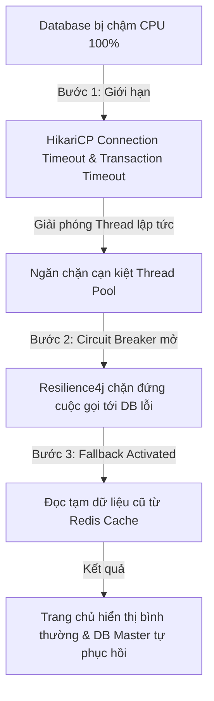

# Khung Tư Duy Xử Lý Khi Database Bị Chậm Của Senior Engineer (Database Slowdown Mitigation: Protecting the System)

## ⚡ Tóm tắt ngắn (30s)
* **Tư duy cốt lõi**: Khi database bị chậm, thảm họa thực sự không chỉ là các câu query tốn nhiều thời gian, mà là **hiệu ứng sụt đổ dây chuyền (Cascading Failure)** kéo sập toàn bộ hệ thống ứng dụng. Thread Pool của API services sẽ nhanh chóng bị cạn kiệt do phải chờ đợi phản hồi từ DB, khiến toàn bộ API khác sập theo. 
* **Chiến lược "Tự vệ 4 Lớp" (Fail-Safe Database Blueprint)**:
  1. *Cắt đuôi nhanh (Fail-Fast via Timeouts)*: Cài đặt giới hạn thời gian chờ (Transaction/Query Timeout) cực kỳ ngắn để giải phóng thread lập tức khi DB bị nghẽn.
  2. *Đóng băng và Cô lập (Circuit Breaker)*: Chủ động ngắt kết nối tạm thời tới luồng DB bị lỗi để bảo vệ luồng hoạt động của các module khác.
  3. *Giảm cấp dịch vụ nhẹ nhàng (Graceful Degradation & Fallback)*: Trả về dữ liệu cũ từ cache hoặc kết quả mặc định thay vì báo lỗi đỏ cho user.
  4. *Kiểm soát dòng chảy (Backpressure & Rate Limiting)*: Giới hạn lưu lượng request đầu vào ở mức DB có thể chịu đựng được.

---

## 🔍 Kịch bản thực chiến (STAR Framework)

### 1. Situation (Bối cảnh)
Trong một đợt mở bán chiến dịch khuyến mãi lớn, hệ thống CRM của công ty chúng tôi gặp sự cố nghiêm trọng. Do một kỹ sư viết câu query thống kê phức tạp chạy thiếu Index trực tiếp trên Database PostgreSQL Master chính, Database CPU lập tức vọt lên **100%**. 
Các câu query nghiệp vụ thông thường như xem thông tin khách hàng, kiểm tra giỏ hàng bị kéo dài thời gian xử lý từ **50ms lên tới hơn 15 giây**. 
Chỉ trong vòng 1 phút, toàn bộ 200 Tomcat Threads của Web Service chính bị cạn kiệt (Thread Exhaustion) vì bận chờ đợi DB trả kết quả. Hậu quả là toàn bộ trang chủ của công ty bị treo trắng xóa, khách hàng không thể thực hiện bất kỳ hành động nào, kể cả những hành động không đụng tới DB.

### 2. Task (Thử thách)
Với tư cách là Senior Backend Engineer, tôi phải tái cấu trúc hệ thống ứng dụng để:
1. Đảm bảo khi Database bị chậm, **hệ thống ứng dụng chính không được phép bị sập dây chuyền (Cascading Failure Resilience)**.
2. Thiết lập cơ chế tự vệ chủ động giúp hệ thống tự động phục hồi khi Database hạ nhiệt.

### 3. Action (Hành động)
Tôi đã áp dụng các mẫu hình tự vệ nâng cao (Resilience Patterns) trên tầng ứng dụng Spring Boot:

* **Bước 1: Thiết lập Giới hạn thời gian khắt khe (Timeout Configuration)**
  Tôi cấu hình lại toàn bộ hệ thống Connection Pool (**HikariCP**) và tầng JPA/Hibernate:
  - `connectionTimeout = 2000` (2 giây): Nếu trong vòng 2 giây ứng dụng không lấy được connection từ pool, trả về lỗi ngay lập tức thay vì treo thread vô hạn (mặc định là 30 giây).
  - `validationTimeout = 1000` (1 giây): Kiểm tra sức khỏe kết nối nhanh.
  - Cấu hình `@Transactional(timeout = 3)` (3 giây) cho các service nghiệp vụ nhạy cảm: Nếu transaction chạy quá 3 giây, Spring sẽ tự động gửi lệnh ROLLBACK giải phóng tài nguyên DB Master.

* **Bước 2: Áp dụng Mẫu hình Cầu chì bảo vệ (Circuit Breaker Pattern)**
  Tôi tích hợp thư viện **Resilience4j** bọc ngoài các phương thức gọi tới Database:
  - Nếu tỷ lệ cuộc gọi tới DB bị timeout hoặc lỗi vượt quá **50%** trong vòng 10 giây, Circuit Breaker sẽ tự động chuyển sang trạng thái **OPEN (Mở)**.
  - Khi Circuit Breaker OPEN, toàn bộ các request tiếp theo sẽ **bị chặn đứng ngay lập tức tại tầng ứng dụng (Fail-Fast)**, hoàn toàn không gửi thêm bất kỳ query nào vào Database nữa. Điều này giúp Database Master có khoảng trống tĩnh lặng để tự phục hồi CPU, không bị đè bẹp thêm bởi bão request.

* **Bước 3: Kích hoạt Chế độ Giảm cấp & Dự phòng (Graceful Fallback)**
  Khi Circuit Breaker OPEN hoặc xảy ra ngoại lệ do DB chậm, tôi cấu hình cơ chế Fallback thông minh:
  - *Xem thông tin Profile*: Thay vì báo lỗi sập trang, hệ thống sẽ đọc tạm thông tin khách hàng được lưu trữ trong **Redis Cache (Read-through)** dù dữ liệu có thể cũ hơn vài phút.
  - *Xem danh sách sản phẩm gợi ý*: Trả về một danh sách sản phẩm mặc định (Static Hardcoded List) được lưu trên bộ nhớ cục bộ của server ứng dụng. Khách hàng vẫn thấy giao diện đẹp đẽ, chỉ có dữ liệu là không mang tính cá nhân hóa thời gian thực.

* **Bước 4: Điều tiết Lưu lượng từ API Gateway (Rate Limiting & Backpressure)**
  - Tôi cấu hình trên **API Gateway (Spring Cloud Gateway)** cơ chế giới hạn lượng request đồng thời gửi tới hệ thống. Nếu lượng request vượt quá ngưỡng chịu tải tối đa của DB, Gateway sẽ từ chối nhanh bằng mã HTTP 429 Too Many Requests để bảo vệ toàn hệ thống.

### 4. Result (Kết quả)
* **Khả năng tự vệ tuyệt vời**: Khi giả lập tình huống DB Master bị lock table trên môi trường Staging, ứng dụng chính vẫn chạy ổn định với p99 latency của trang chủ duy trì ở mức **45ms** (nhờ đọc cache fallback), không xảy ra tình trạng cạn kiệt thread hay treo trang trắng.
* **Hạ nhiệt DB nhanh chóng**: Nhờ Circuit Breaker tự động ngắt tải, DB Master tự giải phóng lock và hạ CPU từ 100% về 5% chỉ sau **15 giây** mà không cần sự can thiệp của DBA.

---

## 💡 Nguyên tắc Senior & Bài học đắt giá

1. **"Fail Fast" (Thất bại nhanh)**: Đây là nguyên lý sống còn của hệ thống phân tán. Treo một request trong 15 giây để chờ đợi một câu trả lời vô vọng là tội ác lớn nhất đối với hạ tầng. Thà trả về lỗi hoặc dữ liệu fallback ngay lập tức trong **100ms** để giải phóng tài nguyên cho hệ thống phục vụ hàng nghìn người dùng khác.
2. **Không bao giờ dùng Timeout mặc định (Never trust default timeouts)**: Hầu hết các thư viện HTTP Client, JDBC Drivers đều cấu hình Timeout mặc định là **vô hạn (infinite)** hoặc **30 giây**. Đây là nguyên nhân hàng đầu kéo sập các hệ thống lớn. Senior bắt buộc phải tự tay cấu hình Timeout cho mọi cuộc gọi IO (DB, Cache, External API).
3. **Database is the single source of truth but also the single point of failure (Database là nguồn chân lý nhưng cũng là điểm chí mạng)**: Phải luôn thiết kế ứng dụng với tư duy phản biện: *"Nếu ngày mai Database sập hoàn toàn trong 4 tiếng, ứng dụng của tôi có thể chạy ở chế độ Read-only an toàn để khách hàng xem thông tin được không?"*

---

## 📊 So sánh phương án quyết định (Trade-offs)

| Cách xử lý khi DB chậm | Ưu điểm (Pros) | Nhược điểm (Cons) | Use Case Phù hợp |
| :--- | :--- | :--- | :--- |
| **Không xử lý (Mặc định)** | - Không tốn công viết code phức tạp. - Dữ liệu hiển thị luôn chính xác 100% nếu lấy được. | - **Hệ thống sập toàn diện** (treo trang trắng). - DB không thể tự phục hồi do liên tục nhận thêm request. | Các ứng dụng nội bộ (Internal Tool), ít người dùng, không có ràng buộc chặt chẽ về uptime. |
| **Fail-Fast + Fallback (Resilience Patterns - Khuyên dùng)** | - **Uptime hệ thống chính đạt tuyệt đối**. - DB tự phục hồi siêu nhanh nhờ ngắt tải. - Trải nghiệm người dùng mượt mà dù đang có sự cố. | - Người dùng có thể thấy dữ liệu cũ (inconsistent data). - Tăng độ phức tạp của mã nguồn khi phải viết các hàm fallback. | **Bắt buộc áp dụng** cho mọi hệ thống Web/App thương mại, Fintech hướng tới khách hàng đại chúng. |

---

## ⚠️ Common Gotchas (Câu hỏi phỏng vấn đào sâu)

### 1. Làm thế nào bạn phân biệt được hệ thống đang bị chậm do Database quá tải (CPU/Memory) hay do Mạng kết nối giữa Application Server và Database Server bị nghẽn (Network Latency/Packet Loss)?
* **Trả lời**: Đây là câu hỏi kiểm tra kỹ năng chẩn đoán sự cố (Debugging/Diagnostics) thực chiến của một Senior:
  * **Các bước chẩn đoán chính xác**:
    1. **Kiểm tra APM Metrics (như Datadog, Prometheus)**:
       - Nếu biểu đồ chỉ số **Database Query Time** (thời gian DB xử lý thực tế đo tại DB engine) vẫn rất thấp (ví dụ 2ms) nhưng chỉ số **Application Transaction Time** (thời gian ứng dụng thực hiện xong 1 JPA call) lại tăng vọt lên 500ms, điều này chứng tỏ DB Engine chạy rất nhanh, điểm nghẽn nằm ở đường truyền mạng hoặc rò rỉ kết nối (Connection Leak) trong ứng dụng.
    2. **Kiểm tra HikariCP Metrics**:
       - Xem biểu đồ `Connection Acquisition Time` (thời gian ứng dụng phải xếp hàng chờ để lấy được 1 connection từ pool). Nếu chỉ số này tăng vọt, chứng tỏ các thread đang giữ connection quá lâu (do logic xử lý ngoài DB quá nặng hoặc quên đóng connection) khiến các thread khác phải xếp hàng chờ đợi vô ích.
    3. **Chạy kiểm tra mạng thủ công từ Server ứng dụng**:
       - Mở terminal trên Application Server và chạy lệnh `ping <db-host>` hoặc `traceroute <db-host>` để kiểm tra độ trễ gói tin (Network Latency) và tỷ lệ mất gói (Packet Loss).
       - Dùng công cụ `pg_bench` chạy test nhanh một câu query đơn giản `SELECT 1` từ app server sang DB server để đo độ trễ mạng thuần túy.

### 2. Khi xảy ra sự cố Database Master chính bị sập hoàn toàn (Hard Failure) và hệ thống tự động thăng cấp một Read Replica lên làm Master mới (Failover), làm thế nào ứng dụng Spring Boot của bạn có thể tự động nhận biết và định tuyến lại toàn bộ các luồng ghi (WRITE) sang Master mới mà không cần phải restart ứng dụng?
* **Trả lời**: Đây là kỹ thuật cấu hình Dynamic Routing nâng cao:
  * **Giải pháp tự động định tuyến**:
    1. **Sử dụng DNS ảo / Load Balancer trước Database**: Không bao giờ cấu hình địa chỉ IP cứng của DB Server trong file `application.yml`. Sử dụng một domain nội bộ ảo (ví dụ: `db-master.internal.company`) trỏ tới DB Master thông qua DNS hoặc một proxy trung gian (như **HAProxy** hoặc **AWS Route53**). Khi xảy ra failover, hệ thống hạ tầng sẽ cập nhật bản ghi DNS ảo này trỏ sang replica mới. Ứng dụng Spring Boot tự động kết nối sang Master mới mà không cần đổi cấu hình.
    2. **Sử dụng Drivers thông minh của Database**: PostgreSQL cung cấp thuộc tính kết nối đặc biệt trong JDBC URL:
       `jdbc:postgresql://host1:5432,host2:5432/db_name?targetServerType=primary`
       Driver JDBC của PostgreSQL sẽ tự động quét cả hai host, tự động phát hiện xem server nào đang ở trạng thái Read-Write (Primary/Master) để định tuyến luồng ghi vào đó, server còn lại là Read-Only (Replica) sẽ bị bỏ qua cho luồng ghi.
    3. **Sử dụng Dynamic DataSource Routing của Spring**: Viết một class kế thừa `AbstractRoutingDataSource` của Spring. Class này sẽ liên tục kiểm tra sức khỏe của các nodes DB qua một background thread. Khi phát hiện node hiện tại bị chuyển sang Read-Only hoặc sập, nó tự động tráo đổi DataSource chính sang node mới một cách hoàn toàn trong suốt với tầng JPA nghiệp vụ.
