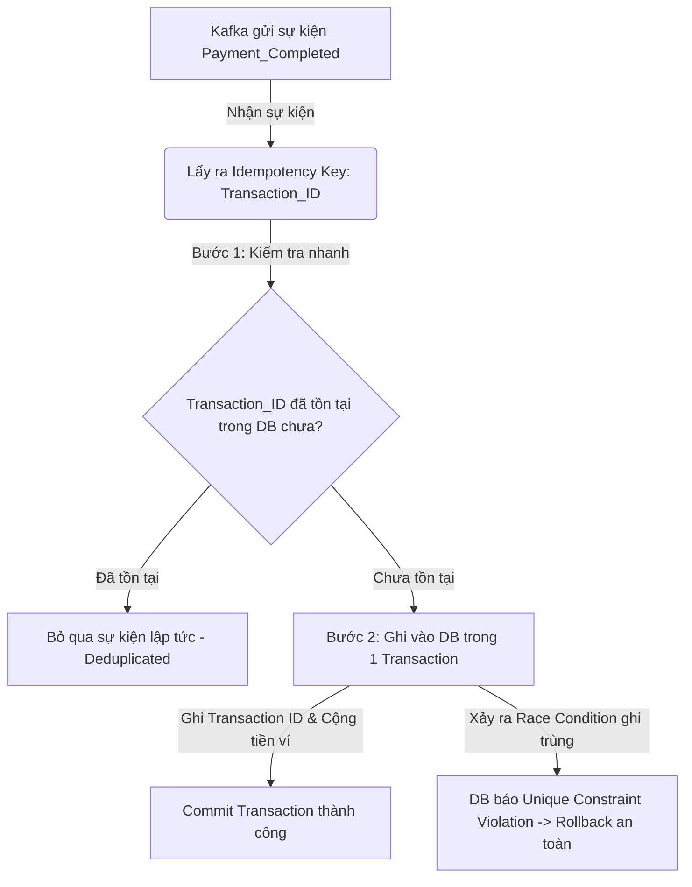

# Khung Tư Duy Xử Lý Trùng Lặp Tin Nhắn Của Senior Engineer (Message Deduplication & Idempotency Patterns)

## ⚡ Tóm tắt ngắn (30s)
* **Tư duy cốt lõi**: Trong hệ thống phân tán hướng sự kiện (Event-Driven), việc trùng lặp tin nhắn (Duplicate Message) là điều **chắc chắn xảy ra** do hầu hết các Message Brokers (như Kafka, RabbitMQ) hoạt động theo cơ chế **At-Least-Once Delivery (Giao tối thiểu một lần)**. Vì vậy, thay vì tìm cách triệt tiêu trùng lặp ở tầng mạng vô ích, Senior Engineer tập trung thiết kế Consumer hoạt động theo cơ chế **Idempotency (Đồng nhất/Khả trị)**: Đảm bảo việc consume một tin nhắn nhiều lần vẫn mang lại kết quả duy nhất như consume một lần.
* **Quy tắc "3 Lớp Phòng Thủ Đồng Nhất" (Idempotency Blueprint)**:
  1. *Khóa duy nhất cấp nghiệp vụ (Business Unique Key)*: Xác định một thuộc tính duy nhất cho mỗi giao dịch (như `Transaction_ID`, `Order_ID`, `Event_ID`) làm Idempotency Key.
  2. *Kiểm tra và Lưu trữ (Unique DB Constraints)*: Sử dụng các ràng buộc duy nhất trong Database (Unique Constraints / Primary Key) để chặn đứng nỗ lực ghi đè dữ liệu trùng lặp ở mức vật lý.
  3. *Bộ lọc trạng thái (State Machine Validation)*: Đảm bảo trạng thái thực thể chỉ di chuyển một chiều (ví dụ: trạng thái `PAID` không bao giờ được phép quay lại `PENDING` khi nhận lại sự kiện thanh toán cũ).

---

## 🔍 Kịch bản thực chiến (STAR Framework)

### 1. Situation (Bối cảnh)
Trong hệ thống ví điện tử (E-Wallet) của công ty chúng tôi, luồng thanh toán được thiết kế hướng sự kiện bất đồng bộ qua **Kafka**. Khi khách hàng thực hiện giao dịch chuyển tiền, Payment Service ghi nhận vào DB và đẩy sự kiện `Payment_Completed` vào Kafka topic. Wallet Service consume sự kiện này để tiến hành cộng tiền vào ví của người nhận. 
Do sự cố gián đoạn mạng tạm thời giữa các broker Kafka, Wallet Service sau khi cộng tiền thành công đã không thể gửi tin nhắn xác nhận (Offset Commit) về cho Kafka Broker. Kafka cho rằng tin nhắn chưa được xử lý và tiến hành gửi lại (Redelivery) sự kiện `Payment_Completed` đó một lần nữa. 
Do Wallet Service cũ thiếu cơ chế Idempotent Consumer, nó tiếp tục lấy sự kiện đó ra xử lý và **cộng tiền lần thứ hai cho cùng một giao dịch chuyển khoản**, gây thất thoát nghiêm trọng tài chính của công ty.

### 2. Task (Thử thách)
Với tư cách là Senior Backend Engineer, tôi phải tái thiết kế lại toàn bộ cơ chế tiêu thụ sự kiện (Consumer) của Wallet Service để đảm bảo hệ thống **đạt tính đồng nhất tuyệt đối (Idempotency 100%)**, triệt tiêu hoàn toàn rủi ro cộng tiền trùng lặp dưới mọi kịch bản lỗi mạng hay redelivery.

### 3. Action (Hành động)
Tôi đã áp dụng các mẫu hình thiết kế đồng nhất nâng cao (Idempotency Patterns) kết hợp kiểm soát concurrency chặt chẽ:



* **Bước 1: Thiết lập Khóa Đồng Nhất nghiệp vụ (Business Idempotency Key)**
  - Tôi quy định mọi tin nhắn được phát ra từ hệ thống bắt buộc phải chứa một thuộc tính duy nhất đóng vai trò là **Idempotency Key**. Đối với luồng này, khóa đó chính là `Transaction_ID` (mã giao dịch duy nhất do Payment Service sinh ra dưới dạng UUID/Snowflake ID).

* **Bước 2: Áp dụng Mẫu hình Bảng Đồng Nhất (Idempotent Table Pattern)**
  Tôi xây dựng một bảng chuyên biệt trong Database của Wallet Service tên là `processed_transactions`:
  - Bảng này có trường `transaction_id` được đặt làm **Primary Key (hoặc Unique Index)**.
  - Mỗi khi Consumer nhận được sự kiện `Payment_Completed`, toàn bộ logic xử lý nghiệp vụ sẽ được bọc trong một Database Transaction duy nhất:
    ```sql
    -- Bước A: Cố gắng insert mã giao dịch vào bảng kiểm soát trùng lặp
    INSERT INTO processed_transactions (transaction_id, processed_at) VALUES ('TX_12345', NOW());
    
    -- Bước B: Thực hiện cộng tiền ví của người nhận
    UPDATE wallet SET balance = balance + 100000 WHERE user_id = 'USER_888';
    ```
  - **Cơ chế tự vệ**: Nếu Kafka gửi lại tin nhắn `TX_12345` lần thứ hai, bước chèn (INSERT) vào bảng `processed_transactions` sẽ lập tức ném ra ngoại lệ vi phạm ràng buộc khóa duy nhất (**UniqueConstraintViolationException**). Database sẽ tự động hủy bỏ (ROLLBACK) toàn bộ Transaction ngay lập tức, ngăn chặn việc thực hiện lệnh UPDATE cộng tiền lần hai.

* **Bước 3: Sử dụng Bộ lọc Máy Trạng Thái (State Machine Validation)**
  Để tăng thêm lớp phòng vệ thứ ba, tôi áp dụng mô hình kiểm soát trạng thái nghiêm ngặt trên bảng giao dịch `transactions`:
  - Trạng thái giao dịch chỉ được phép di chuyển theo sơ đồ cố định: `INIT` -> `PROCESSING` -> `SUCCESS` / `FAILED`.
  - Khi thực hiện cập nhật trạng thái, câu lệnh SQL bắt buộc phải kèm theo điều kiện trạng thái cũ:
    ```sql
    UPDATE transactions SET status = 'SUCCESS' WHERE id = 'TX_12345' AND status = 'PROCESSING';
    ```
  - Nếu nhận lại tin nhắn trùng lặp khi giao dịch đã ở trạng thái `SUCCESS`, câu lệnh UPDATE trên sẽ trả về số lượng dòng cập nhật là `0`. Ứng dụng nhận biết và bỏ qua tin nhắn đó một cách an toàn.

* **Bước 4: Sử dụng Distributed Lock (Redis Redlock) cho các hệ thống NoSQL**
  - Đối với các module lưu trữ dữ liệu trên NoSQL (như MongoDB không hỗ trợ ràng buộc khóa duy nhất đa bảng mạnh mẽ), tôi sử dụng Redis để làm khóa phân tán (**Distributed Lock**):
    * Lấy khóa Redis với key là `lock:transaction:TX_12345` kèm theo thời gian hết hạn (TTL) là 10 phút.
    * Chỉ Consumer nào giành được khóa mới được quyền đi vào xử lý nghiệp vụ. Consumer trùng lặp đến sau không lấy được khóa sẽ bị từ chối ngay lập tức.

### 4. Result (Kết quả)
* **Tuyệt đối an toàn tài chính**: Sau khi deploy cơ chế mới, chúng tôi thực hiện giả lập bơm trùng lặp 10.000 tin nhắn giao dịch đồng thời trên môi trường Staging. Hệ thống Wallet xử lý chính xác **100%**, không xảy ra bất kỳ lỗi cộng tiền trùng lặp nào.
* **Hạ thấp lỗi vận hành**: Hệ thống tự động deduplicate tin nhắn trùng lặp ở mức DB/Application một cách âm thầm và trơn tru, không cần bất kỳ sự can thiệp thủ công nào từ đội hỗ trợ kỹ thuật.

---

## 💡 Nguyên tắc Senior & Bài học đắt giá

1. **At-Least-Once is the industry standard (At-Least-Once là chuẩn mực thực tế)**: Đừng bao giờ tin tưởng vào quảng cáo "Exactly-Once Processing" của các Message Brokers. Trên lý thuyết, Exactly-Once đòi hỏi giao thức commit 2 pha phức tạp (Two-Phase Commit) làm giảm throughput hệ thống đi 10 lần và vẫn có thể sập khi mất điện vật lý. Luôn thiết kế Consumer với tư duy: *"Tin nhắn này chắc chắn sẽ bị gửi trùng ít nhất một lần, code của tôi phải tự phòng vệ."*
2. **Idempotency Key must be generated by the source (Khóa đồng nhất phải sinh ra từ nguồn phát)**: Khóa đồng nhất bắt buộc phải được sinh ra ngay từ thời điểm giao dịch bắt đầu (Client hoặc service đầu chuỗi) và truyền tải xuyên suốt qua các service trung gian. Không được tự sinh khóa đồng nhất ở giữa chuỗi vì điều đó phá vỡ tính nhất quán của toàn bộ luồng.
3. **Log & Monitor Deduplications**: Luôn ghi log rõ ràng ở level `INFO` hoặc `WARN` mỗi khi hệ thống phát hiện và loại bỏ một tin nhắn trùng lặp (ví dụ: *"Transaction TX_12345 already processed, ignoring message"*). Việc này giúp đội vận hành dễ dàng chẩn đoán sự cố khi thấy Kafka lag hoặc broker có vấn đề gửi lại tin nhắn hàng loạt.

---

## 📊 So sánh phương án quyết định (Trade-offs)

| Phương pháp giải quyết trùng lặp | Ưu điểm (Pros) | Nhược điểm (Cons) | Use Case Phù hợp |
| :--- | :--- | :--- | :--- |
| **Kiểm tra nghiệp vụ đơn giản (Select-then-Insert)** | - Cực kỳ dễ code, không cần cấu hình DB đặc biệt. | - Bị lỗi **Race Condition (Tranh chấp đồng thời)**: Nếu 2 tin nhắn trùng lặp chạm tới 2 máy chủ ứng dụng cùng 1 phần triệu giây, cả hai đều SELECT thấy trống và đều INSERT thành công, gây trùng lặp dữ liệu. | Hệ thống chạy đơn luồng (Single Thread), traffic cực thấp hoặc dữ liệu không nhạy cảm (như ghi nhận lượt xem bài viết). |
| **Bảng khóa duy nhất DB (Idempotent Table - Khuyên dùng)** | - **An toàn tuyệt đối 100% nhờ cơ chế khóa vật lý của DB**.<br>- Chống Race Condition hoàn hảo kể cả chạy đa máy chủ. | - Tốn thêm 1 truy vấn chèn (INSERT) vào DB, làm giảm nhẹ throughput của DB. | **Bắt buộc áp dụng** cho mọi hệ thống giao dịch tài chính, thanh toán, đặt hàng, trừ điểm. |
| **Khóa phân tán Redis (Distributed Lock)** | - Giải phóng tải cho Database chính.<br>- Rất nhanh, throughput cực cao. | - Phụ thuộc thêm vào hệ thống Redis (nếu Redis sập, cơ chế bảo vệ bị vô hiệu hóa).<br>- Có rủi ro mất khóa nếu Redis bị rớt kết nối mạng. | Các hệ thống NoSQL, hoặc các API có traffic ghi dữ liệu siêu cao cần loại bỏ trùng lặp cực nhanh trước khi chạm DB. |

---

## ⚠️ Common Gotchas (Câu hỏi phỏng vấn đào sâu)

### 1. Nếu một tin nhắn bị trùng lặp gửi đến khi tin nhắn đầu tiên vẫn đang trong quá trình xử lý (chưa commit xong Transaction để ghi vào bảng processed_transactions), cơ chế khóa duy nhất của bạn có thể bị bypass không? Bạn xử lý ra sao?
* **Trả lời**: Đây là câu hỏi cực kỳ hiểm hóc kiểm tra chiều sâu về Concurrency và Transaction Isolation Levels của bạn:
  * **Rủi ro bypass**: Đúng vậy. Nếu tin nhắn 1 đang chạy dở ở bước cập nhật ví (chưa commit), tin nhắn 2 đến, INSERT vào bảng `processed_transactions` sẽ không bị lỗi Unique Constraint nếu Transaction Isolation Level của Database ở mức mặc định là `Read Committed` (vì tin nhắn 2 chưa nhìn thấy dòng insert chưa commit của tin nhắn 1). Cả hai sẽ cùng xử lý song song và commit thành công, gây cộng tiền 2 lần!
  * **Giải pháp khắc phục tuyệt đối của Senior**:
    1. **Sử dụng cơ chế Khóa Bi quan (Pessimistic Lock / SELECT FOR UPDATE)**:
       Trước khi làm bất kỳ hành động nào, Consumer bắt buộc phải khóa dòng ví của user trong DB:
       ```sql
       SELECT * FROM wallet WHERE user_id = 'USER_888' FOR UPDATE;
       ```
       Khi tin nhắn 1 đang giữ khóa ví của user, tin nhắn 2 đến sẽ bị block hoàn toàn tại câu lệnh `SELECT FOR UPDATE` này, buộc phải xếp hàng chờ đợi cho đến khi tin nhắn 1 hoàn tất toàn bộ transaction (commit và giải phóng khóa). Lúc đó, tin nhắn 2 đi tiếp, thực hiện INSERT và sẽ lập tức dính lỗi Unique Constraint vì dòng insert của tin nhắn 1 lúc này đã hiển thị rõ ràng.
    2. **Sử dụng Distributed Lock (Redis) bọc ngoài Consumer**:
       Consumer lấy khóa Redis `lock:transaction:TX_12345` trước khi bắt đầu transaction DB. Tin nhắn 2 đến sau chắc chắn không lấy được khóa và bị từ chối ngay lập tức ở tầng ứng dụng, không cần chờ DB.

### 2. Trong Kafka, làm thế nào cấu hình Producer để đạt được tính năng Idempotent Producer (chống trùng lặp tin nhắn ngay từ phía người gửi khi gửi dữ liệu sang Kafka Broker)?
* **Trả lời**: Đây là câu hỏi kiểm tra kiến thức chuyên sâu về Kafka Internals:
  * **Cách cấu hình Idempotent Producer**:
    - Trên cấu hình của Kafka Producer, thiết lập thuộc tính:
      `enable.idempotence = true`
  * **Cơ chế hoạt động nội bộ của Kafka**:
    1. Khi thuộc tính này được bật, Kafka Broker sẽ cấp cho mỗi Producer một ID duy nhất gọi là **Producer ID (PID)**.
    2. Mỗi tin nhắn gửi đi từ Producer sẽ được đính kèm một số thứ tự tăng dần gọi là **Sequence Number**.
    3. Tại phía Kafka Broker, broker sẽ duy trì trạng thái của PID và Sequence Number lớn nhất đã nhận được cho mỗi partition.
    4. Nếu Producer gửi lại tin nhắn do không nhận được ACK từ broker (ví dụ do lỗi mạng), broker nhận được tin nhắn có Sequence Number nhỏ hơn hoặc bằng Sequence Number hiện tại sẽ **âm thầm bỏ qua tin nhắn đó (Deduplicated tại broker)** và chỉ gửi lại ACK thành công cho Producer.
    5. Cấu hình này giúp đảm bảo tin nhắn không bao giờ bị ghi trùng lặp vào Kafka Topic partition, bảo vệ an toàn dữ liệu từ nguồn phát.
