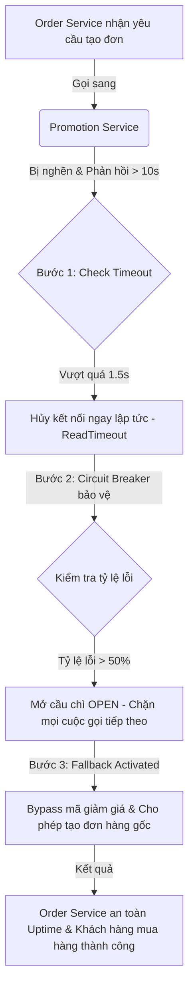

# Khung Tư Duy Xử Lý Sự Cố Downstream Service Timeout Của Senior Engineer (Cascading Failure Prevention: Downstream Timeout Strategy)

## ⚡ Tóm tắt ngắn (30s)
* **Tư duy cốt lõi**: Trong kiến trúc Microservices phân tán, **sự sụp đổ của một dịch vụ hạ nguồn (Downstream Service) có thể kéo sập toàn bộ hệ thống thượng nguồn (Upstream Services)** nếu không được phòng vệ đúng cách. Khi downstream service bị chậm hoặc timeout, lỗi này sẽ nhanh chóng lan truyền ngược (Cascading Failure) do cạn kiệt tài nguyên (Thread Pool/Connection Pool) của service gọi nó.
* **Chiến lược "Tự vệ Phân tầng" (Upstream Resilience Blueprint)**:
  1. *Cắt đứt dây xích (Strict Timeouts)*: Thiết lập giới hạn thời gian chờ cực kỳ ngắn và chính xác cho mọi cuộc gọi HTTP/gRPC liên service.
  2. *Khoang tàu tự vệ (Bulkhead Pattern)*: Cách ly tài nguyên gọi mỗi downstream service vào các Thread Pools riêng biệt để bảo vệ tài nguyên chính của ứng dụng.
  3. *Cầu chì tự ngắt (Circuit Breaker)*: Chủ động ngắt kết nối tạm thời và trả về kết quả lỗi nhanh (Fail-Fast) khi tỷ lệ lỗi/timeout vượt ngưỡng cho phép.
  4. *Dự phòng thông minh (Graceful Fallback)*: Thiết kế cơ chế trả về dữ liệu dự phòng từ cache, dữ liệu mặc định hoặc chuyển luồng xử lý sang chế độ ngoại tuyến (Offline Processing).

---

## 🔍 Kịch bản thực chiến (STAR Framework)

### 1. Situation (Bối cảnh)
Hệ thống thương mại điện tử của công ty chúng tôi có kiến trúc microservices gồm: **Order Service (Upstream)** gọi sang **Promotion Service (Downstream)** đồng bộ qua REST API để kiểm tra và áp dụng mã giảm giá mỗi khi khách hàng tạo đơn hàng. 
Trong chiến dịch Flash Sale lớn, Promotion Service bị quá tải do phải xử lý hàng loạt truy vấn phức tạp từ DB, dẫn đến thời gian phản hồi API kéo dài từ **50ms lên hơn 10 giây**. 
Do Order Service không cấu hình Timeout cho HTTP Client gọi sang Promotion Service, toàn bộ 200 Tomcat Threads của Order Service bị chiếm dụng hoàn toàn để treo chờ Promotion Service phản hồi. Hậu quả là Order Service bị tê liệt hoàn toàn, khách hàng không thể tạo đơn hàng, kể cả những đơn hàng bình thường không sử dụng mã giảm giá.

### 2. Task (Thử thách)
Với tư cách là Senior Backend Engineer/Architect, tôi phải cải tiến kiến trúc giao tiếp của Order Service để:
1. Đảm bảo sự cố chậm/timeout của Promotion Service **không được phép làm sập Order Service (Cascading Failure Prevention)**.
2. Đảm bảo khách hàng vẫn có thể tạo đơn hàng thành công (dù tạm thời không áp dụng được mã giảm giá) thay vì làm gián đoạn luồng mua hàng cốt lõi của doanh nghiệp.

### 3. Action (Hành động)
Tôi đã áp dụng các mẫu hình tự vệ nâng cao (Resilience Patterns) bằng cách cấu hình lại tầng kết nối của Order Service sử dụng **WebClient / Resilience4j**:

* **Bước 1: Thiết lập Giới Hạn Thời Gian Chờ Nghiêm Ngặt (Strict Timeout)**
  Tôi cấu hình lại HTTP Client (sử dụng **WebClient** kết hợp với **Reactor Netty**) gọi sang Promotion Service:
  - `connectTimeout` = 500ms (0.5 giây): Giới hạn thời gian thiết lập kết nối TCP.
  - `readTimeout` = 1000ms (1 giây): Giới hạn thời gian chờ nhận gói tin phản hồi.
  - *Lý do*: Nếu trong vòng 1.5 giây mà Promotion Service không phản hồi, Order Service sẽ chủ động hủy bỏ kết nối ngay lập tức, giải phóng thread để phục vụ request khác.

* **Bước 2: Cấu hình Khoang tàu cách ly (Bulkhead Pattern)**
  Để tránh việc các request gọi sang Promotion Service bị lỗi chiếm dụng toàn bộ Thread Pool chính của Order Service, tôi áp dụng cơ chế **Bulkhead**:
  - Tạo ra một Thread Pool riêng biệt chỉ có tối đa 20 threads chuyên trách việc gọi sang Promotion Service.
  - Nếu Promotion Service bị chậm làm cạn kiệt 20 threads này, các request tiếp theo gọi sang Promotion Service sẽ bị từ chối ngay lập tức ở tầng ứng dụng (WebClient), trong khi 180 threads khác của Order Service vẫn hoạt động bình thường để xử lý các nghiệp vụ cốt lõi khác của đơn hàng.

* **Bước 3: Bọc Cầu chì tự động (Circuit Breaker Pattern via Resilience4j)**
  Tôi cấu hình Circuit Breaker cho luồng gọi Promotion Service:
  - `slidingWindowSize` = 100 requests: Theo dõi trạng thái của 100 cuộc gọi gần nhất.
  - `failureRateThreshold` = 50% (50% cuộc gọi bị lỗi hoặc timeout vượt quá 1.5 giây).
  - `slowCallRateThreshold` = 50% (50% cuộc gọi có thời gian phản hồi > 1.2 giây).
  - **Cơ chế tự vệ**: Khi đạt ngưỡng lỗi, Circuit Breaker tự động chuyển sang trạng thái **OPEN** trong vòng 30 giây. Toàn bộ các request tạo đơn hàng trong thời gian này sẽ hoàn toàn bypass việc gọi sang Promotion Service, bảo vệ tuyệt đối cho Uptime của Order Service.

* **Bước 4: Thiết kế Kịch bản Dự phòng Khôn ngoan (Graceful Fallback)**
  Tôi viết hàm Fallback xử lý khi cuộc gọi sang Promotion Service bị sập/timeout:
  - *"Khi Promotion Service bị lỗi, hệ thống sẽ tự động bỏ qua bước áp dụng mã giảm giá, tính toán tổng tiền đơn hàng theo giá gốc và ghi nhận đơn hàng vào DB với trạng thái `PENDING_PROMOTION`.*
  - *Hệ thống hiển thị thông báo nhẹ nhàng cho khách hàng: 'Hệ thống khuyến mãi đang quá tải, đơn hàng của bạn đã được ghi nhận thành công. Chúng tôi sẽ kiểm tra và hoàn trả lại tiền khuyến mãi (nếu có) vào ví của bạn trong vòng 30 phút'."*
  - Luồng đối soát và hoàn tiền khuyến mãi sẽ được xử lý tự động sau đó qua background job. Việc này giúp **bảo toàn 100% tỷ lệ chuyển đổi đơn hàng (Conversion Rate)** của doanh nghiệp.

### 4. Result (Kết quả)
* **Uptime đạt tuyệt đối**: Khi giả lập tắt hoàn toàn Promotion Service trên môi trường Staging, Order Service vẫn vận hành mượt mà với tỷ lệ tạo đơn hàng thành công đạt **100%** (ở chế giá gốc). p99 latency của Order API giữ ổn định ở mức **80ms** (nhờ cơ chế fail-fast và fallback).
* **Tránh sập dây chuyền**: Không xảy ra bất kỳ hiện tượng cạn kiệt thread pool hay treo nghẽn chéo giữa các service khác trong hệ thống.

---

## 💡 Nguyên tắc Senior & Bài học đắt giá

1. **"Design for Failure" (Thiết kế hướng tới sự đổ vỡ)**: Trong hệ thống microservices, mọi service đều có thể sập vào bất kỳ lúc nào. Không bao giờ tin tưởng vào độ tin cậy của downstream service. Luôn viết code với câu hỏi phản biện: *"Nếu dịch vụ tôi đang gọi bị biến mất hoàn toàn trên mạng ngay bây giờ, dịch vụ của tôi có thể tiếp tục sống sót một cách duyên dáng (Graceful Degradation) hay không?"*
2. **Quy tắc "Cắt đuôi sớm" (Fail-Fast over Hang-On)**: Treo thread để chờ đợi một phản hồi vô vọng từ dịch vụ lỗi là sai lầm nghiêm trọng nhất của lập trình viên trung cấp. Thà trả về lỗi hoặc dữ liệu fallback trong **100ms** để giải phóng hạ tầng cho hàng nghìn khách hàng khác đang truy cập.
3. **Thấu hiểu "Sự sụt giảm tính năng" (Degradation is better than Downtime)**: Đối với mọi doanh nghiệp kinh doanh, việc hệ thống bị mất một vài tính năng phụ (như gợi ý sản phẩm, áp mã giảm giá) tốt hơn gấp 1.000 lần so với việc toàn bộ hệ thống bị sập hoàn toàn không thể truy cập (Downtime).

---

## 📊 So sánh phương án quyết định (Trade-offs)

| Giải pháp xử lý Downstream Timeout | Ưu điểm (Pros) | Nhược điểm (Cons) | Use Case Phù hợp |
| :--- | :--- | :--- | :--- |
| **Giao tiếp Đồng bộ thuần túy (Synchronous Blocking)** | - Cực kỳ đơn giản để lập trình và debug. - Dữ liệu luôn chính xác 100% ở mọi layer. | - **Rủi ro sập dây chuyền (Cascading Failure) cực kỳ cao**. - Hệ thống bị nghẽn thread pool nhanh chóng khi downstream bị chậm. | Các hệ thống nội bộ nhỏ, hoặc các luồng nghiệp vụ bắt buộc phải nhất quán mạnh (như luồng thanh toán chuyển khoản ngân hàng). |
| **Fail-Fast + Circuit Breaker + Fallback (Khuyên dùng)** | - **Bảo vệ Uptime hệ thống Upstream ở mức tuyệt đối**. - Cách ly hoàn toàn vùng lỗi (Blast Radius Control). - Trải nghiệm khách hàng mượt mà dù đang có sự cố. | - Tăng độ phức tạp của mã nguồn và tốn công thiết kế luồng fallback nghiệp vụ phức tạp. | **Bắt buộc áp dụng** cho mọi hệ thống Microservices quy mô lớn, Web/App có traffic cao. |
| **Giao tiếp Bất đồng bộ (Asynchronous/Message-driven)** | - Triệt tiêu hoàn toàn sự phụ thuộc đồng thời giữa các service. - Throughput siêu cao, cực kỳ lỏng lẻo (decoupled). | - Khách hàng không nhận được kết quả tức thì (phải dùng Websocket/SSE để thông báo trạng thái sau). | Các luồng xử lý nặng, tốn nhiều thời gian như: xuất hóa đơn, gửi thông báo, đồng bộ dữ liệu sang bên thứ ba. |

---

## ⚠️ Common Gotchas (Câu hỏi phỏng vấn đào sâu)

### 1. Làm thế nào bạn xác định được giá trị Timeout (connectTimeout, readTimeout) phù hợp nhất cho một cuộc gọi API sang downstream service, tránh việc đặt quá ngắn gây lỗi oan uổng hoặc đặt quá dài gây nghẽn hệ thống?
* **Trả lời**: Đây là câu hỏi kiểm tra tư duy kỹ thuật dựa trên dữ liệu thực tế (Data-driven Engineering):
  * **Cách xác định Timeout khoa học**:
    1. **Phân tích Latency Percentiles từ APM Metrics**:
       - Tôi mở công cụ giám sát (như Datadog hoặc Prometheus) của downstream service đó dưới điều kiện tải bình thường và tải đỉnh (Peak Load).
       - Nhìn vào chỉ số **p95 latency** (95% cuộc gọi hoàn thành trong khoảng thời gian này) và **p99 latency** (99% cuộc gọi hoàn thành trong khoảng này).
       - *Ví dụ*: Nếu p95 latency của downstream service là 100ms, và p99 là 300ms.
    2. **Áp dụng Công thức Tính Timeout**:
       - Tôi sẽ đặt `readTimeout` bằng **p99 latency + 30-50% buffer rủi ro**. Trong ví dụ trên, tôi sẽ đặt `readTimeout` = **450ms - 500ms**.
       - Đặt `connectTimeout` mặc định cực ngắn: từ **200ms - 500ms** (vì kết nối TCP trong mạng nội bộ mạng LAN của data center/cluster cực kỳ nhanh, thường dưới 10ms; nếu quá 500ms chứng tỏ server đích đang bị sập mạng vật lý hoặc chết tiến trình).
    3. **Đánh giá Ràng buộc Nghiệp vụ (SLA)**:
       - Nếu luồng gọi là đồng bộ trực tiếp từ phía người dùng (User-facing API), tổng thời gian chờ của toàn bộ chuỗi cuộc gọi (chain calls) không được vượt quá thời gian kiên nhẫn của khách hàng (thường là tối đa 2.5 giây). Tôi sẽ phân bổ ngân sách thời gian (Time Budget) cho từng hop dịch vụ sao cho tổng không vượt quá ngưỡng này.

### 2. Kỹ thuật "Request Hedging" (hoặc Hedged Requests) là gì? Kỹ thuật này giúp giải quyết bài toán downstream service phản hồi chậm (tail latency) như thế nào trong các hệ thống Big Tech (như Google hay Netflix)?
* **Trả lời**: Đây là kiến thức nâng cao về tối ưu hóa độ trễ đuôi (Tail Latency Optimization) trong các hệ thống quy mô siêu lớn:
  * **Khái niệm Request Hedging**:
    - Trong các hệ thống lớn chạy hàng nghìn máy chủ, thi thoảng sẽ có một vài instance của downstream service bị chậm bất thường (do dính GC pause, ổ đĩa bị nghẽn I/O tạm thời hoặc lỗi phần cứng nhẹ). Lỗi này tạo ra độ trễ đuôi (Tail Latency - p99.9 hoặc p99.99 rất xấu) làm ảnh hưởng trải nghiệm của một nhóm nhỏ khách hàng.
    - Kỹ thuật **Request Hedging** hoạt động như sau:
      1. Upstream service gửi request đầu tiên sang downstream instance A.
      2. Đồng thời, khởi tạo một timer đếm ngược với thời gian cực ngắn (ví dụ bằng **p95 latency** của downstream service, ví dụ 150ms).
      3. Nếu sau 150ms mà instance A chưa trả về kết quả, upstream service sẽ **âm thầm gửi thêm một request thứ hai có nội dung tương tự sang downstream instance B (hoặc gửi song song)** mà không hủy bỏ request đầu tiên.
      4. Upstream service sẽ lấy kết quả của **bất kỳ instance nào trả về trước**, và lập tức gửi lệnh hủy bỏ (cancel) request còn lại để tiết kiệm tài nguyên.
  * **Lợi ích**: Kỹ thuật này giúp triệt tiêu hoàn toàn tác hại của các "instance rùa bò" (stragglers), kéo p99.9 latency về gần bằng p95 latency, mang lại trải nghiệm siêu mượt mà cho mọi khách hàng với chi phí tài nguyên mạng tăng thêm cực nhỏ (chỉ khoảng 2-5% tổng số lượng request).
