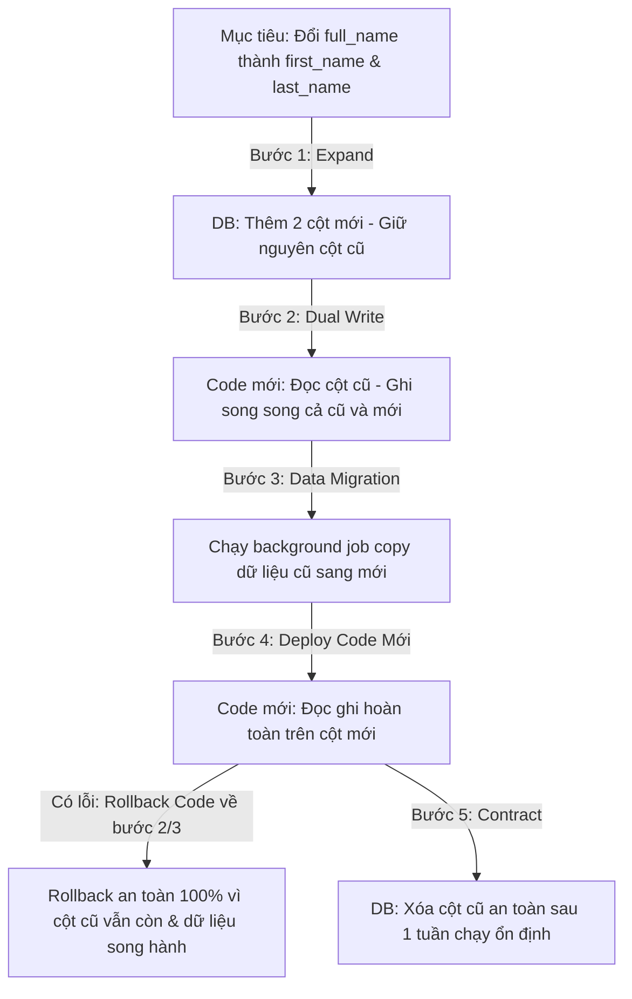

# Khung Quy Trình Rollback Sự Cố Deploy Của Senior Engineer (Zero-Downtime Deployment & Rollback Strategy)

## ⚡ Tóm tắt ngắn (30s)
* **Tư duy cốt lõi**: Khi một bản deploy mới gây ra lỗi trên production, **nguyên tắc vàng tối cao là thực hiện Rollback lập tức (Rollback First, Debug Later)** để đưa hệ thống về trạng thái ổn định nhanh nhất, giảm thiểu tối đa MTTR. Tuyệt đối không được cố gắng viết code hotfix vội vã trực tiếp đè lên bản lỗi. 
* **Rào cản lớn nhất của Rollback**: Phần lớn các vụ sập hệ thống nghiêm trọng khi rollback là do **không tương thích dữ liệu (Database Schema Incompatibility)**. Code có thể dễ dàng rollback về phiên bản cũ bằng một lệnh trên Kubernetes, nhưng Database thì không thể rollback dễ dàng nếu schema đã bị thay đổi vật lý hoặc dữ liệu mới đã được ghi theo cấu trúc mới.
* **Chiến lược "Tương thích ngược Song hành" (Expand and Contract Pattern)**:
  - Mọi thay đổi Database Schema bắt buộc phải được thiết kế thành các bước nhỏ, luôn tương thích ngược (Backward Compatible) với cả code cũ và code mới. Việc này giúp quá trình rollback code diễn ra trơn tru mà không cần đụng chạm hay rollback Database vật lý.

---

## 🔍 Kịch bản thực chiến (STAR Framework)

### 1. Situation (Bối cảnh)
Trong một đợt phát hành phiên bản lớn của ứng dụng E-Commerce, đội ngũ kỹ sư tiến hành deploy một tính năng mới: tái cấu trúc bảng `users` để tách trường `full_name` cũ thành hai trường mới độc lập là `first_name` và `last_name`. 
Quy trình deploy được thực hiện vội vã: chạy script SQL migration để xóa trường `full_name` và thêm hai trường mới, sau đó deploy code phiên bản mới lên Kubernetes. 
Chỉ 5 phút sau khi go-live, hệ thống bắt đầu báo lỗi đỏ hàng loạt. Bản build mới bị lỗi nghiêm trọng tại module in hóa đơn do không parse được dữ liệu tên. 
Đội ngũ hoảng loạn gõ lệnh rollback code về phiên bản cũ trên Kubernetes. Tuy nhiên, khi code cũ khởi động lên, nó lập tức bị crash liên tục và sập hoàn toàn vì **code cũ vẫn tìm kiếm trường `full_name` vốn đã bị xóa vật lý khỏi Database**. Hệ thống bị sập hoàn toàn trong 3 tiếng, gây thiệt hại hàng trăm nghìn USD.

### 2. Task (Thử thách)
Với tư cách là Senior Architect/DevOps Lead, tôi phải tái thiết kế lại toàn bộ quy trình phát hành (Deployment Pipeline) và quy chuẩn thay đổi Database để đảm bảo:
1. Mọi bản deploy đều có khả năng **Rollback an toàn trong vòng dưới 2 phút (Zero-Downtime Rollback)**.
2. Triệt tiêu hoàn toàn rủi ro xung đột dữ liệu giữa code cũ và code mới khi xảy ra sự cố.

### 3. Action (Hành động)
Tôi đã thiết lập quy trình thay đổi Database theo mẫu hình **Expand and Contract (Mở rộng và Thu hẹp)** kết hợp với chiến lược deploy **Canary**:

* **Bước 1: Áp dụng Mẫu hình "Expand and Contract" cho Database Migrations**
  Tôi cấm hoàn toàn việc xóa cột trực tiếp trong Database. Mọi thay đổi cấu hình DB bắt buộc phải chia làm các bước tương thích ngược:
  - **Pha 1 - Expand (Mở rộng Database)**:
    * Tôi chạy script Liquibase/Flyway để thêm hai cột mới `first_name` và `last_name` vào bảng `users`. **Tuyệt đối giữ nguyên cột `full_name` cũ**.
    * Đặt giá trị mặc định cho các cột mới để tránh lỗi Null.
  - **Pha 2 - Dual Write (Ghi song song)**:
    * Deploy phiên bản Code trung gian (Version 1.1). Phiên bản này được viết để: *Đọc dữ liệu từ cột `full_name` cũ, nhưng khi Ghi (Insert/Update) thì tự động tách chuỗi và ghi song song vào cả cột cũ `full_name` và hai cột mới `first_name`, `last_name`.*
    * *Tại sao*: Nếu ở pha này xảy ra lỗi và phải rollback code về Version 1.0, code cũ vẫn chạy ổn định vì cột `full_name` vẫn tồn tại và đầy đủ dữ liệu mới nhất.
  - **Pha 3 - Đồng bộ dữ liệu lịch sử (Data Migration Job)**:
    * Chạy một background job (hoặc batch script) chạy ngầm quét toàn bộ DB cũ để chuyển đổi và điền dữ liệu từ `full_name` sang `first_name`, `last_name` cho các user lịch sử cũ.
  - **Pha 4 - Cutover (Chuyển dịch hoàn toàn)**:
    * Deploy phiên bản Code mới hoàn toàn (Version 1.2). Lúc này code chỉ đọc và ghi trên hai cột mới `first_name` và `last_name`.
  - **Pha 5 - Contract (Thu hẹp)**:
    * Sau 1 tuần chạy ổn định trên production không phát sinh lỗi, tôi mới chạy script SQL cuối cùng để xóa bỏ (DROP) cột `full_name` cũ ra khỏi database để làm sạch dữ liệu.

* **Bước 2: Cấu hình Chiến lược Deploy Canary (Canary Deployment)**
  Tôi thiết lập trên **ArgoCD / Istio Service Mesh** quy trình deploy chia tỉ lệ traffic:
  - Khi deploy phiên bản mới, hệ thống chỉ route **5%** lượng traffic của khách hàng thực tế vào các Pods mới (Canary Pods), 95% khách hàng vẫn chạy trên các Pods cũ ổn định.
  - Tôi cấu hình hệ thống tự động theo dõi các chỉ số lỗi (HTTP 5xx, p99 latency, Exception count) của Canary Pods trong vòng 10 phút.
  - **Cơ chế tự động Rollback (Auto-Rollback)**: Nếu tỷ lệ lỗi trên Canary Pods vượt quá **1%**, ArgoCD sẽ lập tức ngắt luồng 5% traffic kia, tự động hủy bỏ bản deploy mới và đưa toàn bộ traffic quay về các Pods cũ. Quá trình này diễn ra hoàn toàn tự động chỉ trong vòng **10 giây**, khách hàng không hề nhận ra sự cố.

* **Bước 3: Sử dụng Feature Flags (Feature Toggles)**
  - Đối với các logic nghiệp vụ phức tạp, tôi bọc mã nguồn mới trong một **Feature Flag** (sử dụng thư viện Unleash hoặc LaunchDarkly). 
  - Khi deploy code mới lên production, tính năng mới mặc định ở trạng thái **TẮT (OFF)**. 
  - Tôi tiến hành bật ON cho 1% lượng user nội bộ kiểm thử. Nếu xảy ra lỗi nghiêm trọng, tôi chỉ cần click nút **TẮT (OFF)** Feature Flag trên bảng điều khiển trung tâm. Hệ thống quay về luồng code cũ ngay lập tức mà không cần thực hiện bất kỳ thao tác rollback hạ tầng hay redeploy code nào.

### 4. Result (Kết quả)
* **Zero Downtime Rollback**: Thời gian khôi phục hệ thống khi có sự cố deploy (MTTR) giảm sâu từ **3 tiếng xuống còn dưới 30 giây** (nhờ Canary Auto-Rollback và Feature Flags).
* **An toàn tuyệt đối**: Không bao giờ xảy ra tình trạng crash hệ thống do xung đột schema database khi rollback code.

---

## 💡 Nguyên tắc Senior & Bài học đắt giá

1. **"Always design for backward and forward compatibility" (Luôn thiết kế tương thích ngược và tương thích xuôi)**: Đây là tư duy cốt lõi của một Architect. Code mới phải đọc được dữ liệu cũ; và quan trọng hơn, code cũ phải không bị crash khi chạy song song với cấu trúc dữ liệu mới.
2. **Rollback is a feature, not an afterthought (Rollback là một tính năng, không phải việc làm tùy tiện)**: Khi review bất kỳ PR thiết kế hệ thống nào, Senior luôn phải hỏi dev câu hỏi: *"Nếu bản deploy này bị lỗi và chúng ta phải rollback code sau 1 tiếng chạy trên production, dữ liệu đã được ghi vào hệ thống trong 1 tiếng đó sẽ xử lý như thế nào? Có làm hỏng code cũ không?"*
3. **No Database rollback on production (Không rollback Database vật lý)**: Tuyệt đối tránh việc chạy lệnh `DROP COLUMN` hay `ROLLBACK SQL` vật lý trên cơ sở dữ liệu production đang chạy sống, vì điều này cực kỳ nguy hiểm, dễ gây khóa bảng (Table Lock), mất mát dữ liệu khách hàng thực tế đã ghi nhận trong thời gian gặp sự cố. Luôn dùng mẫu hình **Expand and Contract** để trả nợ DB an toàn.

---

## 📊 So sánh phương án quyết định (Trade-offs)

| Chiến lược Rollback Database | Ưu điểm (Pros) | Nhược điểm (Cons) | Use Case Phù hợp |
| :--- | :--- | :--- | :--- |
| **Rollback SQL vật lý (Revert Migration Script)** | - Dọn dẹp DB sạch sẽ ngay lập tức. - Cấu trúc DB quay về trạng thái cũ nhanh. | - **Rủi ro cực kỳ cao** (nguy cơ mất dữ liệu của khách hàng đã ghi nhận trong lúc sập). - Dễ gây khóa bảng lớn (Table Lock) làm treo nghẽn hệ thống. | Chỉ phù hợp ở môi trường Local/Staging, hoặc các dự án siêu nhỏ chưa có dữ liệu giao dịch quan trọng. |
| **Mẫu hình Expand and Contract (Khuyên dùng)** | - **An toàn tuyệt đối 100%**. - Hỗ trợ rollback code Zero-Downtime dễ dàng bất kỳ lúc nào. - Không lo mất mát dữ liệu giao dịch mới. | - Phải chia làm nhiều bước nhỏ, tốn công viết code và chạy nhiều đợt deploy. - Tạm thời làm phình to cấu trúc DB trong thời gian chuyển dịch. | **Bắt buộc áp dụng** cho mọi hệ thống doanh nghiệp lớn, Fintech, Thương mại điện tử có dữ liệu giao dịch nhạy cảm. |

---

## ⚠️ Common Gotchas (Câu hỏi phỏng vấn đào sâu)

### 1. Nếu trong vòng 1 tiếng chạy phiên bản lỗi mới trên production trước khi phát hiện và rollback, khách hàng đã tạo mới 500 đơn hàng theo cấu trúc dữ liệu mới (đã tách thành first_name và last_name). Khi bạn rollback code về bản cũ (chỉ đọc trường full_name), làm thế nào để code cũ có thể đọc được 500 đơn hàng mới này mà không bị lỗi?
* **Trả lời**: Đây là câu hỏi kinh điển kiểm tra tính thấu đáo trong tư duy của Senior:
  * **Giải pháp xử lý tuyệt đối**:
    - Đây chính là lý do tại sao ở **Pha 2 (Dual Write)** và **Pha 3 (Data Migration)** của mẫu hình *Expand and Contract*, chúng ta bắt buộc phải cấu hình ghi dữ liệu song song.
    - Trong 1 tiếng chạy code mới trên production, mã nguồn mới khi ghi nhận 500 user mới bắt buộc vẫn phải tự động gộp `first_name` và `last_name` thành chuỗi `full_name` để ghi vào cột cũ (hoặc sử dụng trigger trong database để tự động gộp).
    - Nhờ có cơ chế ghi song hành này, khi chúng ta rollback code về bản cũ (chỉ đọc trường `full_name`), code cũ vẫn đọc được 500 đơn hàng mới này một cách hoàn hảo vì cột `full_name` của 500 đơn hàng này đã được điền đầy đủ dữ liệu chính xác ngay từ lúc tạo.
    - Điều này chứng minh: *Chúng ta chỉ thực hiện bước Contract (xóa cột cũ) khi và chỉ khi toàn bộ hệ thống đã chạy ổn định và chắc chắn không còn nhu cầu rollback code về phiên bản cũ nữa.*

### 2. Khi chạy script SQL thay đổi Database Schema lớn (ví dụ: thêm một cột mới có thuộc tính NOT NULL DEFAULT 'Active' vào bảng `orders` chứa 100 triệu records), câu lệnh này có thể gây sập production như thế nào? Bạn xử lý ra sao?
* **Trả lời**: Đây là kiến thức thực chiến sâu sắc về Database Lock vật lý:
  * **Rủi ro gây sập**:
    - Khi chạy câu lệnh `ALTER TABLE orders ADD COLUMN status VARCHAR(20) NOT NULL DEFAULT 'Active';` trên PostgreSQL (phiên bản cũ trước 11) hoặc MySQL, Database Engine sẽ thực hiện khóa độc quyền toàn bộ bảng (**Access Exclusive Lock**).
    - Database sẽ tiến hành viết lại toàn bộ 100 triệu dòng trên đĩa cứng để ghi thêm giá trị mặc định 'Active' cho cột mới. Quá trình này có thể tốn từ **15 phút đến hàng tiếng**.
    - Trong suốt thời gian đó, toàn bộ các truy vấn INSERT/UPDATE nghiệp vụ của khách hàng vào bảng `orders` sẽ bị block hoàn toàn, dẫn đến cạn kiệt connection pool và sập toàn bộ hệ thống ngay lập tức.
  * **Giải pháp xử lý an toàn của Senior**:
    1. **Nâng cấp phiên bản Database**: Kể từ PostgreSQL 11+, việc thêm cột mới có giá trị DEFAULT không còn ghi trực tiếp vào đĩa cứng ngay lập tức nữa mà chỉ lưu metadata trong catalog, quá trình này diễn ra trong **0.01 giây** hoàn toàn an toàn.
    2. **Thực hiện qua 3 bước an toàn (nếu dùng hệ quản trị cũ)**:
       - *Bước 1*: Thêm cột mới cho phép NULL (không có DEFAULT):
         `ALTER TABLE orders ADD COLUMN status VARCHAR(20);` -> Quá trình này cực nhanh (chỉ sửa metadata trong 0.1 giây).
       - *Bước 2*: Chạy một background batch script quét và cập nhật dần dần giá trị 'Active' cho từng batch nhỏ (ví dụ 5000 dòng một lần) cho đến hết 100 triệu dòng. Việc chia nhỏ batch giúp tránh giữ lock lâu.
       - *Bước 3*: Thêm ràng buộc NOT NULL sau khi dữ liệu đã được điền đầy đủ:
         `ALTER TABLE orders ALTER COLUMN status SET NOT NULL;` -> An toàn tuyệt đối.
