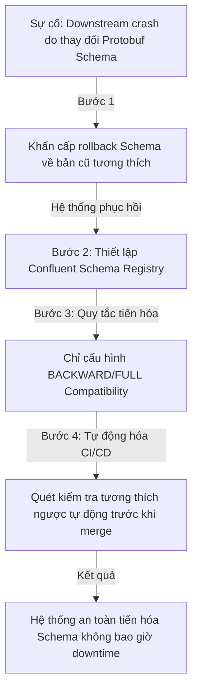

# Khung Đảm Bảo Tương Thích Ngược Schema Của Senior Engineer (Schema Evolution & Backward Compatibility Blueprint)

## ⚡ Tóm tắt ngắn (30s)
* **Tư duy cốt lõi**: Trong hệ thống phân tán quy mô lớn (Microservices/Event-Driven), việc thay đổi cấu trúc dữ liệu (Schema) là điều diễn ra liên tục. Senior Engineer thiết lập quy chuẩn **Schema Evolution (Tiến hóa Schema)** nghiêm ngặt để đảm bảo tính **Tương thích ngược (Backward Compatibility)** và **Tương thích xuôi (Forward Compatibility)**: Code phiên bản cũ vẫn đọc được dữ liệu mới ghi; và code phiên bản mới vẫn đọc được dữ liệu cũ đã lưu, loại bỏ hoàn toàn rủi ro crash hệ thống hay downtime khi deploy lệch pha.
* **Quy tắc vàng của Tiến hóa Schema**:
  1. *Chỉ Thêm - Không Sửa/Xóa (Add-Only Principle)*: Muốn thay đổi một trường, hãy thêm trường mới và giữ nguyên trường cũ cho đến khi toàn bộ hệ thống đã chuyển dịch hoàn toàn.
  2. *Luôn có Giá trị Mặc định (Default Values)*: Mọi trường mới thêm vào bắt buộc phải có giá trị mặc định (hoặc cho phép null) để các phiên bản cũ/mới không bị lỗi parsing.
  3. *Tuyệt đối không thay đổi chỉ số định danh (Field IDs/Tags)*: Trong các giao thức nhị phân (như Protobuf, Avro), chỉ số định danh (Field Number) là bất biến, không bao giờ được phép gán lại cho trường khác.

---

## 🔍 Kịch bản thực chiến (STAR Framework)

### 1. Situation (Bối cảnh)
Hệ thống xử lý đơn hàng (Order System) của chúng tôi được thiết kế theo kiến trúc hướng sự kiện (Event-Driven Architecture) chạy trên **Apache Kafka**. Khi đơn hàng được tạo, Order Service phát ra sự kiện `Order_Created` dưới dạng chuỗi nhị phân mã hóa bằng **Protocol Buffers (Protobuf)**. 
Có 4 dịch vụ downstream khác nhau (như Shipping Service, Notification Service, Analytics Service) consume sự kiện này để xử lý nghiệp vụ độc lập. 
Khi phát triển tính năng mới, một lập trình viên tiến hành chỉnh sửa file `.proto` của sự kiện `Order_Created`: đổi tên trường `address` thành `shipping_address` để rõ nghĩa hơn và gán lại số thứ tự định danh (Field Number) của trường cũ cho một trường mới khác. 
Khi deploy Order Service phiên bản mới lên production, ngay lập tức **cả 4 dịch vụ downstream cũ bị crash hàng loạt** và không thể tiêu thụ tin nhắn mới từ Kafka, khiến luồng vận chuyển và thông báo bị tê liệt hoàn toàn.

### 2. Task (Thử thách)
Với tư cách là Senior Architect/Tech Lead, tôi phải:
1. Giải cứu hệ thống downstream đang bị crash, khôi phục luồng tin nhắn lập tức.
2. Thiết lập quy chuẩn quản lý tiến hóa cấu trúc dữ liệu (**Schema Registry & Protobuf Rules**) để ngăn ngừa 100% rủi ro phá vỡ contract dữ liệu trong tương lai.

### 3. Action (Hành động)
Tôi đã thực hiện khôi phục hệ thống khẩn cấp và tái cấu trúc quy trình quản lý schema:

* **Bước 1: Khắc phục sự cố khẩn cấp (Emergency Mitigation)**
  - Tôi ra lệnh rollback lập tức cấu hình Schema của sự kiện `Order_Created` về phiên bản cũ để các dịch vụ downstream có thể đọc được tin nhắn bình thường trở lại. 
  - Đóng gói bài học lỗi và tổ chức buổi họp chuẩn hóa quy trình quản lý schema.

* **Bước 2: Triển khai Quản lý Schema tập trung (Schema Registry)**
  Tôi tích hợp công cụ **Confluent Schema Registry** vào hạ tầng Kafka:
  - Mọi ứng dụng (Producer/Consumer) không được tự ý gửi nhận dữ liệu nhị phân thô (Raw Bytes) vô danh.
  - Khi gửi sự kiện, Producer gửi Schema lên Schema Registry để kiểm tra và lấy về một ID duy nhất đại diện cho Schema đó. Tin nhắn gửi vào Kafka sẽ đính kèm ID này.
  - Consumer nhận tin nhắn, đọc ID Schema, tự động tải Schema tương ứng từ Schema Registry về để giải mã (deserialization) dữ liệu một cách chuẩn xác.

* **Bước 3: Thiết lập Quy tắc Tiến hóa Schema Nghiêm ngặt (Compatibility Rules)**
  Tôi cấu hình trên Schema Registry chế độ kiểm tra tự động **BACKWARD** hoặc **FULL Compatibility**:
  - **BACKWARD Compatibility (Tương thích ngược - Khuyên dùng)**: Đảm bảo code mới viết luôn đọc được dữ liệu cũ đã ghi. Quy tắc:
    * *Được phép*: Thêm trường mới có giá trị mặc định; Xóa trường cũ đã có giá trị mặc định.
    * *Cấm*: Thêm trường mới bắt buộc (REQUIRED) không có giá trị mặc định; Xóa trường cũ bắt buộc.
  - **Quy tắc bất biến của Protobuf/Avro**:
    * **Tuyệt đối không thay đổi Field Number**: Trong file `.proto`, số thứ tự định danh (ví dụ: `string address = 5;`) là bất biến. Nếu đổi tên trường thành `shipping_address`, bắt buộc phải giữ nguyên số `5` (`string shipping_address = 5;`). Tuyệt đối không được gán số `5` cho trường khác, vì Protobuf mã hóa dữ liệu dựa trên số định danh này chứ không dựa trên tên trường.
    * **Sử dụng từ khóa `reserved`**: Khi muốn xóa trường `address` cũ số 5, tôi đánh dấu nó là `reserved 5;` hoặc `reserved "address";`. Việc này giúp ngăn chặn các nhà phát triển trong tương lai vô tình gán lại số 5 hoặc tên "address" cho một trường khác, gây xung đột và crash các ứng dụng cũ.

* **Bước 4: Tự động hóa kiểm tra tương thích trên CI/CD Pipeline**
  - Tôi cấu hình công cụ **Buf (Protobuf toolchain)** vào CI/CD pipeline.
  - Mỗi khi dev tạo Pull Request thay đổi file `.proto`, pipeline sẽ tự động chạy lệnh `buf breaking --against .git#branch=main` để quét so sánh với bản code trên nhánh `main`.
  - Nếu phát hiện dev vi phạm quy tắc tương thích ngược (như xóa trường, thay đổi kiểu dữ liệu, gán lại ID), pipeline sẽ tự động báo lỗi đỏ và chặn không cho phép merge code.

### 4. Result (Kết quả)
* **Triệt tiêu hoàn toàn sự cố**: Sau khi áp dụng Schema Registry và Buf CLI trên CI/CD, không xảy ra thêm bất kỳ sự cố sập downstream nào do xung đột cấu hình Schema sự kiện.
* **Độc lập phát triển**: Các dịch vụ upstream và downstream có thể tự do phát triển, deploy độc lập lệch pha nhau mà không cần họp bàn căn chỉnh thời gian deploy như trước.

---

## 💡 Nguyên tắc Senior & Bài học đắt giá

1. **"The Database is not your playground" (Database và Message Broker không phải là sân chơi cá nhân)**: Trong hệ thống độc lập (Monolith), bạn có thể dễ dàng refactor đổi tên cột vì code và DB đi cùng nhau. Trong hệ thống phân tán, cấu trúc dữ liệu lưu trên DB hay Event Broker là **tài sản dùng chung lâu dài (Long-lived public contracts)**. Thay đổi nó đòi hỏi sự cẩn trọng cao nhất.
2. **Backward vs Forward Compatibility (Tương thích ngược vs Tương thích xuôi)**:
   - *Tương thích ngược (Backward)*: Consumer phiên bản MỚI đọc được tin nhắn do Producer phiên bản CŨ gửi. (Dễ xử lý).
   - *Tương thích xuôi (Forward)*: Consumer phiên bản CŨ vẫn đọc được tin nhắn do Producer phiên bản MỚI gửi (chỉ đơn giản bỏ qua các trường mới không hiểu). (Khó xử lý hơn, đòi hỏi mọi trường mới thêm vào phải có giá trị mặc định và cho phép null).
3. **Luôn thiết kế Schema mở rộng sẵn**: Khi thiết kế các thực thể (Entities/Protobuf), tránh dùng các kiểu dữ liệu quá cứng nhắc. Sử dụng các cấu trúc dạng Map/Document hoặc định nghĩa sẵn các trường mở rộng nếu dự đoán nghiệp vụ sẽ thay đổi liên tục.

---

## 📊 So sánh phương án quyết định (Trade-offs)

| Giải pháp quản lý Schema | Ưu điểm (Pros) | Nhược điểm (Cons) | Use Case Phù hợp |
| :--- | :--- | :--- | :--- |
| **Gửi nhận JSON thô (Raw JSON)** | - Cực kỳ đơn giản, trực quan, dễ đọc bằng mắt thường. - Không cần cài đặt hạ tầng Schema Registry phức tạp. | - Tốn băng thông mạng gấp 5-10 lần (do JSON chứa cả tên trường dạng text lặp đi lặp lại). - Không có cơ chế kiểm tra tính đúng đắn dữ liệu ở mức vật lý (dễ bị lỗi Null/Typo do dev gõ sai tên trường). | Các dự án nhỏ, microservices nội bộ ít, luồng dữ liệu ít nhạy cảm và traffic không quá lớn. |
| **Protobuf/Avro + Schema Registry (Khuyên dùng)** | - **Dung lượng tin nhắn siêu nhẹ (nén nhị phân tối đa)**. - Tốc độ mã hóa nhanh gấp 5 lần JSON. - Đảm bảo an toàn tuyệt đối contract dữ liệu nhờ CI/CD gate. | - Tăng độ phức tạp của hạ tầng và quy trình phát triển (phải compile file `.proto` thành code Java/Go trước khi viết). | **Bắt buộc áp dụng** cho các hệ thống hướng sự kiện (Event-Driven) lớn, Fintech, hệ thống xử lý thời gian thực (Real-time analytics). |

---

## ⚠️ Common Gotchas (Câu hỏi phỏng vấn đào sâu)

### 1. Nếu bạn bắt buộc phải thay đổi kiểu dữ liệu của một trường trong Database từ `INT` (chỉ số id cũ) sang `VARCHAR` (UUID mới) để phục vụ quy mô hệ thống lớn, làm thế nào bạn thực hiện thay đổi này mà vẫn đảm bảo 100% tương thích ngược, không làm crash code cũ đang chạy?
* **Trả lời**: Đây là thử thách thay đổi kiểu dữ liệu (Type Migration) kinh điển đòi hỏi quy trình 5 bước nghiêm ngặt:
  * **Quy trình di cư kiểu dữ liệu an toàn**:
    1. **Bước 1 - Expand (Thêm cột mới)**: Tạo cột mới tên là `uuid_new` với kiểu dữ liệu `VARCHAR` trên DB, giữ nguyên cột `id` kiểu `INT` cũ.
    2. **Bước 2 - Dual Write (Ghi song song)**: Deploy code mới (Version 1.1) cấu hình: khi ghi nhận dữ liệu, ghi đồng thời giá trị cũ vào `id` và giá trị UUID mới vào `uuid_new`. Đối với luồng đọc, code mới vẫn ưu tiên đọc từ `id` cũ nếu `uuid_new` bị trống.
    3. **Bước 3 - Backfill (Đồng bộ dữ liệu lịch sử)**: Chạy một background batch job quét toàn bộ các bản ghi cũ, sinh UUID ngẫu nhiên và điền vào cột `uuid_new` cho các record lịch sử.
    4. **Bước 4 - Cutover (Định tuyến hoàn toàn)**: Deploy code Version 1.2 thay đổi hoàn toàn logic: đọc và ghi 100% trên cột `uuid_new`. Lúc này cột `id` cũ hoàn toàn không còn được sử dụng bởi bất kỳ dòng code nào trên production.
    5. **Bước 5 - Contract (Xóa cột cũ)**: Chạy script SQL DROP COLUMN `id` cũ để làm sạch cấu trúc Database hoàn tất quá trình di cư an toàn không downtime.

### 2. Trong Apache Kafka, sự khác biệt cốt lõi giữa hai định dạng mã hóa nhị phân Protocol Buffers (Protobuf) và Apache Avro là gì? Khi nào bạn chọn Avro thay vì Protobuf cho hệ thống doanh nghiệp?
* **Trả lời**: Đây là kiến thức chuyên sâu so sánh các công nghệ Serialization:
  * **Sự khác biệt cốt lõi**:
    1. **Mức độ phụ thuộc Schema khi truyền tải**:
       - *Avro*: Tin nhắn mã hóa nhị phân của Avro **hoàn toàn không chứa bất kỳ thông tin nào về cấu trúc/tên trường** (không có Field ID hay tag nhị phân). Tin nhắn chỉ là một chuỗi byte thô liên tiếp. Để giải mã dữ liệu, Consumer **bắt buộc phải có đúng file Schema gốc** dùng để mã hóa tin nhắn đó. Do đó, Avro tích hợp cực kỳ chặt chẽ với Schema Registry.
       - *Protobuf*: Tin nhắn nhị phân của Protobuf **có chứa số thứ tự định danh (Field ID/Tag) và kiểu dữ liệu nhị phân (Wire Type)** của từng trường. Consumer có thể giải mã một phần tin nhắn Protobuf ngay cả khi không có Schema đầy đủ (chỉ cần bỏ qua các trường có ID lạ).
    2. **Khả năng tự động mô tả (Self-Describing)**:
       - Avro Schema được định nghĩa bằng JSON, rất dễ đọc và phân tích tự động bằng code.
       - Protobuf Schema định nghĩa bằng ngôn ngữ riêng (DSL `.proto`), cần có trình biên dịch `protoc` để dịch sang code cụ thể.
  * **Khi nào chọn Avro**:
    - **Hệ thống Data Lake / Big Data (Hadoop, Spark, ClickHouse)**: Avro là định dạng tiêu chuẩn vàng của thế giới dữ liệu lớn. Vì Avro không lưu thông tin schema trong tin nhắn, dung lượng lưu trữ của hàng tỷ records Avro trên đĩa cứng sẽ nhỏ hơn rất nhiều so với Protobuf.
    - **Hệ thống cần thay đổi Schema cực kỳ động**: Avro hỗ trợ tiến hóa schema linh hoạt hơn, cho phép định nghĩa các quy tắc phức tạp dễ dàng qua file JSON.
  * **Khi nào chọn Protobuf**:
    - **Hệ thống Microservices cần gRPC**: gRPC mặc định sử dụng Protobuf làm giao thức truyền tải, mang lại tốc độ gọi API siêu nhanh giữa các service đa ngôn ngữ (Java, Go, Node.js).
