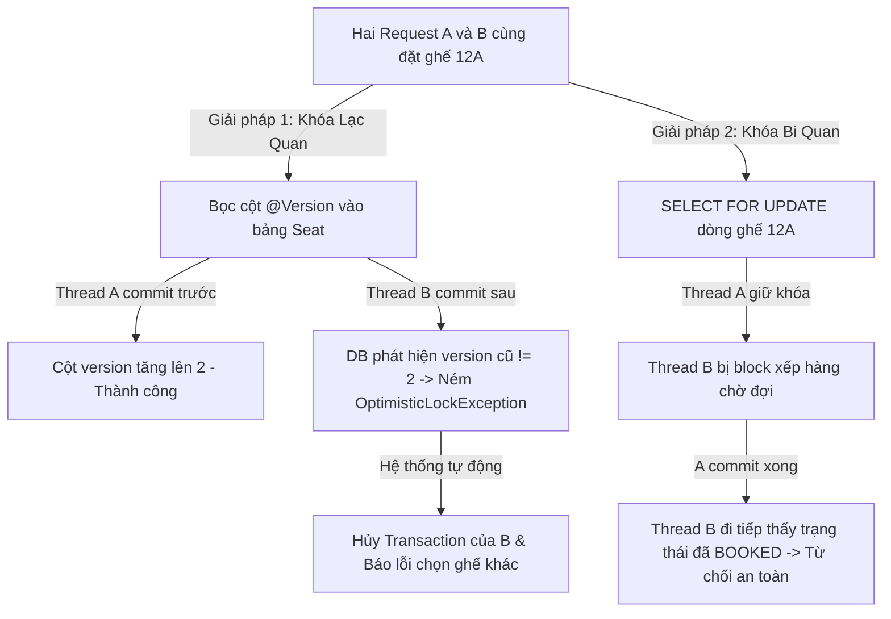

# Khung Tư Duy Phát Hiện Và Xử Lý Race Condition Của Senior Engineer (Race Condition Detection & Mitigation Blueprint)

## ⚡ Tóm tắt ngắn (30s)
* **Tư duy cốt lõi**: Race Condition (Tranh chấp đồng thời) xảy ra khi nhiều luồng xử lý (Threads/Processes) đồng thời truy cập và sửa đổi một nguồn dữ liệu dùng chung, và kết quả cuối cùng phụ thuộc vào thứ tự thực thi của các luồng đó. Trong hệ thống phân tán, Race Condition là nguồn gốc của các lỗi dị biệt nghiêm trọng nhất (như double booking, sai lệch số dư tài khoản).
* **Quy tắc "3 Tầng Phòng Thủ Concurrency"**:
  1. *Khóa Lạc Quan ở tầng Database (Optimistic Locking)*: Sử dụng thuộc tính số phiên bản `@Version` để phát hiện và ngăn chặn ghi đè đè dữ liệu cũ (chống lỗi Lost Update) với chi phí tài nguyên cực thấp.
  2. *Khóa Bi Quan cho luồng nhạy cảm (Pessimistic Locking / SELECT FOR UPDATE)*: Khóa cứng dòng dữ liệu ở mức vật lý của DB để bắt các luồng đồng thời phải xếp hàng chờ đợi khi thực hiện các giao dịch tài chính quan trọng.
  3. *Khóa Phân Tán cho hệ thống lớn (Distributed Lock via Redis)*: Cách ly và đồng bộ hóa luồng xử lý trên toàn bộ cụm máy chủ đa instance.

---

## 🔍 Kịch bản thực chiến (STAR Framework)

### 1. Situation (Bối cảnh)
Hệ thống đặt chỗ của hãng hàng không chúng tôi có một tính năng nhạy cảm: lựa chọn ghế ngồi cao cấp trên chuyến bay. 
Tại thời điểm mở bán vé Tết, hệ thống ghi nhận sự cố nghiêm trọng: **Hai khách hàng khác nhau ở hai tỉnh thành khác nhau cùng mua thành công và được xếp vào cùng một ghế ngồi số 12A trên chuyến bay**. 
Khi kiểm tra mã nguồn, tôi phát hiện ra đoạn code đặt ghế được viết rất ngây thơ:
```java
// Bước A: SELECT xem ghế 12A đã có ai đặt chưa
Seat seat = seatRepository.findByFlightAndNumber(flightId, "12A");
if (seat.getStatus() == SeatStatus.AVAILABLE) {
    // Bước B: Nếu trống, cập nhật trạng thái đã đặt
    seat.setStatus(SeatStatus.BOOKED);
    seatRepository.save(seat);
}
```
Do hai request của khách hàng A và B chạm tới 2 máy chủ ứng dụng Spring Boot độc lập cùng 1 thời điểm. Cả hai luồng xử lý cùng SELECT thấy ghế 12A trống (AVAILABLE) tại Bước A, và cả hai cùng đi tiếp vào Bước B để thực hiện cập nhật trạng thái thành đặt công (BOOKED) cho bản thân, tạo ra lỗi sọc ghế kinh điển.

### 2. Task (Thử thách)
Với tư cách là Senior Backend Engineer, tôi phải:
1. Sửa lỗi triệt để, đảm bảo **không bao giờ xảy ra tình trạng đặt trùng ghế (Race Condition) nữa**.
2. Đưa ra giải pháp tối ưu nhất về hiệu năng, không làm giảm tốc độ mua vé của khách hàng dưới tải cực đại.

### 3. Action (Hành động)
Tôi đã xây dựng chiến lược xử lý tranh chấp đồng thời phân tầng tùy thuộc vào tần suất xung đột dữ liệu:



* **Bước 1: Áp dụng Khóa Lạc Quan (Optimistic Locking) cho luồng ít tranh chấp**
  Đối với các bảng dữ liệu có tần suất cập nhật đồng thời thấp (ví dụ: thông tin profile user, chi tiết chuyến bay), tôi cấu hình **Optimistic Locking** sử dụng JPA/Hibernate:
  - Thêm một cột `version` kiểu `INT` vào bảng `seats` và khai báo annotation `@Version` trong Java Entity.
  - **Cơ chế tự vệ**: Khi Hibernate thực thi lệnh UPDATE, nó tự động so sánh số phiên bản:
    ```sql
    UPDATE seats SET status = 'BOOKED', version = version + 1 WHERE id = 99 AND version = 1;
    ```
    Nếu Kỹ sư A đã commit trước và tăng version lên `2`, câu lệnh UPDATE của Kỹ sư B đến sau với điều kiện `version = 1` sẽ trả về kết quả `0` dòng được cập nhật. Hibernate lập tức ném ra ngoại lệ **OptimisticLockingFailureException**. Hệ thống tự động ROLLBACK transaction của B và thông báo cho B chọn ghế khác.
  - *Lợi ích*: Cực kỳ nhanh, không khóa vật lý DB, throughput hệ thống đạt tối đa.

* **Bước 2: Áp dụng Khóa Bi Quan (Pessimistic Locking) cho luồng tranh chấp cao & nhạy cảm**
  Đối với nghiệp vụ đặt ghế hoặc trừ tiền ví tài khoản (tần suất tranh chấp siêu cao tại một thời điểm cực ngắn), Khóa Lạc Quan sẽ gây ra lỗi Retry liên tục làm ức chế người dùng. Tôi chuyển sang dùng **Pessimistic Locking**:
  - Cấu hình JPA Repository sử dụng thuộc tính khóa bi quan:
    ```java
    @Lock(LockModeType.PESSIMISTIC_WRITE)
    @Query("SELECT s FROM Seat s WHERE s.flightId = :flightId AND s.number = :number")
    Optional<Seat> findAndLockSeat(Long flightId, String number);
    ```
  - **Cơ chế hoạt động**: Khi luồng A thực thi câu query trên, PostgreSQL sẽ lập tức khóa dòng dữ liệu ghế 12A vật lý bằng lệnh `SELECT ... FOR UPDATE`. Luồng B đến sau thực thi câu query tương tự sẽ bị **block hoàn toàn** tại tầng Database, buộc phải xếp hàng chờ đợi.
  - Khi luồng A thực hiện xong UPDATE trạng thái ghế thành `BOOKED` và commit transaction, khóa được giải phóng. Luồng B đi tiếp, lúc này dữ liệu ghế đọc ra đã ở trạng thái `BOOKED`, code logic sẽ tự động từ chối đặt ghế của B một cách an toàn.

* **Bước 3: Sử dụng Khóa Phân Tán (Distributed Lock via Redis Redisson)**
  Đối với các API quy mô siêu lớn chạy trên nhiều cụm Data Center khác nhau, hoặc khi cần khóa một luồng nghiệp vụ phức tạp đi qua nhiều microservices, tôi sử dụng **Redisson** (thư viện Redis chuyên dụng):
  - Lấy khóa phân tán với key: `lock:flight:101:seat:12A`.
  - Cài đặt thời gian chờ lấy khóa (Lease Time) là 3 giây và thời gian tự động giải phóng khóa (Lock TTL) là 10 giây để tránh lỗi treo khóa vĩnh viễn (Deadlock) nếu máy chủ ứng dụng bị sập đột ngột khi đang giữ khóa.

### 4. Result (Kết quả)
* **Triệt tiêu lỗi hoàn toàn**: Hệ thống đặt vé đạt độ chính xác **100%**, không bao giờ xảy ra tình trạng trùng ghế hay sọc số dư tài khoản nữa.
* **Hiệu năng xuất sắc**: Việc áp dụng linh hoạt Khóa Lạc Quan cho 90% bảng thông thường và chỉ áp dụng Khóa Bi Quan/Distributed Lock cho 10% luồng nhạy cảm giúp hệ thống giữ vững p99 latency ở mức dưới **60ms** dưới tải đỉnh.

---

## 💡 Nguyên tắc Senior & Bài học đắt giá

1. **"Never trust application-level checks" (Tuyệt đối không tin tưởng kiểm tra ở tầng ứng dụng)**: Mọi câu lệnh kiểm tra dạng `if (status == AVAILABLE)` chạy trên bộ nhớ của Java đều vô giá trị khi có nhiều luồng đồng thời chạy song song. Ranh giới bảo vệ cuối cùng bắt buộc phải được thiết lập ở tầng Database (Unique Constraints, Locks) hoặc tầng Distributed Lock tập trung.
2. **Beware of Deadlocks (Cảnh giác cao độ với Deadlock)**: Khi lạm dụng Khóa Bi Quan (Pessimistic Lock), nếu không thiết kế cẩn thận, hệ thống rất dễ bị **Deadlock** (Thread A giữ khóa dòng 1 chờ khóa dòng 2; Thread B giữ khóa dòng 2 chờ khóa dòng 1). Quy tắc vàng: *Luôn luôn lock các tài nguyên theo một thứ tự cố định duy nhất trong toàn bộ codebase (ví dụ: luôn lock User ID nhỏ trước, User ID lớn sau).*
3. **Thấu hiểu Isolation Levels**: Senior cần nắm rõ 4 cấp độ cô lập của Transaction DB (Read Uncommitted, Read Committed, Repeatable Read, Serializable). Đa số các hệ quản trị DB đặt mặc định là `Read Committed`, mức này không chống được lỗi Lost Update hay Write Skew, do đó bắt buộc phải tự bọc thêm Optimistic/Pessimistic Lock bằng tay cho các luồng nhạy cảm.

---

## 📊 So sánh phương án quyết định (Trade-offs)

| Cơ chế chống Race Condition | Ưu điểm (Pros) | Nhược điểm (Cons) | Use Case Phù hợp |
| :--- | :--- | :--- | :--- |
| **Khóa Lạc Quan (Optimistic Lock)** | - Hiệu năng siêu cao, throughput đạt cực đại.<br>- Không giữ lock vật lý DB, tránh hoàn toàn rủi ro deadlock hạ tầng. | - Nếu tần suất tranh chấp cao, nhiều request sẽ bị thất bại liên tục (ném exception), gây tốn tài nguyên retry. | Các hệ thống có tỷ lệ đọc nhiều - ghi ít, dữ liệu ít bị tranh chấp đồng thời (ví dụ: chỉnh sửa bài viết, cập nhật profile). |
| **Khóa Bi Quan (Pessimistic Lock)** | - **An toàn tuyệt đối ở mức vật lý DB**.<br>- Tránh được lỗi retry của dev khi tranh chấp cao (vì DB tự động xếp hàng request). | - Làm giảm nhẹ throughput của DB (do giữ lock độc quyền dòng dữ liệu).<br>- Có rủi ro gây Deadlock nếu viết code ẩu. | Các giao dịch tài chính, thanh toán, trừ số dư ví, đặt chỗ, đặt vé xe/phim có tính tranh chấp cực cao. |
| **Khóa Phân Tán (Distributed Lock)** | - Cô lập lỗi ở tầng ứng dụng trước khi chạm DB.<br>- Khóa được luồng nghiệp vụ đi qua nhiều microservices độc lập. | - Phụ thuộc hạ tầng Redis/ZooKeeper.<br>- Độ trễ tăng nhẹ do tốn thêm network hop gọi sang Redis. | Hệ thống Microservices phân tán phức tạp, hoặc khi Database sử dụng là NoSQL không hỗ trợ lock mạnh. |

---

## ⚠️ Common Gotchas (Câu hỏi phỏng vấn đào sâu)

### 1. Sự khác biệt cốt lõi giữa lỗi "Lost Update" (Mất bản cập nhật) và "Write Skew" (Lệch luồng ghi) trong Database là gì? Khóa Lạc Quan (Optimistic Lock) có giải quyết được lỗi Write Skew không?
* **Trả lời**: Đây là câu hỏi phân biệt đẳng cấp kiến trúc chuyên sâu:
  * **Lost Update (Mất bản cập nhật)**:
    - Xảy ra khi hai transaction cùng đọc dòng dữ liệu A (version 1), cùng sửa và cùng ghi lại. Transaction commit sau sẽ đè bẹp kết quả của transaction commit trước.
    - *Giải pháp*: Khóa Lạc Quan giải quyết **hoàn hảo** lỗi này vì version tăng lên sẽ chặn đứng giao dịch ghi đè sau.
  * **Write Skew (Lệch luồng ghi)**:
    - Xảy ra khi hai transaction độc lập đọc các dòng dữ liệu khác nhau nhưng có ràng buộc nghiệp vụ chung, dẫn đến trạng thái dữ liệu cuối cùng vi phạm ràng buộc đó.
    - *Ví dụ kinh điển*: Hệ thống trực bệnh viện quy định: *"Luôn phải có ít nhất 1 bác sĩ trực"*. Hiện tại có Bác sĩ A và B đang trực.
      * Transaction 1 (Bác sĩ A xin nghỉ): Đọc thấy DB có 2 bác sĩ trực -> Hợp lệ -> Tiến hành xin nghỉ thành công -> Commit.
      * Transaction 2 (Bác sĩ B xin nghỉ đồng thời): Đọc thấy DB có 2 bác sĩ trực -> Hợp lệ -> Tiến hành xin nghỉ thành công -> Commit.
      * Kết quả cuối cùng: Cả hai bác sĩ cùng nghỉ, bệnh viện không còn ai trực!
    - *Khóa Lạc Quan có giải quyết được không?* **KHÔNG**. Vì Transaction 1 update dòng của bác sĩ A (version tăng trên dòng A), Transaction 2 update dòng của bác sĩ B (version tăng trên dòng B). Không có dòng nào bị ghi đè trực tiếp, do đó không ném ra ngoại lệ OptimisticLockException!
  * **Cách giải quyết Write Skew**: Bắt buộc phải dùng **Khóa Bi Quan (Pessimistic Lock / SELECT FOR UPDATE)** hoặc đặt Transaction Isolation Level ở mức cao nhất là **Serializable** để DB tự động phát hiện xung đột phụ thuộc và hủy bỏ 1 trong 2 giao dịch.

### 2. Khi sử dụng Redis để làm Distributed Lock, điều gì xảy ra nếu máy chủ Redis Master bị sập đúng vào thời điểm ứng dụng của bạn vừa lấy được khóa thành công, và hệ thống tự động thăng cấp một Redis Replica lên làm Master mới nhưng khóa đó chưa kịp đồng bộ sang (vì cơ chế đồng bộ của Redis là bất đồng bộ)? Làm thế nào thuật toán Redlock của Redis giải quyết được lỗi này?
* **Trả lời**: Đây là câu hỏi cực sâu về phân tích lỗi của hạ tầng Redis:
  * **Rủi ro mất khóa**: Do Redis replication là bất đồng bộ (Asynchronous), khóa vừa ghi vào Master cũ biến mất khi Replica lên làm Master mới. Lúc này, một máy chủ ứng dụng khác có thể vào yêu cầu khóa và lấy thành công khóa đó, dẫn đến 2 máy chủ cùng chạy luồng độc quyền đồng thời, gây Race Condition nghiêm trọng.
  * **Cách thuật toán Redlock giải quyết**:
    - Để chạy thuật toán **Redlock**, chúng ta bắt buộc phải dựng tối thiểu **5 máy chủ Redis độc lập hoàn toàn (không Master-Replica, không Cluster chung)**.
    - Quy trình lấy khóa Redlock:
      1. Ứng dụng gửi yêu cầu lấy khóa đồng thời đến cả 5 máy chủ Redis độc lập này với cùng một key và giá trị ngẫu nhiên.
      2. Ứng dụng đo đạc thời gian lấy khóa. Để lấy khóa thành công, ứng dụng phải giành được khóa ở **đa số máy chủ (tối thiểu 3 trên 5 máy chủ)** trong một khoảng thời gian cực ngắn (nhỏ hơn nhiều so với TTL của khóa).
      3. Nếu lấy khóa thành công ở 3/5 máy chủ, khóa được coi là hợp lệ. 
      4. Nếu chẳng may 1 máy chủ Redis bị sập đột ngột, 4 máy chủ còn lại vẫn lưu giữ trạng thái khóa chính xác. Không một ứng dụng nào khác có thể giành được đa số (3/5) máy chủ nữa, bảo vệ an toàn tuyệt đối cho tính độc quyền của khóa trên toàn hệ thống phân tán.
