# Phân biệt Docker Image và Docker Container (Bản chất UnionFS & Read-Write Layer)

## ⚡ Tóm tắt ngắn (30s)
* **Tư duy OOP**: Nếu coi **Docker Image** là một lớp (`Class` - bản thiết kế tĩnh, chỉ đọc, bất biến), thì **Docker Container** là một thực thể (`Instance` - đối tượng chạy động, có trạng thái biến đổi).
* **Bản chất lưu trữ**: 
  * **Image** cấu thành từ các lớp xếp chồng chỉ đọc (**Read-only Layers**), được quản lý bởi **Union File System (UnionFS)**.
  * **Container** được tạo ra bằng cách thêm một lớp ghi mỏng chỉ tồn tại tạm thời (**Thin Writable Container Layer**) lên trên cùng của Image đó, đi kèm với không gian chạy cô lập (Namespace & Cgroups).

---

## 🔍 Chi tiết bản chất kỹ thuật

### 1. Bản chất của Docker Image
Docker Image là một gói phần mềm nhẹ, độc lập, có thể chạy được, chứa mọi thứ cần thiết để chạy một ứng dụng (code, runtime, thư viện hệ thống, biến môi trường và file config).
* **Bất biến (Immutable)**: Image là Read-only. Bạn không thể sửa đổi trực tiếp nội dung của một Image đang tồn tại.
* **Cơ chế phân lớp (Layering)**: Mỗi dòng lệnh trong `Dockerfile` (như `RUN`, `COPY`, `ADD`) sẽ tạo ra một layer mới. Các layer này xếp chồng lên nhau. 
* **Chia sẻ Layer (Layer Reusability)**: Nhờ UnionFS, nếu nhiều Image sử dụng cùng một layer cơ sở (ví dụ: `ubuntu:22.04`), chúng sẽ chia sẻ chung layer đó trên đĩa cứng để tiết kiệm dung lượng (Content-addressable storage).

### 2. Bản chất của Docker Container
Container là trạng thái hoạt động trực tiếp (Active Runtime State) của một Image.
* **Cơ chế Copy-on-Write (CoW)**: Khi container khởi chạy, Docker Engine tạo một layer ghi tạm thời (**Writable Layer**) trên đỉnh.
  * Khi container muốn đọc một file từ Image, nó đọc trực tiếp từ read-only layer bên dưới.
  * Khi container muốn chỉnh sửa (ghi/xóa) file từ Image, Docker sẽ copy file đó lên Writable Layer rồi mới thực hiện sửa đổi. File gốc ở lớp Image bên dưới vẫn hoàn toàn nguyên vẹn.
* **Vòng đời tạm thời (Ephemeral)**: Khi Container bị xóa (`docker rm`), toàn bộ Writable Layer này sẽ bị phá hủy hoàn toàn. Dữ liệu ghi trên đó sẽ mất sạch trừ khi được ánh xạ ra ngoài qua **Volume** hoặc **Bind Mount**.

---

## 🎨 Sơ đồ cấu trúc bộ nhớ & File System (UnionFS)

```mermaid
graph TD
    subgraph Container_Runtime ["Docker Container (Trạng thái chạy)"]
        WL["Thin Writable Layer (Container Layer) - Đọc/Ghi <br> [Dữ liệu tạm thời phát sinh khi chạy]"]
    end
    
    subgraph Image_Static ["Docker Image (Bản thiết kế tĩnh)"]
        L3["Layer 3 (App Code & Config) - Chỉ đọc"]
        L2["Layer 2 (Runtime - e.g. OpenJDK) - Chỉ đọc"]
        L1["Layer 1 (Base OS - e.g. Alpine) - Chỉ đọc"]
    end

    WL --> L3
    L3 --> L2
    L2 --> L1

    style WL fill:#9b2c2c,stroke:#e53e3e,stroke-width:2px,color:#fff
    style L3 fill:#1a365d,stroke:#3182ce,stroke-width:1px
    style L2 fill:#1a365d,stroke:#3182ce,stroke-width:1px
    style L1 fill:#1a365d,stroke:#3182ce,stroke-width:1px
```



---

## 💻 Minh họa & Tác động thực chiến

### BAD ❌ (Lắp cấu hình động vào Image hoặc thay đổi trạng thái Container thủ công)
* **Kịch bản sai lầm**: Khởi chạy một Container từ base image, sau đó SSH vào container chạy cài đặt Java, tải code, sửa file cấu hình kết nối Database trực tiếp trong container, rồi dùng lệnh `docker commit` để tạo Image mới cứu cánh.
* **Hậu quả**:
  1. Phá vỡ tính bất biến và khả năng tái lập (Reproducibility) của hạ tầng.
  2. Tạo ra các Image cực kỳ nặng (do Writable layer lưu các file log, cache cài đặt không được dọn dẹp).
  3. Khi container crash, mọi dữ liệu cấu hình biến mất, không thể scale-up hay tự động phục hồi (Self-healing).

### GOOD ✅ (Stateless Container & Khai báo qua Dockerfile)
* **Kịch bản chuẩn**: Sử dụng file cấu hình bất biến khai báo rõ ràng quy trình xây dựng Image thông qua `Dockerfile`. Mọi cấu hình kết nối DB được nạp động qua **Environment Variables** khi chạy Container.

**Dockerfile (`src/main/docker/Dockerfile`):**
```dockerfile
# Sử dụng base image mỏng gọn
FROM eclipse-temurin:17-jre-alpine

WORKDIR /app

# Copy artifact đã build sẵn vào read-only layer
COPY target/api-service.jar app.jar

# Khai báo cổng chạy ứng dụng
EXPOSE 8080

# Chạy app thông qua biến môi trường nạp lúc run container
ENTRYPOINT ["java", "-jar", "app.jar"]
```

**Lệnh khởi chạy Container nạp biến cấu hình động:**
```bash
docker run -d \
  --name payment-service-running \
  -p 8080:8080 \
  -e DB_URL="jdbc:postgresql://db.prod:5432/payment" \
  -e DB_USERNAME="prod_user" \
  -v payment-logs:/app/logs \
  payment-service-image:1.0.0
```

---

## 📊 Bảng so sánh thuộc tính cốt lõi

| Đặc tính | Docker Image | Docker Container |
| :--- | :--- | :--- |
| **Trạng thái** | Tĩnh (Static), Lưu trên disk. | Động (Active Process), Chạy trên RAM/CPU. |
| **Tính đột biến** | Bất biến (Immutable) - Chỉ đọc. | Khả biến (Mutable) - Có thể đọc và ghi. |
| **Cơ chế File System** | Tập hợp các Read-only Layers. | Read-only Layers + 1 Thin Writable Layer. |
| **Vòng đời** | Tồn tại lâu dài trừ khi bị xóa thủ công. | Ephemeral (Tạm thời), dễ dàng tạo/xóa chỉ trong vài mili-giây. |
| **Chia sẻ tài nguyên** | Một Image có thể khởi chạy hàng nghìn Container đồng dạng. | Mỗi container có tài nguyên RAM/CPU cô lập (Cgroups). |

---

## ⚠️ Common Gotchas (Câu hỏi phỏng vấn đào sâu)

### 1. "Tại sao tôi chạy lệnh xóa một file 500MB trong Dockerfile nhưng kích thước Image cuối cùng không hề giảm đi?"
* **Bản chất**: Mỗi lệnh `RUN` trong Dockerfile tạo ra một Layer riêng biệt. Nếu Layer 2 tạo ra file `temp.zip` (500MB) và Layer 3 chạy lệnh `rm temp.zip`, UnionFS sẽ chỉ đánh dấu file đó là "đã bị xóa" (whiteout file) ở Layer 3. File 500MB gốc vẫn nằm nguyên vẹn tại Layer 2 và tiếp tục chiếm dụng bộ nhớ của Image cuối cùng.
* **Cách khắc phục**: Luôn tạo và xóa các file tạm trong **cùng một câu lệnh `RUN`** để tránh lưu file tạm vào layer trung gian:
  ```dockerfile
  # ❌ SAI: File zip vẫn chiếm dung lượng ở layer trước
  RUN wget http://example.com/large-package.zip
  RUN unzip large-package.zip && rm large-package.zip

  # ✅ ĐÚNG: Xử lý và dọn dẹp trong cùng một RUN layer
  RUN wget http://example.com/large-package.zip \
      && unzip large-package.zip \
      && rm large-package.zip
  ```

### 2. "Làm thế nào để hai Container chạy trên cùng một máy chủ chia sẻ dữ liệu với nhau một cách tối ưu?"
* **Trả lời**: Chúng ta không bao giờ nên lưu dữ liệu chia sẻ vào lớp ghi của container (`Writable Layer`) vì nó rất chậm (do overhead của Storage Driver) và không an toàn.
* **Giải pháp**: Sử dụng **Docker Volumes**. Docker engine sẽ bypass Storage Driver và ghi dữ liệu trực tiếp lên File System của Host OS tại thư mục được Docker quản lý (thường là `/var/lib/docker/volumes/`). Cả hai Container cùng gắn kết (mount) chung một volume này sẽ đạt tốc độ I/O tối đa và an toàn tuyệt đối khi một trong hai container bị khởi động lại.
