# GitOps: Triết Lý Vận Hành Hạ Tầng Lấy Git Làm Nguồn Chân Lý Duy Nhất (Single Source of Truth)

## ⚡ Tóm tắt ngắn (30s)
* **Định nghĩa**: **GitOps** là mô hình vận hành và triển khai hệ thống (thường áp dụng cho Kubernetes) trong đó **Git đóng vai trò là nguồn chân lý duy nhất (Single Source of Truth)** lưu trữ toàn bộ trạng thái mong muốn (Desired State) của hạ tầng dưới dạng mã khai báo (Declarative Code).
* **4 Nguyên tắc cốt lõi**:
  1. **Hạ tầng khai báo (Declarative)**: Toàn bộ hệ thống được mô tả bằng code (YAML, Helm, Kustomize).
  2. **Git là nơi lưu trữ duy nhất**: Mọi thay đổi về cấu hình, version ứng dụng bắt buộc phải commit vào Git.
  3. **Cơ chế Pull-based (Kéo tự động)**: Một Agent chạy trong cụm (như ArgoCD, Flux) liên tục quét Git để tự động kéo cấu hình mới về áp dụng.
  4. **Tự động đồng bộ & Chống lệch trạng thái (Reconciliation & Anti-drift)**: Agent liên tục so sánh trạng thái thực tế (Actual State) của hệ thống với Git. Nếu ai đó sửa thủ công trực tiếp trên cluster, Agent sẽ ngay lập tức phát hiện và **ghi đè ngược lại** theo đúng code trên Git để tránh hiện tượng trôi lệch cấu hình (Configuration Drift).

---

## 🔍 Chi tiết bản chất kỹ thuật & Cơ chế hoạt động

### 1. Phân biệt Push-based và Pull-based Deployment
* **Push-based (Mô hình CI/CD truyền thống)**:
  * *Cơ chế*: Máy ảo CI (như Jenkins, GitHub Actions) giữ file `kubeconfig` chứa quyền Admin của Kubernetes. Sau khi build xong, máy CI chạy lệnh `kubectl apply -f deployment.yaml` để đẩy (push) trực tiếp vào cụm K8s.
  * *Rủi ro bảo mật*: Máy CI giữ key quyền cao của K8s. Nếu máy CI bị hack, hacker sẽ chiếm toàn quyền kiểm soát cụm Production.
* **Pull-based (Mô hình GitOps - Khuyên dùng)**:
  * *Cơ chế*: Máy CI sau khi build xong chỉ làm đúng một việc: cập nhật tag image mới vào Git Config Repository (ví dụ: sửa `image: v1` thành `image: v2`). 
  * Tiếp theo, một Operator chạy **bên trong** cụm K8s (như **ArgoCD**) sẽ pull cấu hình từ Git về và tự động cập nhật.
  * *Ưu điểm*: Cụm K8s không cần mở cổng SSH ra ngoài, không ai giữ key Admin ngoài cụm. Bảo mật tuyệt đối.

### 2. Khả năng Rollback siêu tốc
* Trong hệ thống cũ, khi deploy lỗi, bạn phải lục lại logs CI, chạy lại pipeline cũ, hoặc gõ các lệnh phức tạp trên Terminal máy chủ.
* Với GitOps, việc Rollback cực kỳ đơn giản: Bạn chỉ cần vào Git chạy lệnh **`git revert <commit_id>`** để đưa cấu hình về trạng thái trước đó. ArgoCD sẽ phát hiện thay đổi trên Git và tự động đưa cụm K8s về phiên bản cũ chỉ trong vài giây.

---

## 🎨 Sơ đồ Quy trình Hoạt động của GitOps với ArgoCD

```mermaid
graph TD
    Dev["Developer"] -->|1. Tạo Pull Request sửa cấu hình| GitConfig["Git Config Repo <br> (Desired State - K8s YAMLs)"]
    GitConfig -->|2. Approve & Merge| GitConfig
    
    subgraph K8s_Cluster ["Kubernetes Cluster (Production)"]
        ArgoCD["ArgoCD Controller <br> (GitOps Operator)"]
        ActualState["Actual App running <br> (Actual State)"]
    end

    ArgoCD -->|3. Liên tục Polling quét thay đổi| GitConfig
    ArgoCD -->|4. So sánh & Phát hiện Drift| ActualState
    ArgoCD -->|"5. Tự động đồng bộ (Reconcile)"| ActualState

    style K8s_Cluster fill:#102a45,stroke:#3182ce,stroke-width:1px
    style ArgoCD fill:#2b6cb0,stroke:#3182ce,color:#fff,stroke-width:2px
    style GitConfig fill:#276749,stroke:#48bb78,color:#fff
```



---

## 💻 Cấu hình Thực chiến: Khai báo Ứng dụng qua ArgoCD Application CRD

Thay vì cấu hình bằng giao diện (UI) click chuột, GitOps yêu cầu ta định nghĩa chính ArgoCD Application bằng code YAML để lưu vào Git.

**`argocd/payment-app.yaml`:**
```yaml
apiVersion: argoproj.io/v1alpha1
kind: Application
metadata:
  name: payment-service-production
  namespace: argocd
spec:
  project: default
  source:
    # 🔗 Đường dẫn tới Git Repository lưu trữ K8s manifests
    repoURL: 'https://github.com/myorg/k8s-configs.git'
    targetRevision: HEAD
    path: environments/production/payment-service # Thư mục chứa Helm chart hoặc Kustomize
  destination:
    # 🎯 Cụm Kubernetes đích cần deploy tới
    server: 'https://kubernetes.default.svc'
    namespace: production
  syncPolicy:
    # Tự động đồng bộ hóa khi phát hiện thay đổi trên Git
    automated:
      prune: true     # Tự động xóa các tài nguyên K8s cũ không còn khai báo trên Git
      selfHeal: true  # Tự động ghi đè lại nếu có ai sửa đổi thủ công trực tiếp trên K8s cluster
    syncOptions:
      - CreateNamespace=true # Tự động tạo namespace đích nếu chưa có
```

---

## 📊 Phân tích So sánh: Push-based vs Pull-based

| Tiêu chí | Push-based CI/CD (Truyền thống) | Pull-based GitOps (Hiện đại) |
| :--- | :--- | :--- |
| **Quyền truy cập mạng** | Máy CI bên ngoài cần mở cổng truy cập vào mạng nội bộ của cụm K8s. | Cụm K8s đóng hoàn toàn cổng ngoài, chỉ có Agent đi ra ngoài kéo data về. |
| **Quản lý Secrets** | Dễ bị lộ do lưu credential của K8s trên nhiều hệ thống CI khác nhau. | Cực kỳ an toàn, thông tin đăng nhập tập trung duy nhất trong cụm K8s. |
| **Chống trôi lệch cấu hình** | Không có (Nếu ai đó vào K8s gõ lệnh sửa trực tiếp, máy CI không hề biết). | **Tuyệt đối** (Mọi sửa đổi thủ công ngoài Git đều bị ghi đè trả về nguyên trạng ngay lập tức). |
| **Khôi phục thảm họa (DR)** | Khó khăn (Phải chạy lại hàng loạt job CI để dựng lại tài nguyên). | **Siêu tốc** (Nếu sập cụm, chỉ cần dựng cụm mới và kết nối ArgoCD tới Git, toàn bộ app tự động dựng lại). |

---

## ⚠️ Common Gotchas (Câu hỏi phỏng vấn đào sâu)

### 1. "Nếu GitOps yêu cầu lưu mọi cấu hình lên Git, làm sao tôi lưu trữ các mật khẩu Database hay JWT secret nhạy cảm mà không lo bị lộ trên Git?"
* **Trả lời**: Đây là câu hỏi bẫy bảo mật tối quan trọng. Tuyệt đối không bao giờ được commit secret dạng plain-text lên Git.
* **Các giải pháp thực chiến**:
  1. **Sealed Secrets (Bitnami)**: Mã hóa bất đối xứng. Dev sử dụng certificate công khai để mã hóa mật khẩu thành chuỗi vô nghĩa dạng `SealedSecret` rồi commit lên Git thoải mái. Chỉ có controller chạy trong cụm K8s giữ Private Key mới giải mã được thành `Secret` thực tế khi chạy.
  2. **HashiCorp Vault / External Secrets Operator (Khuyên dùng cho Enterprise)**: Trên Git chỉ lưu các đường dẫn tham chiếu (ví dụ: `secret-key: vault://production/database/password`). Một Operator trong cụm K8s sẽ chịu trách nhiệm kết nối trực tiếp với Vault bảo mật để lấy pass thực tế nạp vào pod khi chạy.

### 2. "Làm thế nào để quản lý cấu hình khác nhau giữa 3 môi trường: Dev, Staging và Production bằng GitOps mà không bị trùng lặp lặp lại code (DRY - Don't Repeat Yourself)?"
* **Trả lời**: Chúng ta sử dụng **Kustomize** hoặc **Helm Charts** xếp chồng.
* **Chiến lược tổ chức thư mục Git**:
  * Tạo folder `base/` chứa các cấu hình chung nhất của ứng dụng (như Port, Service Type, Probe).
  * Tạo folder `overlays/` chứa các cấu hình riêng biệt cho từng môi trường kế thừa từ `base`:
    * `overlays/dev`: Cấu hình 1 replica để tiết kiệm tài nguyên, tắt SSL.
    * `overlays/prod`: Cấu hình 5 replicas, bật Horizontal Pod Autoscaler (HPA), bật SSL, nạp file config production.
  * ArgoCD ở mỗi môi trường sẽ được trỏ tới folder `overlays` tương ứng, giúp tái sử dụng **90% code cấu hình** và chỉ ghi đè đúng những phần khác biệt.
