# Infrastructure as Code (IaC): Bản Chất Hạ Tầng Dạng Mã & Triết Lý Khai Báo (Declarative)

## ⚡ Tóm tắt ngắn (30s)
* **Định nghĩa**: **Infrastructure as Code (IaC)** là phương pháp quản lý và cấp phát tài nguyên hạ tầng (như máy chủ, mạng, database, load balancer) bằng mã nguồn (code) thay vì cấu hình thủ công bằng tay trên giao diện web hoặc chạy script dòng lệnh rời rạc.
* **Tính chất tối quan trọng**:
  * **Tính đồng nhất (Idempotency)**: Chạy mã IaC bao nhiêu lần đi chăng nữa thì kết quả hạ tầng thu được vẫn luôn giống nhau mà không gây ra tác dụng phụ.
  * **Tự động hóa & Kiểm soát**: Hạ tầng được version control (Git), có thể review (Pull Request), kiểm thử và tự động hóa qua CI/CD.
* **Hai trường phái chính**:
  1. **Declarative (Khai báo - Khuyên dùng)**: Bạn chỉ cần định nghĩa *Trạng thái mong muốn* (ví dụ: *"Tôi muốn có 3 máy ảo và 1 Database"*). Tool tự tính toán cách cài đặt (Terraform, CloudFormation, K8s).
  2. **Imperative (Mệnh lệnh)**: Bạn viết kịch bản hướng dẫn *Cách thực hiện từng bước* (ví dụ: *"Bước 1: Tạo VPC, Bước 2: Tạo VM, Bước 3: Cài đặt nginx"*). Dễ bị sập nếu một bước trung gian bị lỗi (Ansible, Bash script).

---

## 🔍 Chi tiết bản chất kỹ thuật

### 1. Bản chất của File Quản lý Trạng thái (State File - Ví dụ với Terraform)
Các công cụ IaC khai báo như **Terraform** hoạt động dựa trên một khái niệm cốt lõi: **State File (`terraform.tfstate`)**.
* **Nguồn chân lý của Tool**: State file là bản ghi nhớ của Terraform về mối liên kết giữa Code của bạn và Tài nguyên thực tế đang chạy trên Cloud (AWS/GCP).
* **Cơ chế so khớp (Plan & Apply)**:
  * Khi bạn chạy `terraform plan`, Terraform sẽ đối chiếu 3 nguồn: **Code của bạn** $\leftr\rightarrow$ **State File hiện tại** $\leftr\rightarrow$ **Hạ tầng thực tế trên Cloud**.
  * Từ đó, nó phát hiện ra sự trôi lệch cấu hình (**Configuration Drift** - ví dụ: ai đó lén xóa một máy ảo bằng tay trên AWS console) và đề xuất phương án khắc phục (tạo lại máy ảo bị mất) để đưa hệ thống về đúng trạng thái khai báo trong Code.

### 2. Idempotency (Tính khả lặp/Tính đồng nhất)
* Nếu bạn chạy một shell script chứa dòng lệnh tạo máy ảo lần thứ 2, script sẽ báo lỗi *"Máy ảo đã tồn tại"* hoặc tệ hơn là **tạo thêm một máy ảo thứ hai** gây lãng phí chi phí.
* Với công cụ IaC chuẩn (như Terraform), khi chạy lại lần 2, nó sẽ kiểm tra hạ tầng và báo: *"Hạ tầng đã khớp 100% với code, không có thay đổi nào cần thực hiện"*. Đây chính là tính Idempotency.

---

## 🎨 Sơ đồ Vòng đời Quản lý Hạ tầng bằng Terraform (IaC)

```mermaid
graph TD
    Dev["Developer viết Code <br> main.tf"] -->|1. Chạy 'terraform plan'| TFEngine["Terraform Engine"]
    
    subgraph Engine_Compare ["So sánh & Tính toán lệch cấu hình"]
        TFEngine <-->|Đối chiếu| StateFile["State File <br> (terraform.tfstate)"]
        TFEngine <-->|Query API| CloudAPI["Cloud Provider <br> (AWS / GCP / Azure)"]
    end
    
    TFEngine -->|2. Hiển thị danh sách thay đổi| PlanOutput["Plan Output <br> (e.g. + 1 VM, ~ 1 DB)"]
    PlanOutput -->|3. Chạy 'terraform apply'| Apply["Apply thay đổi thực tế"]
    Apply -->|4. Cập nhật| StateFile
    Apply -->|5. Tạo tài nguyên thực| CloudAPI

    style Engine_Compare fill:#102a45,stroke:#3182ce,stroke-width:1px
    style StateFile fill:#7b341e,stroke:#c05621,color:#fff
```



---

## 💻 So sánh Thực chiến Khai báo Hạ tầng

### BAD ❌ (Dùng Shell Script Imperative gọi AWS CLI)
* **Vấn đề**: Cực kỳ khó bảo trì, không có state file, chạy lại lần 2 sẽ bị lỗi trùng tên hoặc tạo thừa tài nguyên, không có cơ chế rollback an toàn.
```bash
# ❌ Nguy hiểm: Script tạo mạng VPC và Máy ảo thủ công
VPC_ID=$(aws ec2 create-vpc --cidr-block 10.0.0.0/16 --query 'Vpc.VpcId' --output text)

SUBNET_ID=$(aws ec2 create-subnet --vpc-id $VPC_ID --cidr-block 10.0.1.0/24 --query 'Subnet.SubnetId' --output text)

# Tạo máy ảo EC2 (Nếu chạy lại dòng này sẽ đẻ thêm máy ảo mới gây tốn tiền)
aws ec2 run-instances --image-id ami-0c55b159cbfafe1f0 --count 1 --instance-type t2.micro --subnet-id $SUBNET_ID
```

### GOOD ✅ (Dùng Declarative Code - Terraform HCL)
* **Giải pháp**: Khai báo trạng thái mong muốn bằng ngôn ngữ HCL của Terraform. Có khả năng lập kế hoạch trước (`plan`), quản lý vòng đời chặt chẽ.
```hcl
# ✅ Khai báo nhà cung cấp Cloud
provider "aws" {
  region = "us-east-1"
}

# ✅ Khai báo tài nguyên mạng VPC
resource "aws_vpc" "main_vpc" {
  cidr_block = "10.0.0.0/16"
  
  tags = {
    Name = "production-vpc"
  }
}

# ✅ Khai báo Subnet
resource "aws_subnet" "public_subnet" {
  vpc_id            = aws_vpc.main_vpc.id
  cidr_block        = "10.0.1.0/24"
  availability_zone = "us-east-1a"
}

# ✅ Khai báo máy ảo EC2 (Tự động biết tạo VPC & Subnet trước do có liên kết biến .id)
resource "aws_instance" "web_server" {
  ami           = "ami-0c55b159cbfafe1f0"
  instance_type = "t2.micro"
  subnet_id     = aws_subnet.public_subnet.id

  tags = {
    Name = "web-production"
  }
}
```

---

## 📊 Phân tích So sánh: Các trường phái IaC phổ biến

| Tiêu chí | Khai báo (Declarative - e.g. Terraform) | Mệnh lệnh (Imperative - e.g. Ansible) | Hạ tầng dạng ngôn ngữ lập trình (e.g. Pulumi, AWS CDK) |
| :--- | :--- | :--- | :--- |
| **Ngôn ngữ** | Ngôn ngữ DSL chuyên dụng (HCL, JSON, YAML). | YAML, Python, Bash. | Ngôn ngữ lập trình phổ biến (TypeScript, Java, Go). |
| **Quản lý State** | **Có** (Cực kỳ chặt chẽ qua state file). | Không (chỉ chạy task theo chuỗi hành động). | Có (dựa trên state engine của Terraform hoặc CloudFormation bên dưới). |
| **Độ linh hoạt** | Trung bình (Bị giới hạn bởi cú pháp của DSL). | Cao (Có thể viết bất kỳ logic lập trình phức tạp nào). | **Cực kỳ cao** (Dùng vòng lặp `for`, câu lệnh `if-else` thoải mái). |
| **Trường hợp sử dụng** | Khởi tạo tài nguyên hạ tầng cơ bản (VPC, Subnet, VM, Kubernetes Cluster). | Cấu hình bên trong OS, cài đặt phần mềm, deploy app lên VM. | Các kiến trúc Cloud cực lớn đòi hỏi sinh code hạ tầng động theo logic nghiệp vụ. |

---

## ⚠️ Common Gotchas (Câu hỏi phỏng vấn đào sâu)

### 1. "Làm thế nào để các thành viên trong một team dev cùng làm việc chung trên một dự án Terraform mà không lo bị xung đột ghi đè state file hoặc làm sập hạ tầng của nhau?"
* **Trả lời**: Mặc định, Terraform lưu state file `terraform.tfstate` ở máy local của bạn. Nếu dev khác cũng chạy lệnh, họ sẽ không có thông tin hạ tầng hiện tại và sẽ tạo đè lên hạ tầng của bạn.
* **Giải pháp thực chiến (Remote Backend & State Locking)**:
  1. **Lưu trữ tập trung (Remote Backend)**: Cấu hình đẩy file `terraform.tfstate` lên một phân vùng lưu trữ chung đám mây an toàn, ví dụ như **Amazon S3** hoặc Google Cloud Storage.
  2. **Khóa trạng thái (State Locking)**: Tích hợp một dịch vụ cơ sở dữ liệu tốc độ cao như **Amazon DynamoDB** làm khóa (Lock).
     * Khi Developer A gõ lệnh `terraform apply`, Terraform sẽ tạo một bản ghi lock trên DynamoDB.
     * Nếu Developer B vô tình chạy `terraform apply` cùng lúc, Terraform sẽ kiểm tra DynamoDB thấy trạng thái đang bị khóa và chặn đứng thao tác của Developer B, tránh xung đột ghi đè dữ liệu cực kỳ an toàn.

### 2. "Configuration Drift là gì? Nếu phát hiện hạ tầng thực tế bị thay đổi bằng tay (drift) so với code IaC, bạn sẽ xử lý thế nào?"
* **Trả lời**:
  * **Định nghĩa**: Configuration Drift là hiện tượng hạ tầng thực tế đang chạy trên Cloud bị thay đổi cấu hình trực tiếp (bằng tay qua UI Console hoặc script ngoài) dẫn đến lệch pha hoàn toàn so với Code IaC ban đầu.
  * **Quy trình xử lý chuẩn**:
    1. **Phát hiện**: Chạy lệnh `terraform plan`. Terraform sẽ so sánh và liệt kê chi tiết các điểm bị trôi lệch cấu hình.
    2. **Đánh giá**:
       * *Trường hợp A (Sửa đổi lỗi)*: Ai đó đổi nhầm cấu hình làm hỏng hệ thống. Ta chạy lệnh **`terraform apply`** để Terraform tự động cấu hình lại hạ tầng thực tế về đúng chuẩn của Code.
       * *Trường hợp B (Sửa đổi đúng)*: Ai đó đã tăng cấu hình CPU máy ảo lên để cứu hệ thống khẩn cấp trong đêm. Ta cần **cập nhật lại Code IaC** cho khớp với cấu hình mới đó, sau đó chạy `terraform apply` để đồng bộ lại State File mà không làm gián đoạn hệ thống.
