# Artifact Versioning & Quy Chuẩn Đặt Tag Docker Image Chuẩn Enterprise

## ⚡ Tóm tắt ngắn (30s)
* **Quy chuẩn cốt lõi**: Định danh phiên bản phải đạt 3 tiêu chí: **Bất biến (Immutable)**, **Tự động hóa (Automated)** và **Có khả năng truy vết nguồn gốc (Traceable)**.
* **Chiến lược đặt tag Docker Image tối ưu**:
  * **SemVer (Semantic Versioning)**: Định dạng `MAJOR.MINOR.PATCH` (Ví dụ: `1.4.2`). Định nghĩa rõ ràng mức độ thay đổi API (Breaking change, feature mới, hay bug fix).
  * **Git Commit SHA (Khuyên dùng cho CI/CD)**: Tag Image bằng mã hash ngắn của git commit (Ví dụ: `1.4.2-sha.8f2d5e1`). Điều này giúp truy vết 100% dòng code nào sinh ra Image đó.
* **Quy tắc sinh tử**: **Tuyệt đối không sử dụng duy nhất tag `latest` trên môi trường Production**. Tag `latest` là một phản mẫu (anti-pattern) nguy hiểm làm mất khả năng rollback và gây ra lỗi trôi lệch phiên bản (Version drift).

---

## 🔍 Chi tiết bản chất kỹ thuật

### 1. Tại sao Tag `latest` cực kỳ nguy hiểm trên Production?
* **Mất khả năng truy vết (Traceability Loss)**: Nếu cụm K8s của bạn chạy 3 pods đều dùng tag `latest`, bạn sẽ không bao giờ biết chắc chắn chúng đang chạy đúng dòng code nào, vì mỗi pod có thể được kéo về ở các thời điểm khác nhau và trỏ tới các bản build khác nhau.
* **Lỗi K8s ImagePullPolicy**: Theo mặc định, nếu bạn dùng tag cụ thể (như `v1.0.0`), K8s sẽ cấu hình `imagePullPolicy: IfNotPresent` (Nếu image đã có trên node thì chạy luôn, không tải lại). Nếu bạn dùng `latest`, K8s bắt buộc phải cấu hình `imagePullPolicy: Always` (Mỗi lần khởi chạy pod phải đi quét registry tìm bản mới). Điều này làm tăng thời gian khởi động container và làm nghẽn mạng hệ thống khi scale-up gấp.
* **Hủy diệt khả năng Rollback**: Nếu bản deploy mới bị lỗi và bạn muốn quay về bản cũ, bạn không thể làm được vì bản cũ và bản mới đều có chung một cái tên: `latest`.

### 2. Triết lý Conventional Commits & Tự động hóa SemVer
Thay vì yêu cầu developer phải sửa file `pom.xml` hoặc `package.json` thủ công để tăng số version mỗi lần sửa code (rất dễ quên), ta áp dụng quy chuẩn **Conventional Commits**:
* Nếu commit message bắt đầu bằng `fix: ...` $\rightarrow$ CI tự động tăng **PATCH** (Ví dụ: `1.0.0` $\rightarrow$ `1.0.1`).
* Nếu commit message bắt đầu bằng `feat: ...` $\rightarrow$ CI tự động tăng **MINOR** (Ví dụ: `1.0.0` $\rightarrow$ `1.1.0`).
* Nếu commit chứa `BREAKING CHANGE: ...` $\rightarrow$ CI tự động tăng **MAJOR** (Ví dụ: `1.0.0` $\rightarrow$ `2.0.0`).

---

## 🎨 Sơ đồ Quy trình Sinh Tag Bất biến & Truy vết Mã nguồn

```mermaid
graph TD
    Dev["Dev push commit: <br> 'feat: add payment gateway' <br> SHA: 8f2d5e1"] -->|1. Trigger| CI["CI Pipeline"]
    
    subgraph CI_Automation ["Xử lý tự động trong CI"]
        CI -->|2. Phân tích Commit Message| SemVerGen["Tự động tính SemVer mới: <br> v1.4.0 -> v1.5.0"]
        SemVerGen -->|3. Hợp nhất| TagGen["Tạo Tag Bất biến: <br> v1.5.0-sha.8f2d5e1"]
    end
    
    TagGen -->|4. Push Image| Registry["Container Registry <br> (ECR / Docker Hub)"]
    TagGen -->|5. Cập nhật GitOps Config| GitOps["Git Config Repository <br> (Sửa tag thành v1.5.0-sha.8f2d5e1)"]

    style CI_Automation fill:#102a45,stroke:#3182ce,stroke-width:1px
    style Registry fill:#7b341e,stroke:#c05621,color:#fff
    style GitOps fill:#276749,stroke:#48bb78,color:#fff
```



---

## 💻 So sánh Thực chiến Đặt Tag

### BAD ❌ (Dùng script deploy ghi đè tag `latest` thủ công)
* **Vấn đề**: Không thể quay xe (rollback) khi có lỗi, không biết code nào đang chạy thực tế, cụm K8s mất thời gian tải lại image liên tục.
```dockerfile
# Dockerfile thô sơ luôn sinh tag tĩnh
docker build -t myorg/payment-api:latest .
docker push myorg/payment-api:latest

# Deployment K8s luôn chỉ trỏ vào latest
spec:
  containers:
  - name: payment-api
    image: myorg/payment-api:latest
    imagePullPolicy: Always # ❌ Bắt buộc phải Always, cực kỳ tốn mạng
```

### GOOD ✅ (Kịch bản sinh tag động bất biến từ Git SHA ngắn)
* **Giải pháp**: Tích hợp plugin lấy mã hash git ngắn trong Maven/Gradle, đóng gói Image kèm tag định danh duy nhất.

**Trong file `pom.xml` sử dụng plugin tự động lấy Git Commit SHA:**
```xml
<plugin>
    <groupId>pl.project13.maven</groupId>
    <artifactId>git-commit-id-plugin</artifactId>
    <version>4.9.1</version>
    <executions>
        <execution>
            <goals>
                <goal>revision</goal>
            </goals>
        </execution>
    </executions>
    <configuration>
        <abbrevLength>7</abbrevLength> <!-- Lấy 7 ký tự đầu của Git SHA -->
    </configuration>
</plugin>
```

**Script đóng gói & push Docker Image trong CI/CD pipeline:**
```bash
# 1. Trích xuất version từ pom.xml và kết hợp Git SHA ngắn làm Tag
VERSION=$(mvn help:evaluate -Dexpression=project.version -q -DforceStdout)
GIT_SHA=$(git rev-parse --short=7 HEAD)
IMMUTABLE_TAG="${VERSION}-sha.${GIT_SHA}"

# 2. Build Image với cả 2 tag (Tag bất biến để chạy Prod, Tag latest để tham chiếu nhanh)
docker build -t myorg/payment-api:${IMMUTABLE_TAG} -t myorg/payment-api:latest .

# 3. Push cả 2 tag lên registry
docker push myorg/payment-api:${IMMUTABLE_TAG}
docker push myorg/payment-api:latest
```

---

## 📊 Phân tích So sánh: Các chiến lược Tagging phổ biến

| Chiến lược đặt Tag | Ưu điểm | Nhược điểm | Tần suất áp dụng |
| :--- | :--- | :--- | :--- |
| **Duy nhất `latest`** | Cực kỳ đơn giản, không cần cấu hình CI phức tạp. | **Phá hủy hoàn toàn khả năng rollback**, dễ gây xung đột, K8s tốn tài nguyên tải lại image. | **0%** (Tuyệt đối tránh trên Prod). |
| **Chỉ dùng SemVer (`v1.2.0`)** | Rõ ràng về mặt ngữ nghĩa (người nhìn vào biết ngay độ lớn của thay đổi). | Cần quy trình phát hành (release process) chặt chẽ, khó map trực tiếp tới commit code nhỏ lẻ hằng ngày. | **100%** cho các thư viện dùng chung (Shared libraries, SDKs). |
| **SemVer + Git SHA ngắn (`1.2.0-sha.8f2d5e1`)** | **Tối ưu nhất cho Microservices**: Đảm bảo tính bất biến, biết chính xác dòng code nào sinh ra image, rollback siêu tốc. | Chuỗi tag trông dài dòng và phức tạp hơn. | **100%** cho các ứng dụng chạy dịch vụ thực tế (Deployable Services). |

---

## ⚠️ Common Gotchas (Câu hỏi phỏng vấn đào sâu)

### 1. "Tại sao tôi đã push Docker Image tag mới lên Registry và cập nhật YAML file trên K8s rồi, nhưng K8s vẫn chạy code cũ và báo trạng thái Image đã có sẵn (Using cached image)?"
* **Bản chất**: Lỗi này xảy ra khi bạn **ghi đè nội dung lên cùng một tag**.
  * Ví dụ: Bạn push code mới nhưng vẫn tag là `v1.0.0` (ghi đè lên image `v1.0.0` cũ trên registry).
  * Khi K8s chạy Deploy, nó thấy tag `v1.0.0` đã có sẵn trên máy vật lý (Node) của K8s rồi. Do cơ chế mặc định `imagePullPolicy: IfNotPresent`, K8s sẽ **ngay lập tức lấy image cũ trong cache ra chạy** mà không thèm kiểm tra xem trên registry có bản mới hay không.
* **Cách khắc phục**:
  * Áp dụng triệt để nguyên tắc **Bất biến (Immutability)**: Không bao giờ được phép push đè nội dung lên một tag cũ đã tồn tại. Mỗi lần sửa code là một tag mới hoàn toàn (ví dụ: `v1.0.0-sha.1` $\rightarrow$ `v1.0.0-sha.2`). K8s thấy tag mới bắt buộc sẽ phải pull image mới về.

### 2. "Làm sao để dọn dẹp hàng nghìn Docker Image tag cũ dư thừa trên Container Registry sau nhiều năm tích lũy để tiết kiệm hàng trăm GB chi phí lưu trữ?"
* **Trả lời**: Đây là bài toán tối ưu chi phí hạ tầng (Cost Optimization) rất phổ biến.
* **Giải pháp (Registry Lifecycle Rules)**:
  Cấu hình **Quy tắc vòng đời (Lifecycle Policies)** trực tiếp trên Container Registry (như AWS ECR hay Docker Hub):
  1. **Giữ lại các tag cố định**: Không bao giờ xóa các tag khớp với regex phiên bản phát hành chính thức (ví dụ: `^v[0-9]+\.[0-9]+\.[0-9]+$`).
  2. **Dọn dẹp các tag nháp (feature branches)**: Tự động xóa các tag chứa tiền tố nhánh hoặc commit SHA (như `*-sha.*`) nếu chúng **cũ hơn 14 ngày hoặc 30 ngày**.
  3. **Giới hạn số lượng bản build**: Chỉ giữ lại tối đa **50 hoặc 100 bản build** gần nhất của mỗi repository để phục vụ rollback, tự động xóa các bản cũ hơn.
