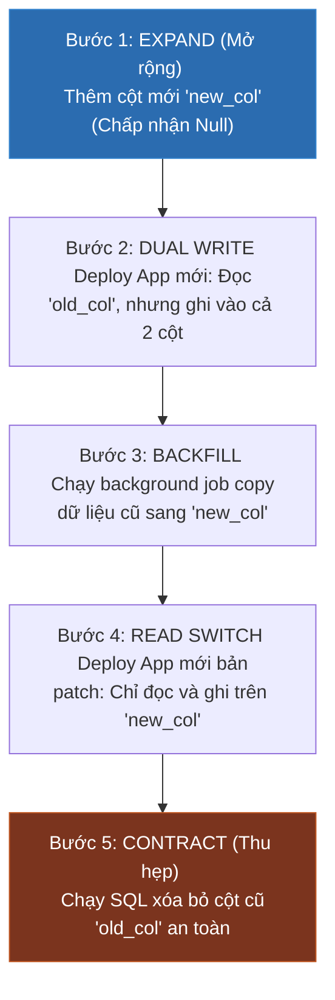

# Database Migration Trong CI/CD Pipeline: Chiến Lược Zero-Downtime & Triết Lý Expand-Contract

## ⚡ Tóm tắt ngắn (30s)
* **Quy tắc cốt lõi**: Quản lý schema database bằng code thông qua các công cụ chuyên dụng như **Flyway** hoặc **Liquibase** (lưu lịch sử trong bảng `schema_version`).
* **Tránh phản mẫu (Anti-pattern)**: **Tuyệt đối không để ứng dụng tự động chạy migration khi khởi động (startup)** trên môi trường Production đa instance (gây lỗi tranh chấp khóa bảng - Lock Collision, và vi phạm quyền bảo mật tối thiểu).
* **Quy trình triển khai chuẩn**:
  * Chạy migration thành một **Stage độc lập trong pipeline CD** hoặc chạy dưới dạng một **Kubernetes Job** trước khi triển khai các pod ứng dụng mới.
* **Triết lý Zero-Downtime**: Thiết kế SQL theo **mẫu thiết kế Expand and Contract (Mở rộng và Thu hẹp)** để đảm bảo tính tương thích ngược (Backward Compatibility) - tức là cấu trúc Database mới luôn phải tương thích tốt với phiên bản ứng dụng cũ đang chạy đồng thời trong quá trình rolling update.

---

## 🔍 Chi tiết bản chất kỹ thuật & Quy trình Zero-Downtime

### 1. Tại sao chạy Migration khi App Startup lại cực kỳ nguy hiểm?
* **Lỗi Xung đột Khóa (Database Lock Conflict)**: Khi bạn scale-up 10 pods ứng dụng đồng thời, cả 10 pods sẽ cùng gửi các truy vấn DDL (như `ALTER TABLE`) lên Database. Flyway cố gắng lock bảng lịch sử, dẫn đến tranh chấp lock nghiêm trọng, làm treo cổ chai hoặc gây sập hoàn toàn database trong giây lát.
* **Lỗi Quyền Hạn (Security Principle of Least Privilege)**: Để chạy migration, app cần quyền cao DDL (như `CREATE`, `ALTER`, `DROP`). Trong thực tế vận hành, ứng dụng chạy hằng ngày chỉ được phép cấp quyền DML (như `SELECT`, `INSERT`, `UPDATE`, `DELETE`). Việc nạp quyền Admin DDL vào app là lỗ hổng bảo mật nghiêm trọng.

### 2. Mẫu thiết kế Expand and Contract (Mở rộng và Thu hẹp)
Khi deploy ứng dụng theo cơ chế **Rolling Update** (K8s thay thế dần từng Pod), sẽ có một khoảng thời gian phiên bản App Cũ (`v1.0`) và App Mới (`v2.0`) **cùng hoạt động song song và trỏ vào chung 1 database**.
* Nếu bạn chạy một câu lệnh SQL xóa hoặc đổi tên một cột ngay lập tức, **App cũ sẽ bị crash 500 ngay lập tức** do không tìm thấy cột đó nữa.
* **Quy trình Đổi tên Cột chuẩn không downtime (5 bước)**:



---

## 💻 Minh họa & Tác động thực chiến

### BAD ❌ (Để ứng dụng tự động chạy Flyway khi startup)
* **Vấn đề**: Cả 10 pods cùng tranh chấp khóa bảng, app chạy bằng user có quyền tối cao DDL cực kỳ mất an toàn.
```yaml
# Cấu hình Spring Boot application.yml
spring:
  datasource:
    username: db_admin_user # ❌ Phải dùng quyền admin tối cao để chạy migration
  flyway:
    enabled: true # ❌ Cực kỳ nguy hiểm trên Production đa instance
```

### GOOD ✅ (Chạy Migration qua Kubernetes Job độc lập)
* **Giải pháp**: 
  1. Tắt tính năng tự động chạy Flyway trong App Java. Sử dụng user có quyền đọc/ghi tối thiểu (`db_app_user`).
  2. Tạo một **K8s Job** chạy một container Flyway chuyên biệt bằng tài khoản admin (`db_admin_user`) để hoàn tất nâng cấp DB trước khi deploy app.

**Khai báo Kubernetes Job (`k8s/db-migration-job.yaml`):**
```yaml
apiVersion: batch/v1
kind: Job
metadata:
  name: payment-db-migration-job
  namespace: production
spec:
  template:
    spec:
      containers:
      - name: db-migrator
        # Sử dụng image Flyway chính thức
        image: flyway/flyway:9-alpine
        command: ["flyway", "migrate"]
        env:
        - name: FLYWAY_URL
          value: "jdbc:postgresql://db-prod:5432/payment_db"
        - name: FLYWAY_USER
          valueFrom:
            secretKeyRef:
              name: db-credentials-admin # Quyền Admin DDL
              key: username
        - name: FLYWAY_PASSWORD
          valueFrom:
            secretKeyRef:
              name: db-credentials-admin
              key: password
        volumeMounts:
        - name: migration-scripts
          mountPath: /flyway/sql
      volumes:
      - name: migration-scripts
        configMap:
          name: db-migration-sql-configmap # Chứa các file SQL V1, V2...
      restartPolicy: OnFailure
```

**Cấu hình ArgoCD / Helm Chart điều phối thứ tự chạy:**
Khai báo Job Migration là một **ArgoCD PreSync Hook** để đảm bảo K8s phải chạy xong Job này báo thành công (`Completed`), ArgoCD mới bắt đầu update các Pod ứng dụng.
```yaml
metadata:
  annotations:
    argocd.argoproj.io/hook: PreSync # ✅ Chạy trước khi Deploy App mới
    argocd.argoproj.io/hook-delete-policy: HookSucceeded
```

---

## 📊 Phân tích So sánh: Các phương án Chạy Migration

| Tiêu chí | Chạy lúc App Startup (Tự động) | Chạy trong Pipeline CI (Dùng Runner) | Chạy qua K8s Job / CD Hook (Khuyên dùng) |
| :--- | :--- | :--- | :--- |
| **Độ an toàn bảo mật** | Thấp (App mang quyền DDL admin hằng ngày). | Trung bình (Máy CI cần mở port kết nối trực tiếp vào Prod DB). | **Tuyệt đối** (Quyền admin chỉ được nạp tạm thời trong K8s mạng nội bộ). |
| **Khả năng Scale-up** | Dễ sập do tranh chấp khóa (Lock collision) giữa nhiều pod. | An toàn (Chỉ chạy duy nhất 1 luồng từ máy CI). | **An toàn** (K8s đảm bảo chỉ chạy duy nhất 1 Pod Job để thực thi). |
| **Khả năng Rollback** | Cực khó (Nếu app startup lỗi, K8s liên tục reboot app tạo vòng lặp vô hạn). | Dễ quản lý (Pipeline báo đỏ dừng ngay lập tức). | **Tối ưu nhất** (Chỉ cần rollback cấu hình Git, K8s tự động chạy lại Job tương ứng). |

---

## ⚠️ Common Gotchas (Câu hỏi phỏng vấn đào sâu)

### 1. "Chuyện gì xảy ra nếu một script migration SQL trong Flyway bị chạy lỗi giữa chừng trên môi trường Production?"
* **Bản chất**: 
  * Nếu bạn dùng Database không hỗ trợ **Transactional DDL** (như MySQL, Oracle), khi script chạy lỗi ở dòng số 5, 4 dòng lệnh trước đó đã được áp dụng vào DB và không thể tự động rollback. Bảng `flyway_schema_history` sẽ ghi nhận trạng thái migration đó là `FAILED` (báo đỏ). Kể từ lúc này, Flyway sẽ bị khóa hoàn toàn, không pod nào có thể khởi chạy được nữa.
  * Nếu dùng PostgreSQL (có hỗ trợ Transactional DDL), toàn bộ giao dịch DDL lỗi sẽ tự động rollback sạch sẽ, nhưng bảng lịch sử vẫn báo `FAILED`.
* **Cách khắc phục thực chiến**:
  1. Tuyệt đối không được vào DB sửa tay cấu hình bừa bãi.
  2. Viết một script SQL sửa đổi ngược lại (fix lỗi) để đưa DB về trạng thái sạch.
  3. Chạy lệnh **`flyway repair`** (thông qua chạy K8s Job tạm thời) để Flyway dọn dẹp và đánh dấu dòng lỗi trong bảng `schema_history` thành trạng thái sạch, sau đó chạy lại pipeline biên dịch chuẩn.

### 2. "Làm sao để chúng ta thực hiện Rollback Database Schema khi một đợt deploy ứng dụng bị lỗi nghiêm trọng bắt buộc phải quay về phiên bản cũ?"
* **Trả lời**: Đây là câu hỏi thử thách cực hạn về thiết kế hệ thống.
  * **Sự thật tàn nhẫn**: Trong thực tế vận hành Enterprise, **chúng ta hầu như không bao giờ chạy lệnh Rollback DDL tự động (như `DROP COLUMN` hay `DROP TABLE`)** vì nó có nguy cơ xóa vĩnh viễn dữ liệu mới được phát sinh bởi khách hàng trong thời gian deploy lỗi.
  * **Chiến lược xử lý chuẩn (Roll-Forward)**:
    1. Giữ nguyên cấu trúc Database mới (vì ta đã thiết kế theo mẫu tương thích ngược *Expand-Contract* nên Database mới vẫn tương thích tốt với code App Cũ).
    2. Thực hiện **Rollback phiên bản Ứng dụng** (App code) về bản cũ (`v1.0`).
    3. Tiến hành phân tích lỗi logic, viết file SQL vá lỗi mới (Ví dụ: `V3__fix_column_migration.sql`) rồi chạy **Roll-Forward** (Deploy tiến lên phía trước) thay vì lùi lại phía sau.
