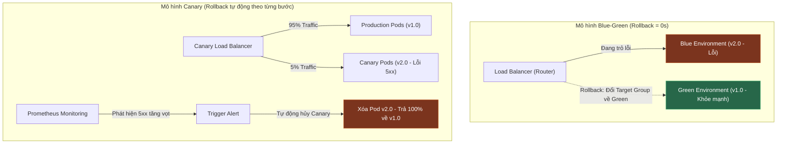

# Chiến Lược Rollback Khi CI/CD Deploy Lỗi: Kịch Bản Ứng Phó Sự Cố Production

## ⚡ Tóm tắt ngắn (30s)
Khi phát hiện lỗi nghiêm trọng sau khi deploy, mục tiêu tối cao là **giảm thiểu thời gian ảnh hưởng người dùng (MTTR - Mean Time to Resolution)**. 
Chúng ta có 3 chiến lược Rollback cốt lõi trong thực chiến:
1. **GitOps Revert (Khuyên dùng)**: Thực hiện lệnh **`git revert <commit_id>`** trên Git Config Repository. ArgoCD/Flux sẽ tự động đồng bộ hóa và đưa cụm K8s về trạng thái cấu hình cũ. Đây là cách làm sạch sẽ, có đầy đủ lịch sử audit log.
2. **K8s Native Rollback (Nhanh nhất)**: Sử dụng lệnh **`kubectl rollout undo deployment/<tên_app>`**. K8s sẽ dừng lập tức việc rollout bản mới và đảo ngược tiến trình, phục hồi lại các ReplicaSet cũ có sẵn trong cache chỉ trong vài giây.
3. **Blue-Green Traffic Switch (An toàn nhất)**: Chỉ cần thay đổi cấu hình Router/Load Balancer (đổi Target Group từ cổng Blue lỗi sang cổng Green cũ). Thời gian rollback bằng **0 giây**.
* **Nguyên tắc sống còn**: Chỉ rollback code ứng dụng (App Code) và cấu hình tĩnh, **tuyệt đối không rollback dữ liệu/schema Database tự động** để tránh làm mất mát dữ liệu giao dịch mới của khách hàng.

---

## 🔍 Chi tiết bản chất kỹ thuật & Ứng phó thực chiến

### 1. Cơ chế hoạt động của Kubernetes Rollout Undo
Khi bạn deploy bản mới, Kubernetes không xóa bỏ hoàn toàn cấu hình cũ.
* K8s quản lý Pod thông qua **ReplicaSet (RS)**. Khi deploy bản `v2`, K8s tạo một `ReplicaSet-v2` mới và tăng dần số pod trên đó, đồng thời giảm dần số pod trên `ReplicaSet-v1` cũ về `0`.
* `ReplicaSet-v1` cũ vẫn được K8s giữ lại trong lịch sử (History Limit mặc định giữ lại 10 bản).
* Khi chạy lệnh `kubectl rollout undo`, K8s chỉ đơn giản là tăng lại số lượng pod mong muốn của `ReplicaSet-v1` lên và giảm `ReplicaSet-v2` về `0`. Do đó, quá trình diễn ra cực nhanh mà không cần pull lại image hay build lại từ đầu.

### 2. Kịch bản Roll-Forward (Tiến về phía trước) vs Rollback (Lùi lại phía sau)
Trong môi trường microservices phức tạp, việc quay xe (rollback) đôi khi gây ra phản ứng dây chuyền làm hỏng các dịch vụ khác (downstream services) đã lỡ tương thích với API mới.
* **Rollback (Lùi lại)**: Phù hợp cho các lỗi độc lập, lỗi crash ứng dụng lập tức, hoặc các lỗi không làm thay đổi cấu trúc database/API contract.
* **Roll-Forward (Tiến lên)**: Thay vì quay về bản cũ, ta giữ nguyên bản lỗi (hoặc cô lập nó), nhanh chóng sửa code (hotfix) và đẩy một phiên bản mới tinh (ví dụ: `v1.0.2-hotfix`) đi qua toàn bộ pipeline CI/CD chuẩn. Phương pháp này cực kỳ an toàn cho tính toàn vẹn của dữ liệu và cấu trúc API.

---

## 🎨 Sơ đồ So sánh Chiến lược Rollback: Blue-Green vs Canary



---

## 💻 Cấu hình Thực chiến: Thực thi Rollback

### 1. Lệnh Rollback thủ công khẩn cấp trên Kubernetes:
```bash
# 1. Kiểm tra lịch sử các lần deploy (rollout history)
kubectl rollout history deployment/payment-service-deployment

# Kết quả trả về:
# REVISION  CHANGE-CAUSE
# 1         mvn clean package tag v1.0.0
# 2         mvn clean package tag v2.0.0 (Lỗi nằm ở bản này)

# 2. Xem chi tiết thông số của revision 1 cũ để chắc chắn
kubectl rollout history deployment/payment-service-deployment --revision=1

# 3. Thực thi Rollback khẩn cấp về bản revision 1 cũ
kubectl rollout undo deployment/payment-service-deployment --to-revision=1

# 4. Theo dõi tiến trình rollback thời gian thực
kubectl rollout status deployment/payment-service-deployment
```

### 2. Kịch bản Rollback Tự động dựa trên Prometheus Metrics (Canary Rollback Script):
Kịch bản này thường được tích hợp trong các công cụ CD nâng cao như **Argo Rollouts** hoặc viết bằng Script chạy trong CI:
```bash
#!/bin/bash
echo "📊 Đang giám sát tỷ lệ lỗi 5xx của bản deploy mới..."

# Truy vấn Prometheus API lấy tỷ lệ lỗi HTTP 5xx trong 2 phút gần nhất
PROM_QUERY="sum(rate(http_requests_total{status=~'5..'}[2m])) / sum(rate(http_requests_total[2m])) * 100"
ERROR_RATE=$(curl -G -s --data-urlencode "query=${PROM_QUERY}" http://prometheus:9090/api/v1/query | jq -r '.data.result[0].value[1]')

# Nếu tỷ lệ lỗi vượt quá 2%
if (( $(echo "$ERROR_RATE > 2.0" | bc -l) )); then
  echo "🚨 CẢNH BÁO: Tỷ lệ lỗi 5xx là ${ERROR_RATE}%, vượt ngưỡng an toàn 2%!"
  echo "🔄 Tiến hành tự động ROLLBACK lập tức để bảo vệ hệ thống..."
  
  # Kích hoạt lệnh rollback của K8s
  kubectl rollout undo deployment/payment-service
  
  # Gửi thông báo khẩn cấp tới Slack
  curl -X POST -H 'Content-type: application/json' --data '{"text":"🚨 [Alert] Tự động ROLLBACK payment-service thành công do tỷ lệ lỗi 5xx tăng vọt!"}' $SLACK_WEBHOOK_URL
  exit 1
else
  echo "✅ Hệ thống ổn định. Tỷ lệ lỗi hiện tại: ${ERROR_RATE}%"
fi
```

---

## 📊 Phân tích So sánh: Các phương án Rollback

| Tiêu chí | GitOps Revert Commit (Khuyên dùng) | K8s Rollout Undo (Khẩn cấp) | Blue-Green Switch |
| :--- | :--- | :--- | :--- |
| **Tốc độ thực thi** | Trung bình (Tốn 1-2 phút chạy lại luồng git sync). | **Cực nhanh** (Vài giây, do pod cũ được dựng lại ngay). | **Tối đa (0 giây)** (Chỉ đổi routing IP). |
| **Mức độ sạch sẽ hạ tầng** | **Tối đa** (Git luôn phản ánh đúng 100% cái đang chạy). | Kém (Hạ tầng thực tế chạy bản cũ nhưng file Git vẫn đang hiển thị tag bản mới). | Tốt (Hai môi trường độc lập). |
| **Yêu cầu tài nguyên** | Thấp. | Thấp. | **Cực cao (gấp đôi)** (Do phải duy trì song song 2 môi trường Blue và Green chạy đồng thời). |
| **Lịch sử Audit Log** | Rõ ràng (Lưu vết ai revert, lúc nào, PR cụ thể). | Thấp (Chỉ lưu vết lệnh trong log K8s API). | Trung bình. |

---

## ⚠️ Common Gotchas (Câu hỏi phỏng vấn đào sâu)

### 1. "Sau khi chạy Rollout Undo khẩn cấp bằng lệnh `kubectl rollout undo` thành công, bạn có cần phải làm gì tiếp theo không? Hay coi như sự cố đã được giải quyết hoàn toàn?"
* **Bản chất**: Lệnh `kubectl rollout undo` chỉ giải cứu hệ thống **tạm thời** về mặt runtime.
* **Nguy hiểm tiềm tàng (Drift State)**: Lúc này, cấu hình thực tế trên K8s đã quay về bản cũ (`v1.0`), nhưng file code khai báo trên Git của bạn vẫn đang hiển thị tag của bản lỗi (`v2.0`). 
  * Nếu có một pipeline CI/CD khác được trigger, hoặc ArgoCD chạy cơ chế tự động đồng bộ (Auto-sync), nó sẽ phát hiện lệch cấu hình và **tự động đè bản lỗi `v2.0` ngược trở lại**, gây ra thảm họa sập hệ thống lần thứ hai.
* **Cách khắc phục bắt buộc**:
  * Ngay sau khi chạy `kubectl rollout undo` để dập lửa cứu người dùng, bạn **bắt buộc phải thực hiện Git Revert** trên code Git để đưa tag Git về đúng bản `v1.0`. Điều này giúp đồng nhất cấu hình giữa Git và Cluster thực tế.

### 2. "Làm sao xử lý vấn đề Session của người dùng (User Session) bị đứt gãy hoặc mất mát khi chúng ta thực hiện Rollback đột ngột giữa chừng?"
* **Trả lời**: Đây là lý do tại sao kiến trúc **Stateless (Không lưu trạng thái)** là tiêu chuẩn bắt buộc cho Microservices hiện đại:
  * **Giải pháp triệt để (Stateless Architecture)**:
    1. Không bao giờ lưu session trực tiếp trong bộ nhớ của Pod (In-memory session).
    2. Sử dụng các token không trạng thái như **JWT (JSON Web Token)** để client tự mang theo thông tin xác thực, hoặc lưu session tập trung tại một cụm cache độc lập hiệu năng cao như **Redis Cluster**.
    * Nhờ cách này, khi ta hủy Pod bản mới và dựng lại Pod bản cũ lập tức, người dùng hoàn toàn không cảm nhận được bất kỳ sự gián đoạn nào (không bị logout, không mất giỏ hàng).
