# Dockerfile Best Practices Cho Java Service (Tối ưu Bảo mật, Kích thước & Hiệu năng)

## ⚡ Tóm tắt ngắn (30s)
* **Nguyên tắc "3 Không"**: Không chạy quyền **root**, không mang **JDK** lên production (chỉ dùng **JRE/Distroless**), không copy toàn bộ mã nguồn vào image chạy.
* **Quy trình tối ưu**:
  1. Sử dụng **Multi-stage Build** để tách biệt môi trường build (JDK + Maven/Gradle) và chạy (JRE/Distroless).
  2. Áp dụng cơ chế **Layer Caching** bằng cách tách riêng các file dependency (`pom.xml` hoặc `build.gradle`) để tải trước, tránh rebuild dependency liên tục.
  3. Sử dụng base image bảo mật như **Distroless** hoặc **Alpine** và chuyển sang quyền **non-root user**.
  4. Cấu hình JVM flags phù hợp để nhận biết chính xác tài nguyên giới hạn của Container (Cgroup aware).

---

## 🔍 Chi tiết bản chất kiến trúc & Cgroup Aware

### 1. Tại sao Java cần Best Practice đặc biệt trong Container?
Trong quá khứ (trước Java 10), JVM không nhận biết được các giới hạn tài nguyên của Container. Nó sẽ truy vấn trực tiếp thông tin phần cứng của Host OS. 
* Ví dụ: Nếu Host OS có 64GB RAM nhưng Container chỉ được cấp 2GB RAM, JVM mặc định sẽ tự cấu hình Max Heap (`-Xmx`) bằng 1/4 RAM của Host (tương đương 16GB). Khi JVM cấp phát vượt quá 2GB, **Kernel sẽ lập tức kill container bằng lỗi OOM (Out-Of-Memory Killer)**.
* **Giải pháp hiện đại**: Sử dụng Java 11/17+ trở lên vốn đã tích hợp mặc định tính năng **UseContainerSupport** giúp JVM tự động điều chỉnh Heap theo cấu hình CPU/RAM thực tế của Container.

### 2. So sánh các dòng Base Image phổ biến

* **JDK (Java Development Kit)**: Chứa trình biên dịch (`javac`), debugger, công cụ build. Chỉ dùng ở Stage 1 (Build stage). Tuyệt đối không dùng để chạy trên Production vì kích thước rất lớn (>500MB) và tăng diện tích tấn công (Attack Surface).
* **JRE (Java Runtime Environment)**: Chỉ chứa runtime chạy app Java. Nhẹ hơn rất nhiều (~100-200MB).
* **Distroless (Khuyên dùng)**: Image siêu bảo mật do Google phát triển. Chỉ chứa duy nhất JRE và các thư viện hệ thống tối thiểu để chạy ứng dụng. **Không chứa shell (`/bin/sh`, `/bin/bash`), không chứa package manager (`apt`, `apk`), không có trình quản lý file**. Hacker nếu chiếm được app cũng không thể chạy lệnh bash hay tải công cụ khai thác.

---

## 🎨 Sơ đồ luồng Multi-stage Build tối ưu

```mermaid
graph TD
    subgraph Stage_1 ["Stage 1: Build (JDK + Maven)"]
        Source["Mã nguồn Java <br> + pom.xml"] -->|Tải dependencies trước| Cache["Docker Cache Layers <br> (Dependencies)"]
        Cache -->|Biên dịch & Đóng gói| Jar["app.jar <br> (~100MB)"]
    end

    subgraph Stage_2 ["Stage 2: Run (Distroless/JRE)"]
        Jar -->|Chỉ copy file Jar| TargetImage["Production Image <br> (Distroless JRE + JAR) <br> [Size: ~150MB]"]
    end
    
    style Stage_1 fill:#1a365d,stroke:#3182ce,stroke-width:1px
    style Stage_2 fill:#1c3d27,stroke:#48bb78,stroke-width:1px
    style TargetImage fill:#276749,stroke:#48bb78,stroke-width:2px
```



---

## 💻 So sánh Thực chiến Dockerfile

### BAD ❌ (Dockerfile thô sơ, kém bảo mật, kích thước lớn)
```dockerfile
# ❌ Sử dụng toàn bộ JDK, kích thước cực kỳ lớn (>500MB)
FROM openjdk:17-jdk

WORKDIR /app

# ❌ Copy toàn bộ mã nguồn vào container chạy
COPY . .

# ❌ Chạy build maven ngay khi chạy container, tốn thời gian khởi động
RUN ./mvnw clean package

# ❌ Chạy bằng quyền root mặc định (Hacker có thể chiếm toàn quyền Host OS)
EXPOSE 8080
ENTRYPOINT ["java", "-jar", "target/my-app.jar"]
```

### GOOD ✅ (Dockerfile Premium: Multi-stage, Caching, Non-Root, Distroless JRE 17)
```dockerfile
# =========================================================================
# STAGE 1: BUILD ENVIRONMENT (JDK)
# =========================================================================
FROM maven:3.8.5-openjdk-17-slim AS builder

WORKDIR /build

# Tối ưu Cache Layer: Copy file cấu hình dependency trước
COPY pom.xml .

# Download dependencies trước (Nếu pom.xml không đổi, layer này sẽ được CACHED hoàn toàn)
RUN mvn dependency:go-offline -B

# Copy mã nguồn và đóng gói
COPY src ./src
RUN mvn clean package -DskipTests

# =========================================================================
# STAGE 2: PRODUCTION RUNTIME (Distroless JRE - Siêu nhẹ, siêu bảo mật)
# =========================================================================
FROM gcr.io/distroless/java17-debian11:nonroot

WORKDIR /app

# Copy thành phẩm từ Stage 1 sang (Hợp nhất thành 1 layer duy nhất)
COPY --from=builder /build/target/*.jar app.jar

# JVM Performance & Container-Aware flags
# - XX:MaxRAMPercentage: Tự động điều chỉnh Max Heap chiếm 75% giới hạn RAM của Container
ENV JAVA_OPTS="-XX:MaxRAMPercentage=75.0 -XX:+UseG1GC -Djava.security.egd=file:/dev/urandom"

EXPOSE 8080

# Chạy trực tiếp qua JRE có sẵn trong distroless (Quyền mặc định đã là nonroot)
ENTRYPOINT ["java", "-jar", "app.jar"]
```

---

## 📊 Trade-off Analysis: Lựa chọn Base Image

| Base Image Type | Kích thước | Độ bảo mật | Khả năng Debug | Phù hợp cho |
| :--- | :--- | :--- | :--- | :--- |
| **Ubuntu + JDK** | >700MB ❌ | Thấp (Chứa nhiều tool thừa, dễ bị khai thác lỗ hổng CVEs) | Cực kỳ dễ (Có đầy đủ bash, curl, apt) | Môi trường Local Development. |
| **Alpine JRE** | ~120MB ✅ | Trung bình (Ít thư viện thừa nhưng thỉnh thoảng lỗi tương thích thư viện native do dùng `musl libc` thay cho `glibc`) | Khá dễ (Có shell `sh` để exec vào) | Các app Java tiêu chuẩn cần tối ưu dung lượng nhanh chóng. |
| **Distroless JRE (Khuyên dùng)** | ~140MB ✅ | **Tối đa** (Không shell, không package manager, không quyền root) | Khó (Phải dùng cơ chế ephemeral debug container của K8s hoặc kịch bản debug phức tạp) | **Production của các ứng dụng Enterprise**, Fintech, hoặc các app tuân thủ bảo mật khắt khe. |

---

## ⚠️ Common Gotchas (Câu hỏi phỏng vấn đào sâu)

### 1. "Tại sao tôi cấu hình `-Xmx1g` cho container có giới hạn RAM 1.5GB trên Kubernetes nhưng app Java vẫn bị OOM-Killed?"
* **Bản chất**: Cấu hình `-Xmx` chỉ định nghĩa giới hạn tối đa cho **Heap Memory**. Tuy nhiên, tổng dung lượng RAM mà JVM tiêu thụ thực tế (**Total Physical Memory**) còn bao gồm nhiều phân vùng bộ nhớ ngoài Heap (Off-heap):
  * **Metaspace**: Lưu thông tin class metadata (mặc định không giới hạn).
  * **Thread Stacks**: Mỗi thread mặc định chiếm `1MB` ngoài Heap. Nếu app chạy 300 threads, nó tốn thêm `300MB`.
  * **Direct Byte Buffers**: Thường dùng trong các network framework hiệu năng cao như Netty/WebFlux.
  * **Garbage Collector overhead**: Bộ nhớ phục vụ cho thuật toán GC chạy.
* **Cách khắc phục**:
  * Luôn để một khoảng trống an toàn (Buffer) tối thiểu **25 - 30%** giữa giới hạn RAM của container và Max Heap (`-XX:MaxRAMPercentage=70.0` hoặc `75.0`).
  * Giới hạn kích thước Metaspace nếu app load động nhiều class: `-XX:MaxMetaspaceSize=256m`.

### 2. "Làm thế nào để debug, phân tích Thread Dump hoặc Heap Dump một container Distroless đang chạy trên production mà không có Shell?"
* **Trả lời**: Đây là câu hỏi bẫy thử thách kinh nghiệm thực chiến thực tế. Do Distroless không có bash/sh, bạn không thể chạy `docker exec -it <container> sh` để cài đặt hay chạy `jcmd`, `jstack`.
* **Cách giải quyết**:
  1. **Sử dụng Ephemeral Containers (Kubernetes 1.25+)**: Chạy lệnh `kubectl debug` để gắn tạm thời một container phụ (debug container chứa đầy đủ các tool chẩn đoán như Busybox/Alpine) chia sẻ chung Process Namespace (`shareProcessNamespace`) với container Distroless chính. Từ đó, bạn có thể chạy các tool Java Diagnostic truy quét tiến trình chính.
  2. **Cấu hình Diagnostic Ports**: Kích hoạt JMX từ xa thông qua biến môi trường an toàn và kết nối qua các tool giao diện từ ngoài mạng nội bộ (như VisualVM hoặc JConsole).
  3. **Tự động xuất Heap Dump khi OOM**: Cấu hình sẵn JVM flags tự động ghi file dump ra một shared volume khi gặp lỗi OOM:
     ```bash
     -XX:+HeapDumpOnOutOfMemoryError -XX:HeapDumpPath=/tmp/dumps/oom.hprof
     ```
