# Multi-stage Build Trong Docker: Khái Niệm, Bản Chất & Tầm Quan Trọng Thực Chiến

## ⚡ Tóm tắt ngắn (30s)
* **Khái niệm**: **Multi-stage Build** là kỹ thuật viết Dockerfile sử dụng nhiều câu lệnh `FROM` liên tiếp. Mỗi câu lệnh `FROM` khởi tạo một giai đoạn (stage) xây dựng độc lập với một base image khác nhau.
* **Bản chất hoạt động**: Ta có thể sao chép chọn lọc thành phẩm (như file `.jar` đã biên dịch, thư mục `dist` của React, binary của Go) từ stage này sang stage khác bằng cú pháp `COPY --from=<stage_name_or_index>`.
* **Tầm quan trọng**: Giúp giảm thiểu triệt để kích thước Image cuối cùng (loại bỏ toàn bộ SDK, mã nguồn, cache package manager) và tăng cường bảo mật tối đa cho môi trường Production.

---

## 🔍 Chi tiết bản chất kỹ thuật

### 1. Tại sao Multi-stage Build ra đời?
Trước khi có Multi-stage Build (Docker < 17.05), các kỹ sư gặp phải thế lưỡng nan "Builder Pattern":
* **Vấn đề**: Biên dịch ứng dụng (ví dụ Java hay Node.js) yêu cầu công cụ nặng (JDK, Maven, npm). Nếu cài đặt tất cả chúng vào Image chạy production, kích thước Image sẽ phình to khủng khiếp (>1GB) và chứa đầy các lỗ hổng bảo mật tiềm tàng của các package dư thừa.
* **Giải pháp thủ công cũ (Phức tạp)**:
  1. Viết 1 script bash build ứng dụng trực tiếp trên máy host hoặc trong một "Build Container".
  2. Xuất file binary/jar ra thư mục tạm trên Host OS.
  3. Chạy Dockerfile thứ hai, copy file binary/jar từ host vào để tạo "Production Image".
  * *Hậu quả*: Phụ thuộc vào môi trường máy host, pipeline CI/CD phức tạp, khó kiểm soát phiên bản.

### 2. Multi-stage Build giải quyết vấn đề như thế nào?
Multi-stage build mang toàn bộ quy trình biên dịch tự động khép kín vào duy nhất **một file Dockerfile**:
* Stage biên dịch chạy độc lập trên một Base Image đầy đủ công cụ.
* Stage chạy production sử dụng một Base Image tối giản, chỉ copy file thành phẩm biên dịch từ Stage trước sang.
* Docker Engine sẽ tự động dọn dẹp các tài nguyên và layer của các stage trung gian sau khi build xong, chỉ giữ lại duy nhất stage cuối cùng để làm Image đầu ra.

---

## 🎨 Sơ đồ luồng hoạt động trong một Dockerfile Multi-stage

```mermaid
graph TD
    subgraph Build_Stage ["Stage 1: 'builder' (Nặng - Cần SDK)"]
        A["FROM maven:3-openjdk-17 AS builder"] --> B["COPY src & pom.xml"]
        B --> C["RUN mvn package (Tải thư viện & biên dịch)"]
        C --> D["Thành phẩm: api.jar (100MB) <br> + Cache Thư viện dư thừa (800MB)"]
    end

    subgraph Run_Stage ["Stage 2: Giai đoạn cuối (Nhẹ - Chỉ cần Runtime)"]
        E["FROM openjdk:17-slim"] --> F["COPY --from=builder /build/api.jar /app/"]
        F --> G["Chỉ giữ lại api.jar + JRE"]
    end

    D -.->|Chỉ sao chép file Jar| F
    
    style Build_Stage fill:#1a365d,stroke:#3182ce,stroke-width:1px
    style Run_Stage fill:#1c3d27,stroke:#48bb78,stroke-width:1px
    style G fill:#276749,stroke:#48bb78,stroke-width:2px,color:#fff
```



---

## 💻 Minh họa & Tác động thực chiến

### BAD ❌ (Dockerfile Single-stage thô sơ)
* **Kịch bản**: Biên dịch ứng dụng React trực tiếp trong 1 container và chạy bằng Node.js luôn.
```dockerfile
FROM node:18-alpine

WORKDIR /app
COPY package*.json ./
RUN npm install
COPY . .

# Biên dịch React ra thư mục build tĩnh
RUN npm run build

# Chạy server Node.js phát triển tĩnh (Hoàn toàn dư thừa engine Node và source code gốc trên prod)
EXPOSE 3000
CMD ["npm", "start"]
```
* **Kích thước Image**: **~950MB** (Chứa mã nguồn gốc, devDependencies, cache npm, node_modules khổng lồ).

### GOOD ✅ (Dockerfile Multi-stage tối ưu)
* **Kịch bản**: Biên dịch bằng Node.js, nhưng chạy bằng Web Server chuyên dụng **Nginx**.
```dockerfile
# ==========================================
# STAGE 1: BUILD REACT APP
# ==========================================
FROM node:18-alpine AS compiler

WORKDIR /app
COPY package*.json ./
RUN npm ci  # Cài đặt sạch sẽ không sinh cache dư thừa

COPY . .
RUN npm run build

# ==========================================
# STAGE 2: PRODUCTION RUNTIME (NGINX)
# ==========================================
FROM nginx:1.23-alpine

# Copy file cấu hình Nginx tối ưu riêng
COPY nginx.conf /etc/nginx/conf.d/default.conf

# Chỉ COPY đúng thư mục build tĩnh từ Stage 1 sang thư mục root của Nginx
COPY --from=compiler /app/build /usr/share/nginx/html

EXPOSE 80
CMD ["nginx", "-g", "daemon off;"]
```
* **Kích thước Image**: **~23MB** (Giảm hơn 40 lần! Không chứa mã nguồn gốc, node_modules hay các lỗ hổng Node.js).

---

## 📊 So sánh Ưu & Nhược điểm

| Tiêu chí | Single-stage Build | Multi-stage Build (Khuyên dùng) |
| :--- | :--- | :--- |
| **Kích thước Image** | Cực kỳ lớn (do chứa đầy công cụ build, file rác). | Siêu nhỏ gọn (chỉ chứa file runtime chạy thực tế). |
| **Độ bảo mật** | Thấp (Diện tích tấn công lớn, chứa compiler, dễ bị leak thông tin cấu hình nhạy cảm lúc build). | **Tối đa** (Không chứa mã nguồn gốc, không có công cụ phát triển, giảm thiểu số lượng thư viện lỗi). |
| **Bảo trì CI/CD** | Phức tạp (Cần tạo các script build trung gian ở máy host trước khi đẩy vào Docker). | **Cực kỳ đơn giản** (Tự động hóa hoàn toàn quy trình build-and-run gói gọn trong 1 file Dockerfile). |
| **Thời gian build** | Nhanh hơn một chút trong lần build đầu tiên. | Có thể chậm hơn ở lần build đầu do tạo nhiều container, nhưng có thể tăng tốc tối đa nhờ Docker BuildKit cache mounts. |

---

## ⚠️ Common Gotchas (Câu hỏi phỏng vấn đào sâu)

### 1. "Làm sao tôi có thể debug hoặc chẩn đoán lỗi biên dịch xảy ra ở các stage trung gian (như stage builder) khi chạy Docker build?"
* **Trả lời**: Mặc định, Docker sẽ xóa các layer trung gian nếu build thất bại, gây khó khăn cho việc debug.
* **Cách khắc phục**:
  1. **Chỉ định Target Stage**: Sử dụng cờ `--target` khi chạy lệnh build để ép Docker dừng lại ở đúng stage cần debug:
     ```bash
     docker build --target compiler -t test-build-stage .
     ```
     Lệnh này sẽ chạy các câu lệnh từ đầu Dockerfile cho đến stage `compiler` rồi dừng lại, xuất ra Image `test-build-stage`. Sau đó bạn có thể chạy container này bằng shell để kiểm tra xem tại sao code không compile được.
  2. **Xem logs chi tiết qua BuildKit**: Kích hoạt cờ `DOCKER_BUILDKIT=1` để xem toàn bộ output log của từng stage thời gian thực.

### 2. "Làm thế nào để tối ưu hóa thời gian tải thư viện (như `node_modules` hay Maven `.m2` cache) giữa các lần build của Multi-stage build?"
* **Trả lời**: Mỗi lần chạy `docker build`, các stage được khởi tạo mới hoàn toàn, đồng nghĩa với việc Maven hoặc npm sẽ phải tải lại toàn bộ dependencies từ Internet, cực kỳ tốn thời gian.
* **Giải pháp (Docker BuildKit Cache Mounts)**: Sử dụng tính năng nâng cao `--mount=type=cache` trong câu lệnh `RUN` để mount thư mục cache của package manager ra ngoài và tái sử dụng qua các lần build:
  ```dockerfile
  # Ví dụ tối ưu cho Maven trong Stage 1:
  RUN --mount=type=cache,target=/root/.m2 \
      mvn clean package -DskipTests
  
  # Ví dụ tối ưu cho npm:
  RUN --mount=type=cache,target=/root/.npm \
      npm ci
  ```
  Nhờ cơ chế này, kể cả khi bạn thay đổi mã nguồn Java/JS, Docker vẫn sẽ tái sử dụng folder cache `.m2` hoặc `.npm` ở máy host, giúp thời gian build giảm từ vài phút xuống còn vài giây.
