# Cơ Chế Hoạt Động Của Docker Layer Caching & Nghệ Thuật Sắp Đặt Dockerfile

## ⚡ Tóm tắt ngắn (30s)
* **Quy luật Cache**: Docker biên dịch Image theo từng dòng lệnh trong `Dockerfile` từ trên xuống dưới. Mỗi dòng lệnh tạo ra một Layer. 
* **Cơ chế so khớp**: 
  * Với các lệnh thông thường (`RUN`, `ENV`...): Docker so sánh chuỗi ký tự của lệnh hiện tại với lệnh đã dùng để build layer cũ.
  * Với lệnh sao chép (`COPY`, `ADD`): Docker tính toán mã băm **checksum** của các file nguồn. Nếu nội dung file thay đổi, cache bị vô hiệu hóa (invalidated).
* **Phản ứng dây chuyền**: Nếu **một dòng lệnh bị mất cache**, toàn bộ các dòng lệnh **phía dưới nó** trong Dockerfile bắt buộc phải rebuild và mất cache hoàn toàn.
* **Nguyên tắc vàng**: Đặt các câu lệnh có dữ liệu ít biến động (cài đặt package, download dependency) lên trên; các câu lệnh có dữ liệu biến động liên tục (copy app code, config) xuống dưới cùng.

---

## 🔍 Chi tiết bản chất kỹ thuật

### 1. Cách Docker kiểm tra Cache từng loại câu lệnh
* **Đối với các chỉ thị khai báo (`ENV`, `WORKDIR`, `EXPOSE`...)**: Docker chỉ kiểm tra xem chuỗi khai báo có khớp 100% với lịch sử hay không.
* **Đối với chỉ thị chạy lệnh (`RUN`)**: Docker chỉ so sánh chuỗi câu lệnh (ví dụ: `RUN apt-get update`). Docker **không vào Internet** để kiểm tra xem repository bên ngoài có dữ liệu mới hay không. Nếu chuỗi text không đổi, nó bê nguyên layer cũ dùng tiếp.
* **Đối với chỉ thị sao chép (`COPY`, `ADD`)**: Docker sẽ quét nội dung các file trên máy host (được chỉ định copy). Nó tạo ra mã hash checksum của từng file. Nếu có bất kỳ sự khác biệt nhỏ nào (kể cả khoảng trắng hay quyền phân quyền file), Docker đánh giá layer đó đã thay đổi và vô hiệu hóa cache.

### 2. Sự lan truyền của việc mất Cache (Cache Invalidation Propagation)
Khi một Layer bị mất cache:
1. Docker dừng việc lấy layer từ bộ nhớ tạm.
2. Docker khởi tạo một container tạm thời từ layer ngay phía trước để thực thi lệnh hiện tại.
3. **Toàn bộ các layer tiếp theo phía dưới** cũng bị hủy cache hoàn toàn và phải chạy lại từ đầu, bất kể nội dung của chúng có thay đổi hay không.

---

## 🎨 Sơ đồ Trực quan hóa Quy luật Mất Cache

```mermaid
graph TD
    subgraph Case_1 ["Kịch bản A: Mã nguồn thay đổi (Hỏng Cache sớm)"]
        A1["FROM node:18-alpine"] -->|Using Cache| A2["COPY . . <br> (Mã nguồn đổi - MẤT CACHE)"]
        A2 -->|Re-run| A3["RUN npm install <br> (Mất 2 phút tải lại dependency)"]
        A3 -->|Re-run| A4["CMD ['npm', 'start']"]
    end

    subgraph Case_2 ["Kịch bản B: Tách biệt dependency (Tối ưu Cache)"]
        B1["FROM node:18-alpine"] -->|Using Cache| B2["COPY package*.json ./ <br> (Không đổi - DÙNG CACHE)"]
        B2 -->|Using Cache| B3["RUN npm ci <br> (Không đổi - DÙNG CACHE)"]
        B3 -->|Re-run| B4["COPY . . <br> (Mã nguồn đổi - MẤT CACHE)"]
        B4 -->|Re-run| B5["CMD ['npm', 'start']"]
    end

    style A2 fill:#9b2c2c,stroke:#e53e3e,stroke-width:1px,color:#fff
    style A3 fill:#9b2c2c,stroke:#e53e3e,stroke-width:1px,color:#fff
    
    style B2 fill:#1c3d27,stroke:#48bb78,stroke-width:1px,color:#fff
    style B3 fill:#1c3d27,stroke:#48bb78,stroke-width:1px,color:#fff
    style B4 fill:#9b2c2c,stroke:#e53e3e,stroke-width:1px,color:#fff
```



---

## 💻 Minh họa & Tác động thực chiến

### BAD ❌ (Dockerfile mất cache liên tục khi sửa code)
* **Vấn đề**: Mỗi lần developer sửa đổi dù chỉ 1 dòng code trong file React components, Docker sẽ chạy lại từ đầu lệnh `npm install`, tốn hàng phút chờ đợi tải thư viện qua mạng.
```dockerfile
FROM node:18-alpine

WORKDIR /app

# ❌ Lỗi nghiêm trọng: Copy toàn bộ code vào trước
COPY . .

# ❌ Do COPY . . làm mất cache khi code đổi, lệnh RUN dưới đây luôn bị chạy lại
RUN npm install

EXPOSE 3000
CMD ["npm", "start"]
```

### GOOD ✅ (Dockerfile Tối ưu Caching đỉnh cao)
* **Giải pháp**: Tách biệt file khai báo thư viện (`package.json`) để copy và install trước. Vì file dependency rất ít khi thay đổi so với code logic hằng ngày.
```dockerfile
FROM node:18-alpine

WORKDIR /app

# ✅ Bước 1: Chỉ copy file config thư viện
COPY package*.json ./

# ✅ Bước 2: Chạy install. Layer này được cache trọn vẹn nếu package.json không đổi
RUN npm ci

# ✅ Bước 3: Copy toàn bộ mã nguồn còn lại. Chỉ có layer này và các dòng dưới bị chạy lại khi sửa code
COPY . .

EXPOSE 3000
CMD ["npm", "start"]
```

---

## 📊 Phân tích So sánh: Cache so khớp

| Chỉ thị trong Dockerfile | Cơ chế kiểm tra Cache | Khả năng mất Cache | Mức độ tối ưu |
| :--- | :--- | :--- | :--- |
| `FROM` | Check phiên bản hash của tag image trên registry hoặc local. | Thấp (chỉ khi tag image bị push đè). | Rất cao |
| `ENV`, `WORKDIR` | So sánh chuỗi ký tự khai báo. | Cực thấp. | Tối đa |
| `COPY package.json` | Tính mã băm checksum nội dung file. | Thấp (chỉ đổi khi thêm/xóa thư viện). | Cực cao |
| `RUN npm ci` | So sánh chuỗi text lệnh `RUN npm ci`. | Phụ thuộc hoàn toàn vào layer trước đó. | Cao |
| `COPY . .` (Copy code) | Quét toàn bộ file dự án, check checksum. | **Cực kỳ cao** (mất cache mỗi lần thay đổi code). | Thấp (nên đặt gần cuối cùng) |

---

## ⚠️ Common Gotchas (Câu hỏi phỏng vấn đào sâu)

### 1. "Tại sao tôi đã sửa code database nhưng khi build lại Docker image, Docker vẫn dùng cache của lệnh `RUN apt-get update && apt-get install -y postgresql-client` cũ kĩ dẫn đến việc cài bản PostgreSQL cũ?"
* **Bản chất**: Docker không thông minh đến mức tự phát hiện gói phần mềm trên internet đã có bản mới. Đối với lệnh `RUN apt-get update`, Docker chỉ thấy chuỗi ký tự này không đổi so với lần build trước nên nó sẽ bê nguyên layer cũ từ cache. Hậu quả là danh sách repository không được update và nó tiếp tục tải bản cũ.
* **Cách khắc phục**:
  1. Sử dụng cờ `--no-cache` khi build để bắt buộc Docker loại bỏ toàn bộ cache của tất cả các dòng:
     ```bash
     docker build --no-cache -t my-app .
     ```
  2. Gom nhóm lệnh thông minh và cập nhật version qua biến môi trường để chủ động trigger phá cache dòng đó:
     ```dockerfile
     ENV PG_CLIENT_VERSION="15"
     RUN apt-get update && apt-get install -y postgresql-client-${PG_CLIENT_VERSION}
     ```

### 2. "Làm sao tận dụng Docker Layer Caching trong CI/CD pipeline (như GitHub Actions hoặc GitLab CI) khi mà mỗi bản build chạy trên một máy ảo (Runner) sạch hoàn toàn mới cứng?"
* **Bản chất**: Trên môi trường CI/CD Cloud, mỗi job chạy trên VM trắng tinh. Do đó, Docker local cache không hề tồn tại, dẫn đến việc mất cache 100% trong mọi lần build pipeline.
* **Cách khắc phục (Sử dụng Registry Cache Backends)**:
  Sử dụng Docker BuildKit tích hợp cờ `--cache-from` và `--cache-to` để pull/push metadata cache trực tiếp từ Container Registry về máy ảo CI, giúp máy ảo sạch vẫn tái sử dụng được cache của lần build trước:
  ```bash
  # Lệnh build tối ưu trên GitHub Actions sử dụng buildx:
  docker buildx build \
    --cache-from=type=registry,ref=myregistry.com/my-app:buildcache \
    --cache-to=type=registry,ref=myregistry.com/my-app:buildcache,mode=max \
    -t myregistry.com/my-app:latest \
    --push .
  ```
  * Cờ `--cache-to` với `mode=max` sẽ đóng gói toàn bộ cache của tất cả các layer trung gian (bao gồm cả các stage build không dùng ở runtime) và đẩy lên registry. Lần chạy sau, CI sẽ kéo bộ cache này về và tăng tốc build tức thì.
