# Docker Compose: Khi Nào Nên Dùng & Nghệ Thuật Khởi Tạo Hệ Thống Đa Container

## ⚡ Tóm tắt ngắn (30s)
* **Định nghĩa**: **Docker Compose** là công cụ giúp định nghĩa và quản lý các ứng dụng Docker chứa nhiều container (**Multi-container Applications**) một cách khai báo (Declarative) thông qua duy nhất một file cấu hình YAML (`docker-compose.yml`).
* **Use Cases lý tưởng**:
  1. **Môi trường Phát triển (Local Development)**: Dev chỉ cần gõ đúng 1 lệnh `docker compose up` để dựng toàn bộ hệ sinh thái (App, DB, Redis, Kafka, Gateway) thay vì phải tự chạy từng container thủ công.
  2. **Kiểm thử tự động (Automated Integration Testing)**: Dựng nhanh một hệ thống sạch để chạy integration test trong CI/CD, sau đó hủy sạch sẽ chỉ bằng `docker compose down`.
  3. **Môi trường Staging/UAT quy mô nhỏ**: Nơi không cần sự phức tạp và chi phí vận hành khổng lồ của Kubernetes.
* **Quy tắc vàng**: **Tuyệt đối không dùng Docker Compose cho môi trường Production quy mô lớn** đòi hỏi Auto-scaling, Self-healing nâng cao và Zero-downtime rolling update (hãy dùng Kubernetes/ECS).

---

## 🔍 Chi tiết bản chất kỹ thuật & Cơ chế hoạt động

### 1. Cơ chế mạng nội bộ (Internal Networking)
Khi bạn chạy `docker compose up`, Docker Compose sẽ tự động thực hiện các bước sau:
* Tạo ra một mạng ảo dùng chung (thường là mạng **Bridge Network**) dành riêng cho project đó.
* Gắn tất cả các container khai báo trong file YAML vào chung mạng này.
* **Cơ chế DNS nội bộ (Service Discovery)**: Các container có thể gọi lẫn nhau bằng **tên Service** được định nghĩa trong file YAML thay vì dùng địa chỉ IP động.
  * Ví dụ: Ứng dụng Backend có thể kết nối tới Database bằng connection string `jdbc:postgresql://db-service:5432/mydb`, trong đó `db-service` là tên service Postgres.

### 2. Cách giải quyết vấn đề khởi chạy đồng bộ (Dependency Order)
Một lỗi kinh điển là Backend khởi chạy trước khi Database kịp mở cổng nhận kết nối, dẫn đến ứng dụng bị crash ngay khi start.
* **depends_on thô sơ**: Khai báo thứ tự khởi chạy của container (ví dụ: database chạy trước backend). Tuy nhiên, Docker chỉ kiểm tra xem container DB đã ở trạng thái *running* chưa, chứ không biết cổng DB đã thực sự sẵn sàng nhận kết nối (*ready*) chưa.
* **Giải pháp Premium (Healthcheck + depends_on condition)**: Cấu hình lệnh kiểm tra sức khỏe của DB, ứng dụng backend chỉ khởi chạy khi DB báo trạng thái **healthy**.

---

## 🎨 Sơ đồ Hệ sinh thái Đa Container quản lý bởi Docker Compose

```mermaid
graph TD
    subgraph Docker_Compose_Project ["Dự án quản lý bởi Docker Compose"]
        subgraph Bridge_Network ["Mạng ảo chung (Internal Bridge Network)"]
            App["Backend App <br> (Service: app-service)"]
            DB["PostgreSQL <br> (Service: db-service)"]
            Cache["Redis <br> (Service: cache-service)"]
        end
    end

    User["Developer (Host OS)"] -->|Gọi Port 8080| App
    App -->|Internal Call: db-service:5432| DB
    App -->|Internal Call: cache-service:6379| Cache

    style Docker_Compose_Project fill:#1a365d,stroke:#3182ce,stroke-width:1px
    style Bridge_Network fill:#102a45,stroke:#3182ce,stroke-dasharray: 5 5
    style App fill:#2b6cb0,stroke:#3182ce,stroke-width:2px,color:#fff
```



---

## 💻 So sánh Thực chiến Cấu hình

### BAD ❌ (Dùng script shell chạy thủ công hàng tá lệnh `docker run`)
* **Vấn đề**: Script cực kỳ dài, khó đọc, dễ sai sót cú pháp, không quản lý được trạng thái mạng, volumes và khó dọn dẹp khi tắt app.
```bash
# Tạo network
docker network create my-network

# Chạy Postgres
docker run -d --name my-db --network my-network -e POSTGRES_PASSWORD=secret -p 5432:5432 postgres:15

# Chạy Redis
docker run -d --name my-redis --network my-network -p 6379:6379 redis:alpine

# Chạy Spring Boot Backend (Phải chờ DB sẵn sàng thủ công)
sleep 10
docker run -d --name my-app --network my-network -p 8080:8080 -e DB_URL=jdbc:postgresql://my-db:5432/postgres my-app-image:1.0
```

### GOOD ✅ (Khai báo clean trong `docker-compose.yml` có Healthcheck)
```yaml
version: '3.8'

services:
  # Service Database
  db-service:
    image: postgres:15-alpine
    container_name: local-postgres
    environment:
      POSTGRES_USER: dev_user
      POSTGRES_PASSWORD: dev_password
      POSTGRES_DB: dev_db
    ports:
      - "5432:5432"
    volumes:
      - pg-data:/var/lib/postgresql/data
    # Kiểm tra cổng 5432 đã thực sự mở chưa
    healthcheck:
      test: ["CMD-SHELL", "pg_isready -U dev_user -d dev_db"]
      interval: 5s
      timeout: 5s
      retries: 5

  # Service Redis Cache
  cache-service:
    image: redis:alpine
    container_name: local-redis
    ports:
      - "6379:6379"

  # Service Backend
  app-service:
    image: my-app-image:1.0
    container_name: local-app
    ports:
      - "8080:8080"
    environment:
      - SPRING_DATASOURCE_URL=jdbc:postgresql://db-service:5432/dev_db
      - SPRING_DATASOURCE_USERNAME=dev_user
      - SPRING_DATASOURCE_PASSWORD=dev_password
      - SPRING_REDIS_HOST=cache-service
    # Chỉ khởi chạy khi db-service đạt trạng thái HEALTHY
    depends_on:
      db-service:
        condition: service_healthy

volumes:
  pg-data:
```

---

## 📊 Trade-off Analysis: Docker Compose vs Kubernetes

| Tiêu chí | Docker Compose | Kubernetes (K8s) |
| :--- | :--- | :--- |
| **Độ phức tạp học tập** | Cực kỳ thấp, dễ tiếp cận trong vài giờ. | Rất cao, đòi hỏi kiến thức hạ tầng chuyên sâu. |
| **Mục đích sử dụng** | Dev local, CI/CD, thử nghiệm nhanh. | Production Enterprise, tự động hóa hạ tầng quy mô lớn. |
| **Khả năng Scaling** | Thấp (chỉ scale container trên 1 máy vật lý duy nhất). | Vô hạn (scale trên cụm cluster gồm hàng nghìn máy vật lý). |
| **Khả năng tự hồi phục (Self-healing)** | Rất cơ bản (chỉ tự động restart container bị crash nhờ policy). | Tối đa (tự động phát hiện lỗi node, tạo pod mới ở node khác, tự động cô lập lỗi). |
| **Downtime khi Deploy** | Có downtime ngắn khi khởi động lại dịch vụ. | Zero-downtime hoàn toàn nhờ chiến lược Rolling Update. |

---

## ⚠️ Common Gotchas (Câu hỏi phỏng vấn đào sâu)

### 1. "Làm sao để tôi chạy integration tests trên môi trường CI/CD bằng Docker Compose mà không lo bị trùng lặp dữ liệu từ lần build trước hoặc bị xung đột cổng nếu có nhiều pipeline chạy song song?"
* **Trả lời**: Đây là một thử thách kinh điển trong DevOps khi thiết kế hệ thống CI/CD dùng chung máy Agent.
* **Giải pháp**:
  1. **Định danh duy nhất (Unique Project Name)**: Mặc định, Docker Compose dùng tên folder làm tiền tố cho các service và mạng. Sử dụng cờ `-p` hoặc `--project-name` kết hợp với ID của Build Job (ví dụ: git commit SHA hoặc build number) để cô lập hoàn toàn các stack chạy song song:
     ```bash
     docker compose -p project_build_${CI_JOB_ID} up -d
     ```
  2. **Cấu hình dynamic ports**: Thay vì map cổng cố định `- "5432:5432"`, hãy để Docker tự động cấp phát cổng ngẫu nhiên trên host bằng cách chỉ khai báo cổng đích `- "5432"`. Sau đó, dùng lệnh `docker compose port` để truy vấn cổng ngẫu nhiên đó nạp vào test framework.
  3. **Dọn dẹp triệt để**: Luôn chạy lệnh hủy kèm cờ `-v` để xóa sạch volumes lưu dữ liệu tạm thời của lần test đó:
     ```bash
     docker compose -p project_build_${CI_JOB_ID} down -v
     ```

### 2. "Làm thế nào để ghi đè cấu hình (như bật/tắt debug mode, đổi port) giữa môi trường local development của Dev và môi trường chạy Automation Test mà không phải viết hai file `docker-compose.yml` khác nhau hoàn toàn?"
* **Trả lời**: Hãy sử dụng cơ chế **Multiple Compose Files** (Ghi đè cấu hình xếp chồng).
* **Cách thực hiện**:
  * Tạo file gốc `docker-compose.yml` chứa các khai báo nền tảng.
  * Tạo file `docker-compose.dev.yml` chứa cấu hình riêng cho Dev (ví dụ: mount source code để live-reload).
  * Tạo file `docker-compose.test.yml` chứa cấu hình riêng cho CI (ví dụ: tắt cổng export ra ngoài máy host).
  * Khi chạy, xếp chồng các file lên nhau bằng cờ `-f`. File viết sau sẽ tự động ghi đè hoặc bổ sung thuộc tính cho file viết trước:
    ```bash
    # Chạy trên máy Dev:
    docker compose -f docker-compose.yml -f docker-compose.dev.yml up -d

    # Chạy trên CI server:
    docker compose -f docker-compose.yml -f docker-compose.test.yml up -d
    ```
