# Bản Chất Docker Networking: Port Mapping & Các Network Drivers Cốt Lõi

## ⚡ Tóm tắt ngắn (30s)
* **Port Mapping**: Sử dụng cờ `-p <Cổng_Host>:<Cổng_Container>` để ánh xạ lưu lượng truy cập từ ngoài máy vật lý (Host OS) vào ứng dụng bên trong Container thông qua cơ chế Network Address Translation (NAT/iptables).
* **Các Network Drivers cốt lõi**:
  * **Bridge Network (Mặc định)**: Tạo mạng ảo cô lập cho các container trên cùng một Host. Chúng giao tiếp nội bộ qua dải IP ảo (thường là `172.17.0.x`).
  * **Host Network**: Bypass hoàn toàn lớp ảo hóa mạng. Container dùng chung card mạng và cổng của máy Host trực tiếp (Hiệu năng I/O mạng cao nhất).
  * **None Network**: Cô lập mạng tuyệt đối. Container không có kết nối ra ngoài.
  * **Overlay Network**: Kết nối mạng xuyên quốc gia giữa nhiều node máy chủ vật lý khác nhau (Docker Swarm/Kubernetes).
* **Quy luật vàng**: Muốn gọi nhau bằng tên Service/tên Container, bắt buộc phải tạo **User-defined Bridge Network** (Mạng tự định nghĩa). Mạng mặc định (`default bridge`) không hỗ trợ DNS Service Discovery.

---

## 🔍 Chi tiết bản chất kỹ thuật

### 1. Bản chất Port Mapping (Ánh xạ cổng)
Khi bạn chạy lệnh `docker run -p 8080:80 nginx`, điều gì xảy ra ở tầng nhân Linux?
* Docker Daemon sẽ thêm một loạt quy tắc định tuyến mạng vào **iptables** của Linux.
* Bất kỳ gói tin TCP nào đi tới cổng `8080` của máy Host sẽ được cơ chế NAT của nhân Linux dịch chuyển địa chỉ đích và đẩy thẳng vào cổng `8`0 trên card mạng ảo của container.

### 2. DNS Service Discovery trong User-defined Network
* Trong mạng **Default Bridge**: Khi container A muốn kết nối container B, nó chỉ có cách kết nối qua địa chỉ IP ảo (như `172.17.0.3`). Tuy nhiên, IP này sẽ tự động thay đổi mỗi lần container B khởi động lại. Do đó, việc hardcode IP là cực kỳ nguy hiểm.
* Trong mạng **User-defined Bridge**: Docker kích hoạt một **Embedded DNS Server** tích hợp sẵn tại địa chỉ IP `127.0.0.11`. Khi container A gọi `http://payment-service:8080`, DNS nội bộ này sẽ phân giải tên `payment-service` thành địa chỉ IP ảo chính xác thời gian thực của container đó.

---

## 🎨 Sơ đồ Cấu trúc Bridge Network & Port Mapping

```mermaid
graph TD
    subgraph Host_OS ["Host OS (Physical Network)"]
        User["Người dùng ngoài <br> http://192.168.1.10:8080"] -->|Cổng Vật lý 8080| PortMap["iptables / NAT Rule <br> (Map 8080 -> 80)"]
        
        subgraph Docker_Bridge_Network ["User-defined Bridge Network (172.20.0.0/16)"]
            PortMap -->|Đẩy gói tin vào IP 172.20.0.2:80| Nginx["Nginx Container <br> IP: 172.20.0.2 <br> Port trong: 80"]
            App["Backend App Container <br> IP: 172.20.0.3 <br> Port trong: 8080"]
            
            Nginx -->|Internal DNS Call: 'http://app-service:8080'| App
        end
    end

    style Host_OS fill:#1a365d,stroke:#3182ce,stroke-width:1px
    style Docker_Bridge_Network fill:#102a45,stroke:#3182ce,stroke-dasharray: 5 5
    style Nginx fill:#2b6cb0,stroke:#3182ce,stroke-width:2px,color:#fff
    style App fill:#2b6cb0,stroke:#3182ce,stroke-width:2px,color:#fff
```



---

## 💻 So sánh Thực chiến Cấu hình Mạng

### BAD ❌ (Chạy trong mạng mặc định, hardcode IP)
* **Vấn đề**: Không thể gọi nhau bằng tên container, code kết nối dễ bị sập khi IP thay đổi lúc restart.
```bash
# Khởi chạy DB
docker run -d --name local-db -e POSTGRES_PASSWORD=secret postgres:15

# Lấy IP của DB (ví dụ trả về 172.17.0.2)
docker inspect -f '{{range .NetworkSettings.Networks}}{{.IPAddress}}{{end}}' local-db

# Khởi chạy App (Bắt buộc phải truyền IP cứng, cực kỳ không ổn định)
docker run -d --name local-app -p 8080:8080 -e DB_URL=jdbc:postgresql://172.17.0.2:5432/postgres my-app:1.0
```

### GOOD ✅ (Tạo mạng riêng, giao tiếp tự động qua DNS nội bộ)
* **Giải pháp**: Tạo một mạng tự định nghĩa, mọi giao tiếp cấu hình tĩnh qua tên container cực kỳ an toàn và ổn định.
```bash
# Bước 1: Tạo mạng Bridge tự định nghĩa
docker network create internal-app-net

# Bước 2: Gắn DB vào mạng này
docker run -d --name db-container \
  --network internal-app-net \
  -e POSTGRES_PASSWORD=secret \
  postgres:15

# Bước 3: Gắn App vào cùng mạng và kết nối qua tên container 'db-container'
docker run -d --name app-container \
  --network internal-app-net \
  -p 8080:8080 \
  -e DB_URL=jdbc:postgresql://db-container:5432/postgres \
  my-app:1.0
```

---

## 📊 So sánh Thuộc tính Các Network Drivers

| Network Driver | Hiệu năng I/O | Mức độ cô lập | Tự động phân giải DNS | Trường hợp sử dụng |
| :--- | :--- | :--- | :--- | :--- |
| **Bridge (Mặc định)** | Trung bình (do phải đi qua cầu mạng ảo và NAT). | Cao (Mạng ảo riêng tách biệt máy host). | **Có** (chỉ khi tự tạo mạng user-defined). | Dành cho các ứng dụng chạy độc lập trên 1 server đơn lẻ (Phổ biến nhất). |
| **Host** | **Tối đa** (không overhead, không NAT). | Thấp (Dùng chung cổng với Host, dễ xung đột cổng nếu chạy nhiều container cùng loại). | Không | Các ứng dụng Web hiệu năng cực cao, High-Throughput (như Load Balancer, Gateway). |
| **None** | Không áp dụng. | **Tuyệt đối** (không card mạng ảo). | Không | Chạy các Batch Job tính toán dữ liệu nhạy cảm, không được phép kết nối internet để bảo mật. |
| **Overlay** | Thấp hơn do cần mã hóa và định tuyến giữa các server (VXLAN). | Cao | Có | Chạy microservices đa server (Docker Swarm/K8s). |

---

## ⚠️ Common Gotchas (Câu hỏi phỏng vấn đào sâu)

### 1. "Tại sao tôi đứng bên trong container chạy lệnh `curl http://localhost:5432` thì không thể kết nối tới Database đang chạy trực tiếp trên máy Host vật lý bên ngoài?"
* **Bản chất**: Từ khóa `localhost` hay `127.0.0.1` bên trong container trỏ tới **chính cạc mạng ảo cô lập của container đó**, chứ không trỏ ra máy Host vật lý. Vì cổng `5432` không mở trong container nên kết nối thất bại hoàn toàn.
* **Cách khắc phục**:
  1. **Trên môi trường Docker Desktop (Mac/Windows)**: Sử dụng tên miền đặc biệt tích hợp sẵn: `host.docker.internal`
     ```bash
     curl http://host.docker.internal:5432
     ```
  2. **Trên môi trường Linux Production**: Sử dụng địa chỉ IP của cầu mạng Docker mặc định (thường là `172.17.0.1`) để định tuyến ngược ra ngoài:
     ```bash
     curl http://172.17.0.1:5432
     ```
     *(Lưu ý: Bạn phải cấu hình Database cho phép nhận kết nối từ dải IP `172.17.0.0/16` trong file `pg_hba.conf`).*

### 2. "Làm thế nào để khởi chạy 2 container Nginx lắng nghe cùng cổng 80 trên cùng một máy chủ vật lý mà không bị lỗi xung đột cổng (Port Collision)?"
* **Trả lời**: Đây là ưu điểm vượt trội của Docker Network. Do mỗi container chạy trên một **Network Namespace riêng biệt**, mỗi container có một IP ảo riêng và cổng `80` riêng. Chúng hoàn toàn không xung đột nhau bên trong Docker network.
* **Cách map ra ngoài**:
  Để người bên ngoài máy host truy cập được, chúng ta map ra các cổng Host vật lý khác nhau:
  ```bash
  docker run -d --name web1 -p 8081:80 nginx
  docker run -d --name web2 -p 8082:80 nginx
  ```
  Lúc này, Host vật lý lắng nghe cổng `8081` và `8082` định tuyến tương ứng vào cổng `80` của từng container.
