# Docker Storage: Bản Chất Volume Mount, Bind Mount & Tối Ưu Hóa Dữ Liệu Persistent

## ⚡ Tóm tắt ngắn (30s)
* **Mục đích**: Lưu trữ dữ liệu bền vững (**Persistent Data**). Vì lớp ghi của Container (`Writable Layer`) mang tính tạm thời và sẽ bị xóa sạch khi container bị xóa, ta cần đưa dữ liệu ra ngoài ổ đĩa vật lý của máy Host.
* **Ba cơ chế lưu trữ cốt lõi**:
  1. **Named Volume (Khuyên dùng cho DB)**: Được quản lý hoàn toàn bởi Docker Daemon tại thư mục chuyên biệt (Linux: `/var/lib/docker/volumes/`). An toàn, độc lập với cấu trúc thư mục máy host.
  2. **Bind Mount (Lý tưởng cho Dev/Config)**: Gắn kết trực tiếp một đường dẫn tuyệt đối bất kỳ từ máy Host vào trong Container. Thường dùng để chia sẻ source code (live-reload) hoặc file cấu hình tĩnh.
  3. **tmpfs Mount**: Lưu dữ liệu trực tiếp trên **RAM** của máy Host. Không bao giờ ghi xuống đĩa cứng (Hiệu năng cực cao, chuyên dùng lưu credential/secret tạm thời).

---

## 🔍 Chi tiết bản chất kỹ thuật

### 1. Tại sao Writable Layer lại tệ cho dữ liệu Persistent?
* **Mất mát dữ liệu**: Khi Container bị xóa (`docker rm`), toàn bộ lớp Writable Layer bị phá hủy.
* **Overhead hiệu năng (Storage Drivers)**: Writable Layer phải đi qua cơ chế **Copy-on-Write** được quản lý bởi các storage driver của Docker (như `overlay2`). Cơ chế này tạo ra độ trễ cực lớn khi thực hiện các tác vụ I/O ghi đè liên tục, hoàn toàn không phù hợp cho các Database như PostgreSQL hay MySQL vốn đòi hỏi tốc độ I/O đĩa tối đa.
* **Giải pháp**: Volume bypass hoàn toàn storage driver, ghi trực tiếp với tốc độ Native File System của Host OS.

### 2. So sánh cơ chế khởi tạo (Initialization) giữa Volume và Bind Mount
* **Đối với Named Volume (Thông minh)**: Nếu bạn mount một Named Volume trống vào một thư mục đã có sẵn dữ liệu trong Container (ví dụ: `/var/lib/mysql`), Docker sẽ tự động copy toàn bộ dữ liệu có sẵn đó từ Container **ra ngoài Volume** trước, rồi mới thực hiện mount.
* **Đối với Bind Mount (Ghi đè thô bạo)**: Nếu bạn bind mount một thư mục từ máy host vào thư mục có sẵn trong container, thư mục của host sẽ **che khuất hoàn toàn** dữ liệu trong container. Container sẽ chỉ thấy dữ liệu từ máy host.

---

## 🎨 Sơ đồ So sánh các cơ chế Mount của Docker

```mermaid
graph TD
    subgraph Host_OS ["Máy Host vật lý (Host OS File System)"]
        subgraph RAM ["Bộ nhớ RAM"]
            T1["tmpfs mount <br> (Lưu trên RAM)"]
        end
        
        subgraph Hard_Disk ["Ổ cứng vật lý"]
            V1["/var/lib/docker/volumes/ <br> (Docker Named Volume)"]
            B1["/home/user/project/config/ <br> (Host Bind Path)"]
        end
    end

    subgraph Container ["Docker Container"]
        C1["/app/data (Mounted)"]
        C2["/app/config (Mounted)"]
        C3["/app/secrets (Mounted)"]
    end

    V1 -->|Mount| C1
    B1 -->|Mount| C2
    T1 -->|Mount| C3

    style Host_OS fill:#1a365d,stroke:#3182ce,stroke-width:1px
    style Container fill:#102a45,stroke:#3182ce,stroke-dasharray: 5 5
    style C1 fill:#2b6cb0,stroke:#3182ce,color:#fff
    style C2 fill:#2b6cb0,stroke:#3182ce,color:#fff
    style C3 fill:#2b6cb0,stroke:#3182ce,color:#fff
```



---

## 💻 Minh họa & Tác động thực chiến

### BAD ❌ (Chạy Database mà không mount volume)
* **Hậu quả**:
  1. Khi container bị sập hoặc bị nâng cấp lên bản mới, toàn bộ dữ liệu Database biến mất 100%.
  2. Hiệu năng ghi dữ liệu của Postgres tụt giảm nghiêm trọng do overhead của storage driver overlay2.
```bash
# ❌ Nguy hiểm: Khởi chạy Postgres lưu dữ liệu trực tiếp trong Writable layer
docker run -d --name local-db -e POSTGRES_PASSWORD=secret postgres:15
```

### GOOD ✅ (Sử dụng Named Volume cho Database & Bind Mount cho Cấu hình)
* **Giải pháp**:
  1. Sử dụng Named Volume `pg-data` để đảm bảo an toàn dữ liệu và tối ưu hiệu năng I/O.
  2. Sử dụng Bind Mount để nạp file cấu hình tĩnh từ máy host.
```bash
# Tạo Named Volume trước
docker volume create pg-data-volume

# Chạy Database sử dụng Named Volume và Bind Mount cấu hình
docker run -d \
  --name local-db-healthy \
  -e POSTGRES_PASSWORD=secret \
  -p 5432:5432 \
  -v pg-data-volume:/var/lib/postgresql/data \
  -v /home/developer/postgres/pg_hba.conf:/etc/postgresql/pg_hba.conf \
  postgres:15
```

---

## 📊 Bảng so sánh thuộc tính lưu trữ

| Thuộc tính | Named Volume (Khuyên dùng) | Bind Mount | tmpfs Mount |
| :--- | :--- | :--- | :--- |
| **Vị trí lưu trữ** | Thư mục do Docker quản lý trên Host OS. | Đường dẫn bất kỳ do người dùng chọn trên Host OS. | Bộ nhớ RAM của Host OS. |
| **Độ an toàn dữ liệu** | Rất cao (Không bị ảnh hưởng bởi các tiến trình ngoài Docker). | Trung bình (Dễ bị chỉnh sửa nhầm bởi các phần mềm khác trên Host). | Mất dữ liệu lập tức khi container tắt/máy sập. |
| **Hiệu năng I/O** | Native Speed (Cực cao). | Native Speed (Cực cao). | **Tối đa** (Tốc độ RAM). |
| **Tính tương thích** | Dễ dàng chia sẻ an toàn giữa nhiều container. | Phụ thuộc vào hệ điều hành (Đường dẫn Windows khác Linux). | Chỉ hoạt động trên môi trường Linux. |
| **Trường hợp lý tưởng** | Database, logs, lưu trữ file upload. | Mount source code để hot-reload lúc code, mount config. | Lưu JWT Secret, API key tạm thời. |

---

## ⚠️ Common Gotchas (Câu hỏi phỏng vấn đào sâu)

### 1. "Tại sao tôi sử dụng Bind Mount để mount code từ máy Host chạy Windows/MacOS vào Container chạy Linux để làm hot-reload, nhưng file trong Container không tự động cập nhật hoặc bị lỗi phân quyền (Permission Denied)?"
* **Bản chất**: 
  1. **Lỗi phân quyền**: Mặc định, tiến trình trong container chạy bằng quyền `root` (UID 0). Khi bạn tạo file ở máy host Linux bằng quyền user thường (ví dụ: UID 1000) rồi mount vào container, container có thể không có quyền chỉnh sửa file đó, hoặc ngược lại, file do container sinh ra sẽ có chủ sở hữu là `root`, khiến máy host không thể sửa hay xóa.
  2. **Lỗi Hot-reload**: Trên Windows/Mac, Docker chạy qua một máy ảo Linux trung gian. Cơ chế File System Event (như `fsnotify` của Node.js/Java) không thể truyền xuyên suốt từ Windows -> Máy ảo -> Container Linux một cách mượt mà.
* **Cách khắc phục**:
  * **Xử lý phân quyền**: Khởi chạy container bằng cách truyền đúng ID người dùng hiện tại của máy host vào container qua cờ `-u`:
    ```bash
    docker run -d -u $(id -u):$(id -g) -v $(pwd):/app my-node-app
    ```
  * **Xử lý Hot-reload**: Cấu hình các công cụ phát triển (như Webpack, nodemon) sang chế độ **Legacy Polling** (quét định kỳ thay vì dựa vào sự kiện hệ điều hành):
    ```bash
    # Ví dụ với nodemon:
    nodemon --legacy-watch app.js
    ```

### 2. "Làm sao để tôi backup dữ liệu từ một Docker Named Volume đang chạy trên Production?"
* **Trả lời**: Vì Named Volume nằm trong folder bảo mật của hệ thống, ta không thể `cp` trực tiếp một cách an toàn khi DB đang hoạt động.
* **Giải pháp (Kịch bản Backup chuẩn)**:
  Khởi chạy một container phụ siêu nhẹ (như Alpine), mount chung volume cần backup và chạy lệnh nén `tar` xuất file ra một thư mục bind mount ngoài máy host:
  ```bash
  docker run --rm \
    -v pg-data-volume:/volume-to-backup \
    -v $(pwd):/backup-destination \
    alpine \
    tar cvf /backup-destination/backup.tar /volume-to-backup
  ```
  * Lệnh này sẽ tạo ra file `backup.tar` nằm ngay tại thư mục hiện tại của máy host một cách an toàn và sạch sẽ.
