# Thiết Kế Pipeline CI/CD Chuẩn Enterprise Cho Java Backend: Các Giai Đoạn & Triết Lý Fail-Fast

## ⚡ Tóm tắt ngắn (30s)
Một pipeline CI/CD chuẩn cho dự án Java backend Enterprise cần tuân theo triết lý **Shift-Left (Phát hiện lỗi càng sớm càng tốt)** và **Fail-Fast (Cho pipeline dừng ngay khi gặp lỗi nhỏ nhất)**.
Quy trình pipeline gồm 7 Stage vàng:
1. **Checkout & Cache**: Kéo code, khởi tạo cache thư viện (Maven/Gradle) để tăng tốc độ.
2. **Compile & Unit Test**: Biên dịch và chạy unit test (`mvn test`). Giai đoạn này phải chạy cực nhanh (<2 phút) để phản hồi lập tức cho dev.
3. **Static Analysis & Code Quality**: Phân tích tĩnh chất lượng code (SonarQube) và đo lường độ bao phủ test (JaCoCo).
4. **Security Scan (SCA/SAST)**: Quét lỗ hổng bảo mật của thư viện bên thứ ba (OWASP Dependency-Check / Snyk) và quét mã nguồn chống lộ secret (TruffleHog).
5. **Package & Containerize**: Đóng gói Docker image (sử dụng Multi-stage build), gắn tag chuẩn hóa và push lên Container Registry (Docker Hub, AWS ECR).
6. **Integration Test (Dịch chuyển bên phải)**: Chạy kiểm thử tích hợp thực tế sử dụng các container cô lập hoàn toàn (ví dụ: chạy Testcontainers).
7. **Deploy & Smoke Test**: Cập nhật môi trường (Staging/Prod) thông qua GitOps/Ansible và chạy kiểm tra nhanh cổng mạng (Smoke Test) để chắc chắn app khởi chạy thành công.

---

## 🔍 Chi tiết bản chất kỹ thuật & Thiết kế pipeline

### 1. Triết lý Dịch chuyển bên trái (Shift-Left Testing)
* **Khái niệm**: Chi phí để khắc phục một lỗi bảo mật hoặc bug logic ở môi trường Production đắt gấp **100 lần** so với việc phát hiện và sửa nó ngay trên máy của Developer hoặc ở giai đoạn Unit Test.
* **Áp dụng trong CI/CD**: Các stage kiểm tra nhanh, chi phí thấp (như Linter, Unit Test) bắt buộc phải chạy trước. Các stage nặng, tốn thời gian (như Integration Test, Containerize, Deploy) chỉ được chạy khi code đã vượt qua toàn bộ các bài kiểm tra cơ bản.

### 2. Quản lý Database Migration trong Pipeline
Tuyệt đối không chạy database migration (như Flyway/Liquibase) trực tiếp bằng quyền của ứng dụng Java khi startup trên production (vì lý do bảo mật và xung đột lock khi scale-up nhiều instance).
* **Quy trình chuẩn**: Migration phải được chạy như một **Stage độc lập** trong pipeline (sử dụng một container Flyway/Liquibase chuyên biệt chạy trước khi deploy app mới) hoặc chạy qua cơ chế **K8s Job / Init Container** để đảm bảo database schema được cập nhật an toàn và có khả năng rollback rõ ràng.

---

## 🎨 Sơ đồ Quy trình Pipeline CI/CD Java Backend chuẩn hóa

```mermaid
graph TD
    A["Stage 1: Checkout & Cache"] --> B["Stage 2: Compile & Unit Test <br> (mvn clean test)"]
    
    subgraph Parallel_Checks ["Kiểm tra song song (Tối ưu thời gian)"]
        B --> C1["Stage 3: SonarQube <br> (Code Quality)"]
        B --> C2["Stage 4: Trivy Scan <br> (Dependency CVEs)"]
    end

    C1 --> D["Stage 5: Build & Push Docker <br> (Multi-stage Build)"]
    C2 --> D
    
    D --> E["Stage 6: Integration Test <br> (Testcontainers / Staging DB)"]
    E --> F["Stage 7: Deploy & Smoke Test <br> (GitOps - ArgoCD)"]

    style Parallel_Checks fill:#102a45,stroke:#3182ce,stroke-dasharray: 5 5
    style B fill:#2b6cb0,stroke:#3182ce,color:#fff
    style D fill:#2b6cb0,stroke:#3182ce,color:#fff
    style F fill:#276749,stroke:#48bb78,color:#fff,stroke-width:2px
```



---

## 💻 Cấu hình Thực chiến: GitHub Actions Workflow

Dưới đây là file cấu hình GitHub Actions hoàn chỉnh, tối ưu cache Maven và tích hợp đầy đủ kiểm tra bảo mật cho Java Spring Boot project.

**.github/workflows/ci-cd.yml:**
```yaml
name: Java Enterprise CI/CD Pipeline

on:
  push:
    branches: [ "main" ]
  pull_request:
    branches: [ "main" ]

jobs:
  # =========================================================================
  # JOB 1: BUILD, TEST, AND ANALYSIS
  # =========================================================================
  build-and-test:
    runs-on: ubuntu-latest
    steps:
      - name: Checkout Code
        uses: actions/checkout@v3

      - name: Set up JDK 17
        uses: actions/setup-java@v3
        with:
          java-version: '17'
          distribution: 'temurin'
          # ✅ Kích hoạt cơ chế tự động cache Maven dependencies (.m2 folder)
          cache: 'maven'

      - name: Compile and Run Unit Tests
        run: mvn clean test

      # Phân tích tĩnh mã nguồn bằng SonarCloud/SonarQube
      - name: Static Code Analysis (SonarQube)
        env:
          GITHUB_TOKEN: ${{ secrets.GITHUB_TOKEN }}
          SONAR_TOKEN: ${{ secrets.SONAR_TOKEN }}
        run: mvn sonar:sonar -Dsonar.projectKey=my-java-backend

  # =========================================================================
  # JOB 2: CONTAINERIZE AND PUSH
  # =========================================================================
  containerize:
    needs: build-and-test
    runs-on: ubuntu-latest
    steps:
      - name: Checkout Code
        uses: actions/checkout@v3

      - name: Set up Docker Buildx
        uses: docker/setup-buildx-action@v2

      - name: Login to Docker Hub
        uses: docker/login-action@v2
        with:
          username: ${{ secrets.DOCKERHUB_USERNAME }}
          password: ${{ secrets.DOCKERHUB_TOKEN }}

      # Quét lỗ hổng bảo mật trong code & Dockerfile trước khi build
      - name: Run Trivy vulnerability scanner
        uses: aquasecurity/trivy-action@master
        with:
          scan-type: 'fs'
          ignore-unfixed: true
          format: 'table'
          exit-code: '1' # Bắt buộc dừng pipeline nếu có lỗi bảo mật nghiêm trọng (HIGH/CRITICAL)
          severity: 'CRITICAL,HIGH'

      # Build Docker image sử dụng Cache Registry tối ưu
      - name: Build and Push Docker Image
        uses: docker/build-push-action@v4
        with:
          context: .
          push: true
          tags: myorg/java-api:${{ github.sha }},myorg/java-api:latest
          cache-from: type=gha # Tận dụng cache của GitHub Actions
          cache-to: type=gha,mode=max
```

---

## 📊 Phân tích Lợi & Hại giữa các phương án Thiết kế Pipeline

| Tiêu chí | Pipeline Tuần Tự (Sequential) | Pipeline Song Song (Parallel - Khuyên dùng) |
| :--- | :--- | :--- |
| **Tốc độ thực thi** | Chậm (Phải đợi từng stage kết thúc mới chạy tiếp). | **Cực kỳ nhanh** (Tối ưu hóa thời gian chờ đợi của developer). |
| **Tiêu thụ tài nguyên** | Thấp (Mỗi thời điểm chỉ chạy 1 task). | Cao (Cần nhiều runner/agent chạy cùng lúc). |
| **Trải nghiệm Developer** | Kém (Mất 15-20 phút chỉ để biết code bị lỗi Lint đơn giản). | **Rất tốt** (Nhận phản hồi lỗi Lint/Bảo mật chỉ sau 2-3 phút chạy song song). |
| **Thiết lập & Bảo trì** | Cực kỳ đơn giản. | Phức tạp hơn (Cần quản lý luồng phụ thuộc `needs` và chia sẻ dữ liệu artifact giữa các Job). |

---

## ⚠️ Common Gotchas (Câu hỏi phỏng vấn đào sâu)

### 1. "Pipeline CI/CD của dự án Java Spring Boot của chúng tôi mất tới hơn 15 phút mỗi lần chạy. Bạn sẽ tối ưu hóa nó như thế nào để giảm xuống dưới 5 phút?"
* **Trả lời**: Đây là câu hỏi kinh điển đánh giá kinh nghiệm tối ưu hóa thực chiến của một Senior DevOps/Backend Engineer. Tôi sẽ áp dụng đồng thời 4 giải pháp sau:
  1. **Cache thư viện `.m2` (Dependency Caching)**: Đây là nguyên nhân gây chậm số 1 do Maven tải lại hàng trăm MB thư viện từ Internet trong mỗi lần chạy. Sử dụng `actions/setup-java` với cấu hình `cache: 'maven'` sẽ tái sử dụng folder `.m2` qua các lần build, giảm thời gian build từ 8 phút xuống còn 1.5 phút.
  2. **Song song hóa tối đa (Parallelization)**: Cho chạy song song các job không phụ thuộc vào nhau như: Static Analysis (SonarQube) và Security Scan (SCA) ngay sau khi Unit Test hoàn tất.
  3. **Tối ưu hóa Unit Test**: 
     * Tránh lạm dụng `@SpringBootTest` trong Unit Test vì nó bắt buộc phải khởi tạo toàn bộ Application Context của Spring (rất chậm). Thay vào đó, hãy dùng Unit Test thuần với **Mockito** hoặc giới hạn context bằng các slice annotations chuyên biệt như `@WebMvcTest` hoặc `@DataJpaTest`.
     * Kích hoạt chạy test song song trong Maven Surefire plugin:
       ```xml
       <plugin>
           <groupId>org.apache.maven.plugins</groupId>
           <artifactId>maven-surefire-plugin</artifactId>
           <configuration>
               <parallel>methods</parallel>
               <threadCount>4</threadCount>
           </configuration>
       </plugin>
       ```
  4. **Docker Build Cache**: Sử dụng tính năng cache của Docker Buildx (`cache-from=type=gha` và `cache-to=type=gha`) để tái sử dụng các layer Docker không thay đổi giữa các commit.

### 2. "Làm sao đảm bảo an toàn cho các thông tin nhạy cảm (như mật khẩu Database, API key của bên thứ ba, SSH key) trong pipeline CI/CD mà không bị lộ ra ngoài?"
* **Trả lời**: Mọi thông tin nhạy cảm bắt buộc phải tuân theo nguyên tắc "Không bao giờ commit lên Git dưới dạng plain-text".
* **Giải pháp bảo mật**:
  1. **Sử dụng CI/CD Secrets**: Nạp tất cả secret vào phân vùng bảo mật của nền tảng (ví dụ: GitHub Encrypted Secrets, GitLab Masked Variables). Các giá trị này sẽ được mã hóa và tự động che giấu (masked as `***`) trong log chạy của pipeline.
  2. **Sử dụng dynamic credentials (OIDC - OpenID Connect)**: Thay vì lưu trữ SSH keys hay AWS Access Key tĩnh vĩnh viễn trên GitHub, hãy cấu hình kết nối OIDC giữa GitHub và Cloud provider (như AWS/Azure). GitHub sẽ tự động xin một token tạm thời có thời hạn chạy chỉ vài phút để tương tác và deploy, tự động vô hiệu hóa sau đó.
  3. **Quét Secret tự động (Secret Scanning)**: Tích hợp công cụ **gitleaks** hoặc **TruffleHog** ở ngay stage đầu tiên của pipeline để tự động quét toàn bộ lịch sử commit. Nếu phát hiện nhà phát triển vô tình commit một chuỗi trông giống API Key hay Mật khẩu, pipeline sẽ lập tức bị hủy bỏ và gửi cảnh báo đỏ.
