# Tổ Chức Pipeline CI/CD Tối Ưu: Chiến Lược Thứ Tự Thực Thi & Tối Ưu Hóa Chi Phí

## ⚡ Tóm tắt ngắn (30s)
* **Quy tắc xếp thứ tự**: Sắp xếp các giai đoạn từ **nhanh nhất + rẻ nhất** đến **chậm nhất + đắt nhất**.
* **Thứ tự logic tối ưu**:
  1. **Lint (Định dạng & Cú pháp)**: Chạy mất 5-10 giây, rẻ nhất. Fail ngay nếu vi phạm clean code.
  2. **Test (Unit Tests)**: Chạy mất 1-2 phút, không tốn hạ tầng ngoài. Phát hiện bug logic sớm.
  3. **Build (Biên dịch & Đóng gói)**: Tạo ra file `.jar` hoặc Docker image.
  4. **Security Scan (Quét lỗ hổng)**: Chạy trên Docker image vừa build để quét CVEs hệ điều hành và thư viện.
  5. **Deploy (Triển khai)**: Đắt nhất, tốn thời gian nhất. Chỉ chạy khi 4 bước trên đã PASS hoàn toàn.
* **Song song hóa thông minh**: Chạy **Lint** và **Unit Test** song song ở ngay bước đầu tiên để tiết kiệm thời gian chờ đợi của developer.

---

## 🔍 Chi tiết bản chất kỹ thuật & Tư duy thiết kế

### 1. Tại sao phải Lint trước khi Build/Test?
* **Tiết kiệm thời gian và chi phí**: Biên dịch Java (Build) và chạy Test là các tác vụ tốn CPU và RAM. Nếu nhà phát triển viết code cẩu thả, quên format, thừa import, hoặc vi phạm quy chuẩn đặt tên, dự án sẽ thất bại ở bước Lint. 
* Nếu ta đặt Build trước Lint, ta phải đợi 5 phút biên dịch xong mới phát hiện ra lỗi Lint nhỏ nhặt chỉ tốn 5 giây kiểm tra. Triết lý **Fail-Fast** yêu cầu ta chặn đứng pipeline ở giây thứ 10.

### 2. Sự khác biệt giữa SAST (Static Application Security Testing) và SCA (Software Composition Analysis)
Trong bước **Security Scan**, ta cần thực hiện hai việc khác nhau:
* **SAST (Quét mã nguồn tĩnh)**: Phân tích trực tiếp code do ta viết để tìm các lỗi bảo mật logic (ví dụ: SQL Injection, Hardcoded Secrets, XSS). Công cụ phổ biến: SonarQube, Semgrep. Stage này chạy tốt ở ngay đầu pipeline cùng Unit Test.
* **SCA (Quét thư viện & Container)**: Quét các thư viện bên thứ ba nhập vào (`pom.xml`, `package.json`) và các package hệ điều hành trong Docker image để phát hiện lỗ hổng đã được công bố (CVEs). Công cụ: Trivy, Snyk. Stage này bắt buộc phải chạy **sau** khi đã build xong Docker Image.

---

## 🎨 Sơ đồ Phân phối Thời gian & Song song hóa Pipeline

```mermaid
graph TD
    subgraph Phase_1 ["Giai đoạn 1: Khởi động nhanh (Parallel - 30s)"]
        A1["Lint <br> (Checkstyle / Spotless)"]
        A2["SAST Scan <br> (Semgrep - Quét Secret)"]
        A3["Unit Test <br> (JUnit - Mocked)"]
    end

    subgraph Phase_2 ["Giai đoạn 2: Đóng gói (Sequential - 2m)"]
        B["Build Artifact & Containerize <br> (Docker Multi-stage Build)"]
    end

    subgraph Phase_3 ["Giai đoạn 3: Kiểm soát cuối (Parallel - 1m)"]
        C1["SCA Scan <br> (Trivy - Quét OS/Lib CVEs)"]
        C2["Integration Test <br> (Testcontainers)"]
    end

    subgraph Phase_4 ["Giai đoạn 4: Triển khai (Staging/Prod - 1m)"]
        D["Deploy to Environment <br> (ArgoCD / GitOps)"]
    end

    Phase_1 -->|All PASS| Phase_2
    Phase_2 -->|Success| Phase_3
    Phase_3 -->|All PASS| Phase_4

    style Phase_1 fill:#102a45,stroke:#3182ce,stroke-dasharray: 5 5
    style Phase_2 fill:#1a365d,stroke:#3182ce
    style Phase_3 fill:#102a45,stroke:#3182ce,stroke-dasharray: 5 5
    style Phase_4 fill:#1c3d27,stroke:#48bb78,color:#fff
```



---

## 💻 Cấu hình Thực chiến: GitLab CI Pipeline (`.gitlab-ci.yml`)

GitLab CI hỗ trợ mạnh mẽ cơ chế phân luồng **Stages** và chạy song song (Parallel execution) dựa trên tài nguyên Agent khả dụng.

```yaml
stages:
  - analyze      # Stage 1: Chạy nhanh, phân tích tĩnh
  - test         # Stage 2: Chạy test
  - package      # Stage 3: Đóng gói Container
  - secure       # Stage 4: Quét bảo mật container
  - deploy       # Stage 5: Triển khai hạ tầng

# ==========================================
# STAGE 1: ANALYZE (Lint & SAST)
# ==========================================
linting:
  stage: analyze
  image: maven:3.8-openjdk-17-slim
  script:
    - mvn spotless:check # Kiểm tra định dạng code Java
  tags:
    - docker-runner

secret-scanning:
  stage: analyze
  image: trufflesecurity/trufflehog:latest
  script:
    - trufflehog git file://. --since-commit HEAD --fail # Quét lộ secret trong commit mới nhất

# ==========================================
# STAGE 2: TEST
# ==========================================
unit-tests:
  stage: test
  image: maven:3.8-openjdk-17-slim
  script:
    - mvn clean test
  artifacts:
    paths:
      - target/surefire-reports/
    expire_in: 1 week

# ==========================================
# STAGE 3: PACKAGE (Docker Build)
# ==========================================
build-image:
  stage: package
  image: docker:20.10
  services:
    - docker:dind
  script:
    - docker build -t my-app-registry.com/backend:$CI_COMMIT_SHA .
    - docker login -u $REGISTRY_USER -p $REGISTRY_PASSWORD my-app-registry.com
    - docker push my-app-registry.com/backend:$CI_COMMIT_SHA

# ==========================================
# STAGE 4: SECURE (SCA Scan)
# ==========================================
container-scan:
  stage: secure
  image: aquasec/trivy:latest
  script:
    # Quét bảo mật Docker Image vừa push lên registry
    - trivy image --exit-code 1 --severity HIGH,CRITICAL my-app-registry.com/backend:$CI_COMMIT_SHA

# ==========================================
# STAGE 5: DEPLOY
# ==========================================
deploy-to-staging:
  stage: deploy
  image: alpine:latest
  script:
    # Ví dụ: kích hoạt webhook để K8s tự kéo image mới (GitOps)
    - curl -X POST -H "Content-Type: application/json" -d '{"image_tag":"'$CI_COMMIT_SHA'"}' $K8S_WEBHOOK_URL
  only:
    - main
```

---

## 📊 Phân tích Trade-offs: Chiến lược Thiết kế Pipeline

| Mô hình thiết kế | Tốc độ phản hồi (Feedback Loop) | Độ ổn định & Tin cậy | Phù hợp với |
| :--- | :--- | :--- | :--- |
| **Strictly Sequential (Tuần tự tuyệt đối)** | Rất chậm (Dev phải đợi mọi thứ chạy xong từng bước một). | Cực kỳ cao, không bao giờ xảy ra tranh chấp tài nguyên mạng/disk. | Các team nhỏ, ít máy Runner chạy CI. |
| **Direct Parallelization (Song song tối đa - Khuyên dùng)** | **Cực nhanh** (Nhận báo cáo lỗi Lint/Unit test chỉ trong 30 giây đầu). | Cao, nhưng cần quản lý artifact truyền qua lại giữa các stage kỹ lưỡng để tránh thất thoát file. | **Các dự án lớn (Enterprise)**, nhiều microservices chạy đồng thời. |
| **Hype-driven (Bỏ qua Lint/Test để build nhanh)** | Nhanh giả tạo (Build xong trong 1 phút nhưng phát hiện lỗi khi chạy production). | Cực thấp, dễ làm crash môi trường production thường xuyên. | Tuyệt đối tránh. |

---

## ⚠️ Common Gotchas (Câu hỏi phỏng vấn đào sâu)

### 1. "Nếu một lỗi bảo mật ở mức HIGH được phát hiện bởi Trivy trong một thư viện phụ thuộc của Java (SCA), bạn có quyết định block deploy production không?"
* **Trả lời**: Đây là câu hỏi tình huống thực tế đòi hỏi sự thấu hiểu rủi ro (Risk-based approach) thay vì giáo điều:
  * **Giải pháp thực chiến**:
    1. **Quy tắc cứng**: Mặc định, bất kỳ lỗ hổng bảo mật **CRITICAL** nào đều bị block deploy lập tức (`exit-code 1`).
    2. **Đánh giá lỗ hổng HIGH**: Chúng ta cần xem xét lỗ hổng đó có **khả năng bị khai thác thực tế (Exploitability)** trong bối cảnh ứng dụng hay không.
       * Ví dụ: Thư viện `log4j` bị dính lỗi RCE nhưng service của chúng ta chỉ chạy offline trong mạng nội bộ, không nhận đầu vào từ người dùng. Ta có thể tạm thời gắn thẻ bỏ qua (ignore) trong file `.trivyignore` kèm theo ticket Jira giải thích cụ thể để khắc phục trong sprint tiếp theo, tránh chặn luồng kinh doanh (business deployment) một cách máy móc.
       * Ngược lại, nếu lỗ hổng HIGH nằm ở thư viện xác thực JWT hoặc cổng thanh toán, ta kiên quyết **BLOCK DEPLOY** và yêu cầu vá ngay lập tức.

### 2. "Làm sao để đảm bảo code trên nhánh `main` luôn hoạt động tốt và vượt qua pipeline 100%, tránh tình trạng một dev push code lỗi làm sập toàn bộ pipeline của cả dự án?"
* **Trả lời**: Chúng ta áp dụng cơ chế **Branch Protection Rules** và **Pull Request Gatekeeper**:
  * **Tuyệt đối không cho phép push code trực tiếp lên nhánh `main`**.
  * Mọi thay đổi phải đi qua **Pull Request (PR)** từ nhánh feature.
  * Khi tạo PR, pipeline CI/CD sẽ tự động chạy thử trên nhánh feature đó (chỉ chạy từ bước Lint đến Security Scan, bỏ qua Deploy).
  * Cấu hình Git bắt buộc: PR chỉ được phép merge vào `main` khi và chỉ khi:
    1. Pipeline CI trên nhánh feature báo **Green (PASS 100%)**.
    2. Nhận được tối thiểu 1 hoặc 2 lượt **Approve** từ Senior Engineer sau khi review code thủ công.
  * Cách làm này giúp cô lập hoàn toàn lỗi trên nhánh feature của từng dev, giữ cho nhánh `main` luôn ở trạng thái sẵn sàng deploy bất cứ lúc nào.
