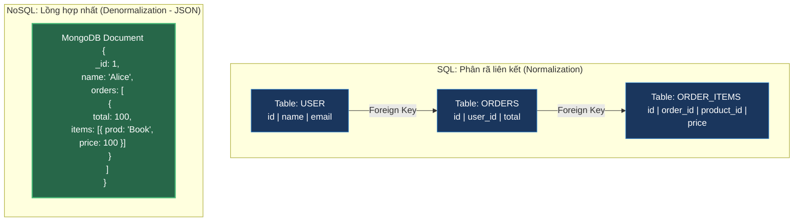

# So Sánh Toàn Diện SQL và NoSQL: Bản Chất Lưu Trữ, Mô Hình Scaling & Trade-offs Thực Chiến

## ⚡ Tóm tắt ngắn (30s)
Sự khác biệt cốt lõi giữa **SQL** và **NoSQL** nằm ở triết lý thiết kế và mô hình mở rộng (Scaling Model):
* **SQL (Relational Database - RDBMS)**:
  * **Cấu trúc**: Bảng nghiêm ngặt (rows & columns), liên kết chặt chẽ qua Foreign Keys, hỗ trợ **JOIN** mạnh mẽ.
  * **Scaling**: **Vertical Scaling** (Scale-up: tăng RAM/CPU máy đơn lẻ). Khó scale-out sang hàng chục server do ràng buộc ACID.
  * **Độ tin cậy**: Tuân thủ tuyệt đối **ACID** (Tính nhất quán mạnh - Strong Consistency).
* **NoSQL (Non-relational Database)**:
  * **Cấu trúc**: Không ràng buộc schema cố định (Schemaless), lưu trữ linh hoạt (Document, Key-Value, Column-family, Graph). Hạn chế dùng JOIN, ưu tiên lồng dữ liệu (Embedding/Denormalization).
  * **Scaling**: **Horizontal Scaling** (Scale-out: phân mảnh sharding sang cụm hàng nghìn server giá rẻ một cách dễ dàng).
  * **Độ tin cậy**: Tuân thủ **BASE** (Nhất quán sau cùng - Eventual Consistency).

---

## 🔍 Chi tiết bản chất kỹ thuật

### 1. Bản chất Schema: Strict vs Dynamic Schema
* **SQL**: Sử dụng thiết kế Schema tĩnh (Static Schema). Bạn phải định nghĩa chính xác kiểu dữ liệu của từng cột trước khi chèn dữ liệu. Mọi thay đổi cấu hình (như thêm cột) yêu cầu chạy lệnh DDL `ALTER TABLE` có nguy cơ khóa (lock) toàn bộ bảng dữ liệu lớn.
* **NoSQL**: Sử dụng Schema linh hoạt (Dynamic Schema). Mỗi bản ghi (ví dụ: Document trong MongoDB) có thể có cấu trúc các trường thuộc tính hoàn toàn khác nhau. Phù hợp cho dữ liệu bán cấu trúc (Semi-structured data) biến động liên tục.

### 2. Mô hình mở rộng: Vertical vs Horizontal Scaling
* **SQL (Scale-up)**: Để xử lý nhiều truy vấn hơn, cách tốt nhất là mua server to hơn. 
  * *Tại sao khó Scale-out?* Vì tính chất **ACID** bắt buộc dữ liệu ở mọi Node trong cụm phải nhất quán tức thì (Strong Consistency). Khi có hàng trăm server vật lý cách nhau địa lý, độ trễ mạng (Network Latency) làm việc phân tán transaction đồng thời trở nên bất khả thi (CAP Theorem).
* **NoSQL (Scale-out)**: Thiết kế ngay từ đầu để chia nhỏ dữ liệu thành các mảnh (**Shards**) dựa trên một **Shard Key**. Các shard này phân tán độc lập trên các server vật lý khác nhau. Hệ thống tự động phân tuyến truy vấn, dễ dàng mở rộng dung lượng vô hạn bằng cách cắm thêm máy chủ giá rẻ.

---

## 🎨 Sơ đồ So sánh Cấu trúc: SQL Bảng vs NoSQL Tài liệu (Document)



---

## 💻 Minh họa Thực chiến: Lấy dữ liệu Trang chủ E-commerce

### BAD ❌ (Dùng SQL JOIN 5 bảng dưới tải 10k QPS trên Prod)
* **Vấn đề**: Để hiển thị thông tin trang chủ của user (Profile + Địa chỉ + Đơn hàng gần nhất + Sản phẩm yêu thích), ta phải viết câu lệnh JOIN khổng lồ qua 5 bảng. Dưới tải cao, CPU của Database SQL sẽ nhảy vọt lên 100% do Overhead tính toán JOIN và khóa bảng.
```sql
SELECT u.name, a.city, o.total, p.product_name
FROM users u
LEFT JOIN addresses a ON u.id = a.user_id
LEFT JOIN orders o ON u.id = o.user_id
LEFT JOIN order_items oi ON o.id = oi.order_id
LEFT JOIN products p ON oi.product_id = p.id
WHERE u.id = 99; -- ❌ Rất chậm dưới tải 10,000 QPS
```

### GOOD ✅ (Dùng MongoDB Đọc 1 key duy nhất lấy trọn gói dữ liệu)
* **Giải pháp**: Lưu trữ toàn bộ dữ liệu trang chủ lồng sẵn (Denormalized) vào 1 JSON Document duy nhất của User trong MongoDB. Thao tác đọc diễn ra cực nhanh bằng cơ chế Single Key Lookup $O(1)$ không tốn bất kỳ phép tính toán JOIN nào.
```javascript
// ✅ Chỉ truy vấn đúng 1 Document duy nhất theo _id, siêu nhanh
db.users.findOne({ "_id": 99 });

// Kết quả trả về trọn vẹn trong 1 nốt nhạc:
{
  "_id": 99,
  "name": "Alice",
  "city": "Hanoi",
  "recent_orders": [
    { "total": 100, "items": ["Book"] }
  ]
}
```

---

## 📊 Bảng so sánh Thuộc tính Cốt lõi

| Đặc tính | Hệ cơ sở dữ liệu SQL | Hệ cơ sở dữ liệu NoSQL |
| :--- | :--- | :--- |
| **Mô hình dữ liệu** | Quan hệ (Relational - Bảng). | Phi quan hệ (Document, Key-Value, Wide-column, Graph). |
| **Schema** | Tĩnh (Static), Khắt khe. | Động (Dynamic), Linh hoạt. |
| **Phép toán JOIN** | Rất mạnh mẽ, xử lý dữ liệu phức tạp tốt. | Không có hoặc rất hạn chế (Ưu tiên lồng dữ liệu). |
| **Mô hình Scaling** | Vertical (Scale-up). | Horizontal (Scale-out). |
| **Tính Nhất Quán** | **ACID**: Nhất quán mạnh mẽ (Strong Consistency). | **BASE**: Nhất quán sau cùng (Eventual Consistency). |
| **Use Case lý tưởng** | Hệ thống Tài chính, Ngân hàng, ERP, E-commerce Checkout. | Hệ thống Mạng xã hội, Big Data, Real-time Analytics, Log Storage, User Profiles. |

---

## ⚠️ Common Gotchas (Câu hỏi phỏng vấn đào sâu)

### 1. "Có phải cơ sở dữ liệu NoSQL tuyệt đối không hỗ trợ tính chất giao dịch ACID (Transactions) hay không?"
* **Trả lời**: Đây là câu hỏi bẫy kiểm tra tính cập nhật công nghệ của bạn.
  * **Sự thật lịch sử**: Ban đầu, hầu hết các hệ NoSQL (như MongoDB cũ, Cassandra) hy sinh ACID để đổi lấy tốc độ và khả năng scale. Chúng chỉ hỗ trợ tính nguyên tử (Atomicity) ở cấp độ **đơn dòng/đơn tài liệu (Single-document)**.
  * **Thực tế hiện đại**: Kể từ phiên bản **MongoDB 4.0+**, hệ thống đã hỗ trợ **Multi-document ACID Transactions** đầy đủ giống như SQL (sử dụng giao thức hai pha - Two-Phase Commit). 
  * **Tuy nhiên (Trade-off)**: Việc bật Transaction trên NoSQL sẽ làm **giảm sút nghiêm trọng hiệu năng đọc/ghi** và tăng độ trễ. Do đó, khuyến nghị thiết kế schema lồng dữ liệu thông minh để hạn chế tối đa việc phải sử dụng Transaction.

### 2. "Làm sao để chúng ta xử lý các mối quan hệ 1-Nhiều (1-to-Many) trong NoSQL khi không có khóa ngoại (Foreign Keys) và JOIN?"
* **Trả lời**: Chúng ta có hai chiến lược cốt lõi phụ thuộc vào kích thước của mối quan hệ:
  1. **Nhúng dữ liệu (Embedding - Khuyên dùng cho quan hệ nhỏ/cố định)**:
     * Ví dụ: Một User có tối đa 3-5 địa chỉ giao hàng. Ta nhúng trực tiếp mảng địa chỉ vào trong Document User.
     * *Ưu điểm*: Đọc cực nhanh trong 1 câu lệnh.
  2. **Tham chiếu (Referencing - Bắt buộc cho quan hệ lớn/vô hạn)**:
     * Ví dụ: Một Tác giả có 100,000 bài viết (Books). Nếu nhúng tất cả vào 1 document, tài liệu sẽ vượt quá giới hạn dung lượng tối đa của MongoDB (16MB).
     * *Giải pháp*: Lưu Books thành các Document ở collection riêng, trong đó chứa trường `author_id`. Khi truy vấn, ứng dụng sẽ thực hiện **2 câu lệnh đọc độc lập** (hoặc dùng `$lookup` của MongoDB) để kết nối dữ liệu ở tầng Application.
