# So Sánh Các Cơ Chế Đánh Chỉ Mục Cốt Lõi: B-Tree vs Inverted Index vs LSM-Tree

## ⚡ Tóm tắt ngắn (30s)
Cơ chế đánh chỉ mục (Indexing) quyết định tốc độ đọc/ghi của từng loại Database. Có 3 cấu trúc chỉ mục kinh điển ngự trị thế giới dữ liệu:
1. **B-Tree Index (SQL / MongoDB)**: Cấu trúc cây tự cân bằng (Balanced Tree). 
   * **Bản chất**: Lưu trữ dữ liệu dạng phân cấp, tối ưu hóa tuyệt đối cho các truy vấn **tìm kiếm chính xác** (`=`) và **truy vấn theo dải** (`>`, `<`, `BETWEEN`).
   * **Tốc độ**: Đọc/ghi có độ phức tạp $O(\log N)$. MongoDB và hầu hết RDBMS dùng B-Tree làm mặc định.
2. **Inverted Index (Chỉ mục đảo ngược - Elasticsearch)**:
   * **Bản chất**: Bảng tra cứu ánh xạ ngược từ **Từ khóa (Term)** trỏ tới **Danh sách tài liệu chứa từ khóa đó (Posting List)**.
   * **Tốc độ**: Tìm kiếm văn bản (Full-text search) siêu tốc trong $O(1)$. Ghi/Update rất đắt đỏ do tính bất biến của các segment.
3. **LSM-Tree (Log-Structured Merge-Tree - Cassandra / DynamoDB)**:
   * **Bản chất**: Ghi tuần tự bất đồng bộ. Lệnh ghi đẩy thẳng vào RAM (**MemTable**) rồi xả xuống đĩa thành các file sắp xếp sẵn (**SSTables**). Một tiến trình **Compaction** chạy ngầm để gộp đè dữ liệu sau.
   * **Tốc độ**: **Tốc độ ghi nhanh nhất** trong tất cả các cấu trúc chỉ mục. Đọc chậm hơn do phải check nhiều file SSTables cùng lúc.

---

## 🔍 Chi tiết bản chất kỹ thuật & Sự đánh đổi (Trade-offs)

### 1. Tại sao B-Tree lại chậm hơn LSM-Tree đối với tác vụ Ghi?
* **Cơ chế ghi của B-Tree (In-place Update)**: Khi bạn chèn một dòng mới, B-Tree phải duyệt cây tìm đúng node lá phù hợp và ghi đè trực tiếp dữ liệu vào vị trí đĩa cứng đó. Điều này gây ra các phép **ghi đĩa ngẫu nhiên (Random Disk I/O)** cực kỳ chậm chạp và có nguy cơ phải tách node cây (Node Splitting) làm tốn CPU.
* **Cơ chế ghi của LSM-Tree (Append-only)**: Không bao giờ ghi đè lên file cũ. Mọi lệnh ghi là tuần tự (Sequential I/O), chỉ viết thêm vào cuối file nhật ký và lưu trên RAM. Đĩa cứng đọc ghi tuần tự nhanh hơn ghi ngẫu nhiên gấp **100 đến 10,000 lần** (kể cả với ổ SSD).

### 2. Bản chất lưu trữ của Inverted Index trong Lucene
* Lucene (trái tim của Elasticsearch) chia index thành nhiều file nhỏ gọi là **Segments**.
* Mỗi Segment chứa một Inverted Index tự thân và hoàn toàn **bất biến (Immutable)**.
* Vì bất biến nên ES không thể sửa đổi segment cũ khi có lệnh Update/Delete mà bắt buộc phải tạo segment mới và đánh dấu xóa (Deleted) ở segment cũ. Điều này giải thích tại sao ES cực kỳ kỵ các hệ thống có tác vụ Update dữ liệu với tần suất cao liên tục.

---

## 🎨 Sơ đồ Trực quan hóa 3 cấu trúc Chỉ mục Kinh điển

```mermaid
graph TD
    subgraph B_Tree ["1. B-Tree (SQL / MongoDB) <br> [Tự cân bằng - Tìm chính xác & Dải]"]
        Root["Root Node"] --> Branch1["Branch Node 1"]
        Root --> Branch2["Branch Node 2"]
        Branch1 --> Leaf1["Leaf: 1 - 10"]
        Branch1 --> Leaf2["Leaf: 11 - 20"]
    end

    subgraph Inverted_Idx ["2. Inverted Index (Elasticsearch) <br> [Mảng ánh xạ ngược - Tìm văn bản]"]
        Term1["Term: 'java'"] --> PostList1["[Doc 1, Doc 4, Doc 9]"]
        Term2["Term: 'code'"] --> PostList2["[Doc 2, Doc 4]"]
    end

    subgraph LSM_Tree ["3. LSM-Tree (Cassandra) <br> [RAM MemTable + Disk SSTables - Ghi siêu tốc]"]
        Mem["RAM: MemTable <br> (Sắp xếp tăng dần)"] -->|Flush bất đồng bộ| SST1["Disk: SSTable 1 <br> (Chỉ đọc, Bất biến)"]
        Mem -->|Flush tiếp| SST2["Disk: SSTable 2 <br> (Chỉ đọc, Bất biến)"]
    end

    style B_Tree fill:#102a45,stroke:#3182ce
    style Inverted_Idx fill:#1a365d,stroke:#3182ce
    style LSM_Tree fill:#1c3d27,stroke:#48bb78
```

---

## 💻 Minh họa & Ảnh hưởng thực chiến

### BAD ❌ (Dùng Elasticsearch làm DB ghi/sửa liên tục)
* **Vấn đề**: Bạn thiết kế hệ thống IoT đẩy GPS của xe ôm công nghệ liên tục 1 giây/lần về Elasticsearch để lưu trữ và cập nhật tọa độ mới nhất.
* **Hậu quả**: ES liên tục phải ghi đè, sinh ra hàng triệu file segment rác nhỏ nhặt trên đĩa. CPU của ES sẽ nhảy vọt lên 100% chỉ để làm tác vụ **Segment Merge** dọn rác. Hệ thống sẽ bị nghẽn (throttling), độ trễ tìm kiếm tăng lên hàng giây.

### GOOD ✅ (Chọn đúng cấu trúc chỉ mục cho từng tác vụ)
* **Giải pháp**:
  * Tọa độ GPS xe ôm đẩy về liên tục $\rightarrow$ Ghi vào **Cassandra (LSM-Tree)** để tận dụng tốc độ ghi đĩa tuần tự tối đa, RAM không bị block.
  * Thông tin tài khoản giao dịch $\rightarrow$ Ghi vào **PostgreSQL/MongoDB (B-Tree)** để đảm bảo tìm kiếm chính xác và nhất quán giao dịch tốt.
  * Ô tìm kiếm địa chỉ, tên đường $\rightarrow$ Đồng bộ sang **Elasticsearch (Inverted Index)** để tìm kiếm full-text thông minh.

---

## 📊 Bảng so sánh Ma trận Chỉ mục

| Tiêu chí | B-Tree (SQL / MongoDB) | Inverted Index (Elasticsearch) | LSM-Tree (Cassandra) |
| :--- | :--- | :--- | :--- |
| **Tốc độ Ghi (Write)** | Trung bình (Tốn random ghi đĩa, khóa hàng). | Chậm (Phải đánh chỉ mục phân tích từ, sinh segment). | **Vô địch** (Chỉ ghi RAM và ghi tuần tự append-only). |
| **Tốc độ Đọc (Read)** | Nhanh ($O(\log N)$). | **Nhanh nhất** cho văn bản ($O(1)$). | Chậm hơn (Phải check Bloom Filter, merge nhiều SSTables). |
| **Truy vấn theo Dải (`>`, `<`)** | **Hoạt động hoàn hảo**. | Kém hiệu quả. | Hoạt động tốt nếu dải trùng với Clustering Key. |
| **Tìm kiếm Full-text** | Không hỗ trợ (Hoặc rất kém). | **Tối ưu tối đa** (Độc tôn). | Không hỗ trợ. |
| **Sự phình to dung lượng** | Thấp (Dữ liệu cập nhật tại chỗ). | Cao (Do giữ nhiều segment rác chưa merge). | Cao (Do lưu nhiều bản sao cập nhật của cùng 1 dòng). |

---

## ⚠️ Common Gotchas (Câu hỏi phỏng vấn đào sâu)

### 1. "Tại sao B-Tree lại bị giới hạn hiệu năng khi kích thước Index vượt quá dung lượng bộ nhớ RAM của máy chủ?"
* **Bản chất**: B-Tree hoạt động nhanh vì toàn bộ các Node nhánh và Node lá của cây thường được cache sẵn trên RAM.
  * **Thảm họa Disk Thrashing**: Khi dữ liệu phình to lên hàng trăm triệu dòng, file Index vượt quá dung lượng RAM vật lý của server. Lúc này, mỗi phép so sánh tìm kiếm trên cây B-Tree sẽ không thể tìm thấy node tiếp theo trên RAM mà bắt buộc phải chạy xuống ổ đĩa cứng để load node lá lên RAM.
  * Việc liên tục đọc/ghi ngẫu nhiên giữa RAM và ổ cứng (Disk Thrashing) sẽ làm **tốc độ truy vấn của SQL tụt dốc không phanh từ 2ms lên tới 2000ms** ngay lập tức.
* **Cách khắc phục**:
  1. Chỉ đánh index trên các trường thực sự cần thiết để giữ dung lượng file Index nhỏ nhất có thể.
  2. Thực hiện **Sharding** (Chia nhỏ bảng) để phân tán file Index ra nhiều máy chủ khác nhau, đảm bảo file index của mỗi máy chủ luôn nằm gọn trong RAM của máy đó.

### 2. "Bloom Filter trong LSM-Tree (Cassandra) dùng để giải quyết vấn đề gì? Nó hoạt động thế nào?"
* **Bản chất**: Do LSM-Tree ghi dữ liệu phân mảnh ra hàng chục file SSTables khác nhau trên đĩa, khi khách hàng gửi lệnh Đọc một Key, Cassandra mặc định sẽ phải mở và quét qua tất cả các file SSTables này để tìm xem key nằm ở đâu (Rất chậm, tốn Disk Read I/O).
* **Giải pháp (Bloom Filter)**: 
  * Bloom Filter là một cấu trúc dữ liệu xác suất (Probabilistic Data Structure) siêu nhẹ nằm gọn trên RAM.
  * **Nhiệm vụ**: Nó có thể trả lời ngay lập tức câu hỏi: *"Key này có chắc chắn KHÔNG tồn tại trong file SSTable này hay không?"*.
    * Nếu Bloom Filter bảo **KHÔNG**, Cassandra tin tưởng 100% và bỏ qua file SSTable đó không thèm đọc đĩa (Tiết kiệm tối đa Disk I/O).
    * Nếu Bloom Filter bảo **CÓ**, Cassandra mới đi xuống đĩa mở file SSTable đó ra để quét (Thỉnh thoảng có sai số dương tính giả - False Positive - báo có nhưng xuống đĩa không tìm thấy, nhưng tỷ lệ rất thấp <1%).
  * Nhờ Bloom Filter, tốc độ đọc của hệ thống LSM-Tree được cải thiện gấp hàng chục lần.
