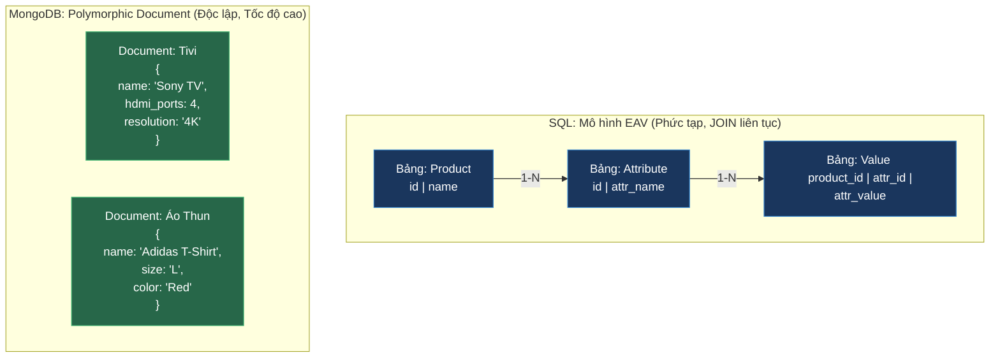

# Cơ Sở Dữ Liệu Tài Liệu (Document Database - MongoDB): Use Cases Lý Tưởng & Thiết Kế Thực Chiến

## ⚡ Tóm tắt ngắn (30s)
* **Định nghĩa**: **Document Database** (điển hình là **MongoDB**) lưu trữ dữ liệu dưới dạng các tài liệu bán cấu trúc (**BSON** - phiên bản mã nhị phân của JSON). Dữ liệu liên quan được nhóm và lồng trực tiếp vào nhau thay vì tách bảng.
* **Môi trường phù hợp nhất (Use Cases)**:
  1. **Danh mục sản phẩm đa hình (Polymorphic Catalogs)**: E-commerce có hàng triệu sản phẩm với các thuộc tính hoàn toàn khác nhau (ví dụ: áo thun có *size/màu*, tivi có *độ phân giải/số cổng HDMI*).
  2. **Quản lý nội dung (CMS/Blog)**: Dữ liệu bài viết, bình luận, lịch sử chỉnh sửa có cấu trúc lồng nhau linh hoạt.
  3. **Hồ sơ người dùng (User Profiles/Preferences)**: Lưu trữ các tùy chọn cấu hình động của người dùng.
  4. **Hệ thống Tracking/IoT Logs**: Dữ liệu cảm biến đẩy về liên tục dạng JSON có cấu trúc biến đổi nhẹ.
* **Chống chỉ định**: Hệ thống kế toán tài chính, giao dịch liên ngân hàng yêu cầu ràng buộc quan hệ khắt khe và tính toàn vẹn tham chiếu tuyệt đối (Referential Integrity).

---

## 🔍 Chi tiết bản chất kỹ thuật

### 1. Định dạng BSON (Binary JSON)
MongoDB không lưu text JSON thuần túy trên đĩa cứng mà dịch chuyển nó sang **BSON**.
* **Lợi ích**: BSON hỗ trợ nhiều kiểu dữ liệu nâng cao hơn JSON (như `Date`, `Decimal128` cho tiền tệ, `Binary` cho file nhỏ).
* **Tốc độ vượt trội**: BSON được thiết kế để phân tích (parse) cực nhanh. Nó lưu trữ độ dài của các trường dữ liệu ở đầu tài liệu, giúp công cụ quét (query engine) có thể **nhảy qua (skip)** các trường không quan tâm mà không cần quét toàn bộ ký tự của tài liệu như JSON text.

### 2. Sự nguy hiểm của Phản mẫu EAV (Entity-Attribute-Value) trong SQL
Khi lưu các sản phẩm có thuộc tính biến động trong SQL, người ta thường dùng mẫu thiết kế EAV (Bảng sản phẩm, Bảng thuộc tính, Bảng giá trị).
* *Hậu quả*: Để lấy thông tin 1 sản phẩm, bạn phải JOIN 3 bảng này lại với nhau. Câu lệnh truy vấn SQL vô cùng phức tạp và làm sụt giảm nghiêm trọng hiệu năng index.
* *Với MongoDB*: Bạn chỉ cần khai báo một trường dạng object/array lồng chứa mọi thuộc tính biến động và tạo **Wildcard Index** để tìm kiếm siêu tốc trên mọi thuộc tính đó.

---

## 🎨 Sơ đồ So sánh EAV (SQL) vs Polymorphic Document (MongoDB)



---

## 💻 Minh họa Thực chiến: Thiết kế Danh mục Sản phẩm E-commerce

### BAD ❌ (Dùng SQL EAV để lưu sản phẩm đa dạng thuộc tính)
* **Vấn đề**: Truy vấn cực kỳ cồng kềnh, không thể tối ưu index cho các bộ lọc tìm kiếm động (như tìm Tivi có màn hình 4K và có 4 cổng HDMI).
```sql
-- ❌ Phải dùng nhiều câu lệnh JOIN phức tạp chỉ để lấy thông tin sản phẩm
SELECT p.name, a1.attr_name, v1.attr_value, a2.attr_name, v2.attr_value
FROM products p
JOIN product_values v1 ON p.id = v1.product_id
JOIN product_attributes a1 ON v1.attr_id = a1.id AND a1.attr_name = 'resolution'
JOIN product_values v2 ON p.id = v2.product_id
JOIN product_attributes a2 ON v2.attr_id = a2.id AND a2.attr_name = 'hdmi_ports'
WHERE v1.attr_value = '4K' AND v2.attr_value = '4';
```

### GOOD ✅ (Dùng MongoDB Schema thiết kế linh hoạt)
* **Giải pháp**: Mỗi sản phẩm là 1 document độc lập có cấu trúc động. Sử dụng **Wildcard Index** để cho phép tìm kiếm bất kỳ trường thuộc tính nào cực kỳ nhanh gọn.

**Dữ liệu trong MongoDB Collection `products`:**
```json
// Bản ghi Tivi
{
  "_id": "p_101",
  "name": "Sony Bravia 55 inch",
  "category": "Electronics",
  "specs": {
    "resolution": "4K",
    "hdmi_ports": 4,
    "screen_type": "OLED"
  }
}

// Bản ghi Áo Thun
{
  "_id": "p_102",
  "name": "Nike Run Shirt",
  "category": "Apparel",
  "specs": {
    "size": "L",
    "color": "Blue",
    "material": "Polyester"
  }
}
```

**Tạo Wildcard Index trên toàn bộ object `specs` để tìm kiếm động:**
```javascript
// ✅ Chỉ 1 câu lệnh index cho phép tìm kiếm mọi thuộc tính bên trong specs
db.products.createIndex({ "specs.$**": 1 });

// ✅ Tìm kiếm cực nhanh không tốn phép JOIN
db.products.find({ "specs.resolution": "4K", "specs.hdmi_ports": 4 });
```

---

## 📊 Phân tích Ưu & Nhược điểm của MongoDB

| Tiêu chí | Điểm mạnh (Pros) | Điểm yếu (Cons) |
| :--- | :--- | :--- |
| **Tốc độ đọc dữ liệu** | **Cực nhanh** do dữ liệu lồng sẵn không cần JOIN đĩa cứng. | Tốn nhiều dung lượng RAM/Disk hơn do lặp lại tên trường trong mỗi document. |
| **Tính linh hoạt** | Thay đổi cấu trúc dữ liệu không cần downtime, không cần chạy migration nặng. | Thiếu ràng buộc kiểm soát tính toàn vẹn ở tầng DB (phải tự validate ở tầng Application code). |
| **Mở rộng (Scaling)** | Hỗ trợ tự động phân mảnh **Horizontal Sharding** cực kỳ mượt mà. | Không phù hợp cho các báo cáo phân tích tài chính phức tạp (như tổng hợp sổ cái kế toán đa cấp). |
| **Trải nghiệm lập trình** | Dữ liệu dạng JSON khớp 100% với mô hình OOP Class của Java/NodeJS. | Giới hạn dung lượng tối đa 16MB cho một Document duy nhất. |

---

## ⚠️ Common Gotchas (Câu hỏi phỏng vấn đào sâu)

### 1. "Giới hạn kích thước một Document trong MongoDB là 16MB. Làm thế nào bạn xử lý lưu trữ nếu dữ liệu lồng nhau (ví dụ: mảng bình luận của một bài viết hot) vượt quá giới hạn này?"
* **Bản chất**: Lỗi lồng vô hạn (**Infinite Growth Anti-pattern**). Nếu bạn nhúng toàn bộ bình luận (comments) vào chung document bài viết (`articles`), khi bài viết có 1 triệu bình luận, document sẽ phình to vượt 16MB và làm sập app (BSON Document Size Limit Exceeded).
* **Cách xử lý thực chiến**:
  1. **Chiến lược Subset Pattern (Khuyên dùng)**: Chỉ nhúng tối đa **100 bình luận mới nhất** vào document bài viết để hiển thị nhanh trang đầu tiên. Toàn bộ các bình luận cũ hơn sẽ được tách ra một Collection `comments` riêng biệt chứa `article_id` tham chiếu và phân trang bằng lazy loading.
  2. **Sử dụng GridFS**: Nếu cần lưu trữ các file lớn (như file ảnh, pdf > 16MB), sử dụng cơ chế GridFS của MongoDB. GridFS sẽ tự động chia nhỏ file đó thành các phần `chunks` (mặc định 255KB) và lưu vào các collection riêng biệt để quản lý.

### 2. "Multikey Index trong MongoDB hoạt động thế nào? Nó có rủi ro gì về hiệu năng lưu trữ và bộ nhớ?"
* **Trả lời**: 
  * **Cơ chế**: Khi bạn tạo index trên một trường có giá trị là một **Mảng (Array)** (ví dụ: `db.products.createIndex({ tags: 1 })` trong đó `tags = ["tech", "smart", "home"]`), MongoDB sẽ tự động tạo ra **3 bản ghi index riêng biệt** trỏ tới cùng 1 document (mỗi phần tử trong mảng chiếm 1 dòng index). Cơ chế này gọi là **Multikey Index**.
  * **Rủi ro**: Nếu mảng của bạn quá lớn (ví dụ: mảng chứa 10,000 phần tử), MongoDB sẽ phải tạo ra 10,000 dòng index cho duy nhất 1 tài liệu đó. Điều này làm **bộ nhớ RAM của Database phình to cực kỳ nhanh** (Index RAM Exhaustion) và làm chậm đáng kể tốc độ của các thao tác ghi/cập nhật dữ liệu do phải update quá nhiều dòng index đồng thời.
  * **Khắc phục**: Luôn giới hạn kích thước (length) của mảng được đánh index hoặc tránh đánh index trên các mảng có khả năng phình to vô hạn.
