# Hệ Lưu Trữ Key-Value (Redis, DynamoDB): Bản Chất Hoạt Động, Use Cases & Chiến Lược Tránh Hot Partition

## ⚡ Tóm tắt ngắn (30s)
* **Khái niệm**: **Key-Value Store** là mô hình NoSQL đơn giản nhất. Dữ liệu được lưu trữ như một bảng băm khổng lồ (Hash Map) trong đó mỗi bản ghi được truy xuất thông qua một **Khóa duy nhất (Unique Key)** trỏ tới một **Giá trị (Value)**.
* **Môi trường phù hợp (Use Cases)**:
  1. **Caching & Session Store (Redis)**: Lưu thông tin đăng nhập (Session), giỏ hàng tạm thời, hoặc làm bộ đệm tăng tốc cho các truy vấn SQL chậm.
  2. **Hệ thống giao dịch quy mô lớn (DynamoDB)**: Ứng dụng web cần độ trễ cực thấp **dưới 10 mili-giây** ổn định ở bất kỳ quy mô traffic nào (ví dụ: giỏ hàng Amazon, số dư tài khoản game).
  3. **Bộ đếm & Giới hạn tần suất (Rate Limiting - Redis)**: Đếm số request để chặn spam.
  4. **Hàng đợi & Pub/Sub (Redis)**: Truyền tin nhắn bất đồng bộ tốc độ cao.
* **Nguyên tắc cốt lõi**: Phù hợp cho các truy vấn đơn giản dạng **"lấy dữ liệu theo ID"** (`get(key)`). **Cực kỳ không phù hợp** cho các truy vấn tìm kiếm phức tạp theo nhiều tiêu chí động không phải là Key (như tìm kiếm full-text, lọc theo nhiều cột không có index).

---

## 🔍 Chi tiết bản chất kỹ thuật

### 1. Sự khác biệt kiến trúc: Redis vs DynamoDB
Mặc dù đều là Key-Value, nhưng mục đích thiết kế của chúng hoàn toàn khác nhau:
* **Redis (In-Memory)**: 
  * Dữ liệu lưu hoàn toàn trên **RAM**, đạt tốc độ kinh ngạc (>100k QPS/node) với độ trễ <1ms.
  * Hoạt động theo cơ chế **Đơn luồng (Single-threaded Event Loop)** kết hợp với I/O Multiplexing (như `epoll` của Linux). Nhờ đơn luồng, Redis loại bỏ hoàn toàn chi phí context-switch của CPU và tranh chấp khóa (deadlocks), giúp các phép toán diễn ra cực kỳ an toàn và ổn định.
* **DynamoDB (Persistent & Distributed)**:
  * Dữ liệu lưu trên **ổ cứng SSD** phân tán, được AWS quản lý hoàn toàn.
  * Tự động scale từ vài request lên hàng triệu request mỗi giây mà không cần cấu hình hạ tầng. Độ trễ ổn định ở mức single-digit ms (dưới 10ms).

### 2. Hiện tượng Phân Vùng Nóng (Hot Partition Problem) trong DynamoDB
* **Cơ chế**: DynamoDB chia dữ liệu thành nhiều phân vùng vật lý (**Partitions**) dựa trên mã băm của khóa phân vùng (**Partition Key - PK**).
* **Vấn đề**: Nếu bạn chọn một PK có tính phân tán thấp (ví dụ: `status` chỉ có giá trị `ACTIVE`/`INACTIVE`), hoặc một PK đại diện cho một KOL nổi tiếng (như tài khoản Twitter của Taylor Swift nhận hàng triệu view/giây), toàn bộ request sẽ bị dồn vào **duy nhất 1 Partition vật lý**, gây cạn kiệt tài nguyên (Throttling) trong khi các server khác trong cụm vẫn đang rảnh rỗi.

---

## 🎨 Sơ đồ Phân mảnh Dữ liệu theo Hash Ring của Key-Value Store

```mermaid
graph TD
    Key["Truy vấn: GET 'user:99'"] -->|1. Tính mã Hash| HashFunc["Hash Function <br> (CRC32 / MurmurHash)"]
    HashFunc -->|2. Trả về mã băm| HashVal["Hash Value: 24510"]
    
    subgraph Cluster ["Distributed Cluster Node Rings"]
        Node1["Node 1 (Range: 0 - 10000)"]
        Node2["Node 2 (Range: 10001 - 20000)"]
        Node3["Node 3 (Range: 20001 - 30000)"]
    end

    HashVal -->|3. Route trực tiếp| Node3
    Node3 -->|4. Lấy Value cực nhanh| Value["Value: { name: 'Bob', age: 30 }"]

    style Cluster fill:#102a45,stroke:#3182ce,stroke-dasharray: 5 5
    style Node3 fill:#276749,stroke:#48bb78,color:#fff,stroke-width:2px
```



---

## 💻 Minh họa Thực chiến: Quản lý Giỏ Hàng E-commerce

### BAD ❌ (Dùng SQL Query liên tục khi khách hàng click duyệt sản phẩm)
* **Vấn đề**: Giỏ hàng (Shopping Cart) được khách hàng cập nhật liên tục (thêm, bớt, đổi số lượng). Nếu mỗi click của khách hàng đều tạo ra lệnh `UPDATE` hoặc `SELECT` JOIN nhiều bảng trong SQL DB, DB sẽ nhanh chóng quá tải CPU do ghi ổ đĩa quá nhiều.
```sql
-- ❌ Chạy liên tục dưới tải cao làm sập ổ cứng DB SQL
UPDATE cart_items 
SET quantity = quantity + 1 
WHERE user_id = 99 AND product_id = 101;
```

### GOOD ✅ (Dùng Redis Hash Structure siêu tốc)
* **Giải pháp**: Lưu giỏ hàng bằng cấu trúc dữ liệu **Hash** của Redis. Toàn bộ thao tác cập nhật số lượng chỉ diễn ra trên RAM trong vòng chưa đầy `0.5ms` bằng câu lệnh nguyên tử `HINCRBY`.

**Cơ cấu lưu trữ trong Redis (Key: `cart:user:99`):**
```bash
# 1. Khách hàng thêm 2 cuốn sách (product 101) vào giỏ hàng
HINCRBY cart:user:99 product:101 2

# 2. Khách hàng thêm 1 cái áo (product 202) vào giỏ hàng
HINCRBY cart:user:99 product:202 1

# 3. Lấy toàn bộ giỏ hàng ra hiển thị lập tức trong <1ms
HGETALL cart:user:99

# Kết quả trả về cực nhanh:
# "product:101" -> "2"
# "product:202" -> "1"
```

---

## 📊 Bảng so sánh: Redis vs DynamoDB vs SQL

| Tiêu chí | Redis | DynamoDB | SQL (RDBMS) |
| :--- | :--- | :--- | :--- |
| **Vùng lưu trữ** | RAM (In-Memory). | SSD (Persistent). | SSD/HDD (Persistent). |
| **Tốc độ (Latency)** | **< 1ms** (Siêu tốc). | < 10ms (Rất nhanh). | 10ms - 200ms (Trung bình). |
| **Khả năng Scaling** | Khá phức tạp (Cần cấu hình Redis Cluster, Sentinel). | **Vô hạn, Tự động hoàn toàn** (Serverless). | Khó khăn, giới hạn ở máy đơn lẻ. |
| **Cấu trúc dữ liệu** | Đa dạng (Strings, Hashes, Lists, Sets, Sorted Sets). | Document (JSON). | Tabular (Bảng). |
| **Độ an toàn dữ liệu** | Trung bình (Dữ liệu có thể bị mất nếu mất điện đột ngột trước khi kịp ghi đĩa RDB/AOF). | **Tuyệt đối** (AWS replicate dữ liệu ra 3 Availability Zones tự động). | **Tuyệt đối** (Hỗ trợ Transaction nghiêm ngặt). |

---

## ⚠️ Common Gotchas (Câu hỏi phỏng vấn đào sâu)

### 1. "Làm sao để chúng ta xử lý triệt để hiện tượng 'Phân Vùng Nóng' (Hot Partition) khi thiết kế bảng trong DynamoDB?"
* **Trả lời**: Đây là câu hỏi kinh điển kiểm tra tư duy thiết kế hệ thống phân tán cấp độ Senior:
  * **Giải pháp thực chiến**:
    1. **Thêm hậu tố ngẫu nhiên (Write Sharding / Key Salting)**:
       * Nếu ta có hàng triệu log sự kiện cần ghi cùng một ngày, thay vì dùng Partition Key tĩnh dạng `date_2026-05-23`, ta sẽ thêm một hậu tố ngẫu nhiên từ `1` đến `N` vào cuối khóa: `date_2026-05-23_part_3`.
       * Việc này giúp phân tán đều dữ liệu sang `N` phân vùng vật lý khác nhau một cách hoàn hảo.
       * Khi cần đọc lại, ứng dụng chỉ cần thực hiện `N` câu lệnh truy vấn song song (Parallel Queries) trên `N` khóa này và hợp nhất lại.
    2. **Chọn Partition Key có độ phân tán cao (High Cardinality)**: Sử dụng các ID có tính ngẫu nhiên cao làm PK như `user_id`, `transaction_id`, `uuid` thay vì các trường phân loại thấp như `status`, `gender`, `category`.

### 2. "Nếu Redis hoạt động đơn luồng (Single-threaded), tại sao một câu lệnh `KEYS *` lại có thể làm sập toàn bộ hệ thống đang chạy của bạn?"
* **Bản chất**: Do Redis là **đơn luồng**, nó chỉ có thể thực thi **1 câu lệnh duy nhất tại 1 thời điểm**.
  * Câu lệnh **`KEYS *`** yêu cầu Redis phải quét qua toàn bộ hàng triệu key có trong RAM để tìm kiếm. Với Database lớn, câu lệnh này có thể tốn từ 2 - 10 giây để chạy xong.
  * Trong suốt 10 giây đó, **toàn bộ các lệnh đọc/ghi khác của hàng nghìn khách hàng sẽ bị BLOCK hoàn toàn** (treo connection). App sẽ bị timeout hàng loạt và gây sập dây chuyền toàn bộ hệ thống.
* **Cách khắc phục**:
  1. Tuyệt đối không bao giờ được phép gõ lệnh `KEYS *` trên môi trường Production. Cấu hình chặn lệnh này trong file `redis.conf` bằng cách rename lệnh đó thành chuỗi rỗng:
     ```conf
     rename-command KEYS ""
     ```
  2. Nếu bắt buộc phải quét key tìm kiếm, hãy dùng lệnh **`SCAN`**. Lệnh `SCAN` hoạt động theo cơ chế con trỏ (Cursor-based), nó chỉ quét một nhóm nhỏ key (mặc định 10 key) rồi trả lại CPU cho các lệnh khác xử lý, giúp hệ thống không bao giờ bị nghẽn.
