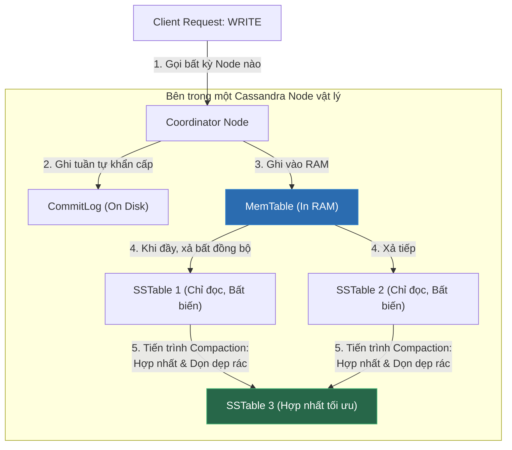

# Cơ Sở Dữ Liệu Cột Rộng (Wide-column Store - Cassandra): Kiến Trúc Masterless & Triết Lý Write-First

## ⚡ Tóm tắt ngắn (30s)
* **Định nghĩa**: **Wide-column Store** (như **Apache Cassandra**, **ScyllaDB**, **Google Bigtable**) tổ chức dữ liệu dưới dạng các họ cột (Column Families) thay vì bảng quan hệ. Mỗi dòng có thể chứa số lượng cột và tên cột hoàn toàn khác nhau.
* **Môi trường phù hợp nhất (Use Cases)**:
  1. **Tốc độ ghi siêu khủng (Write-Heavy Systems)**: Hệ thống theo dõi vết hoạt động (Activity Log / Clickstream), dữ liệu cảm biến IoT đẩy về liên tục 24/7, lịch sử giao dịch chứng khoán/Crypto.
  2. **Hệ thống phân tán đa vùng (Multi-Datacenter Replication)**: Cần đồng bộ dữ liệu tức thì giữa các cụm máy chủ đặt tại Mỹ, Châu Âu và Châu Á.
  3. **Hệ thống High Availability tối cao**: Yêu cầu **Uptime 99.999%**, không cho phép có bất kỳ điểm nghẽn đơn lẻ nào (No Single Point of Failure).
* **Chống chỉ định**: Các hệ thống có nhu cầu truy vấn linh hoạt (Ad-hoc Queries), lọc dữ liệu theo nhiều tiêu chí ngẫu nhiên, hoặc cần thay đổi logic nghiệp vụ liên tục (Cassandra yêu cầu bạn phải biết trước câu truy vấn trước khi thiết kế bảng).

---

## 🔍 Chi tiết bản chất kỹ thuật & Kiến trúc khác biệt

### 1. Kiến trúc Masterless Ring (Không máy chủ Master)
Khác với MongoDB hay SQL (hoạt động theo mô hình Master-Slave, nếu Master sập hệ thống sẽ bị gián đoạn để bầu chọn lại), Cassandra hoạt động theo mô hình **Đồng đẳng (Peer-to-Peer)** dạng vòng tròn:
* Mọi Node trong cụm đều giữ vai trò và quyền hạn ngang nhau.
* Các node giao tiếp sức khỏe với nhau qua giao thức **Gossip Protocol**.
* Khi khách hàng gửi yêu cầu ghi tới **bất kỳ Node nào**, node đó sẽ tự động đóng vai trò điều phối (Coordinator), băm khóa (Hash Key) để xác định node đích thực sự giữ dữ liệu và chuyển tiếp tin nhắn, đảm bảo hệ thống không bao giờ bị sập hoàn toàn kể cả khi 50% số server bị cháy.

### 2. Bản chất Đường Ghi siêu tốc (Write Path) của Cassandra
Tại sao Cassandra có thể ghi hàng triệu bản ghi mỗi giây lên đĩa cứng nhanh hơn tất cả các Database khác?
* **Bước 1**: Khi nhận lệnh ghi, Cassandra ghi tuần tự thông tin vào **CommitLog** trên đĩa cứng (chỉ để đề phòng mất điện, ghi tuần tự cực nhanh).
* **Bước 2**: Đồng thời, nó ghi dữ liệu vào cấu trúc dữ liệu **MemTable** trên RAM và lập tức trả về `Success` cho client. **Client không cần đợi ghi xuống đĩa chính**.
* **Bước 3**: Khi MemTable đầy, nó được flush (xả) bất đồng bộ xuống ổ cứng thành các file **SSTables (Sorted String Tables)**.
* **Tính chất đặc biệt**: SSTables là **bất biến (Immutable)**. Cassandra không bao giờ thực hiện sửa đổi (update) trực tiếp trên file cũ mà chỉ ghi đè file mới. Do đó, nó loại bỏ hoàn toàn chi phí tìm kiếm đầu đọc đĩa (Disk Seek) và chi phí khóa hàng (Row Lock), đạt tốc độ ghi bằng tốc độ vật lý tối đa của phần cứng.

---

## 🎨 Sơ đồ Đường Ghi siêu tốc (Write Path) & Tiến trình Compaction



---

## 💻 Minh họa Thực chiến: Thiết kế Bảng theo Truy vấn (Query-Driven Design)

Trong Cassandra, bạn **không được phép thiết kế database chuẩn hóa (Normalized)** rồi dùng lệnh JOIN để truy vấn. Bạn bắt buộc phải **thiết kế Bảng khớp 100% với cấu trúc câu Query hiển thị trên UI**.

### BAD ❌ (Thiết kế bảng kiểu SQL, cố gắng Query linh hoạt)
* **Vấn đề**: Cassandra không hỗ trợ JOIN, không hỗ trợ quét đĩa tìm kiếm không có Partition Key. Câu lệnh dưới đây sẽ bị sập hoặc bị hệ thống từ chối chạy (hoặc bắt buộc phải cờ nguy hiểm `ALLOW FILTERING` quét sạch cụm server).
```sql
-- ❌ Thất bại: Cố gắng lọc theo email hoặc country trên bảng thiết kế sai
SELECT * FROM users_table 
WHERE email = 'alice@gmail.com' AND country = 'Vietnam';
```

### GOOD ✅ (Thiết kế bảng Query-driven chuẩn Cassandra)
* **Giải pháp**: Nếu UI yêu cầu "Hiển thị danh sách log của thiết bị theo thời gian", ta thiết kế bảng sử dụng **Composite Key** gồm:
  * **Partition Key (`device_id`)**: Xác định dữ liệu nằm ở Node vật lý nào.
  * **Clustering Key (`log_timestamp`)**: Sắp xếp dữ liệu vật lý tăng/giảm dần trên đĩa cứng của Node đó để truy xuất cực nhanh theo dải thời gian.

**Câu lệnh khởi tạo bảng bằng ngôn ngữ CQL (Cassandra Query Language):**
```sql
CREATE KEYSPACE iot_platform WITH replication = {
  'class': 'SimpleStrategy', 
  'replication_factor': 3
};

USE iot_platform;

-- ✅ Bảng log thiết bị được tối ưu cho việc truy vấn theo thời gian
CREATE TABLE device_logs (
    device_id uuid,
    log_timestamp timestamp,
    sensor_value double,
    status_code text,
    PRIMARY KEY (device_id, log_timestamp) -- (Partition Key, Clustering Key)
) WITH CLUSTERING ORDER BY (log_timestamp DESC); -- Sắp xếp mới nhất lên trên
```

**Truy vấn siêu tốc bằng cách cung cấp chính xác Partition Key:**
```sql
--  Chỉ quét đúng 1 node vật lý chứa device_id này, trả về kết quả trong <2ms
SELECT * FROM device_logs 
WHERE device_id = 9b1deb4d-3b7d-4bad-9bdd-2b0d7b3dcb6d 
  AND log_timestamp >= '2026-05-23 00:00:00';
```

---

## 📊 Bảng so sánh trade-offs: Cassandra vs MongoDB vs SQL

| Đặc tính | Apache Cassandra | MongoDB | SQL (RDBMS) |
| :--- | :--- | :--- | :--- |
| **Kiến trúc** | Masterless (Peer-to-Peer Ring). | Master-Slave (Replica Set). | Single/Master-Slave. |
| **Tốc độ Ghi (Write)** | **Tối đa** (Nhờ MemTable + Immutable SSTables). | Nhanh. | Trung bình (Tốn lock và ghi đĩa ngẫu nhiên). |
| **Tốc độ Đọc (Read)** | Chậm hơn (Phải check nhiều file SSTables trên đĩa). | **Cực nhanh** (Nhờ BSON lồng sẵn). | Nhanh (Nếu có Index tốt). |
| **Tính linh hoạt truy vấn** | **Rất thấp** (Phải biết trước câu query mới tạo được bảng). | Rất cao (Hỗ trợ ad-hoc query động). | **Tối đa** (JOIN bất kỳ bảng nào). |
| **Độ phức tạp vận hành** | Cực kỳ cao (Cần đội ngũ SRE cứng để tuning JVM, compaction). | Trung bình. | Thấp. |

---

## ⚠️ Common Gotchas (Câu hỏi phỏng vấn đào sâu)

### 1. "Tombstone trong Cassandra là gì? Tại sao việc xóa (DELETE) dữ liệu quá nhiều lại có thể làm sập hoặc làm chậm nghiêm trọng tốc độ ĐỌC của Cassandra?"
* **Bản chất**: Do SSTables là **bất biến (Immutable)** để tối ưu tốc độ ghi, Cassandra không thể tìm đến dòng cũ trên đĩa và xóa nó đi khi nhận lệnh `DELETE`.
  * **Cơ chế**: Khi bạn xóa một dòng, Cassandra chỉ ghi thêm một nhãn đánh dấu gọi là **Tombstone** (Bia mộ) báo rằng *"Dòng này đã chết ở thời điểm T"*.
  * **Hậu quả**: Khi thực hiện câu lệnh Đọc, Cassandra bắt buộc phải quét qua tất cả các Tombstones này để lọc bỏ dữ liệu đã xóa trước khi trả về cho client. Nếu bạn xóa hàng triệu bản ghi, lệnh Đọc sẽ phải tải hàng triệu Tombstones vào RAM, gây ra lỗi **OutOfMemory** của máy chủ Cassandra hoặc làm trễ lệnh đọc lên tới vài giây.
* **Cách khắc phục**: Hạn chế tối đa việc chạy lệnh `DELETE` trong Cassandra. Nếu cần xóa dữ liệu cũ, hãy cấu hình tính năng **TTL (Time-To-Live)** để Cassandra tự động hết hạn và dọn dẹp âm thầm thông qua tiến trình **Compaction** (Tiến trình gộp các file SSTables và thực sự xóa bỏ các dữ liệu có nhãn Tombstone).

### 2. "Tunable Consistency (Khả năng điều chỉnh tính nhất quán) trong Cassandra hoạt động thế nào? Làm sao đảm bảo đọc được dữ liệu mới nhất (Strong Consistency)?"
* **Trả lời**: Cassandra cho phép bạn cấu hình mức độ Nhất quán (Consistency Level - CL) trên **từng câu lệnh Đọc và Ghi độc lập**:
  * **Write CL = ONE**: Chỉ cần 1 Node ghi thành công vào RAM/CommitLog là báo Success cho client ngay (Tốc độ ghi tối đa nhưng dễ mất dữ liệu nếu Node đó sập trước khi đồng bộ).
  * **Read CL = ONE**: Chỉ cần hỏi 1 Node gần nhất lấy dữ liệu trả về ngay (Tốc độ đọc tối đa nhưng có thể lấy phải dữ liệu cũ).
  * **Giao thức Quorum (Đa số)**: Hỏi số lượng Node lớn hơn một nửa ($N/2 + 1$) trong cụm.
  * **Công thức Đọc Nhất Quán Mạnh (Strong Consistency)**:
    Để đảm bảo **luôn đọc được dữ liệu mới nhất**, bạn phải cấu hình sao cho tổng số Node xác thực lúc Ghi và Đọc lớn hơn tổng số bản sao (Replication Factor - RF):
    $$\text{Write CL} + \text{Read CL} > \text{Replication Factor}$$
    * Ví dụ: Với hệ thống có $\text{RF} = 3$ (Dữ liệu nhân bản ra 3 Node vật lý): Nếu bạn cấu hình **Write CL = QUORUM** (cần 2 node xác nhận ghi) và **Read CL = QUORUM** (cần 2 node đồng ý đọc), thì tổng là $2 + 2 = 4 > 3$. Hệ thống chắc chắn đảm bảo tính nhất quán mạnh mẽ (Strong Consistency) tuyệt đối.
    * 
