# Định Lý CAP: Chìa Khóa Tư Duy Thiết Kế Hệ Thống Phân Tán & Định Luật PACELC

## ⚡ Tóm tắt ngắn (30s)
* **Định nghĩa**: **Định lý CAP** (Brewer's Theorem) khẳng định rằng một hệ thống lưu trữ dữ liệu phân tán (Distributed Data Store) chỉ có thể đảm bảo tối đa **2 trong số 3** tính chất sau đồng thời:
  1. **Consistency (Tính nhất quán - C)**: Mọi Node đều đọc được dữ liệu mới nhất giống nhau tại cùng một thời điểm, hoặc trả về lỗi (Không đọc dữ liệu cũ).
  2. **Availability (Tính khả dụng - A)**: Mọi Node hoạt động bình thường đều phải trả về câu trả lời thành công (không lỗi), nhưng không đảm bảo đó là dữ liệu mới nhất.
  3. **Partition Tolerance (Tính chịu lỗi phân mảnh mạng - P)**: Hệ thống vẫn tiếp tục hoạt động bình thường kể cả khi mạng kết nối giữa các Node bị đứt gãy hoặc trễ (Network Partition).
* **Sự thật thực chiến**: Vì đứt gãy mạng (P) là **bất khả kháng** trong thế giới vật lý thực tế, các kiến trúc sư hệ thống bắt buộc phải lựa chọn giữa **CP** (Nhất quán tuyệt đối, chấp nhận sập mạng/tắt hệ thống khi có lỗi mạng) hoặc **AP** (Luôn khả dụng chạy mượt mà, chấp nhận hiển thị dữ liệu cũ tạm thời). **Mô hình CA là bất khả thi trong hệ thống phân tán**.

---

## 🔍 Chi tiết bản chất kỹ thuật & Sự lựa chọn sinh tử

### 1. Tại sao mô hình CA là một "Ảo tưởng" (CA is a Myth)?
Nhiều người lầm tưởng các Database SQL truyền thống là hệ thống **CA** (Consistency & Availability). 
* **Sự thật**: CA chỉ tồn tại trên **một máy chủ vật lý đơn lẻ (Single Node)** - nơi không bao giờ xảy ra lỗi mạng kết nối nội bộ.
* Một khi bạn đã thiết kế hệ thống phân tán (từ 2 Node trở lên), đường truyền mạng giữa các node chắc chắn có lúc bị đứt gãy (cáp đứt, switch hỏng, router quá tải). Lúc này, tính chất **P** bắt buộc phải có. Do đó, bạn chỉ được phép chọn:
  * **Chọn CP (Consistency + Partition Tolerance)**: Khi mạng bị chia cắt, để bảo vệ tính nhất quán dữ liệu, Node A sẽ từ chối nhận lệnh Ghi hoặc báo lỗi Đọc. Hệ thống **mất tính khả dụng (A)**. (Ví dụ: Hệ thống chuyển tiền ngân hàng).
  * **Chọn AP (Availability + Partition Tolerance)**: Khi mạng bị chia cắt, Node A vẫn chấp nhận cho khách hàng rút tiền/ghi dữ liệu, Node B vẫn cho đọc dữ liệu cũ. Khi mạng thông lại, chúng tự đồng bộ hóa sau. Hệ thống **mất tính nhất quán mạnh (C)**. (Ví dụ: Like/Comment trên Facebook).

### 2. Sự bổ sung hoàn hảo: Định luật PACELC
Định lý CAP chỉ mô tả hệ thống **khi có sự cố mạng (Partition)**. Vậy khi hệ thống hoạt động **bình thường (Else)** thì sao? Định luật **PACELC** ra đời để giải quyết câu hỏi đó:
* **P-A-C**: Nếu có **P**artition, chọn giữa **A**vailability và **C**onsistency.
* **E-L-C**: **E**lse (nếu chạy bình thường), chọn giữa **L**atency (Độ trễ thấp - chạy nhanh) và **C**onsistency (Tính nhất quán - chạy an toàn).
  * Ví dụ: MongoDB là hệ thống **PC/EC** (Ưu tiên nhất quán khi lỗi mạng, và vẫn ưu tiên nhất quán khi chạy bình thường bằng cách bắt đọc/ghi trên Master).
  * Cassandra là hệ thống **PA/EL** (Ưu tiên khả dụng khi lỗi mạng, và ưu tiên chạy nhanh độ trễ thấp khi chạy bình thường bằng cách đọc ghi bất đồng bộ trên Node gần nhất).

---

## 🎨 Sơ đồ Tam giác CAP & Bản đồ Phân bổ Cơ sở Dữ liệu

```mermaid
graph TD
    subgraph CAP_Triangle ["Tam giác Định lý CAP"]
        C["Consistency (C) <br> [Nhất quán mạnh]"] --- A["Availability (A) <br> [Khả dụng 100%]"]
        A --- P["Partition Tolerance (P) <br> [Chịu lỗi mạng]"]
        P --- C
    end
    
    subgraph DB_Mapping ["Bản đồ chọn lựa thực tế"]
        CP["Lựa chọn CP: <br> - MongoDB <br> - HBase <br> - Redis Cluster <br> - SQL (Distributed)"]
        AP["Lựa chọn AP: <br> - Apache Cassandra <br> - DynamoDB <br> - CouchDB"]
        CA["Lựa chọn CA (Không phân tán): <br> - PostgreSQL (Single Node) <br> - MySQL (Single Node)"]
    end

    C -.-> CP
    P -.-> CP
    
    A -.-> AP
    P -.-> AP
    
    C -.-> CA
    A -.-> CA

    style CAP_Triangle fill:#102a45,stroke:#3182ce
    style CP fill:#7b341e,stroke:#c05621,color:#fff
    style AP fill:#276749,stroke:#48bb78,color:#fff
    style CA fill:#2d3748,stroke:#4a5568,color:#fff
```



---

## 💻 Minh họa Thực chiến: Lựa chọn Mô hình Hệ thống

### 1. Kịch bản CP (Hệ thống Rút Tiền ATM / Giao dịch Ví điện tử)
* **Yêu cầu**: Số dư tài khoản phải tuyệt đối đồng nhất. Nếu lỗi mạng giữa Node Hà Nội và Node Sài Gòn xảy ra, hệ thống thà báo lỗi *"Hệ thống bận, vui lòng thử lại sau"* (Mất tính Khả dụng) còn hơn là cho phép người dùng rút âm tiền ở 2 cây ATM khác nhau (Mất tính Nhất quán).
* **Cấu hình MongoDB đảm bảo tính CP (Write Concern = Majority)**:
```javascript
// ✅ Ép MongoDB chỉ báo thành công khi dữ liệu đã được ghi vào ĐA SỐ node trong cụm Replica Set
db.accounts.updateOne(
  { "_id": 99 },
  { $inc: { "balance": -100 } },
  { writeConcern: { w: "majority", wtimeout: 5000 } }
);
```

### 2. Kịch bản AP (Hệ thống Like / Comment / Giỏ hàng)
* **Yêu cầu**: Khách hàng click "Like" bài viết hoặc thêm đồ vào giỏ hàng. Kể cả khi mạng giữa các database server bị lag, ta vẫn phải cho khách hàng nhấn nút thành công và nhìn thấy số like tăng (Luôn Khả dụng). Việc số like hiển thị lệch nhau vài giây giữa người dùng A và B là hoàn toàn chấp nhận được (Nhất quán sau cùng).
* **Cấu hình Cassandra đảm bảo tính AP (Consistency Level = ONE)**:
```sql
-- ✅ Chỉ cần 1 Node gần nhất xác nhận ghi/đọc là báo thành công lập tức cho client
CONSISTENCY ONE;
SELECT * FROM article_likes WHERE article_id = 101;
```

---

## 📊 Bảng so sánh trade-offs: CP vs AP Databases

| Tiêu chí | Hệ thống CP (Consistency - Partition) | Hệ thống AP (Availability - Partition) |
| :--- | :--- | :--- |
| **Phản ứng khi sập mạng** | Từ chối yêu cầu, báo lỗi hệ thống để bảo vệ dữ liệu. | Chấp nhận yêu cầu đọc/ghi, tự đồng bộ sau khi mạng thông lại. |
| **Độ trễ (Latency)** | Cao hơn (do phải chờ các node đồng bộ/xác nhận đa số). | Cực thấp (đọc ghi ngay tại node gần nhất). |
| **Tính đúng đắn dữ liệu** | Tuyệt đối (Không bao giờ xảy ra dirty read/write drift). | Tương đối (Chấp nhận dữ liệu cũ, xử lý xung đột ghi đè sau). |
| **Use Case lý tưởng** | Quản lý số dư, thanh toán, quản lý tài khoản, checkout đơn hàng. | Hệ thống chat, lượt xem, notifications, giỏ hàng, IoT log, mạng xã hội. |

---

## ⚠️ Common Gotchas (Câu hỏi phỏng vấn đào sâu)

### 1. "Định lý CAP nói rằng chúng ta chỉ chọn 2 trong 3 tính chất. Vậy có cách nào để đạt được cả 3 (C, A, P) trong thực tế không?"
* **Trả lời**: Đây là câu hỏi kinh điển kiểm tra xem ứng viên có bị rập khuôn lý thuyết hay không.
  * **Về mặt toán học/vật lý**: **KHÔNG THỂ**. Định lý CAP đã được chứng minh khoa học là tuyệt đối đúng trong môi trường mạng phân tán.
  * **Về mặt kỹ thuật thực tế (Engineering compromise)**: Chúng ta có thể đạt được **"Gần như cả 3"** bằng cách đầu tư mạnh mẽ vào **hạ tầng mạng chất lượng cao**:
    * Sử dụng cáp quang chuyên dụng, mạng riêng tư đám mây (như AWS Direct Connect), cấu hình đa vùng Availability Zones với độ trễ mạng < 1ms.
    * Khi độ trễ cực thấp và tỷ lệ mất gói tin mạng tiệm cận về `0`, mạng phân mảnh (P) hầu như không bao giờ xảy ra trong điều kiện thường. Lúc này hệ thống chạy mượt mà như một hệ thống CA (vừa nhất quán mạnh vừa khả dụng 100%). Tuy nhiên, bạn vẫn bắt buộc phải có kịch bản ứng phó CP/AP khi thiên tai làm đứt cáp diện rộng xảy ra.

### 2. "Nếu chọn mô hình AP (Nhất quán sau cùng), làm sao hệ thống giải quyết xung đột khi hai khách hàng cùng cập nhật một dữ liệu tại hai Node bị chia cắt mạng (Conflict Resolution)?"
* **Trả lời**: Chúng ta có 3 chiến lược giải quyết xung đột ghi đè phổ biến:
  1. **LWW (Last-Write-Wins - Ghi sau cùng thắng)**:
     * Sử dụng mốc thời gian vật lý (Timestamp) đi kèm yêu cầu. Bản ghi có timestamp mới nhất sẽ đè bẹp bản ghi cũ.
     * *Rủi ro*: Đồng hồ vật lý giữa các server đám mây thỉnh thoảng bị lệch vài mili-giây (Clock Drift), dẫn đến việc xóa oan giao dịch đúng.
  2. **CRDTs (Conflict-Free Replicated Data Types)**:
     * Cấu trúc dữ liệu thông minh tự động hợp nhất kết quả mà không cần phân xử. Ví dụ: Set tự tăng, G-Counter. Thường dùng trong các văn bản cộng tác đồng thời (như Google Docs, Notion).
  3. **Xử lý thủ công/Nghiệp vụ (Application-level resolution)**:
     * Lưu cả 2 phiên bản xung đột lại và yêu cầu người dùng tự chọn (như Git merge conflict), hoặc áp dụng luật nghiệp vụ (Ví dụ: Giỏ hàng Amazon tự động gộp sản phẩm của cả 2 phiên bản lại thay vì xóa bớt).
