# Tính Chất BASE: Mô Hình Nhất Quán Sau Cùng (Eventual Consistency) & Đối Nghịch Của ACID

## ⚡ Tóm tắt ngắn (30s)
* **Định nghĩa**: **BASE** là mô hình nhất quán dữ liệu được thiết kế riêng cho các hệ thống phân tán quy mô lớn (thường dùng trong NoSQL). Nó là sự đối nghịch hoàn toàn với mô hình giao dịch nghiêm ngặt **ACID** của RDBMS truyền thống.
* **BASE** là viết tắt của:
  1. **Basically Available (Khả dụng cơ bản - BA)**: Hệ thống cam kết luôn phản hồi mọi yêu cầu đọc/ghi của người dùng (Không báo lỗi sập hệ thống), nhưng câu trả lời có thể chứa dữ liệu cũ hoặc bị suy giảm chất lượng nhẹ.
  2. **Soft State (Trạng thái mềm - S)**: Trạng thái dữ liệu của hệ thống có thể thay đổi/biến động liên tục theo thời gian, ngay cả khi không có yêu cầu viết mới nào từ người dùng, do các Node vật lý đang tự động đồng bộ hóa bất đồng bộ với nhau ở ngầm bên dưới.
  3. **Eventually Consistent (Nhất quán sau cùng - E)**: Hệ thống đảm bảo dữ liệu trên toàn bộ các Node sẽ **đạt tới trạng thái đồng nhất 100% sau một khoảng thời gian nhất định** (thường chỉ vài trăm mili-giây đến vài giây), với điều kiện không có thêm cập nhật mới nào được thực hiện trên bản ghi đó.

---

## 🔍 Chi tiết bản chất kỹ thuật & Sự khác biệt triết lý

### 1. Triết lý thiết kế: ACID vs BASE
* **ACID (Pessimistic / Phòng ngừa)**:
  * Triết lý: *"Thà tôi từ chối phục vụ khách hàng (Mất tính Khả dụng) còn hơn là để lộ ra một lỗi sai dữ liệu dù chỉ 1 xu"*.
  * Ứng dụng: Chuyển tiền, thanh toán hóa đơn.
* **BASE (Optimistic / Tự tin)**:
  * Triết lý: *"Tôi phải phục vụ khách hàng trước bằng mọi giá để mang lại trải nghiệm mượt mà nhất. Nếu có sai sót nhỏ về dữ liệu lệch pha tạm thời, hệ thống tự động sửa đổi hoặc bù trừ nghiệp vụ sau"*.
  * Ứng dụng: Đăng bài viết, số lượng lượt xem video, cập nhật giỏ hàng, feed mạng xã hội.

### 2. Bản chất của Nhất quán sau cùng (Eventual Consistency)
Hãy tưởng tượng kịch bản mạng xã hội:
* Bạn đăng một bức ảnh mới lên Node đặt tại Singapore.
* Dữ liệu lập tức được ghi nhận tại Singapore và hiển thị ngay trên màn hình của bạn (Nhất quán nội bộ).
* Cùng lúc đó, hệ thống bất đồng bộ sao chép (replicate) bức ảnh này sang các Node đặt tại Mỹ và Châu Âu. Quá trình này tốn **200 mili-giây** truyền tải cáp quang biển.
* Trong vòng 200ms đó, bạn của bạn ở Mỹ tải trang sẽ **không thấy** bức ảnh mới (Dữ liệu chưa đồng nhất).
* Ở giây thứ 1, dữ liệu đồng bộ xong. Bạn của bạn ở Mỹ tải trang và nhìn thấy bức ảnh. Hệ thống đã đạt tới **Nhất quán sau cùng**.

---

## 🎨 Sơ đồ Trực quan hóa Tiến trình Nhất quán sau cùng (Eventual Consistency)

```mermaid
sequenceDiagram
    autonumber
    actor Dev as User A (Singapore)
    actor Friend as User B (USA)
    participant SG as Singapore Node (Active)
    participant US as USA Node (Replica)

    Dev->>SG: WRITE "Post #1"
    Note over SG: Ghi thành công lập tức
    SG-->>Dev: HTTP 200 (Success)
    
    rect rgb(40, 10, 10)
        Note over Friend, US: ⚠️ Giai đoạn Soft State (Chưa đồng bộ xong)
        Friend->>US: READ Posts list
        US-->>Friend: Trả về danh sách cũ (Không có Post #1)
    end

    SG->>US: Replicate Data (Asynchronous)
    Note over US: Cập nhật thành công Post #1

    rect rgb(10, 40, 10)
        Note over Friend, US:  Hệ thống đã đạt EVENTUALLY CONSISTENT
        Friend->>US: READ Posts list
        US-->>Friend: Trả về Post #1 thành công!
    end
```



---

## 💻 Minh họa Thực chiến: Thiết kế Hệ thống theo triết lý BASE

### BAD ❌ (Áp dụng ACID một cách máy móc cho hệ thống Đếm view Video)
* **Vấn đề**: Mỗi lần có người xem video, hệ thống chạy câu lệnh `UPDATE video SET views = views + 1`. 
* Dưới tải 100,000 lượt xem/giây đồng thời, database SQL sẽ sập hoàn toàn do tranh chấp hàng (Row Locking) để cộng dồn số lượt xem một cách nhất quán tuyệt đối. Điều này hoàn toàn dư thừa vì số view hiển thị lệch vài đơn vị không gây ảnh hưởng gì tới người dùng.

### GOOD ✅ (Áp dụng BASE: Đếm view bất đồng bộ)
* **Giải pháp**: 
  1. Khi người dùng xem video, đẩy một sự kiện "view" vào Kafka hoặc tăng biến đếm tạm thời trên RAM của Redis (Basically Available).
  2. Định kỳ cứ sau 10 giây, một background worker quét Redis và ghi tổng số lượt cộng dồn xuống Database chính (Soft State).
  3. Sau vài giây, số view trên màn hình của mọi người dùng hiển thị đồng nhất (Eventually Consistent).

**Kịch bản ghi nhận View bất đồng bộ cực nhẹ:**
```bash
# 1. Khi có view mới, ghi nhận siêu tốc vào Redis (Chỉ tốn 0.1ms)
INCRBY video:views:101 1

# 2. Định kỳ 10s, Worker chạy lấy tổng số view tạm thời ra:
GET video:views:101 # Trả về ví dụ: 540 views mới

# 3. Cộng dồn 1 lần duy nhất vào Database SQL/NoSQL chính:
UPDATE videos SET views = views + 540 WHERE id = 101;

# 4. Reset bộ đếm tạm thời trên Redis chuẩn bị cho chu kỳ tiếp theo
SET video:views:101 0
```

---

## 📊 Bảng so sánh Đối nghịch: ACID vs BASE

| Tiêu chí | Mô hình ACID (RDBMS) | Mô hình BASE (NoSQL AP) |
| :--- | :--- | :--- |
| **Tính Nhất Quán** | **Strong Consistency** (Nhất quán tức thì, mọi người nhìn thấy một giá trị giống nhau ở mọi thời điểm). | **Eventual Consistency** (Nhất quán sau cùng, chấp nhận lệch pha tạm thời). |
| **Tính Khả Dụng** | Thấp hơn (Thà sập hệ thống còn hơn để sai dữ liệu). | **Cực cao** (Cam kết luôn phản hồi nhanh nhất). |
| **Độ trễ (Latency)** | Cao hơn (Tốn thời gian lock và đồng thuận phân tán). | Siêu thấp (Đọc ghi bất đồng bộ). |
| **Độ phức tạp dữ liệu** | Hỗ trợ cấu trúc quan hệ phức tạp, JOIN sâu. | Cấu trúc dữ liệu phẳng, đơn giản, lồng nhau. |

---

## ⚠️ Common Gotchas (Câu hỏi phỏng vấn đào sâu)

### 1. "Làm sao để chúng ta thiết kế một hệ thống Nhất quán sau cùng (Eventual Consistency) nhưng người dùng A vừa thực hiện thay đổi vẫn có cảm giác hệ thống nhất quán tức thì đối với chính họ (Read-Your-Own-Writes Consistency)?"
* **Trả lời**: Đây là bài toán UX tối quan trọng. Nếu người dùng chỉnh sửa Avatar của mình, sau đó họ nhấn F5 trang mà vẫn thấy Avatar cũ (do request đọc tiếp theo bị route sang Node Replica chưa kịp đồng bộ), họ sẽ nghĩ hệ thống bị lỗi và liên tục click nút lưu.
* **Giải pháp thực chiến (Read-Your-Own-Writes Consistency)**:
  1. **Sticky Sessions (Định tuyến bám dính)**: Cấu hình Gateway/Load Balancer sao cho mọi request của User A trong vòng 10 phút sau khi có lệnh Ghi sẽ **luôn luôn được định tuyến tới đúng Node đã thực hiện lệnh Ghi đó** (Node gốc). Do Node gốc đã có dữ liệu mới, User A tải lại trang sẽ thấy ngay lập tức avatar mới.
  2. **Tối ưu hóa UI/UX Frontend (Client-side Simulation)**: Ngay khi User A nhấn lưu avatar mới thành công, Frontend sẽ lưu tạm ảnh đó vào bộ nhớ của trình duyệt (Local Storage/State) và hiển thị nó lên màn hình ngay lập tức mà không cần đợi kéo dữ liệu thực tế từ Database về trong vài giây đầu.

### 2. "Làm thế nào để đo lường khoảng thời gian trễ đồng bộ (Replication Lag) trong một hệ thống Eventually Consistent?"
* **Trả lời**: Chúng ta có hai cách phổ biến:
  1. **Heartbeat / Sentinel Monitoring**: Một dịch vụ giám sát độc lập định kỳ ghi một bản tin chứa timestamp hiện tại lên Node Master, sau đó đọc lại bản tin đó từ các Node Replica. Khoảng chênh lệch giữa mốc thời gian ghi và mốc thời gian đọc được tại Replica chính là **Replication Lag** thực tế thời gian thực.
  2. **Sử dụng APM Tools**: Sử dụng các công cụ giám sát chuyên dụng (như Grafana kết hợp metrics có sẵn của MongoDB/Cassandra) để vẽ biểu đồ theo dõi số lượng byte dữ liệu đang nằm trong hàng đợi chờ đồng bộ (Synchronization Queue size).
