# Ma Trận Quyết Định (Decision Matrix): Khi Nào Nên Chọn NoSQL Thay Vì SQL?

## ⚡ Tóm tắt ngắn (30s)
Việc lựa chọn giữa **SQL** và **NoSQL** không phải là cuộc chiến công nghệ nào tốt hơn, mà là tìm **giải pháp phù hợp nhất với ràng buộc nghiệp vụ (Business Constraints)**.
* **Hãy chọn NoSQL khi có tối thiểu 2 trong số các điều kiện sau**:
  1. **Yêu cầu mở rộng quy mô cực khủng (Horizontal Scaling)**: Lượng dữ liệu vượt quá giới hạn lưu trữ của 1 server (>10TB) hoặc traffic ghi quá cao (>10,000 writes/giây).
  2. **Dữ liệu bán cấu trúc/Không cấu trúc (Unstructured Data)**: Cấu trúc bản ghi thay đổi liên tục, có nhiều thuộc tính động phức tạp (Ví dụ: danh mục sản phẩm e-commerce đa dạng, metadata).
  3. **Yêu cầu độ trễ cực thấp (Sub-10ms)**: Cần đọc/ghi dữ liệu siêu nhanh không qua tính toán JOIN phức tạp.
  4. **Access Pattern đơn giản**: Truy cập dữ liệu chủ yếu theo dạng Key-Value (`getById`).
* **Hãy chọn SQL khi**:
  1. Hệ thống yêu cầu **ACID giao dịch khắt khe** (Ví dụ: Kế toán, thanh toán, số dư tài khoản).
  2. Dữ liệu có **quan hệ logic chặt chẽ** (Ví dụ: Một Order bắt buộc phải gắn với một User có sẵn và một Danh sách Item hợp lệ).
  3. Có nhu cầu phân tích, truy vấn báo cáo động phức tạp (Ad-hoc query) bằng lệnh **JOIN**.

---

## 🔍 Chi tiết bản chất kỹ thuật & Ma trận Quyết định

### 1. Ma trận phân loại theo mô hình dữ liệu (Access Patterns)
* **Key-Value (Redis, DynamoDB)**: Chọn khi bạn chỉ cần lưu/lấy dữ liệu theo một Khóa chính duy nhất.
* **Document (MongoDB)**: Chọn khi dữ liệu có dạng phân cấp lồng nhau (Nested JSON) và cấu trúc linh hoạt nhưng vẫn cần đánh index trên các trường con bên trong.
* **Wide-column (Cassandra)**: Chọn khi có lượng ghi khổng lồ và dữ liệu có cấu trúc thời gian (Time-series) cần lưu trữ phân tán.
* **Graph (Neo4j)**: Chọn khi mối liên kết giữa các thực thể là trọng tâm tối cao (Ví dụ: Mạng lưới bạn bè, phát hiện gian lận thẻ tín dụng, sơ đồ đề xuất sản phẩm liên quan).

### 2. Triết lý Lưu Trữ Đa Dạng (Polyglot Persistence)
Trong thực tế kiến trúc Microservices hiện đại, một Senior Architect sẽ **không bao giờ ép buộc toàn bộ hệ thống Enterprise phải dùng duy nhất một loại Database**.
* Chúng ta sử dụng **Polyglot Persistence**: Mỗi dịch vụ/mô hình dữ liệu sẽ chọn loại database tối ưu nhất cho nó.
  * Thông tin User, Hóa đơn thanh toán $\r\rightarrow$ Lưu vào **PostgreSQL** để đảm bảo an toàn ACID tối cao.
  * Danh mục sản phẩm động $\r\rightarrow$ Lưu vào **MongoDB** để dễ dàng lọc và thay đổi thuộc tính specs.
  * Session login, Giỏ hàng $\r\rightarrow$ Lưu vào **Redis** để đạt tốc độ phản hồi < 1ms.
  * Bộ tìm kiếm gõ sai, autocomplete $\r\rightarrow$ Đồng bộ dữ liệu sang **Elasticsearch** để tìm kiếm full-text.

---

## 🎨 Sơ đồ Kiến trúc Lưu trữ Đa dạng (Polyglot Persistence) chuẩn Enterprise

```mermaid
graph TD
    User["Client App"] -->|API Requests| Gateway["API Gateway"]
    
    subgraph Services ["Tầng Microservices cô lập"]
        Auth["Auth Service"]
        Order["Order Service"]
        Catalog["Catalog Service"]
        Search["Search Service"]
    end

    Gateway --> Auth
    Gateway --> Order
    Gateway --> Catalog
    Gateway --> Search

    subgraph Databases ["Tầng Lưu trữ Đa dạng (Polyglot)"]
        Redis["Redis <br> (In-memory Session)"]
        Postgres["PostgreSQL <br> (ACID Order Transactions)"]
        Mongo["MongoDB <br> (Polymorphic Catalog)"]
        ES["Elasticsearch <br> (Full-text Search Index)"]
    end

    Auth --> Redis
    Order --> Postgres
    Catalog --> Mongo
    Search --> ES

    Postgres -->|Asynchronous CDC / Kafka| ES

    style Databases fill:#102a45,stroke:#3182ce,stroke-dasharray: 5 5
    style Postgres fill:#7b341e,stroke:#c05621,color:#fff
    style Redis fill:#2b6cb0,stroke:#3182ce,color:#fff
    style Mongo fill:#276749,stroke:#48bb78,color:#fff
    style ES fill:#2a4365,stroke:#3182ce,color:#fff
```



---

## 💻 Minh họa Thực chiến: Thiết kế Polyglot Persistence

### BAD ❌ (Cố đấm ăn xôi nhét toàn bộ hệ thống vào 1 Database duy nhất)
* **Kịch bản sai lầm**: Sử dụng duy nhất MySQL để vừa làm thanh toán, vừa lưu vết log người dùng click chuột (clickstream), vừa làm bộ tìm kiếm full-text.
* **Hậu quả**:
  1. Bảng `clickstream` phình to hàng trăm triệu dòng làm sập đĩa cứng, kéo theo dịch vụ thanh toán bị treo theo do dùng chung tài nguyên CPU của MySQL.
  2. Câu lệnh tìm kiếm `LIKE '%keyword%'` chạy quá chậm làm nghẽn connection pool.

### GOOD ✅ (Tổ chức Polyglot: SQL cho giao dịch, NoSQL cho tốc độ)
* **Giải pháp**:
  * Lưu hóa đơn thanh toán vào MySQL/Postgres.
  * Log clickstream đẩy trực tiếp bất đồng bộ vào **Cassandra/MongoDB** để ghi siêu nhanh và tự động hết hạn (TTL).
  * Đồng bộ dữ liệu sản phẩm sang **Elasticsearch** để phục vụ tìm kiếm.

**Mã nguồn Spring Boot cấu hình Dynamic Routing / Multiple DataSources:**
```java
// ✅ Cấu hình gọi PostgreSQL cho giao dịch đặt hàng
@Service
public class OrderService {
    @Autowired
    private OrderRepository postgresRepository; // Spring Data JPA (PostgreSQL)

    @Transactional
    public OrderCheckoutResponse checkout(OrderRequest request) {
        // Thực thi transaction thanh toán nghiêm ngặt ACID
        return postgresRepository.save(new Order(request));
    }
}

// ✅ Cấu hình gọi Redis để lấy giỏ hàng cực nhanh
@Service
public class CartService {
    @Autowired
    private StringRedisTemplate redisTemplate; // Redis Connection

    public CartResponse getCart(String userId) {
        // Lấy giỏ hàng từ RAM chỉ tốn <1ms
        Map<Object, Object> items = redisTemplate.opsForHash().entries("cart:" + userId);
        return new CartResponse(items);
    }
}
```

---

## 📊 Bảng so sánh: Tiêu chí Quyết định Chọn lựa

| Tiêu chí | Chọn SQL (RDBMS) | Chọn NoSQL |
| :--- | :--- | :--- |
| **Độ trưởng thành dữ liệu (Schema)** | Đã ổn định, ít thay đổi cấu trúc, quan hệ 1-N, N-N rõ ràng. | Dữ liệu thô, biến động cấu trúc liên tục, bán cấu trúc. |
| **Giao dịch (Transactions)** | Rất thường xuyên, yêu cầu tính đúng đắn 100%. | Ít khi yêu cầu, hoặc chỉ yêu cầu trên 1 thực thể đơn lẻ. |
| **Tải ghi (Write Load)** | Thấp đến Trung bình. | **Cực kỳ cao** (Hàng chục nghìn lượt ghi/giây). |
| **JOIN phức tạp** | Bắt buộc phải có để truy xuất báo cáo. | Tránh tối đa (Dữ liệu đã được lồng sẵn). |
| **Kích thước dữ liệu** | < 5TB (Dễ dàng sao lưu, quản lý). | > 10TB đến Big Data hàng trăm TB. |

---

## ⚠️ Common Gotchas (Câu hỏi phỏng vấn đào sâu)

### 1. "Trong kiến trúc Polyglot Persistence, làm thế nào để chúng ta đồng bộ hóa dữ liệu từ Database SQL gốc sang các NoSQL phụ (như Elasticsearch) một cách thời gian thực mà không làm giảm hiệu năng của database chính?"
* **Trả lời**: Đây là câu hỏi sâu sắc về thiết kế luồng dữ liệu (Data Pipeline):
  * **Giải pháp tồi**: Viết code trong Java để vừa lưu SQL thành công, vừa gọi API lưu sang Elasticsearch (Dual-Write).
    * *Hậu quả*: Nếu ES bị chậm hoặc sập, luồng ghi SQL bị nghẽn theo, hoặc dữ liệu bị bất đồng nhất nếu 1 trong 2 bên ghi thất bại.
  * **Giải pháp chuẩn Enterprise (CDC - Change Data Capture)**:
    1. Ứng dụng chỉ ghi duy nhất vào Database SQL gốc.
    2. Một công cụ CDC chuyên dụng (như **Debezium** hoặc **Canal**) liên tục quét file nhật ký ghi của SQL (**Binary Log - Binlog**) ở chế độ bất đồng bộ (không tốn CPU của DB).
    3. Debezium phát hiện thay đổi, đóng gói thành sự kiện và đẩy vào hàng đợi **Kafka**.
    4. Một dịch vụ phụ (Consumer) lấy sự kiện từ Kafka và cập nhật sang Elasticsearch.
    * *Ưu điểm*: Cô lập lỗi hoàn toàn, hiệu năng ghi của SQL không bị ảnh hưởng, đảm bảo dữ liệu đồng bộ trong vòng vài trăm mili-giây.

### 2. "Có phải hệ thống NoSQL luôn có chi phí vận hành rẻ hơn SQL do nó chạy được trên các máy chủ giá rẻ (Commodity Hardware)?"
* **Trả lời**: Đây là một hiểu lầm tai hại về mặt tài chính:
  * **Sự thật**: Chạy NoSQL phân tán (như cụm 10 Node Cassandra hoặc DynamoDB trên AWS) thường **đắt đỏ hơn rất nhiều** so với việc chạy 1 máy chủ PostgreSQL mạnh mẽ:
    1. **Chi phí nhân sự**: Vận hành, bảo trì, tối ưu hóa cụm NoSQL phân tán cực kỳ phức tạp, cần kỹ sư SRE/DevOps trình độ cao với mức lương rất đắt.
    2. **Overhead phần cứng**: Vì dữ liệu NoSQL được Denormalize (lặp đi lặp lại), dung lượng đĩa tiêu thụ thường gấp 3-5 lần SQL. Hơn nữa, để chạy cluster, bạn cần tối thiểu 3 Node để đạt đồng thuận (Quorum), tốn chi phí hạ tầng cơ bản.
    3. **Cloud pricing**: Cấu hình DynamoDB với lượng WCU (Write Capacity Units) và RCU (Read Capacity Units) không tối ưu sẽ đốt tiền của doanh nghiệp khủng khiếp nếu gặp các đợt bùng nổ traffic.
  * **Kết luận**: Hãy chỉ chọn NoSQL khi bài toán quy mô thực sự đòi hỏi, đừng chọn chỉ vì nghĩ nó "rẻ" hay "hot".
