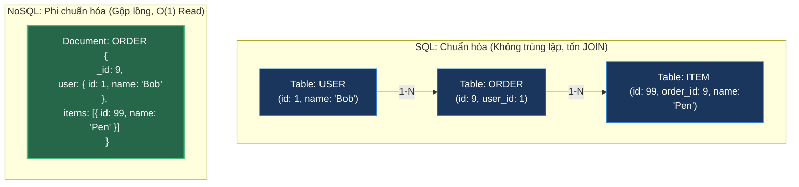

# Nghệ Thuật Thiết Kế Schema Trong NoSQL vs SQL: Quy Chuẩn Chuẩn Hóa vs Phi Chuẩn Hóa

## ⚡ Tóm tắt ngắn (30s)
Sự khác biệt cốt lõi trong tư duy thiết kế cơ sở dữ liệu giữa SQL và NoSQL được tóm tắt qua quy tắc vàng sau:
* **SQL (Relational Design - Normalization)**:
  * **Triết lý**: **Thiết kế hướng Dữ liệu (Data-driven / Storage-first)**.
  * **Quy chuẩn**: Áp dụng các quy tắc **Chuẩn hóa (1NF, 2NF, 3NF)** để chia nhỏ thực thể vào các bảng riêng biệt nhằm triệt tiêu hoàn toàn sự trùng lặp dữ liệu, tiết kiệm tối đa dung lượng ổ đĩa. Bạn thiết kế schema trước mà không cần quan tâm UI/UX sẽ hiển thị thế nào.
* **NoSQL (Non-relational Design - Denormalization)**:
  * **Triết lý**: **Thiết kế hướng Truy vấn (Query-driven / Access Pattern-first)**.
  * **Quy chuẩn**: Áp dụng **Phi chuẩn hóa (Denormalization)**. Bạn bắt buộc phải biết trước UI sẽ hiển thị câu query nào trước khi tạo bảng. Dữ liệu được lặp lại, sao chép và nhúng (embed) thẳng vào nhau để **triệt tiêu hoàn toàn phép toán JOIN**, tối ưu hóa tuyệt đối tốc độ Đọc.
  * **Quy tắc vàng**: *"Dữ liệu nào được đọc cùng nhau thì nên được lưu trữ cùng nhau"* (What is read together should be stored together).

---

## 🔍 Chi tiết bản chất kỹ thuật & Sự chuyển dịch tư duy

### 1. Sự lựa chọn chiến lược trong NoSQL: Embedding (Nhúng) vs Referencing (Tham chiếu)
Khi thiết kế quan hệ 1-Nhiều (1-to-Many) trong NoSQL (Ví dụ: Một Khách hàng có nhiều số Điện thoại), bạn có hai cách:
* **Embedding (Nhúng lồng - Khuyên dùng cho quan hệ cố định/nhỏ)**:
  * *Cách làm*: Lưu trực tiếp mảng điện thoại vào trong document Khách hàng: `phones: ['0912...', '0983...']`.
  * *Ưu điểm*: Đọc cực nhanh trong 1 câu lệnh bằng Single Key Lookup, không có overhead của mạng.
  * *Nhược điểm*: Kích thước Document phình to, dễ chạm ngưỡng giới hạn đĩa (MongoDB limit 16MB) nếu mảng phình to vô hạn.
* **Referencing (Tham chiếu - Bắt buộc cho quan hệ vô hạn)**:
  * *Cách làm*: Tách thành 2 collection: `users` và `orders`. Trong `orders` lưu trường `user_id`.
  * *Ưu điểm*: Tránh phồng tài liệu, dễ dàng phân trang (Pagination).
  * *Nhược điểm*: Khi cần đọc thông tin đơn hàng kèm tên user, ứng dụng phải chạy **2 câu lệnh truy vấn độc lập** rồi ghép dữ liệu ở tầng Application (Application-level JOIN).

### 2. Sự đánh đổi dung lượng đĩa (Storage is cheap, CPU/Time is expensive)
* Trong những năm 1970-1990, ổ cứng đĩa từ rất đắt đỏ. SQL ra đời với mục tiêu tối thượng là tiết kiệm từng byte đĩa bằng Normalization.
* Trong kỷ nguyên Cloud hiện nay, dung lượng ổ đĩa vô cùng rẻ, nhưng thời gian phản hồi (Latency) của người dùng và CPU của server lại cực kỳ đắt. NoSQL chấp nhận nhân bản dữ liệu ra nhiều nơi (tốn đĩa hơn) để đổi lấy tốc độ truy vấn tức thì (tiết kiệm CPU/mạng).

---

## 🎨 Sơ đồ Phép so sánh: Chuẩn hóa (SQL) vs Phi chuẩn hóa (NoSQL)



---

## 💻 Minh họa Thực chiến: Thiết kế Database cho bài toán Blog/Post

### Kịch bản UI
Trang chủ hiển thị danh sách 10 bài viết mới nhất. Với mỗi bài viết, hiển thị: *Tiêu đề + Tên tác giả + 3 bình luận mới nhất*.

### BAD ❌ (Thiết kế NoSQL kiểu SQL - Chuẩn hóa thái quá)
* **Vấn đề**: Bạn tạo 3 collection riêng biệt: `users`, `posts`, `comments`. Khi tải trang chủ, ứng dụng của bạn sẽ phải thực hiện **hàng chục câu lệnh gọi database liên tiếp** (N+1 Query) để lắp ghép dữ liệu. Hệ thống sẽ vô cùng chậm chạp và lag mạng.
```javascript
// ❌ 3 Collections riêng biệt:
// Collection: users {_id: 1, name: "Alice"}
// Collection: posts {_id: 101, title: "Learn Java", author_id: 1}
// Collection: comments {_id: 999, post_id: 101, text: "Great!", user_id: 2}

// ❌ App code phải chạy 3 câu query độc lập để ghép dữ liệu:
const posts = db.posts.find().sort({createdAt: -1}).limit(10);
for (let post of posts) {
   post.author = db.users.findOne({_id: post.author_id});
   post.latest_comments = db.comments.find({post_id: post._id}).limit(3);
}
```

### GOOD ✅ (Thiết kế NoSQL Phi chuẩn hóa - Tối ưu hóa cho truy vấn)
* **Giải pháp**: Nhúng trực tiếp thông tin tác giả (chỉ lấy trường tên) và mảng 3 bình luận mới nhất vào ngay bên trong document `post`.

**Dữ liệu Collection `posts` trong MongoDB:**
```json
{
  "_id": 101,
  "title": "Learn Java & Spring Boot",
  "author": {
    "id": 1,
    "name": "Alice"   // ✅ Nhúng tên tác giả vào (Không cần JOIN)
  },
  "latest_comments": [ // ✅ Nhúng sẵn 3 bình luận mới nhất
    { "text": "Very useful!", "user_name": "Bob" },
    { "text": "Awesome!", "user_name": "Charlie" }
  ],
  "comment_count": 45  // Lưu tổng số comment để phục vụ đếm nhanh
}
```

**Truy vấn lấy 10 bài viết hiển thị trang chủ:**
```javascript
// ✅ Chỉ duy nhất 1 câu lệnh đọc đĩa, phản hồi trong <2ms không tốn phép JOIN nào
db.posts.find().sort({ createdAt: -1 }).limit(10);
```

---

## 📊 Phân tích So sánh: Embedding vs Referencing

| Tiêu chí | Embedding (Nhúng lồng) | Referencing (Tham chiếu) |
| :--- | :--- | :--- |
| **Mối quan hệ** | 1-to-One, 1-to-Few (Cố định). | 1-to-Many (Vô hạn), Many-to-Many. |
| **Tần suất cập nhật** | Thấp (Dữ liệu con ít khi thay đổi độc lập). | Cao (Dữ liệu con biến động và cần quản lý riêng). |
| **Tốc độ ĐỌC (Read)** | **Tối đa** (Chỉ 1 câu lệnh lấy trọn gói). | Chậm hơn (Phải query nhiều lần hoặc dùng `$lookup`). |
| **Tốc độ GHI (Write)** | Chậm hơn (Nếu tài liệu phình to, hệ điều hành phải di chuyển vùng nhớ đĩa). | Nhanh hơn (Ghi độc lập vào các collection riêng biệt). |

---

## ⚠️ Common Gotchas (Câu hỏi phỏng vấn đào sâu)

### 1. "Trong ví dụ trên, nếu tác giả Alice đổi tên thành 'Alice Nguyen', chúng ta phải cập nhật tên mới này ở hàng nghìn bài viết cũ chứa bản sao tên cô ấy như thế nào để đảm bảo tính nhất quán dữ liệu?"
* **Trả lời**: Đây là câu hỏi kinh điển về việc xử lý **Tính nhất quán dữ liệu trong mô hình Phi chuẩn hóa (Denormalized Consistency)**:
  * **Giải pháp thực chiến (Asynchronous Event-Driven Update)**:
    1. **Quy tắc nghiệp vụ**: Tần suất người dùng đổi tên là **cực kỳ thấp** (ví dụ: vài năm 1 lần), trong khi tần suất người dùng đọc bài viết là **cực kỳ cao** (hàng triệu lần/ngày). Vì vậy, ta chấp nhận chịu phạt một chút hiệu năng lúc ghi để đổi lấy tốc độ đọc tối đa hằng ngày.
    2. **Cơ chế cập nhật**:
       * Khi Alice đổi tên, ứng dụng lưu tên mới vào collection `users` chính thành công.
       * Đồng thời, ứng dụng bắn một sự kiện `UserRenamedEvent` vào Kafka/RabbitMQ.
       * Một background worker sẽ lấy event ra và chạy lệnh cập nhật bất đồng bộ (Bulk Update) trên toàn bộ collection bài viết ở ngầm bên dưới:
         ```javascript
         db.posts.updateMany(
           { "author.id": 1 },
           { $set: { "author.name": "Alice Nguyen" } }
         );
         ```
       * *Kết quả*: Trong vòng vài giây chạy ngầm, toàn bộ bài viết sẽ hiển thị tên mới của Alice mà không làm gián đoạn hay ảnh hưởng tới luồng đọc trang chủ của người dùng.

### 2. "Làm thế nào để tránh lỗi sập bộ nhớ RAM khi thực hiện phép toán `$lookup` (tương đương JOIN) giữa các collection có kích thước hàng triệu dòng trong MongoDB?"
* **Trả lời**: 
  * Phép toán `$lookup` của MongoDB là một tác vụ cực kỳ nặng. Nó phải quét đĩa và so khớp dữ liệu ở tầng CPU của Database Server. Nếu không được cấu hình index chính xác, nó sẽ gây ra lỗi **Full Collection Scan** lập tức làm sập Database.
  * **Các nguyên tắc an toàn**:
    1. Bắt buộc phải tạo **Index** trên trường liên kết ở cả 2 collection (cả trường nguồn và trường đích của phép `$lookup`).
    2. Sử dụng các lệnh **`$match`** và **`$limit`** ở **ngay đầu của Pipeline Aggregation** để giảm thiểu tối đa số lượng dòng dữ liệu trước khi đẩy qua phép `$lookup` xử lý. Tuyệt đối không bao giờ được phép `$lookup` toàn bộ bảng rồi mới match/filter sau.
