# So sánh ArrayList và LinkedList trong Java hiện đại

## ⚡ Tóm tắt ngắn (30s)
* **`ArrayList`**: Triển khai bằng **mảng động (resizable array)**. Truy cập ngẫu nhiên cực nhanh $O(1)$. Thêm/xóa ở cuối nhanh $O(1)$ amortized, nhưng thêm/xóa ở giữa/đầu chậm $O(n)$ do phải dịch chuyển các phần tử kế tiếp. Tận dụng cực tốt **CPU Cache Locality** (do các phần tử nằm liên tiếp trong bộ nhớ).
* **`LinkedList`**: Triển khai bằng **danh sách liên kết kép (doubly-linked list)**. Truy cập ngẫu nhiên chậm $O(n)$ do phải duyệt tuần tự từ đầu hoặc cuối. Thêm/xóa tại vị trí bất kỳ nhanh $O(1)$ sau khi đã tìm thấy node. Gây tốn RAM hơn nhiều (overhead lưu trữ các con trỏ `prev`, `next` của mỗi Node) và dễ gây ra **CPU Cache Miss**.
* 👉 **Quy tắc vàng**: 99% trường hợp trong thực tế nên ưu tiên dùng `ArrayList`. Chỉ dùng `LinkedList` (hoặc tốt hơn là `ArrayDeque`) khi cần cấu trúc hàng đợi Queue/Deque hoạt động liên tục ở hai đầu.

---

## 🔍 Chi tiết bản chất

### 1. Cơ chế Resize của `ArrayList` và Stack vs Heap Allocation
* Khi khởi tạo mặc định `new ArrayList<>()`, mảng rỗng ban đầu được gán dung lượng mặc định là **10** ở lần thêm phần tử đầu tiên.
* Khi dung lượng mảng đầy, `ArrayList` tự động mở rộng bằng cách tạo một mảng mới có kích thước **gấp 1.5 lần** kích thước cũ:
  ```java
  int newCapacity = oldCapacity + (oldCapacity >> 1); // Dịch bit phải tương đương chia 2
  ```
* Toàn bộ dữ liệu cũ được sao chép sang mảng mới bằng phương thức tối ưu cấp hệ thống `System.arraycopy()` (gọi trực tiếp mã máy C++ JNI).
* Mảng cũ trên Heap không còn tham chiếu sẽ được Garbage Collector thu dọn ở chu kỳ tiếp theo.

### 2. Sự ảnh hưởng chí mạng của CPU Cache Locality
* Bộ nhớ RAM truy xuất khá chậm so với tốc độ xử lý của CPU. Để tăng tốc, CPU nạp các khối bộ nhớ liên tiếp vào **CPU L1/L2/L3 Cache (Cache Line)**.
* **ArrayList**: Do lưu trữ các tham chiếu đối tượng trong một mảng tuần tự liên tiếp nhau, khi CPU đọc phần tử thứ nhất, nó cũng nạp luôn phần tử tiếp theo vào cache. Việc duyệt mảng diễn ra mượt mà và cực nhanh.
* **LinkedList**: Các Node được cấp phát rải rác bất kỳ trên Heap. Khi duyệt qua các con trỏ `next`, CPU liên tục phải nhảy sang các vùng nhớ không liên tiếp, gây ra **Cache Miss** liên tục $\rightarrow$ CPU phải đợi RAM nạp dữ liệu mới, làm suy giảm hiệu năng thực tế từ 5 đến 50 lần so với `ArrayList` dù cùng độ phức tạp thuật toán.

---

## 🎨 Sơ đồ trực quan (Memory Layout Heap & Cache Line)

```mermaid
graph TD
    subgraph RAM_ArrayList["Bộ nhớ ArrayList (Tuần tự liên tiếp - Cache Friendly)"]
        A_Arr["[0] Ref 0x1"] --- B_Arr["[1] Ref 0x2"] --- C_Arr["[2] Ref 0x3"] --- D_Arr["[3] Ref 0x4"]
    end
    
    subgraph RAM_LinkedList["Bộ nhớ LinkedList (Phân tán rải rác - Cache Miss Hazard)"]
        Node1["Node 1 (0x100) <br> [Prev: null | Data | Next: 0x300]"]
        Node2["Node 2 (0x300) <br> [Prev: 0x100 | Data | Next: 0x200]"]
        Node3["Node 3 (0x200) <br> [Prev: 0x300 | Data | Next: null]"]
        Node1 -. Con trỏ .-> Node2
        Node2 -. Con trỏ .-> Node3
    end
    
    style RAM_ArrayList fill:#1a365d,stroke:#3182ce,stroke-width:2px
    style RAM_LinkedList fill:#2d3748,stroke:#ed8936,stroke-width:1px
```



---

## 💻 Code Example

### BAD ❌ (Sử dụng LinkedList để duyệt ngẫu nhiên bằng vòng lặp chỉ số)
```java
List<String> list = new LinkedList<>(largeDataset);

// ❌ Thuật toán biến thành O(N^2) cực kỳ tồi tệ!
// Với mỗi lần gọi get(i), LinkedList phải duyệt lại từ đầu/cuối danh sách tới i.
for (int i = 0; i < list.size(); i++) {
    String val = list.get(i); 
    System.out.println(val);
}
```

### GOOD ✅ (Dùng ArrayList tối ưu dung lượng và duyệt bằng Iterator/ForEach)
```java
// ✅ Khai báo trước dung lượng dự kiến để tránh việc resize mảng nhiều lần tốn CPU
List<String> list = new ArrayList<>(10000); 

// Thêm dữ liệu...
for (int i = 0; i < 10000; i++) {
    list.add("Item " + i); // O(1) amortized cực nhanh
}

// ✅ Duyệt bằng Iterator hoặc For-Each giúp tận dụng tối đa vtable và tuần tự vùng nhớ
for (String val : list) {
    System.out.println(val); // O(1) truy cập cho mỗi phần tử
}
```

---

## 📊 Trade-off Analysis

| Tiêu chí so sánh | ArrayList | LinkedList |
| :--- | :--- | :--- |
| **Cấu trúc bên dưới** | Mảng động vật lý (Object[]) | Danh sách liên kết kép (Node) |
| **Truy cập ngẫu nhiên (`get(i)`)** | **$O(1)$** (Cực nhanh) | **$O(n)$** (Phải duyệt qua từng Node) |
| **Thêm ở đầu (`add(0, e)`)** | **$O(n)$** (Phải dịch mảng sang phải) | **$O(1)$** (Chỉ thay đổi con trỏ đầu) |
| **Thêm ở cuối (`add(e)`)** | **$O(1)$** amortized (Đôi khi resize $O(n)$) | **$O(1)$** (Cực nhanh và ổn định) |
| **Phụ phí bộ nhớ (RAM Overhead)**| Thấp (Chỉ tốn dung lượng mảng trống dư thừa) | **Rất cao** (Mỗi Node tốn thêm 24-32 bytes cho 2 con trỏ) |
| **CPU Cache Locality** | **Cực tốt** | **Rất kém** (Liên tục gây ra Cache Miss) |

---

## ⚠️ Common Gotchas & Questions follow-up
1. **LinkedList thực sự có nhanh hơn ArrayList khi thêm/xóa phần tử ở giữa danh sách không?**
   * *Bản chất*: Trên lý thuyết, chèn vào danh sách liên kết là $O(1)$. Tuy nhiên, thực tế trước khi chèn bạn phải **tìm thấy** vị trí chèn, thao tác tìm kiếm này tốn $O(n)$ trong LinkedList. Trong khi đó, ArrayList chèn tốn $O(n)$ do dịch chuyển mảng, nhưng tìm vị trí chỉ tốn $O(1)$. Khi chạy benchmark thực tế, ArrayList hầu như luôn nhanh hơn LinkedList kể cả khi chèn/xóa ở giữa do chi phí copy mảng của CPU cực kỳ tối ưu và không bị cache miss.
2. **Làm sao để đồng bộ hóa ArrayList trong môi trường đa luồng?**
   * Không dùng các luồng đồng thời ghi trực tiếp vào ArrayList thông thường. Thay vào đó, hãy dùng `Collections.synchronizedList(new ArrayList<>(`)) hoặc sử dụng cấu trúc chuyên dụng `CopyOnWriteArrayList`.
3. 👉 **Câu hỏi đào sâu từ interviewer**: *Nếu bắt buộc cần một cấu trúc FIFO queue với tốc độ chèn/xóa hai đầu cực cao, thay thế LinkedList bạn sẽ dùng class nào?*
   * *(Trả lời: Sẽ sử dụng **`ArrayDeque`** (Array Double Ended Queue). Lớp này triển khai bằng mảng vòng (circular array) không có con trỏ liên kết, không gây rác bộ nhớ, tận dụng được CPU Cache và nhanh hơn LinkedList đáng kể trong việc làm stack hay queue).*