# Phân biệt chi tiết Comparable và Comparator trong Java

## ⚡ Tóm tắt ngắn (30s)
* **`Comparable`**: Định nghĩa **thứ tự sắp xếp mặc định (natural ordering)** của bản thân đối tượng. Được triển khai **bên trong (internal)** chính lớp của đối tượng cần so sánh. Cung cấp 1 phương thức duy nhất: `int compareTo(T o)`.
* **`Comparator`**: Định nghĩa **thứ tự sắp xếp tùy biến (custom ordering)**. Được triển khai ở một lớp **bên ngoài độc lập (external)** hoặc viết dưới dạng Lambda Expression. Cung cấp phương thức chính: `int compare(T o1, T o2)`. Giúp định nghĩa vô số tiêu chuẩn sắp xếp khác nhau cho cùng một lớp mà không cần sửa đổi mã nguồn của lớp đó.
* 👉 **Quy tắc vàng**: Dùng `Comparable` cho các giá trị tự nhiên có quy luật mặc định rõ ràng (Ngày tháng, Con số, Chuỗi ký tự). Dùng `Comparator` khi cần sắp xếp theo nhiều tiêu chí nghiệp vụ linh hoạt ở các tầng chức năng khác nhau (sắp xếp Product theo giá, theo ngày đăng, theo lượt mua...).

---

## 🔍 Chi tiết bản chất

### 1. Phân tích Cấu trúc & Vị trí cài đặt code
* **Comparable (java.lang.Comparable)**:
  * Khi triển khai, bạn thay đổi trực tiếp phần đầu khai báo của class: `public class Student implements Comparable<Student>`.
  * Chỉ so sánh đối tượng hiện tại (`this`) với đối tượng truyền vào (`o`).
* **Comparator (java.util.Comparator)**:
  * Hoạt động như một bên thứ ba đứng ra làm trọng tài chấm điểm. Class chính không cần biết đến sự tồn tại của Comparator này.
  * Hỗ trợ viết cực kỳ nhanh bằng Lambda từ Java 8+:
    ```java
    Comparator<Student> byAge = (s1, s2) -> Integer.compare(s1.getAge(), s2.getAge());
    ```

### 2. Sự Nguy Hiểm của Phép Trừ Trực Tiếp (Integer Overflow Hazard)
* Rất nhiều lập trình viên có thói quen viết hàm so sánh bằng cách lấy hiệu hai số nguyên:
  ```java
  public int compare(User o1, User o2) {
      return o1.getSalary() - o2.getSalary(); // ❌ NGUY HIỂM CHẾT NGƯỜI!
  }
  ```
* **Bản chất**: Nếu `o1.getSalary()` có giá trị dương cực lớn (ví dụ: `Integer.MAX_VALUE = 2147483647`) và `o2.getSalary()` có giá trị âm cực lớn (ví dụ: `-100`), phép trừ sẽ vượt quá giới hạn lưu trữ của kiểu `int` và xoay vòng về một số âm (**Integer Overflow**) $\rightarrow$ Kết quả so sánh bị đảo ngược hoàn toàn logic!
* **Giải pháp chuẩn**: Luôn sử dụng các phương thức tĩnh an toàn của lớp Wrapper: `Integer.compare(x, y)`, `Double.compare(x, y)`.

### 3. Sự ảo diệu của Fluent Comparator APIs (Java 8+)
* Giao diện `Comparator` từ Java 8 được bổ sung các default methods cực kỳ mạnh mẽ để kết nối nhiều tiêu chí sắp xếp tuần tự:
  ```java
  Comparator<Employee> complexSort = Comparator
      .comparing(Employee::getDepartment) // Tiêu chí 1
      .thenComparing(Employee::getSalary, Comparator.reverseOrder()) // Tiêu chí 2 (đảo ngược)
      .thenComparing(Employee::getName); // Tiêu chí 3
  ```
* Trình biên dịch sẽ tự động sinh mã bọc tuần tự, giúp code trông cực kỳ sạch đẹp, dễ đọc như văn nói và bảo đảm an toàn kiểm thử tuyệt đối.

---

## 🎨 Sơ đồ trực quan (Internal Sorter vs External Judge)

```mermaid
graph TD
    subgraph ComparablePath["1. Comparable (Sắp xếp nội bộ tự nhiên)"]
        ObjA["Đối tượng A"] -->|implements| Comparable["Comparable.compareTo(B)"]
        Comparable -->|Chạy logic nội tại| Res1["Kết quả lớn/nhỏ"]
    end

    subgraph ComparatorPath["2. Comparator (Trọng tài ngoài phân xử)"]
        ObjC["Đối tượng C"]
        ObjD["Đối tượng D"]
        Judge["Comparator.compare(C, D) <br> (Bộ so sánh độc lập bên ngoài)"]
        
        ObjC --> Judge
        ObjD --> Judge
        Judge -->|Phân xử khách quan| Res2["Kết quả lớn/nhỏ"]
    end
    
    style Comparable fill:#1a365d,stroke:#3182ce,stroke-width:2px
    style Judge fill:#2d3748,stroke:#ed8936,stroke-width:2px
```



---

## 💻 Code Example

### BAD ❌ (Viết phép trừ trực tiếp gây tràn số và sửa nát Class để đổi thứ tự sắp xếp)
```java
public class BadUser implements Comparable<BadUser> {
    private String name;
    private int score; // Có thể âm hoặc dương rất lớn

    public BadUser(String name, int score) { this.name = name; this.score = score; }

    @Override
    public int compareTo(BadUser o) {
        // ❌ Lỗi 1: Gây nguy cơ tràn số Integer Overflow cực lớn!
        // ❌ Lỗi 2: Bị bó cứng tiêu chí, không thể sắp xếp theo Tên ở màn hình khác
        return this.score - o.score; 
    }
}
```

### GOOD ✅ (Dùng Fluent API và Comparator an toàn tuyệt đối)
```java
public class GoodUser {
    private final String name;
    private final int score;

    public GoodUser(String name, int score) {
        this.name = name;
        this.score = score;
    }

    public String getName() { return name; }
    public int getScore() { return score; }

    // ✅ Định nghĩa các Comparator tĩnh dùng chung, an toàn tràn số
    public static final Comparator<GoodUser> BY_SCORE = 
        (u1, u2) -> Integer.compare(u1.getScore(), u2.getScore());

    public static final Comparator<GoodUser> BY_NAME = 
        (u1, u2) -> u1.getName().compareTo(u2.getName());

    public static final Comparator<GoodUser> COMPLEX_SORT = 
        Comparator.comparing(GoodUser::getScore)
                  .thenComparing(GoodUser::getName);
}
```

---

## 📊 Trade-off Analysis

| Tiêu chí | Comparable | Comparator |
| :--- | :--- | :--- |
| **Vị trí cài đặt** | **Bên trong** chính lớp của đối tượng. | **Bên ngoài** độc lập, hoặc viết dạng inline Lambda. |
| **Số lượng tiêu chí** | **Duy nhất 1** thứ tự mặc định cho lớp. | **Vô số** tiêu chí tùy biến theo yêu cầu nghiệp vụ. |
| **Khả năng sửa mã nguồn**| Bắt buộc phải sửa mã nguồn của lớp. | Không cần can thiệp mã nguồn gốc (rất tốt khi dùng lib ngoài). |
| **Cách gọi sử dụng** | `Collections.sort(list)` | `Collections.sort(list, comparator)` |
| **Tính đóng gói (OOP)** | Gắn chặt vào thực thể đối tượng. | Đạt tính thiết kế lỏng (Loose Coupling) cực cao. |

---

## ⚠️ Common Gotchas & Questions follow-up
1. **Tại sao khi gọi `Arrays.sort()` hoặc `Collections.sort()` trên mảng đối tượng custom lại bị sập app?**
   * *Bản chất*: Do mảng đối tượng đó không triển khai `Comparable` và bạn không truyền thêm `Comparator` ngoài nào. JVM không biết làm sao để xếp hạng lớn bé cho đối tượng của bạn nên ném ngoại lệ `ClassCastException`.
2. **Làm sao để sắp xếp danh sách chứa các phần tử có giá trị `null` bằng Comparator mà không bị NullPointerException?**
   * *Bản chất*: Hãy sử dụng các phương thức bọc an toàn null-safe của `Comparator` từ Java 8:
     ```java
     // Đẩy tất cả các phần tử null xuống cuối danh sách
     Comparator<GoodUser> nullSafe = Comparator.nullsLast(GoodUser.BY_SCORE);
     ```
3. 👉 **Câu hỏi đào sâu từ interviewer**: *Sắp xếp bằng `Comparable` hay `Comparator` sẽ nhanh hơn về mặt hiệu năng thực thi của máy ảo JVM?*
   * *(Trả lời: **Ngang nhau**. Về mặt thuật toán bên dưới (JVM sử dụng thuật toán **Timsort** từ Java 7), cả hai đều chỉ thực hiện so sánh thông qua việc gọi phương thức bytecode `invokeinterface` hoặc `invokevirtual`. Chi phí thực thi là tương đương. Điểm khác biệt duy nhất chỉ là tính sạch sẽ của code và tư duy thiết kế hệ thống mềm dẻo).*