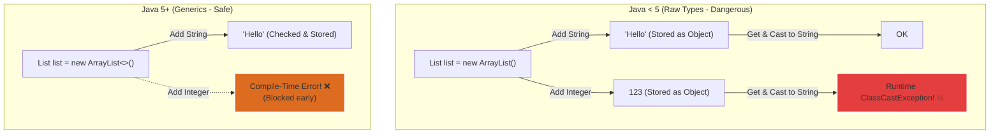

# Generics trong Java và cơ chế Bảo đảm An toàn Kiểu dữ liệu

## ⚡ Tóm tắt ngắn (30s)
* **Generics** (từ Java 5) cho phép **tham số hóa kiểu dữ liệu** (Parameterized types) cho class, interface và method.
* Mang lại hai lợi ích lớn nhất: **Bảo đảm an toàn kiểu ở compile-time (Compile-time Type Safety)** và loại bỏ hoàn toàn các lỗi ép kiểu thủ công (`ClassCastException`) ở runtime.
* Giúp viết mã nguồn có tính **tái sử dụng cao (Reusability)** mà không mất đi khả năng kiểm soát kiểu nghiêm ngặt của trình biên dịch.

---

## 🔍 Chi tiết bản chất

### 1. Bối cảnh lịch sử và Sự ra đời
* **Trước Java 5 (Raw Types)**: Các cấu trúc dữ liệu collection như `ArrayList` chỉ lưu trữ kiểu `Object`. Do đó, bạn có thể nhét bất kỳ đối tượng nào (`String`, `Integer`, `Customer`...) vào cùng một danh sách. Khi lấy phần tử ra, bạn bắt buộc phải ép kiểu thủ công (Explicit Casting). Nếu vô tình ép sai kiểu, chương trình sẽ ném ra ngoại lệ `ClassCastException` và sập ứng dụng tại **runtime**.
* **Java 5 trở đi (Generics)**: Trình biên dịch sẽ thực hiện kiểm tra an toàn kiểu dữ liệu ngay tại thời điểm biên dịch (**compile-time**). Nếu bạn cố tình thêm một phần tử không tương thích kiểu, trình biên dịch sẽ chặn lại và báo lỗi ngay lập tức.

### 2. Hạn chế với Kiểu nguyên thủy (Primitive Types)
* Generics **chỉ hoạt động với kiểu đối tượng tham chiếu (Reference Types)**, không hoạt động với kiểu nguyên thủy (`int`, `double`, `char`...). 
* Bản chất là do sau khi xóa kiểu (Type Erasure), tất cả các tham số kiểu generic được đưa về `Object`, và kiểu nguyên thủy không thể kế thừa hoặc tương thích với `Object`. Do đó ta bắt buộc phải sử dụng các lớp Wrapper tương ứng (`Integer`, `Double`, `Character`...), điều này gây ra một khoản overhead nhỏ về mặt bộ nhớ và CPU do cơ chế **Autoboxing/Unboxing**.

---

## 🎨 Sơ đồ So sánh Cơ chế Kiểm soát Kiểu (Raw vs Generics)



---

## 💻 Code Example

### BAD ❌ (Dùng Raw Type cổ điển không an toàn)
```java
// Không chỉ định kiểu generic (Raw Type)
List list = new ArrayList();
list.add("Java Core");
list.add(2026); // Chương trình vẫn biên dịch mượt mà!

for (Object obj : list) {
    // 💥 Nổ lỗi ClassCastException ở runtime khi vòng lặp duyệt đến số 2026!
    String str = (String) obj; 
    System.out.println(str.toUpperCase());
}
```

### GOOD ✅ (Sử dụng Generics an toàn kiểm duyệt compile)
```java
// Chỉ định kiểu dữ liệu rõ ràng qua Generics
List<String> list = new ArrayList<>();
list.add("Java Core");
// list.add(2026); // ❌ Trình biên dịch báo lỗi đỏ ngay tại IDE, ngăn chặn bug phát sinh!

for (String str : list) {
    // ✅ Không cần ép kiểu thủ công, an toàn tuyệt đối 100%
    System.out.println(str.toUpperCase()); 
}
```

---

## 📊 Trade-off Analysis

| Tiêu chí | Sử dụng Raw Types (Java < 5) | Sử dụng Generics (Java 5+) |
| :--- | :--- | :--- |
| **Type Safety** | Không an toàn, dễ gây sập app ở runtime. | **An toàn tuyệt đối** ngay từ compile-time. |
| **Độ sạch của Code**| Rườm rà do phải ép kiểu thủ công ở khắp mọi nơi. | Sạch sẽ, tường minh, tự động cast ngầm định. |
| **Overhead Bộ nhớ**| Thấp (Không có chi phí của wrapper classes). | Có thể tăng nhẹ nếu lạm dụng Wrapper Classes do Autoboxing. |
| **Tính tương thích**| Linh hoạt tối đa cho mọi kiểu dữ liệu. | Ràng buộc kiểu chặt chẽ, tăng khả năng tái sử dụng. |

---

## ⚠️ Common Gotchas & Questions follow-up
1. **Tại sao không thể khởi tạo thực thể của Generic Type trực tiếp (`new T()` hoặc `new T[10]`)?**
   * *Bản chất*: Do cơ chế xóa kiểu (Type Erasure) của Java, tại runtime JVM hoàn toàn không biết `T` thực sự là lớp nào để cấp phát vùng nhớ trên Heap. Muốn tạo đối tượng, ta bắt buộc phải dùng kỹ thuật Reflection và truyền Class token vào.
2. **Có thể dùng kiểu Generic trong thuộc tính static (static field) của class không?**
   * *Bản chất*: **Tuyệt đối không**. Vì thuộc tính static được chia sẻ chung cho tất cả các đối tượng của class đó, trong khi kiểu generic được xác định riêng biệt cho từng instance khi khởi tạo (`new MyClass<String>()` vs `new MyClass<Integer>()`).
3. 👉 **Câu hỏi đào sâu từ interviewer**: *Làm sao để thiết kế một Generic Method tự động suy luận kiểu dữ liệu truyền vào mà không cần khai báo kiểu ở mức Class?*
   * *(Trả lời: Ta khai báo tham số kiểu generic ngay trước kiểu trả về của phương thức. Ví dụ: `public static <E> void printArray(E[] elements)`. Lúc này, kiểu `E` sẽ chỉ có phạm vi sử dụng cục bộ bên trong phương thức đó).*