# Cơ chế Type Erasure (Xóa bỏ kiểu) trong Java Generics

## ⚡ Tóm tắt ngắn (30s)
* **Type Erasure** là cơ chế của compiler Java nhằm **xóa bỏ hoàn toàn các thông tin về kiểu generic** (`T`, `E`, `K`...) khi dịch mã nguồn thành bytecode.
* Mục đích sống còn: Bảo đảm tính **tương thích ngược (Backward Compatibility)** với các phiên bản JVM cũ (< Java 5) không hỗ trợ Generics.
* Tại bytecode, các tham số generic sẽ được thay thế bằng lớp chặn trên tương ứng (thường là **`Object`** hoặc kiểu bound cụ thể như `Number`), và compiler tự động chèn các lệnh ép kiểu ẩn tại nơi lấy dữ liệu ra.

---

## 🔍 Chi tiết bản chất

### 1. Cách thức hoạt động của Compiler
Khi biên dịch mã nguồn, compiler thực hiện 3 bước xóa kiểu:
* Thay thế tất cả các tham số kiểu generic bằng kiểu chặn trên của chúng (Bounds). Nếu không khai báo bound cụ thể, mặc định sẽ là `java.lang.Object`.
  * `List<T>` $\rightarrow$ Biên dịch thành `List` (Raw type) chứa `Object`.
  * `List<? extends Number>` $\rightarrow$ Biên dịch thành `List` chứa `Number`.
* Tự động chèn các mã lệnh ép kiểu (`checkcast` trong bytecode) tại những nơi truy xuất dữ liệu từ collection để đảm bảo an toàn kiểu.
* Tự động sinh ra các **Bridge Methods** (Phương thức cầu nối) trong các lớp con kế thừa để bảo toàn tính chất đa hình (Polymorphism) khi kế thừa các class generic.

### 2. Hệ quả trực tiếp đối với Lập trình viên
Do thông tin kiểu bị xóa sạch khi ứng dụng chạy (runtime), ta gặp những hạn chế sau:
* Không thể dùng `instanceof` với generic cụ thể (ví dụ: `list instanceof ArrayList<String>` là lỗi compile, chỉ được phép check `list instanceof ArrayList<?> `).
* Không thể dùng toán tử new (`new T()`, `new T[10]`).
* Không thể lấy trực tiếp Class token (`T.class` là bất hợp pháp).
* Không thể khai báo mảng của kiểu generic (`List<String>[]` là lỗi biên dịch).

---

## 🎨 Sơ đồ Tiến trình Biên dịch & Xóa kiểu (Type Erasure)

```mermaid
graph LR
    Src["Mã nguồn Java <br> List<String> list = new ArrayList<>() <br> list.add('Hello') <br> String s = list.get(0)"] -->|Biên dịch| Comp["Trình biên dịch (Compiler) <br> Kiểm tra an toàn kiểu"]
    Comp -->|Xóa kiểu Generics| Byte["Bytecode JVM <br> List list = new ArrayList() <br> list.add('Hello') <br> String s = (String) list.get(0)"]
    
    style Comp fill:#1a365d,stroke:#3182ce,stroke-width:2px
```



---

## 💻 Code Example

### BAD ❌ (Cố tình overloading trùng signature sau khi xóa kiểu gây lỗi compile)
```java
public class Printer {
    // ❌ LỖI BIÊN DỊCH: Trình biên dịch báo lỗi trùng tên phương thức!
    // Vì sau khi Type Erasure, cả hai phương thức đều bị xóa kiểu thành:
    // public void print(List list)
    
    public void print(List<String> list) {
        System.out.println("Printing Strings");
    }

    public void print(List<Integer> list) {
        System.out.println("Printing Integers");
    }
}
```

### GOOD ✅ (Đặt tên phương thức khác nhau hoặc thay đổi cấu trúc tham số)
```java
public class Printer {
    // ✅ Biên dịch mượt mà, độc lập Signature ở tầng Bytecode
    public void printStrings(List<String> list) {
        System.out.println("Printing Strings");
    }

    public void printIntegers(List<Integer> list) {
        System.out.println("Printing Integers");
    }
}
```

---

## 📊 Trade-off Analysis

| Tiêu chí | Cơ chế Type Erasure (Java) | Cơ chế Reification (C# / C++ Templates) |
| :--- | :--- | :--- |
| **Tương thích ngược** | **Tuyệt vời**. Code Java 5+ chạy mượt mà trên các JVM cũ mà không cần chỉnh sửa runtime. | Kém. Đòi hỏi thay đổi cấu trúc của máy ảo (CLR) để lưu trữ kiểu dữ liệu thực tế. |
| **Dung lượng File** | Cực kỳ tiết kiệm. Chỉ sinh ra 1 file class chung duy nhất cho mọi kiểu generic. | Tăng cao (Code Bloat). Compiler tự động nhân bản class mới cho mỗi kiểu dữ liệu cụ thể. |
| **Thông tin Runtime** | Bị mất hoàn toàn. Không thể check kiểu cụ thể hoặc khởi tạo động tại runtime. | Giữ nguyên 100%. Cho phép khởi tạo động `new T()` và kiểm soát kiểu runtime tuyệt đối. |

---

## ⚠️ Common Gotchas & Questions follow-up
1. **Làm sao để kiểm tra kiểu của đối tượng generic an toàn tại runtime?**
   * *Bản chất*: Hãy truyền một đối tượng Class token (`Class<T>`) vào constructor của lớp đó để lưu giữ thông tin kiểu dữ liệu:
     ```java
     public class Checker<T> {
         private final Class<T> type;
         public Checker(Class<T> type) { this.type = type; }
         public boolean check(Object obj) { return type.isInstance(obj); }
     }
     ```
2. **Lỗi ClassCastException ngầm định phát sinh do Type Erasure**:
   * Nếu ta sử dụng ép kiểu thô (Raw type cast) hoặc thư viện JSON deserialize không chuẩn, chương trình có thể biên dịch thành công nhưng nổ lỗi `ClassCastException` tại dòng code hoàn toàn bình thường khi cố lấy phần tử ra, do lệnh cast ngầm định của compiler bị lỗi.
3. 👉 **Câu hỏi đào sâu từ interviewer**: *Bridge Method là gì và tại sao compiler lại tự sinh ra nó?*
   * *(Trả lời: Khi một lớp kế thừa từ một lớp generic và định nghĩa cụ thể kiểu dữ liệu (ví dụ: `class MyList implements List<String>`), để đảm bảo tính đa hình cho các phương thức có signature thay đổi sau khi xóa kiểu (như `add(Object)` của List và `add(String)` của MyList), compiler sẽ tự tạo ra phương thức cầu nối `add(Object)` gọi trực tiếp đến `add(String)` ở background).*