# Phân biệt chi tiết List<?>, List<Object>, List<? extends Number> và List<? super Integer>

## ⚡ Tóm tắt ngắn (30s)
* **`List<Object>`**: Danh sách chứa bất kỳ đối tượng nào. Có tính **Bất biến kiểu (Invariant)** $\rightarrow$ Chỉ chấp nhận gán chính xác `List<Object>`, tuyệt đối không nhận `List<String>` hay `List<Integer>`. Hỗ trợ cả Đọc và Ghi.
* **`List<?>`**: Unbounded Wildcard, danh sách của một kiểu hoàn toàn không xác định. Có thể gán bởi bất kỳ danh sách nào. Tuy nhiên, **chỉ cho phép Đọc** ra kiểu `Object`, **không cho phép Ghi** (ngoại trừ giá trị `null`).
* **`List<? extends Number>`**: Upper Bounded Wildcard (Covariant). Danh sách chứa `Number` hoặc các lớp con của `Number`. **Chỉ Đọc (Read-only)** kiểu `Number`, cấm ghi (ngoài `null`).
* **`List<? super Integer>`**: Lower Bounded Wildcard (Contravariant). Danh sách chứa `Integer` hoặc các lớp cha của nó. **Chỉ Ghi (Write-only)** kiểu `Integer`, khi đọc ra chỉ nhận được kiểu tối cao `Object`.

---

## 🔍 Chi tiết bản chất

### 1. Tính Bất biến kiểu (Invariance) của Collection
* Trong lập trình hướng đối tượng thông thường, `Integer` là con của `Number`. Tuy nhiên, `List<Integer>` **hoàn toàn không** phải là con của `List<Number>`.
* Nếu Java cho phép gán `List<Integer>` cho `List<Number>`, ta có thể thông qua con trỏ `List<Number>` chèn một số thực `3.14 (Double)` vào danh sách số nguyên, phá nát tính toàn vẹn và an toàn kiểu của Generics. Vì vậy, mặc định Generics là **Invariant**.

### 2. Sự cần thiết của Wildcards (`?`)
Để mang lại tính linh hoạt cho API, Java giới thiệu các ký tự đại diện Wildcards:
* **Covariance (`? extends T` - Upper Bound)**: Thiết lập quan hệ cha con cho danh sách. Giúp hàm nhận đầu vào là `List<Integer>`, `List<Double>` cho tham số dạng `List<? extends Number>`. Để đảm bảo an toàn kiểu, compiler cấm ghi vì nó không biết danh sách thực tế bên dưới là kiểu cụ thể nào (có thể là `List<Double>`, nếu cho phép thêm `Integer` sẽ gây lỗi dữ liệu).
* **Contravariance (`? super T` - Lower Bound)**: Ngược lại với extends, cho phép chèn phần tử kiểu `T` hoặc con của `T` vào danh sách chứa các lớp cha của `T`.

---

## 🎨 Sơ đồ Phân cấp Lớp và Giới hạn Chặn (Wildcard Bounds)

```mermaid
graph TD
    Object["Object"]
    Number["Number"]
    Integer["Integer"]
    Double["Double"]

    Object --> Number
    Number --> Integer
    Number --> Double

    subgraph UpperBound["? extends Number (Upper Bound - Read Only)"]
        Number
        Integer
        Double
    end

    subgraph LowerBound["? super Integer (Lower Bound - Write Only)"]
        Object
        Number
        Integer
    end

    style UpperBound fill:#1a365d,stroke:#3182ce,stroke-width:2px
    style LowerBound fill:#2d3748,stroke:#ed8936,stroke-width:2px
```



---

## 💻 Code Example

### BAD ❌ (Thiết kế API cứng nhắc không thể linh hoạt nhận danh sách lớp con)
```java
public class Calculator {
    // API sử dụng kiểu invariant cứng nhắc
    public static double sum(List<Number> list) { // Chỉ nhận đúng List<Number>
        double total = 0.0;
        for (Number n : list) total += n.doubleValue();
        return total;
    }
}

// Sử dụng bên ngoài:
List<Integer> ints = List.of(1, 2, 3);
// double result = Calculator.sum(ints); // ❌ LỖI BIÊN DỊCH! Dù Integer kế thừa từ Number
```

### GOOD ✅ (Áp dụng Wildcard linh hoạt theo đúng thiết kế)
```java
public class Calculator {
    // ✅ API covariant mềm dẻo: nhận mọi List chứa lớp con của Number
    public static double sum(List<? extends Number> list) { 
        double total = 0.0;
        for (Number n : list) { // Đọc ra an toàn kiểu Number
            total += n.doubleValue();
        }
        return total;
    }
}

// Sử dụng bên ngoài:
List<Integer> ints = List.of(1, 2, 3);
double result = Calculator.sum(ints); // ✅ Biên dịch hoàn hảo! Tái sử dụng cực cao.
```

---

## 📊 Trade-off Analysis

| Kiểu Khai báo | Thao tác Đọc (Read) | Thao tác Ghi (Write) | Khả năng Gán (Assignability) |
| :--- | :--- | :--- | :--- |
| **`List<Object>`** | Có, trả về `Object` | Có, ghi được mọi đối tượng | Chỉ gán được chính xác `List<Object>` |
| **`List<?>`** | Có, trả về `Object` | **Cấm** (Chỉ cho phép ghi `null`) | Nhận mọi loại `List<T>` |
| **`List<? extends T>`**| Có, trả về kiểu `T` | **Cấm** (Chỉ cho phép ghi `null`) | Nhận `List<T>` hoặc các con của `T` |
| **`List<? super T>`** | Có, chỉ trả về `Object` | Có, chèn được `T` hoặc con của `T` | Nhận `List<T>` hoặc các cha của `T` |

---

## ⚠️ Common Gotchas & Questions follow-up
1. **Tại sao không thể thêm phần tử vào `List<? extends T>`?**
   * *Bản chất*: Trình biên dịch chỉ biết danh sách chứa "một kiểu con của T", nhưng không biết chính xác là kiểu cụ thể nào (ví dụ có thể là `List<Dog>` hoặc `List<Cat>`). Nếu cho phép thêm đối tượng `T` chung chung, ta có thể vô tình thêm một con `Cat` vào `List<Dog>` $\rightarrow$ Phá vỡ an toàn kiểu dữ liệu. Do đó compiler cấm tuyệt đối mọi thao tác chèn.
2. 👉 **Câu hỏi đào sâu từ interviewer**: *Sự khác nhau giữa `List` (Raw Type) và `List<?>` (Unbounded Wildcard)?*
   * *(Trả lời: `List` là Raw Type hoàn toàn tắt tính năng kiểm duyệt của Generics, cho phép chèn bất kỳ đối tượng nào và cực kỳ không an toàn. Ngược lại, `List<?>` là kiểu Generic an toàn, nó đại diện cho một danh sách của một kiểu cụ thể nhưng chưa biết, compiler cấm chèn mọi phần tử để đảm bảo an toàn).*