# Nguyên lý PECS (Producer Extends, Consumer Super) trong Java Generics

## ⚡ Tóm tắt ngắn (30s)
* **PECS** viết tắt của **Producer Extends, Consumer Super**. Đây là quy tắc vàng thiết kế Generic Wildcards từ cuốn sách huyền thoại *Effective Java* của Joshua Bloch.
* **Producer Extends (`? extends T`)**: Dùng khi cấu trúc dữ liệu đóng vai trò **cung cấp dữ liệu** (chỉ đọc ra phần tử để sử dụng).
* **Consumer Super (`? super T`)**: Dùng khi cấu trúc dữ liệu đóng vai trò **tiêu thụ dữ liệu** (chỉ chèn phần tử mới vào).
* 👉 **Quy tắc bỏ túi**: *Lấy dữ liệu ra dùng `extends`, đút dữ liệu vào dùng `super`*.

---

## 🔍 Chi tiết bản chất

### 1. Phân tích Dòng chảy dữ liệu (Data Flow)
* **Producer (Extends)**: Khi bạn gọi phương thức lấy dữ liệu ra khỏi Collection, ví dụ `T item = list.get(i)`. Khai báo `List<? extends T>` đảm bảo mọi phần tử lấy ra chắc chắn là kiểu `T` hoặc lớp con của `T`, giúp ta upcast an toàn về lớp cha `T`.
* **Consumer (Super)**: Khi bạn đẩy dữ liệu vào Collection, ví dụ `list.add(itemOfT)`. Khai báo `List<? super T>` đảm bảo collection đó có kiểu cha của `T`, do đó nó hoàn toàn có khả năng chứa đối tượng kiểu `T` một cách an toàn mà không sợ sai lệch kiểu.

### 2. Tối đa hóa khả năng tương thích của API
* Nếu thiết kế API không tuân thủ PECS, khách hàng sử dụng thư viện sẽ gặp tình trạng bị chặn đứng bởi compiler mặc dù về mặt logic hướng đối tượng, kiểu dữ liệu truyền vào hoàn toàn tương thích và an toàn.

---

## 🎨 Sơ đồ luồng dữ liệu theo nguyên lý PECS

```mermaid
graph LR
    subgraph Producer["1. PRODUCER (Extends - Read Only)"]
        Src["List<? extends T> src"] -->|Read / Get| Out["T value"]
    end

    subgraph Consumer["2. CONSUMER (Super - Write Only)"]
        In["T item"] -->|Write / Add| Dest["List<? super T> dest"]
    end

    style Src fill:#1a365d,stroke:#3182ce,stroke-width:2px
    style Dest fill:#2d3748,stroke:#ed8936,stroke-width:2px
```



---

## 💻 Code Example

### BAD ❌ (Viết hàm copy cứng nhắc không áp dụng PECS)
```java
public class CollectionUtils {
    // ❌ Cực kỳ hạn chế: Chỉ có thể copy giữa 2 danh sách trùng khít 100% kiểu dữ liệu
    public static <T> void copy(List<T> dest, List<T> src) {
        for (T item : src) {
            dest.add(item);
        }
    }
}

// Sử dụng thực tế:
List<Number> numList = new ArrayList<>();
List<Integer> intList = List.of(1, 2, 3);
// CollectionUtils.copy(numList, intList); // ❌ LỖI BIÊN DỊCH! Dù Integer là con Number
```

### GOOD ✅ (Áp dụng hoàn hảo nguyên lý PECS nâng cao tính tái sử dụng)
```java
public class CollectionUtils {
    // ✅ Cực kỳ linh hoạt: src sản xuất dữ liệu (extends), dest tiêu thụ dữ liệu (super)
    public static <T> void copy(List<? super T> dest, List<? extends T> src) {
        for (T item : src) { // src cung cấp dữ liệu kiểu T
            dest.add(item);  // dest nhận dữ liệu kiểu T
        }
    }
}

// Sử dụng thực tế:
List<Number> numList = new ArrayList<>();
List<Integer> intList = List.of(1, 2, 3);
CollectionUtils.copy(numList, intList); // ✅ Biên dịch hoàn hảo! Tự động upcast Integer thành Number.
```

---

## 📊 Trade-off Analysis

| Tiêu chí | API cứng nhắc (Không dùng PECS) | API linh hoạt (Áp dụng PECS) |
| :--- | :--- | :--- |
| **Độ linh hoạt của API** | Rất thấp. Giới hạn nghiêm ngặt kiểu dữ liệu truyền vào. | **Cực kỳ cao**. Chấp nhận linh hoạt các cấu trúc kế thừa lớp cha/con. |
| **Độ phức tạp cú pháp**| Đơn giản, dễ đọc cho người mới bắt đầu. | Phức tạp hơn, cần hiểu sâu cơ chế covariance/contravariance. |
| **An toàn kiểu dữ liệu**| An toàn tuyệt đối. | **An toàn tuyệt đối 100%** (Compiler giám sát hoàn hảo). |

---

## ⚠️ Common Gotchas & Questions follow-up
1. **Có bao giờ sử dụng cả `extends` và `super` trên cùng một tham số không?**
   * *Bản chất*: **Không**. Nếu bạn vừa cần đọc dữ liệu từ một danh sách vừa cần ghi dữ liệu vào chính danh sách đó, bạn không được dùng wildcards. Hãy sử dụng kiểu generic cụ thể, rõ ràng (ví dụ: `List<T>`).
2. 👉 **Câu hỏi đào sâu từ interviewer**: *Có nên sử dụng PECS cho kiểu trả về (Return Type) của một phương thức không?*
   * *(Trả lời: **Không nên**. Kiểu trả về của một API public nên là kiểu cụ thể nhất có thể để người dùng dễ dàng khai báo và gọi phương thức mà không bị ép buộc phải sử dụng wildcards ở phía nhận dữ liệu).*