# Cơ chế hoạt động của Fail-Fast Iterator trong Java

## ⚡ Tóm tắt ngắn (30s)
* **Fail-Fast Iterator** là cơ chế thiết kế phát hiện lỗi sớm của các cấu trúc dữ liệu không đồng bộ (`ArrayList`, `HashMap`, `HashSet`...).
* Nếu có bất kỳ sự thay đổi cấu trúc nào (Structural Modification - thêm, xóa phần tử) trực tiếp trên Collection trong khi Iterator đang duyệt, Iterator sẽ lập tức ném ra ngoại lệ **`ConcurrentModificationException`**.
* Giúp ngăn chặn việc duyệt qua dữ liệu đã bị thay đổi không kiểm soát, tránh các lỗi logic nghiêm trọng hoặc dữ liệu không nhất quán.

---

<h2>🔍 Chi tiết bản chất</h2>

### 1. Cơ chế hoạt động dựa trên `modCount`
Các lớp Collection của Java duy trì một thuộc tính nội bộ gọi là **`modCount`** (Modification Count). Mỗi khi bạn gọi các hàm làm thay đổi kích thước danh sách như `add()`, `remove()`, `clear()`... biến `modCount` sẽ tự động tăng lên 1.

Khi bạn khởi tạo một Iterator:
* Iterator ghi nhớ giá trị `modCount` lúc đó vào một biến nội bộ gọi là **`expectedModCount`**.
* Trên mỗi thao tác duyệt (`next()`, `remove()`), Iterator thực hiện so sánh:
  ```java
  if (modCount != expectedModCount) {
      throw new ConcurrentModificationException();
  }
  ```
* Nếu phát hiện có sự lệch nhau (nghĩa là có luồng khác, hoặc chính luồng đó gọi hàm sửa đổi trực tiếp của Collection thay vì gọi qua Iterator), nó lập tức tung ra exception để dừng chương trình ngay tại chỗ.

---

## 🎨 Sơ đồ luồng hoạt động của Fail-Fast Iterator

```mermaid
graph TD
    A["Khởi tạo Iterator <br> expectedModCount = modCount = 5"] --> B["Vòng lặp loop"]
    B --> C{"Gọi next()"}
    C --> D{"Kiểm tra modCount == expectedModCount?"}
    D -- Yes (Không đổi) --> E["Trả về phần tử, tiếp tục loop"]
    D -- No (Bị thay đổi ngoài) --> F["💥 Ném ConcurrentModificationException"]
    
    style D fill:#2d3748,stroke:#ed8936,stroke-width:2px
    style F fill:#e53e3e,stroke:#fff,stroke-width:2px
```



---

## 💻 Code Example

### BAD ❌ (Sửa đổi trực tiếp Collection trong vòng lặp gây sập app)
```java
List<String> list = new ArrayList<>(List.of("A", "B", "C"));

for (String item : list) { // Dưới background sử dụng Iterator để duyệt
    if ("B".equals(item)) {
        list.remove(item); // ❌ SAI LẦM! Gọi trực tiếp hàm xóa của list làm modCount tăng
    }
}
// 💥 Sập app ném ra ConcurrentModificationException tại vòng lặp tiếp theo!
```

### GOOD ✅ (Dùng phương thức remove của chính Iterator hoặc removeIf)
```java
List<String> list = new ArrayList<>(List.of("A", "B", "C"));

// Cách 1: Sử dụng Iterator rõ ràng
Iterator<String> it = list.iterator();
while (it.hasNext()) {
    String item = it.next();
    if ("B".equals(item)) {
        it.remove(); // ✅ ĐÚNG! Phương thức này tự động đồng bộ expectedModCount = modCount
    }
}

// Cách 2: Sử dụng lambda từ Java 8+ (Cực kỳ khuyên dùng)
list.removeIf("B"::equals); // ✅ An toàn, ngắn gọn, hiệu năng tối ưu
```

---

## 📊 Trade-off Analysis

| Tiêu chí | Fail-Fast Iterators | Fail-Safe / Weakly-Consistent Iterators |
| :--- | :--- | :--- |
| **Cơ chế** | Duyệt trực tiếp trên bộ nhớ gốc, so sánh `modCount`. | Duyệt trên một **bản sao (Snapshot)** riêng biệt của Collection. |
| **Tốc độ duyệt** | **Cực kỳ nhanh** ($O(1)$ cho mỗi phần tử). | Chậm hơn một chút (tốn chi phí duy trì bản sao). |
| **Overhead Bộ nhớ**| Không tốn thêm bộ nhớ. | Tốn nhiều bộ nhớ hơn (đặc biệt là `CopyOnWriteArrayList`). |
| **ConcurrentException**| **Có thể xảy ra** bất cứ lúc nào nếu có thay đổi. | **Không bao giờ xảy ra** ngoại lệ. |

---

## ⚠️ Common Gotchas & Questions follow-up
1. **Lỗi ngộ nhận về Đa luồng**:
   Nhiều lập trình viên nghĩ rằng `ConcurrentModificationException` chỉ xảy ra khi có nhiều Thread cùng truy cập. Thực tế, lỗi này xảy ra **ngay trên một Thread duy nhất** nếu bạn cố tình sửa đổi Collection khi đang loop qua nó như ví dụ BAD ở trên.
2. 👉 **Câu hỏi đào sâu từ interviewer**: *Làm sao để vừa duyệt qua danh sách vừa có thể chèn thêm phần tử mới ở giữa danh sách mà không bị ném exception?*
   * *(Trả lời: Ta không dùng `Iterator` thông thường mà sử dụng **`ListIterator`** chuyên biệt của List. ListIterator cung cấp phương thức `add(E e)` cho phép chèn phần tử trực tiếp tại vị trí con trỏ hiện tại cực kỳ an toàn mà không làm lệch expectedModCount).*