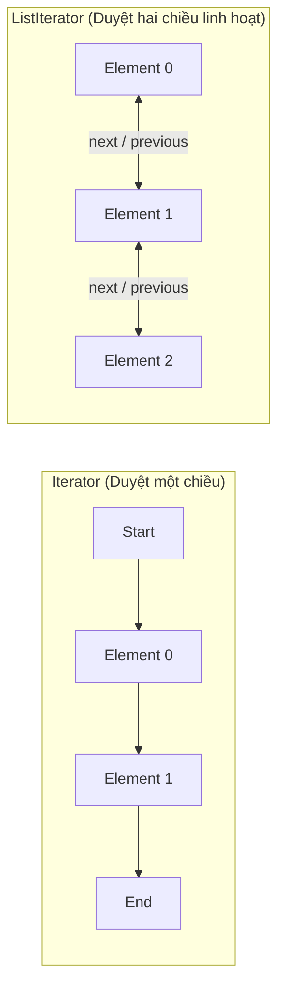

# So sánh toàn diện Iterator và ListIterator trong Java

## ⚡ Tóm tắt ngắn (30s)
* **`Iterator`**: Là giao diện tổng quát, dùng được cho **mọi cấu trúc Collection** (List, Set, Queue...). Chỉ cho phép duyệt **một chiều duy nhất** từ đầu đến cuối. Hỗ trợ các thao tác cơ bản: duyệt (`next()`), kiểm tra (`hasNext()`) và xóa (`remove()`).
* **`ListIterator`**: Là giao diện chuyên biệt, **chỉ dùng được duy nhất cho `List`** (ArrayList, LinkedList). Hỗ trợ duyệt **hai chiều linh hoạt (Bidirectional)** (tiến bằng `next()`, lùi bằng `previous()`). Đồng thời hỗ trợ nhiều thao tác mạnh mẽ khác như: thêm phần tử (`add()`), sửa đổi phần tử (`set()`), truy vấn chỉ mục hiện tại (`nextIndex()`, `previousIndex()`).

---

## 🔍 Chi tiết bản chất

### 1. Khác biệt về Phạm vi và Tính năng
* **Iterator**: Nằm ở mức trừu tượng cao nhất của Collection Framework (`java.util.Iterator`). Do đó, bạn có thể viết mã nguồn dùng chung cho cả `HashSet`, `PriorityQueue`, `ArrayList` một cách thống nhất.
* **ListIterator**: Kế thừa trực tiếp từ `Iterator` nhưng bổ sung các hành vi đặc trưng cho cấu trúc dữ liệu dạng chuỗi index-based (`java.util.ListIterator`).

### 2. Cơ chế con trỏ (Cursor) trong ListIterator
* `ListIterator` hoạt động dựa trên cơ chế con trỏ nằm **giữa** các phần tử.
* Khi gọi `next()`, con trỏ nhảy qua phần tử bên phải và trả về phần tử đó.
* Khi gọi `previous()`, con trỏ nhảy ngược về bên trái và trả về phần tử vừa nhảy qua.
* Nhờ cơ chế này, bạn có thể chèn (`add`) hoặc sửa (`set`) phần tử ngay tại vị trí hiện tại của con trỏ cực kỳ nhanh chóng và chính xác.

---

## 🎨 Sơ đồ Cơ chế Duyệt phần tử (Iterator vs ListIterator)



---

## 💻 Code Example

### BAD ❌ (Duyệt ngược LinkedList bằng index thông thường gây thảm họa hiệu năng)
```java
List<String> list = new LinkedList<>(List.of("A", "B", "C", "D"));

// ❌ THẢM HỌA HIỆU NĂNG! list.get(i) trên LinkedList tốn O(N) thời gian để duyệt.
// Kết hợp vòng lặp biến thuật toán thành O(N^2), làm nghẽn CPU nghiêm trọng khi danh sách lớn!
for (int i = list.size() - 1; i >= 0; i--) {
    System.out.println(list.get(i)); 
}
```

### GOOD ✅ (Dùng ListIterator duyệt ngược tối ưu tuyệt đối)
```java
List<String> list = new LinkedList<>(List.of("A", "B", "C", "D"));

// Khởi tạo ListIterator đặt con trỏ ở cuối danh sách
ListIterator<String> lit = list.listIterator(list.size());

// ✅ Duyệt ngược cực kỳ mượt mà, độ phức tạp chỉ O(1) cho mỗi phần tử!
while (lit.hasPrevious()) {
    String item = lit.previous();
    System.out.println(item);
    
    if ("C".equals(item)) {
        lit.set("Updated C"); // ✅ Thay thế phần tử tại vị trí hiện tại siêu tốc O(1)
    }
}
```

---

## 📊 Trade-off Analysis

| Tính năng | Iterator | ListIterator |
| :--- | :--- | :--- |
| **Cấu trúc áp dụng** | **Mọi Collection** (List, Set, Map thông qua entrySet) | **Chỉ áp dụng cho List** |
| **Hướng duyệt** | Chỉ duyệt tiến (Forward) | Duyệt tiến và Duyệt lùi (Forward/Backward) |
| **Lấy chỉ mục (Index)**| Không hỗ trợ | Hỗ trợ `nextIndex()` và `previousIndex()` |
| **Thêm phần tử (`add`)**| Không hỗ trợ | Hỗ trợ thêm phần tử an toàn tại vị trí duyệt |
| **Sửa phần tử (`set`)** | Không hỗ trợ | Hỗ trợ ghi đè phần tử vừa duyệt |

---

## ⚠️ Common Gotchas & Questions follow-up
1. **Lỗi IllegalStateException khi gọi `add()` hoặc `set()`**:
   * *Bản chất*: Phương thức `set()` và `remove()` hoạt động dựa trên phần tử cuối cùng được trả về bởi `next()` hoặc `previous()`. Nếu bạn vừa gọi `add()` hoặc vừa gọi `remove()` xong mà gọi ngay `set()`, JVM sẽ ném lỗi `IllegalStateException` do con trỏ chưa xác định được đối tượng tác động.
2. 👉 **Câu hỏi đào sâu từ interviewer**: *Tại sao ArrayDeque hoặc HashSet không hỗ trợ ListIterator?*
   * *(Trả lời: Vì bản chất cấu trúc dữ liệu của Set là không có thứ tự và không dựa trên chỉ mục index, nên việc đi lùi hoặc lấy chỉ mục là vô nghĩa. Đối với ArrayDeque, nó được thiết kế tối giản làm Queue/Stack nên chỉ hỗ trợ duyệt 1 chiều thông thường để đạt hiệu năng cao nhất).*