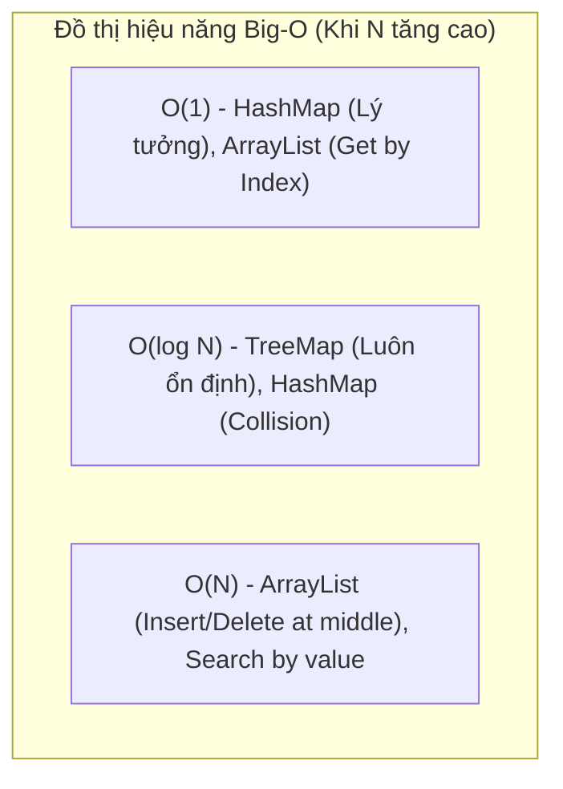

# Phân tích chi tiết độ phức tạp thuật toán (Big-O) của ArrayList, HashMap và TreeMap

## ⚡ Tóm tắt ngắn (30s)
* **`ArrayList`**: Tra cứu theo index: **`$O(1)$`** tuyệt đối. Chèn/Xóa ở cuối: **`$O(1)$`** amortized (khấu hao). Chèn/Xóa ở đầu/giữa: **`$O(N)$`** (do dịch chuyển mảng). Tìm theo giá trị: **`$O(N)$`**.
* **`HashMap`**: Tìm kiếm, chèn, xóa theo Key: **`$O(1)$`** trung bình lý tưởng. Tệ nhất (do đụng độ băm): **`$O(log N)$`** nhờ cấu trúc Cây Đỏ-Đen (Java 8+).
* **`TreeMap`**: Tìm kiếm, chèn, xóa theo Key: **`$O(log N)$`** luôn ổn định trong mọi trường hợp nhờ cấu trúc cây tự cân bằng Red-Black Tree.

---

## 🔍 Chi tiết bản chất

### 1. Tại sao ArrayList chèn ở cuối lại là `$O(1)$` amortized?
* Khi mảng nội bộ của ArrayList bị đầy, nó bắt buộc phải khởi tạo một mảng mới lớn gấp 1.5 lần và sao chép toàn bộ phần tử sang (tốn `$O(N)$`).
* Tuy nhiên, phép toán resize này diễn ra rất thưa thớt. Trung bình cộng tất cả các phép toán chèn lại, chi phí thực tế cho mỗi lần chèn vẫn cực kỳ nhỏ và đạt hiệu năng **`$O(1)$`**.

### 2. Sự ảo diệu `$O(1)$` của HashMap
* Nhờ việc áp dụng hàm băm (Hashing) để tính toán địa chỉ lưu trữ trực tiếp của Key trên RAM (trong mảng Buckets), HashMap không cần duyệt qua các phần tử để tìm kiếm. Độ phức tạp chỉ bị thoái hóa lên `$O(log N)` (Java 8+) hoặc `$O(N)` (Java <8) khi xảy ra va chạm băm dữ dội.

### 3. TreeMap và Cây Đỏ-Đen tự cân bằng
* Khác với HashMap, TreeMap lưu giữ các phần tử ở dạng cây nhị phân cân bằng. Mọi thao tác tìm kiếm hay chèn đều phải duyệt từ gốc (Root) đi xuống các lá. Chiều cao của cây luôn được đảm bảo duy trì ở mức tối đa là `$2log(N + 1)$`, giúp hiệu năng luôn duy trì cực kỳ ổn định kể cả khi dung lượng dữ liệu khổng lồ.

---

## 🎨 Sơ đồ Đồ thị Hiệu năng Big-O theo Kích thước dữ liệu



---

## 💻 Code Example

### BAD ❌ (Dùng sai cấu trúc dữ liệu gây sập hiệu năng hệ thống)
```java
// Bài toán: Kiểm tra sự tồn tại của sản phẩm trong danh sách 500,000 phần tử
List<String> productList = new ArrayList<>(); // ... Giả định nạp đầy 500k mã sản phẩm

public boolean isProductExists(String code) {
    // ❌ THẢM HỌA HIỆU NĂNG! list.contains() chạy O(N) quét tuần tự toàn bộ mảng.
    // Dưới tải hàng ngàn request đồng thời, CPU sẽ bị vắt kiệt vì phải quét hàng triệu phép so sánh!
    return productList.contains(code); 
}
```

### GOOD ✅ (Sử dụng đúng cấu trúc dữ liệu tối ưu hóa thuật toán)
```java
// Sử dụng HashSet (được triển khai dựa trên HashMap bên dưới)
Set<String> productSet = new HashSet<>(); // ... Giả định nạp đầy 500k mã sản phẩm

public boolean isProductExists(String code) {
    // ✅ CỰC KỲ NHANH! HashSet.contains() chạy O(1) trung bình.
    // Thời gian phản hồi gần như lập tức và không phụ thuộc vào độ lớn của tập dữ liệu!
    return productSet.contains(code);
}
```

---

## 📊 Bảng phân tích So sánh Big-O toàn diện

| Cấu trúc dữ liệu | Tra cứu theo Index | Tra cứu theo Key | Chèn / Xóa ở Cuối | Chèn / Xóa ở Đầu | Sắp xếp phần tử |
| :--- | :--- | :--- | :--- | :--- | :--- |
| **`ArrayList`** | **`$O(1)$`** | N/A | **`$O(1)$`** amortized | `$O(N)$` | Không sắp xếp |
| **`HashMap`** | N/A | **`$O(1)$`** trung bình | **`$O(1)$`** trung bình | **`$O(1)$`** trung bình | Không sắp xếp |
| **`TreeMap`** | N/A | **`$O(log N)$`** | **`$O(log N)$`** | **`$O(log N)$`** | **Luôn sắp xếp** |

---

## ⚠️ Common Gotchas & Questions follow-up
1. **HashMap Resizing Overhead**:
   Mặc dù HashMap có tốc độ trung bình là `$O(1)$`, nhưng khi số lượng phần tử vượt ngưỡng tải trọng (`Capacity * Load Factor`), HashMap sẽ tự động chạy tiến trình Resize (nhân đôi mảng bucket) và thực hiện **Rehash** lại toàn bộ các Key hiện có (tốn `$O(N)$` thời gian). Nếu bạn biết trước Map sẽ chứa 100,000 phần tử, hãy thiết lập kích thước ban đầu phù hợp khi khởi tạo để tránh chi phí rehash liên tục.
2. 👉 **Câu hỏi đào sâu từ interviewer**: *Vì sao chèn phần tử vào LinkedList ở đầu luôn là `$O(1)$` nhưng LinkedList thực tế lại chạy chậm hơn ArrayList chèn ở cuối?*
   * *(Trả lời: LinkedList chèn đầu cực nhanh về mặt lý thuyết, nhưng mỗi lần chèn nó bắt buộc phải tạo mới đối tượng Node để liên kết. Việc cấp phát đối tượng mới liên tục gây áp lực cho bộ dọn rác GC và các Node nằm phân tán rải rác trên Heap dễ gây ra hiện tượng **CPU Cache Miss**, làm giảm hiệu năng thực tế gấp nhiều lần so với mảng phẳng tuần tự ArrayList).*