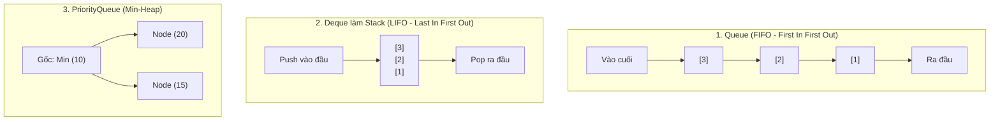

# Lựa chọn tối ưu giữa Queue, Deque và PriorityQueue trong phát triển ứng dụng

## ⚡ Tóm tắt ngắn (30s)
* **`Queue` (Hàng đợi)**: Dùng khi cần xử lý phần tử theo cơ chế **FIFO (First-In, First-Out)** - Vào trước ra trước. Điển hình là hàng đợi tin nhắn, xử lý request tuần tự.
* **`Deque` (Double Ended Queue)**: Hàng đợi hai đầu, cho phép chèn và xóa ở cả hai đầu. Dùng làm **Stack (LIFO - Last-In, First-Out)** thay thế cho lớp `Stack` đã lỗi thời và chậm chạp, hoặc dùng làm hàng đợi linh hoạt.
* **`PriorityQueue` (Hàng đợi ưu tiên)**: Dùng khi các phần tử cần được xử lý dựa trên **độ ưu tiên (Priority)** thay vì thời gian chèn vào. Dựa trên cấu trúc dữ liệu **Heap (Binary Heap)**.

---

## 🔍 Chi tiết bản chất

### 1. Tại sao Deque là sự thay thế hoàn hảo cho java.util.Stack?
* Lớp `java.util.Stack` cổ điển của Java được thiết kế từ Java 1.0 bằng cách kế thừa lớp `Vector`. Tất cả các phương thức chính của nó đều sử dụng từ khóa `synchronized` $\rightarrow$ Gây ra overhead khóa cực kỳ nặng nề và làm chậm luồng đơn do tranh chấp Monitor lock không cần thiết.
* **`ArrayDeque`** là sự lựa chọn thay thế tối ưu nhất để làm Stack. Nó không đồng bộ hóa dư thừa, triển khai trên mảng vòng (Circular array), mang lại **Cache Locality tuyệt vời** và tốc độ nhanh hơn `LinkedList` gấp nhiều lần do không tốn chi phí tạo đối tượng Node trung gian cho mỗi phần tử chèn vào.

### 2. Cơ chế hoạt động của PriorityQueue
* PriorityQueue lưu trữ phần tử dưới dạng Binary Heap (mặc định là Min-Heap).
* Nó không thực hiện sắp xếp toàn bộ danh sách, chỉ đảm bảo phần tử ở đầu (gốc Heap) luôn là phần tử nhỏ nhất (hoặc lớn nhất theo Comparator).
* Nhờ đó, việc chèn (`offer`) và xóa đầu (`poll`) tốn **`$O(log N)$`**, nhưng lấy phần tử đầu (`peek`) cực nhanh **`$O(1)$`**.

---

## 🎨 Sơ đồ Minh họa 3 cấu trúc Hàng đợi phổ biến



---

## 💻 Code Example

### BAD ❌ (Sử dụng lớp Stack lỗi thời làm chậm hiệu năng đa luồng/đơn luồng)
```java
// Bài toán: Đảo ngược chuỗi ký tự cục bộ
public String reverseString(String input) {
    // ❌ TỆ! java.util.Stack sử dụng cơ chế synchronized lỗi thời của Vector.
    // Gây lãng phí hiệu năng do liên tục xin khóa Monitor một cách vô nghĩa trong đơn luồng.
    java.util.Stack<Character> stack = new java.util.Stack<>(); 
    for (char c : input.toCharArray()) stack.push(c);
    
    StringBuilder sb = new StringBuilder();
    while (!stack.isEmpty()) sb.append(stack.pop());
    return sb.toString();
}
```

### GOOD ✅ (Sử dụng ArrayDeque tối ưu tốc độ tối đa)
```java
public String reverseString(String input) {
    // ✅ TỐI ƯU! ArrayDeque không đồng bộ hóa dư thừa, tốc độ xử lý vượt trội.
    Deque<Character> stack = new ArrayDeque<>(); 
    for (char c : input.toCharArray()) stack.push(c); // Sử dụng Deque như một Stack chuyên nghiệp
    
    StringBuilder sb = new StringBuilder();
    while (!stack.isEmpty()) sb.append(stack.pop());
    return sb.toString();
}
```

---

## 📊 Trade-off Analysis

| Cấu trúc dữ liệu | Cơ chế bên dưới | Lợi thế vượt trội | Hạn chế lớn | Độ phức tạp (Chèn / Xóa đầu) |
| :--- | :--- | :--- | :--- | :--- |
| **`ArrayDeque`** | Mảng vòng động (Circular array) | **Tốc độ nhanh nhất**, tốn cực ít bộ nhớ Heap, cache locality tốt. | Không cho phép chứa `null`. | **`$O(1)$`** / **`$O(1)$`** |
| **`LinkedList`** | Danh sách liên kết kép | Cho phép chứa `null`, linh hoạt trong việc thao tác con trỏ. | Tốn nhiều RAM cho Node, dễ gây Cache Miss làm chậm CPU. | **`$O(1)$`** / **`$O(1)$`** |
| **`PriorityQueue`**| Heap nhị phân (Binary Heap) | Tự động phân phối theo **độ ưu tiên**, lấy phần tử min/max siêu tốc. | Không cho phép chứa `null`, chi phí chèn/xóa trung bình cao hơn. | **`$O(log N)$`** / **`$O(log N)$`** |

---

## ⚠️ Common Gotchas & Questions follow-up
1. **Lỗi sửa đổi thuộc tính so sánh trong PriorityQueue**:
   Nếu bạn thay đổi giá trị thuộc tính dùng để so sánh của đối tượng sau khi đã chèn vào PriorityQueue, cấu trúc Heap sẽ bị sai lệch hoàn toàn và không tự động sắp xếp lại. Hãy luôn xóa ra khỏi queue, sửa đổi rồi chèn lại.
2. **PriorityQueue Iterator**:
   * *Bản chất*: Vòng lặp `for-each` hoặc `iterator()` của PriorityQueue **không đảm bảo** duyệt qua các phần tử theo đúng thứ tự ưu tiên. Nó chỉ duyệt tuần tự theo cấu trúc mảng phẳng của Heap nhị phân. Cách duy nhất để lấy ra đúng thứ tự là gọi liên tục phương thức `poll()` cho đến khi rỗng.
3. 👉 **Câu hỏi đào sâu từ interviewer**: *Làm sao để triển khai một PriorityQueue chứa các phần tử theo cơ chế Max-Heap thay vì Min-Heap mặc định?*
   * *(Trả lời: Ta chỉ cần truyền một bộ so sánh đảo ngược `Comparator.reverseOrder()` hoặc một Comparator custom vào constructor khi khởi tạo PriorityQueue).*