# So sánh chi tiết HashMap, LinkedHashMap và TreeMap trong Java

## ⚡ Tóm tắt ngắn (30s)
* **`HashMap`**: Lưu trữ cặp Key-Value sử dụng **bảng băm (Hash Table)**. **Không đảm bảo thứ tự** phần tử. Tốc độ tìm kiếm, thêm, xóa cực nhanh **$O(1)$** trong điều kiện lý tưởng.
* **`LinkedHashMap`**: Kế thừa từ `HashMap` nhưng duy trì một **danh sách liên kết kép toàn cục (double-linked list)** nối qua toàn bộ các Entry. Bảo toàn **thứ tự chèn (insertion-order)** hoặc thứ tự truy cập gần nhất (access-order). Tốc độ tìm kiếm $O(1)$, tiêu tốn nhiều RAM hơn HashMap.
* **`TreeMap`**: Triển khai dựa trên cấu trúc **Cây tự cân bằng Đỏ-Đen (Red-Black Tree)**. Sắp xếp các phần tử theo **thứ tự tự nhiên (natural ordering)** của Key hoặc theo một `Comparator` được cấu hình ngoài. Độ phức tạp cho mọi thao tác là **$O(log n)$**.

---

## 🔍 Chi tiết bản chất

### 1. Phân tích Cấu trúc lưu trữ vật lý
* **HashMap**: Lưu trữ dữ liệu trong một mảng các Node (thùng băm - bucket). Khi có đụng độ băm, các Node liên kết thành danh sách liên kết đơn hoặc chuyển thành cây Đỏ-Đen nếu va chạm lớn. Thứ tự Node phụ thuộc hoàn toàn vào kết quả của hàm băm (`hash(key) & (length-1)`).
* **LinkedHashMap**: Mỗi Node kế thừa `HashMap.Node` và bổ sung thêm hai trường con trỏ: `before` và `after`. Khi một phần tử được thêm vào Map, nó vừa được đưa vào bucket băm của HashMap, vừa được móc nối đuôi vào danh sách liên kết kép toàn cục. Nh đó, việc duyệt qua Map (`entrySet().iterator()` ) sẽ đi tuần tự theo thứ tự chèn, thay vì nhảy lung tung theo thuật toán băm.
* **TreeMap**: Không sử dụng bảng băm, không có bucket. Mỗi Entry là một nút trên cây Đỏ-Đen chứa các con trỏ `left`, `right`, `parent`, và thuộc tính màu sắc `color` (đỏ hoặc đen). Cây luôn tự cân bằng sau các thao tác ghi để đảm bảo chiều cao cây không vượt quá $2log(n+1)$, giữ vững hiệu năng tìm kiếm ổn định.

---

## 🎨 Sơ đồ trực quan (Cấu trúc dữ liệu bên dưới)

```mermaid
graph TD
    subgraph HashMapStructure["1. HashMap (Bảng băm lộn xộn)"]
        Buckets["Array Buckets [0..N]"]
        Buckets -->|Index 2| NodeA["Node A (Hash A)"] --> NodeB["Node B (Hash A)"]
    end

    subgraph LinkedHashMapStructure["2. LinkedHashMap (Thêm dây xích liên kết thứ tự)"]
        LBuckets["Array Buckets"]
        LNode1["Node 1 (First)"] -->|Hash collision| LNode2["Node 2"]
        
        %% Móc nối danh sách liên kết kép
        LNode1 ===>|before/after link| LNode2
        LNode2 ===>|before/after link| LNode3["Node 3 (Last)"]
    end

    subgraph TreeMapStructure["3. TreeMap (Cây Đỏ-Đen tự sắp xếp)"]
        Root["Root Node (Black)"]
        Root --> Left["Left Child (Red)"]
        Root --> Right["Right Child (Red)"]
    end
    
    style LNode1 fill:#1a365d,stroke:#3182ce,stroke-width:2px
    style LNode2 fill:#1a365d,stroke:#3182ce,stroke-width:2px
    style LNode3 fill:#1a365d,stroke:#3182ce,stroke-width:2px
    style Root fill:#2d3748,stroke:#ed8936,stroke-width:2px
```



---

## 💻 Code Example

### BAD ❌ (Sử dụng TreeMap bừa bãi khi không cần sắp xếp key)
```java
// ❌ Rất tệ: Chỉ lưu trữ cấu hình đơn giản nhưng dùng TreeMap gây lãng phí CPU!
// Thao tác get/put liên tục ở runtime tốn O(log N) và tạo áp lực cân bằng cây.
Map<String, String> configMap = new TreeMap<>();
configMap.put("db.host", "localhost");
configMap.put("db.port", "5432");

String host = configMap.get("db.host"); // O(log N)
```

### GOOD ✅ (Dùng đúng cấu trúc theo ngữ cảnh nghiệp vụ)
```java
// ✅ Dùng HashMap cho mục đích tra cứu thuần túy, nhanh nhất O(1)
Map<String, String> cache = new HashMap<>();
cache.put("123", "User A");

// ✅ Dùng LinkedHashMap khi cần làm bộ đệm giới hạn kích thước (LRU Cache)
Map<String, String> lruCache = new LinkedHashMap<>(16, 0.75f, true) {
    @Override
    protected boolean removeEldestEntry(Map.Entry<String, String> eldest) {
        return size() > 100; // Tự động xóa phần tử ít truy cập nhất khi dung lượng vượt quá 100
    }
};

// ✅ Dùng TreeMap khi thực sự cần sắp xếp và dùng các hàm khoảng (Range-query)
NavigableMap<Integer, String> scores = new TreeMap<>();
scores.put(90, "Alice");
scores.put(75, "Bob");
scores.put(85, "Charlie");

// Lấy ra điểm số thấp nhất mà lớn hơn hoặc bằng 80
Map.Entry<Integer, String> passed = scores.ceilingEntry(80); // ✅ Trả về: 85 -> Charlie
```

---

## 📊 Trade-off Analysis

| Tiêu chí | HashMap | LinkedHashMap | TreeMap |
| :--- | :--- | :--- | :--- |
| **Cấu trúc dữ liệu** | Bảng băm (Hash Table) | Bảng băm + LinkedList kép | Cây Đỏ-Đen (Red-Black Tree) |
| **Độ phức tạp (Get/Put)**| **$O(1)$** lý tưởng | **$O(1)$** | **$O(log n)$** (Chậm và ổn định) |
| **Thứ tự của Key** | Hoàn toàn lộn xộn | Theo thứ tự chèn/truy cập | Sắp xếp tăng/giảm tự nhiên |
| **Phụ phí bộ nhớ** | Thấp (Chỉ chứa Node) | Trung bình (Node tốn thêm 2 con trỏ) | Cao (Node chứa 3 con trỏ + màu sắc) |
| **Cho phép Key Null** | **Có** (Vị trí bucket 0) | **Có** | **Không** (Ném ra NullPointerException) |

---

## ⚠️ Common Gotchas & Questions follow-up
1. **Tại sao TreeMap không cho phép Key Null?**
   * *Bản chất*: TreeMap sử dụng phương thức `compareTo()` hoặc `compare()` của Comparator để xác định vị trí của Key trên cây. Việc gọi phương thức so sánh này trên một đối tượng `null` sẽ ngay lập tức ném ra `NullPointerException`. HashMap không cần so sánh Key lớn bé nên chỉ cần gán cứng vị trí của `null` tại bucket 0.
2. **LinkedHashMap duy trì thứ tự truy cập (Access-Order) hoạt động như thế nào?**
   * Khi khởi tạo bằng constructor có tham số `accessOrder = true`, mỗi khi một phần tử được truy xuất qua phương thức `get()`, LinkedHashMap sẽ tự động rút Entry đó ra khỏi vị trí hiện tại trong danh sách liên kết kép và móc nó xuống cuối danh sách. Điều này biến nó thành một cấu trúc hoàn hảo để xây dựng giải thuật **LRU (Least Recently Used) Cache**.
3. 👉 **Câu hỏi đào sâu từ interviewer**: *Khi duyệt (iterate) qua toàn bộ Map, hiệu năng của LinkedHashMap và HashMap khác nhau thế nào trong trường hợp dung lượng Map ban đầu khởi tạo quá lớn so với số phần tử thực tế lưu trữ?*
   * *(Trả lời: **LinkedHashMap duyệt nhanh hơn**. Khi duyệt HashMap, chương trình phải duyệt qua toàn bộ mảng bucket vật lý (tốn $O(Capacity + Size)$). Nếu dung lượng khởi tạo là 1 triệu nhưng chỉ chứa 10 phần tử, HashMap vẫn phải quét qua 1 triệu bucket rỗng. Đối với LinkedHashMap, nó chỉ việc đi dọc theo danh sách liên kết kép thực tế nối 10 phần tử đó với nhau, do đó tốc độ chỉ phụ thuộc trực tiếp vào số phần tử thực tế ($O(Size)$)).*