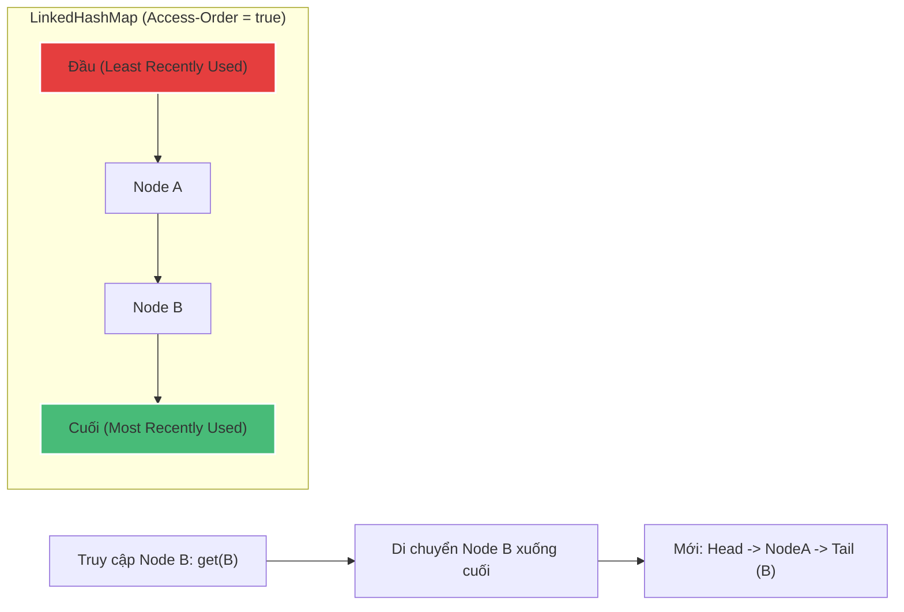

# Cách thiết kế và triển khai LRU Cache tối ưu bằng Java Collection

## ⚡ Tóm tắt ngắn (30s)
* **LRU (Least Recently Used) Cache** là bộ nhớ đệm tự động loại bỏ phần tử **ít được truy cập nhất** khi dung lượng bộ nhớ vượt quá giới hạn.
* Giải pháp tối ưu và thanh lịch nhất trong Java là kế thừa hoặc sử dụng **`LinkedHashMap`** ở chế độ **Access-Order** và override phương thức bảo vệ **`removeEldestEntry()`**.
* Giúp lập trình viên sở hữu một cấu trúc LRU Cache hoàn hảo, an toàn, hiệu năng cao chỉ với **khoảng 15 dòng code** thay vì tự viết hàng trăm dòng HashMap + LinkedList thủ công đầy rủi ro.

---

## 🔍 Chi tiết bản chất

### 1. Cơ chế Access-Order của LinkedHashMap
Mặc định, `LinkedHashMap` duy trì một danh sách liên kết kép chạy qua các Entry theo thứ tự chèn (`Insertion-Order`). Tuy nhiên, nó cung cấp một constructor đặc biệt:
```java
public LinkedHashMap(int initialCapacity, float loadFactor, boolean accessOrder)
```
Nếu truyền `accessOrder = true`, mỗi khi một phần tử được truy cập (qua phương thức `get()` hoặc cập nhật qua `put()`), LinkedHashMap sẽ tự động tháo Node đó khỏi vị trí hiện tại và **di chuyển xuống cuối** danh sách liên kết kép.
Nhờ đó, Node nằm ở **đầu danh sách** luôn là phần tử lâu nhất chưa được truy cập (Least Recently Used).

### 2. Cơ chế Tự động Trục xuất (Eviction)
Mỗi khi thực hiện thêm phần tử mới qua `put()`, LinkedHashMap sẽ tự động gọi phương thức kiểm thử:
```java
protected boolean removeEldestEntry(Map.Entry<K,V> eldest)
```
Mặc định phương thức này trả về `false`. Nếu ta override lại và trả về `true` khi kích thước map vượt quá dung lượng giới hạn (`size() > capacity`), LinkedHashMap sẽ tự động xóa Node ở đầu danh sách liên kết kép để nhường chỗ cho phần tử mới.

---

## 🎨 Sơ đồ luồng di chuyển phần tử trong LRU Cache



---

## 💻 Code Example

### BAD ❌ (Tự viết thuật toán LRU thủ công bằng HashMap + LinkedList phức tạp)
```java
// Tự quản lý con trỏ LinkedList thủ công, cực kỳ dễ sai sót logic,
// không an toàn đa luồng và khó tối ưu hiệu năng.
public class ManualLRUCache<K, V> {
    // Hàng trăm dòng code quản lý head, tail, prev, next...
    // Dễ gây memory leak hoặc đứt gãy con trỏ khi có lỗi logic xảy ra.
}
```

### GOOD ✅ (Triển khai LRU Cache thanh lịch bằng LinkedHashMap)
```java
public class LRUCache<K, V> {
    private final int capacity;
    private final Map<K, V> cache;

    public LRUCache(int capacity) {
        this.capacity = capacity;
        // 16: Dung lượng ban đầu, 0.75f: Load factor mặc định
        // true: Kích hoạt chế độ Access-Order (LRU)
        this.cache = new LinkedHashMap<K, V>(capacity, 0.75f, true) {
            @Override
            protected boolean removeEldestEntry(Map.Entry<K, V> eldest) {
                // ✅ Tự động trục xuất phần tử cũ nhất khi vượt dung lượng
                return size() > LRUCache.this.capacity;
            }
        };
    }

    // ✅ Đồng bộ hóa để đảm bảo an toàn đa luồng trong ứng dụng thực tế
    public synchronized V get(K key) {
        return cache.get(key);
    }

    public synchronized void put(K key, V value) {
        cache.put(key, value);
    }

    public synchronized int size() {
        return cache.size();
    }
}
```

---

    * *(Trả lời: **Không dùng LinkedHashMap đơn thuần được**. LFU yêu cầu đếm số lần truy cập (Frequency) của từng phần tử chứ không phải thời gian truy cập gần nhất. Để implement LFU tối ưu, ta phải kết hợp một HashMap lưu trữ dữ liệu chính và một cấu trúc TreeMap hoặc một danh sách liên kết kép của các Set lưu giữ tần số truy cập, giúp đạt độ phức tạp $O(1)$).*