# HashMap hoạt động nội bộ như thế nào trong JVM?

## ⚡ Tóm tắt ngắn (30s)
* **`HashMap`** hoạt động dựa trên nguyên lý **Hashing (Băm)** sử dụng một **Mảng các Node** (thường gọi là mảng bucket) làm bộ nhớ vật lý cơ sở.
* **Quy trình `put(key, value)`**:
  1. Tính toán mã băm thông qua hàm `hash(key)` tối ưu của HashMap.
  2. Xác định vị trí index của bucket bằng công thức bitwise cực nhanh: `index = (n - 1) & hash` (với `n` là kích thước mảng).
  3. Duyệt bucket tìm Node trùng key (bằng `equals()`): Nếu thấy thì ghi đè value; nếu không thấy, tạo Node mới nối vào cuối danh sách liên kết (hoặc cây Đỏ-Đen).
  4. Nếu số phần tử vượt ngưỡng giới hạn **`Threshold = Capacity * Load Factor`** (mặc định 0.75), Map tự động tăng gấp đôi kích thước mảng bucket và thực hiện **Rehash (chia lại bài)** toàn bộ phần tử.

---

## 🔍 Chi tiết bản chất

### 1. Phép toán băm bổ trợ (XOR-shift Hash)
* Hàm băm của HashMap được thiết kế lại nhằm phân tán đều các bit, tránh đụng độ khi mảng bucket còn nhỏ:
  ```java
  static final int hash(Object key) {
      int h;
      return (key == null) ? 0 : (h = key.hashCode()) ^ (h >>> 16);
  }
  ```
* **Bản chất**: Phép dịch bit phải `>>> 16` đẩy 16 bit trọng số cao của mã băm gốc xuống và thực hiện phép toán `XOR` với 16 bit thấp. Việc này giúp các bit cao cũng tham gia vào việc xác định vị trí index của bucket khi mảng bucket có kích thước nhỏ dưới $2^{16}$ phần tử.

### 2. Sự vi diệu của kích thước mảng luôn là lũy thừa của 2 ($2^x$)
* Để tìm chỉ số bucket cho một hash code, phép toán nguyên thủy là chia lấy dư: `index = hash % n`. Tuy lượng CPU xử lý chia dư rất chậm.
* Nếu `n` (capacity) luôn là **lũy thừa của 2** (ví dụ: 16, 32, 64, 128...), thì phép toán chia dư được biến đổi thành phép toán logic bitwise AND:
  ```java
  index = (n - 1) & hash;
  ```
* *Ví dụ*: Với $n = 16$ (nhị phân `10000`), $n-1 = 15$ (nhị phân `01111`). Phép toán `& 01111` sẽ cắt lấy đúng 4 bit cuối cùng của mã băm, tốc độ thực thi của phép toán bitwise này nhanh gần như tuyệt đối (chỉ mất 1 chu kỳ xung nhịp CPU).

### 3. Tiến trình Resize và Rehash
* Khi đạt ngưỡng vượt giới hạn, HashMap cấp phát một mảng bucket mới có kích thước gấp đôi.
* Việc di chuyển các phần tử cũ sang mảng mới được tối ưu hóa: Do kích thước mảng mới gấp đôi, index mới của phần tử chỉ có thể là **giữ nguyên index cũ** hoặc **bằng index cũ cộng thêm kích thước mảng cũ** (`oldCap`). Việc này được xác định đơn giản bằng phép toán:
  ```java
  if ((e.hash & oldCap) == 0) { // Giữ nguyên vị trí index cũ
      // Móc nối danh sách giữ nguyên
  } else { // Nhảy sang index cũ + oldCap
      // Móc nối danh sách mới
  }
  ```
* Điều này giúp giảm thiểu tối đa việc phải tính toán lại toán tử băm từ đầu cho từng Node, tăng tốc độ resize lên rất nhiều.

---

## 🎨 Sơ đồ luồng hoạt động chi tiết của phương thức put()

```mermaid
graph TD
    Start["Gọi put(Key K, Value V)"] --> CalcHash["Tính hash = K.hashCode() ^ (hash >>> 16)"]
    CalcHash --> GetIdx["Xác định index = (n - 1) & hash"]
    GetIdx --> CheckBucket{"Bucket[index] trống?"}
    
    CheckBucket -- Yes --> PutNew["Tạo Node mới chèn vào bucket"]
    CheckBucket -- No --> LoopBucket["Duyệt các Node trong bucket"]
    
    LoopBucket --> CheckEquals{"(Node.key == K) || Node.key.equals(K)?"}
    CheckEquals -- Yes --> OverrideVal["Ghi đè Value cũ bằng V và trả về"]
    CheckEquals -- No --> CheckNext{"Còn Node tiếp theo?"}
    
    CheckNext -- Yes --> MoveNext["Chuyển sang Node tiếp theo"] --> CheckEquals
    CheckNext -- No --> InsertTail["Chèn Node mới vào đuôi list (hoặc Tree)"]
    
    PutNew --> CheckResize{"Kích thước vượt ngưỡng Threshold?"}
    InsertTail --> CheckResize
    CheckResize -- Yes --> ResizeMap["Khởi động cấp đôi dung lượng & Rehash"]
    CheckResize -- No --> End["Hoàn tất put()"]
    ResizeMap --> End
    
    style CheckBucket fill:#2d3748,stroke:#3182ce,stroke-width:2px
    style CheckEquals fill:#2d3748,stroke:#3182ce,stroke-width:2px
    style CheckResize fill:#2d3748,stroke:#ed8936,stroke-width:2px
```



---

## 💻 Code Example

### BAD ❌ (Key có hàm hashCode tồi tệ làm sụp đổ hiệu năng HashMap)
```java
public class BadKey {
    private String id;
    
    public BadKey(String id) { this.id = id; }
    
    @Override
    public boolean equals(Object o) {
        if (this == o) return true;
        if (!(o instanceof BadKey)) return false;
        return Objects.equals(id, ((BadKey) o).id);
    }
    
    // ❌ Sai lầm chết người: Luôn trả về 1 số cố định
    // Gây đụng độ băm 100%, biến HashMap thành danh sách liên kết
    @Override
    public int hashCode() {
        return 42; 
    }
}
```

### GOOD ✅ (Sử dụng Record làm Key tự động sinh equals và hashCode hoàn hảo)
```java
// Record tự động sinh ra equals và hashCode phân tán đều dựa trên thuộc tính
// Các trường mặc định là final (bất biến) -> Đảm bảo an toàn tuyệt đối làm Key
public record GoodKey(String id, String region) {
    // Không cần viết lại code gì thêm, cực kỳ tinh giản và an toàn
}
```

---

## 📊 Trade-off Analysis

| Thuộc tính Load Factor | Ưu điểm nổi bật | Nhược điểm & Rủi ro |
| :--- | :--- | :--- |
| **Giá trị Thấp (ví dụ 0.5)** | **Tốc độ tối đa**: Rất ít xảy ra va chạm băm, việc tra cứu diễn ra siêu tốc gần như $O(1)$ tuyệt đối. | **Lãng phí bộ nhớ**: HashMap phải resize liên tục, mảng lớn trống trải không sử dụng hết RAM. |
| **Mặc định (0.75)** | **Cân bằng hoàn hảo**: Điểm tối ưu toán học giữa việc tận dụng bộ nhớ và giảm thiểu đụng độ băm. | Phù hợp với 99% ứng dụng thông thường. |
| **Giá trị Cao (nếu > 0.9)** | **Tiết kiệm RAM tối đa**: Chỉ resize khi mảng đầy ắp dữ liệu. | **Sụt giảm tốc độ**: Va chạm băm xảy ra liên tục, các bucket dài lê thê làm chậm thời gian truy xuất $O(n)$. |

---

## ⚠️ Common Gotchas & Questions follow-up
1. **Tại sao HashMap không được đồng bộ hóa nội bộ (Non-thread-safe)?**
   * *Bản chất*: Để tối đa hóa hiệu năng. Việc thêm khóa đồng bộ (lock) trên mọi thao tác sẽ làm chậm tốc độ thực thi đi hàng chục lần. Nếu chạy đa luồng ghi vào HashMap thông thường, cấu trúc danh sách liên kết có thể bị lặp vòng vô hạn (infinite loop) ở phiên bản Java cũ lúc resize, hoặc gây mất mát dữ liệu (data loss).
2. **Kích thước mặc định của HashMap ban đầu là bao nhiêu?**
   * Kích thước mảng ban đầu mặc định là **16** và load factor là **0.75**.
3. 👉 **Câu hỏi đào sâu từ interviewer**: *Nếu bạn biết trước hệ thống sẽ cần lưu trữ chính xác 10,000 phần tử vào HashMap, bạn nên khởi tạo đối tượng Map đó như thế nào để tránh hoàn toàn chi phí resize/rehash tốn kém?*
   * *(Trả lời: Ta cần khởi tạo Map với dung lượng ban đầu được tính toán trước. Công thức tính là: `Dung lượng khởi tạo = Số phần tử / Load Factor + 1`. Với 10,000 phần tử, ta cần: `10000 / 0.75 + 1 approx 13334`. Tuy nhiên HashMap sẽ tự động làm tròn lên lũy thừa của 2 gần nhất là **16384**. Do đó ta khởi tạo: `Map<K, V> map = new HashMap<>(16384);` hoặc dùng class tiện ích `HashMap.newHashMap(10000)` của Java 19+).*