# Điều gì xảy ra khi có Hash Collision (Đụng độ băm) trong HashMap?

## ⚡ Tóm tắt ngắn (30s)
* **`Hash Collision`** (Đụng độ băm) xảy ra khi hai key khác nhau tính ra cùng một chỉ số index bucket trong HashMap.
* **Cơ chế xử lý (từ Java 8+)**:
  1. Nếu số lượng phần tử va chạm trong 1 bucket nhỏ hơn **8**, HashMap dùng cấu trúc **Danh sách liên kết đơn (Singly Linked List)** để nối các Node đụng độ. Tốc độ tìm kiếm là $O(n)$.
  2. Nếu số lượng va chạm vượt quá **`TREEIFY_THRESHOLD = 8`** và tổng số phần tử của HashMap tối thiểu là **`MIN_TREEIFY_CAPACITY = 64`**, danh sách liên kết của bucket đó sẽ được **Cây hóa (Treeify)** chuyển thành **Cây Đỏ-Đen (Red-Black Tree)**. Tốc độ tìm kiếm tệ nhất được cải thiện từ $O(n)$ xuống còn **$O(log n)$**.
  3. Nếu số phần tử trong bucket đó giảm xuống còn **`UNTREEIFY_THRESHOLD = 6`** (do bị xóa hoặc do resize), cấu trúc cây sẽ tự động chuyển ngược lại thành danh sách liên kết đơn để tiết kiệm tài nguyên.

---

## 🔍 Chi tiết bản chất

### 1. Tại sao lại cần chuyển đổi sang Cây Đỏ-Đen (Red-Black Tree)?
* Trước Java 8, nếu có hàng nghìn key bị va chạm băm (ví dụ: kẻ tấn công cố tình truyền các key có cùng hashCode), thời gian tìm kiếm của HashMap sẽ bị thoái hóa thành tuyến tính **$O(n)$**. Điều này dẫn tới thảm họa **Hash DoS Attack** (tấn công từ chối dịch vụ thông qua mã băm), làm CPU hệ thống nhảy lên 100% chỉ để duyệt tìm kiếm các phần tử trong danh sách liên kết.
* Bằng việc giới hạn chiều cao cây tự cân bằng thông qua cấu trúc cây Đỏ-Đen, thời gian tìm kiếm tệ nhất luôn được bảo đảm ở mức ổn định cực kỳ an sau toàn là **$O(log n)$**, triệt tiêu hoàn toàn khả năng bị tấn công Hash DoS.

### 2. Ý nghĩa toán học của con số 8 (Treeify Threshold)
* Tại sao không phải là 5 hay 10? Các kỹ sư phát triển Java đã dựa trên lý thuyết xác suất thống kê để chọn ra ngưỡng tối ưu nhất.
* Theo phân phối xác suất Poisson, với hàm băm tốt và phân phối đều, khả năng một bucket bị đụng độ đến 8 phần tử là cực kỳ nhỏ (chưa tới **$1 / 10,000,000$**). Việc treeify rất hiếm khi xảy ra trong các ứng dụng bình thường.
* Việc chuyển đổi sang Node cây (`TreeNode`) tốn nhiều bộ nhớ hơn Node danh sách liên kết khoảng **gấp đôi** (do TreeNode chứa thêm các con trỏ left, right, parent, color). Do đó, con số 8 là ngưỡng cân bằng tối đa giữa chi phí hao phí bộ nhớ và sự phòng vệ hiệu năng an toàn.

---

## 🎨 Sơ đồ trực quan (Cơ chế Treeify & Untreeify)

```mermaid
graph LR
    subgraph ListState["Bucket chứa <= 8 node (Danh sách liên kết đơn)"]
        Node1["Node 1"] --> Node2["Node 2"] --> Node3["Node 3"]
    end
    
    subgraph TreeState["Bucket chứa > 8 node & Map size >= 64 (Cây Đỏ-Đen)"]
        TRoot["TreeNode (Black)"]
        TLeft["TreeNode (Red)"]
        TRight["TreeNode (Red)"]
        TRoot --> TLeft
        TRoot --> RRight
    end
    
    ListState -->|Va chạm >= 8 & Size >= 64 <br> Treeify| TreeState
    TreeState -->|Phần tử giảm xuống <= 6 <br> Untreeify| ListState
    
    style Node1 fill:#2d3748,stroke:#a0aec0,stroke-width:1px
    style TRoot fill:#1a365d,stroke:#3182ce,stroke-width:2px
    style TLeft fill:#e53e3e,stroke:#fff,stroke-width:1px
```



---

## 💻 Code Example

### BAD ❌ (Kẻ tấn công cố tình truyền dữ liệu gây thảm họa đụng độ băm)
```java
public class AttackKey implements Comparable<AttackKey> {
    private final String value;
    public AttackKey(String value) { this.value = value; }

    @Override
    public int hashCode() {
        return 100; // ❌ Cố tình đụng độ băm 100%
    }

    @Override
    public boolean equals(Object obj) {
        if (this == obj) return true;
        if (!(obj instanceof AttackKey)) return false;
        return Objects.equals(value, ((AttackKey) obj).value);
    }

    @Override
    public int compareTo(AttackKey o) {
        return this.value.compareTo(o.value);
    }
}

// 💥 Nếu ở Java 7: Thao tác tìm kiếm 10,000 đối tượng AttackKey trong Map 
// sẽ cực kỳ chậm chạp do phải duyệt tuần tự danh sách liên kết dài 10,000 Node (O(N)).
// Từ Java 8: HashMap tự động treeify, tốc độ vẫn cực nhanh nhờ cấu trúc cây Đỏ-Đen (O(log N)).
```

### GOOD ✅ (Giải pháp Key chuẩn chỉ cho HashMap)
```java
// Hãy luôn sử dụng các kiểu dữ liệu Immutable mặc định như String, Integer làm Key
// hoặc các lớp Record được tối ưu hóa băm hoàn hảo
Map<String, String> secureMap = new HashMap<>();
secureMap.put("KeyA", "ValueA"); // Hàm băm String phân phối đều, an toàn
```

---

## 📊 Trade-off Analysis

| Tiêu chí | Singly Linked List (Node) | Red-Black Tree (TreeNode) |
| :--- | :--- | :--- |
| **Tiêu tốn bộ nhớ** | **Cực thấp**: Chỉ lưu trữ thuộc tính cơ bản và con trỏ `next`. | **Gấp đôi**: Lưu trữ thêm 3 tham chiếu con trỏ (`left`, `right`, `parent`) và biến trạng thái `color`. |
| **Tốc độ chèn** | **Nhanh**: Chỉ cần nối vào đuôi danh sách. | **Chậm hơn**: Phải duyệt cây tìm vị trí và thực hiện cân bằng xoay cây. |
| **Tốc độ tìm kiếm** | **Chậm** ($O(n)$) | **Siêu nhanh** ($O(log n)$) |
| **Độ phức tạp duy trì**| Thấp, mã nguồn đơn giản. | Rất cao (yêu cầu giải thuật cây cân bằng phức tạp). |

---

## ⚠️ Common Gotchas & Questions follow-up
1. **Nếu các Class làm Key đụng độ mà không triển khai interface `Comparable`, HashMap sẽ treeify như thế nào?**
   * *Bản chất*: Khi chuyển thành cây Đỏ-Đen, JVM cần so sánh các Node để sắp xếp nhánh trái/phải. Nếu các Key không triển khai `Comparable`, HashMap sẽ dùng cơ chế so sánh phụ trợ:
     - So sánh dựa trên tên lớp của đối tượng (`ClassName`).
     - Nếu tên lớp giống nhau, HashMap sử dụng phương thức `System.identityHashCode(obj)` làm trọng số so sánh cuối cùng để đảm bảo tính nhất quán của cây.
2. **Nếu tổng dung lượng Map nhỏ hơn 64 nhưng số phần tử va chạm trong 1 bucket đã lớn hơn 8, chuyện gì xảy ra?**
   * HashMap sẽ **không** chuyển đổi thành cây Đỏ-Đen. Thay vào đó, nó chọn giải pháp **Resize (mở rộng dung lượng Map)** gấp đôi để phân tán lại các phần tử, giải phóng tình trạng va chạm của bucket đó.
3. 👉 **Câu hỏi đào sâu từ interviewer**: *Tại sao ngưỡng Treeify là 8 nhưng ngưỡng Untreeify lại là 6? Tại sao không chọn cùng một con số là 8 để chuyển đổi qua lại?*
   * *(Trả lời: Để **tránh hiện tượng dao động liên tục (thrashing)**. Nếu chọn cùng một con số (ví dụ là 8), khi một bucket có đúng 8 phần tử, việc thêm/xóa 1 phần tử liên tục ở ranh giới này sẽ ép JVM phải thực hiện chuyển đổi cấu trúc liên tục từ Cây sang Danh sách rồi từ Danh sách sang Cây. Việc này tiêu tốn cực kỳ nhiều CPU. Khoảng cách an toàn giữa 8 (Treeify) và 6 (Untreeify) hoạt động như một bộ đệm giảm chấn).*