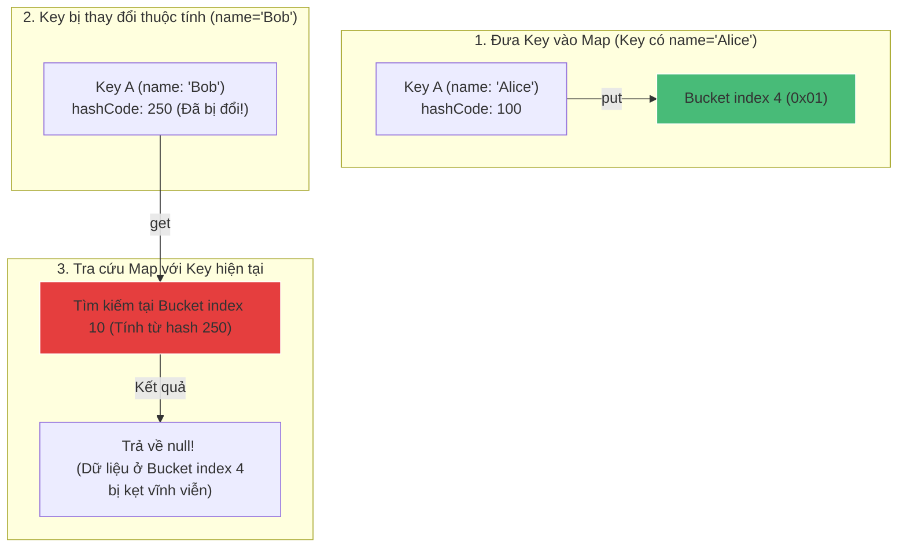

# Tại sao Key trong HashMap bắt buộc nên là Immutable (Bất biến)?

## ⚡ Tóm tắt ngắn (30s)
* Key trong HashMap bắt buộc nên là **Immutable (Bất biến)** để bảo đảm **tính nhất quán của mã băm (hashCode consistency)** trong suốt vòng đời của Map.
* **Hệ quả của việc dùng Mutable Key (có thể biến đổi)**:
  1. Nếu ta thay đổi thuộc tính của đối tượng Key sau khi đã đưa vào Map, mã băm của nó sẽ thay đổi theo.
  2. Khi ta gọi `map.get(key)`, HashMap tính toán lại mã băm mới và xác định sai chỉ số bucket vật lý $\rightarrow$ Trả về `null`.
  3. Giá trị cũ vẫn nằm chết kẹt trong mảng bucket ban đầu $\rightarrow$ Gây ra **rò rỉ bộ nhớ (Memory Leak)** nghiêm trọng do đối tượng không bao giờ được Garbage Collector dọn dẹp.

---

## 🔍 Chi tiết bản chất

### 1. Cơ chế tra cứu 2 bước của HashMap và Sự Đột biến (Mutation)
* Khi bạn gọi `map.get(key)`, HashMap thực hiện tra cứu qua hai chốt chặn nghiêm ngặt:
  * **Bước 1**: Tìm đúng chỉ số bucket vật lý bằng phép toán `index = (n-1) & hash(key)`.
  * **Bước 2**: Tại bucket tìm được, duyệt tìm chính xác Node bằng phép so sánh `key.equals(node.key)`.
* Khi thuộc tính của Key bị thay đổi (đột biến), mã băm `hashCode()` của nó bị tính toán lại ra một con số khác.
* **Hậu quả**: Bước 1 sẽ tìm đến một bucket rỗng hoặc một bucket chứa phần tử khác $\rightarrow$ Truy xuất thất bại.
* Ngay cả khi mã băm mới vô tình trùng khớp index bucket cũ, ở Bước 2 phép so sánh nội dung `key.equals(node.key)` cũng sẽ trả về `false` vì dữ liệu thuộc tính của Key hiện tại đã khác so với dữ liệu của chính nó lúc lưu trữ trong Node $\rightarrow$ Bạn vĩnh viễn mất dấu vết của dữ liệu đó!

### 2. Tại sao String lại là Key hoàn hảo nhất?
* Lớp `java.lang.String` được thiết kế bất biến tuyệt đối.
* **Cơ chế Cache Hashcode**: Bên trong lớp String có một trường private `int hash` lưu giữ mã băm sau lần tính toán đầu tiên. Do String bất biến, giá trị băm này không bao giờ thay đổi, giúp HashMap bỏ qua việc tính lại mã băm ở các lần gọi sau, đẩy tốc độ truy xuất đạt hiệu năng tối đa.

---

## 🎨 Sơ đồ trực quan (Hiểm họa rò rỉ bộ nhớ do Mutable Key)



---

## 💻 Code Example

### BAD ❌ (Sử dụng đối tượng Mutable có Setter làm Key)
```java
public class MutableUser {
    private String username;
    public MutableUser(String username) { this.username = username; }
    public void setUsername(String username) { this.username = username; }

    @Override
    public int hashCode() { return Objects.hash(username); }
    @Override
    public boolean equals(Object o) {
        if (this == o) return true;
        if (!(o instanceof MutableUser)) return false;
        return Objects.equals(username, ((MutableUser) o).username);
    }
}

// 💥 Sử dụng:
Map<MutableUser, String> map = new HashMap<>();
MutableUser user = new MutableUser("alex");
map.put(user, "Alex_Data_Profile");

// Thay đổi thuộc tính của key sau khi chèn vào Map
user.setUsername("john"); 

// ❌ Kết quả: Trả về null!
System.out.println(map.get(user)); // Output: null

// ❌ Gây rò rỉ bộ nhớ: Map vẫn giữ tham chiếu tới đối tượng, không thể GC!
System.out.println(map.size()); // Output: 1
```

### GOOD ✅ (Thiết kế Immutable Key an toàn tuyệt đối)
```java
// ✅ Định nghĩa Record bất biến từ Java 14+
public record SafeUserKey(String username) {
    // Không thể thay đổi username sau khi khởi tạo
}

// Hoặc tự viết class thủ công:
public final class SafeUserKeyManual {
    private final String username; // ✅ private final

    public SafeUserKeyManual(String username) {
        this.username = username;
    }

    public String getUsername() { return username; } // Chỉ có getter, không có setter

    @Override
    public int hashCode() { return Objects.hash(username); }
    @Override
    public boolean equals(Object o) {
        if (this == o) return true;
        if (!(o instanceof SafeUserKeyManual)) return false;
        return Objects.equals(username, ((SafeUserKeyManual) o).username);
    }
}
```

---

## 📊 Trade-off Analysis

| Phương án thiết kế | Ưu điểm | Nhược điểm & Rủi ro |
| :--- | :--- | :--- |
| **Immutable Key (Khuyên dùng)** | **An toàn tuyệt đối**: Bảo toàn tính đúng đắn của dữ liệu, loại bỏ hoàn toàn lỗi rò rỉ bộ nhớ, tối ưu hóa tốc độ nhờ cache hashCode. | Tốn thêm một chút chi phí bộ nhớ ban đầu để tạo các đối tượng Key mới khi cần sửa đổi giá trị. |
| **Mutable Key (Tối kỵ)** | Không cần tạo đối tượng mới khi cập nhật thuộc tính. | **Cực kỳ nguy hiểm**: Dễ làm sập ứng dụng, mất dấu vết dữ liệu, tạo lỗ hổng rò rỉ bộ nhớ khó gỡ lỗi nhất trong Java. |

---

## ⚠️ Common Gotchas & Questions follow-up
1. **Điều gì xảy ra nếu thuộc tính thay đổi của Key không tham gia vào phương thức `hashCode()`?**
   * *Bản chất*: Nếu thuộc tính bị thay đổi không được tính toán trong `hashCode()` và `equals()`, HashMap vẫn hoạt động đúng kỹ thuật. Tuy nhiên, đây là một bad practice về mặt thiết kế hướng đối tượng, dễ gây nhầm lẫn cho các lập trình viên khác trong dự án khi đọc code.
2. **Làm sao giải phóng các entry bị mất dấu do Mutated Keys trong Map?**
   * Bạn chỉ có cách gọi `map.clear()` để dọn sạch toàn bộ Map, hoặc GC sẽ dọn dẹp khi bản thân đối tượng Map đó không còn tham chiếu nào nữa.
3. 👉 **Câu hỏi đào sâu từ interviewer**: *Nếu bắt buộc phải sử dụng một Key có thuộc tính thay đổi được trong một cấu trúc dạng Map, giải pháp thiết kế thay thế của bạn là gì?*
   * *(Trả lời: Ta nên thay thế bằng giải pháp tách biệt thông tin định danh bất biến (Identity) làm Key và phần dữ liệu động làm Value. Ví dụ: Dùng mã định danh chuỗi bất biến `String userId` làm Key của Map, và đưa đối tượng Mutable `UserProfile` chứa các trường thay đổi được vào phần Value. Điều này vừa bảo đảm an toàn cho Map vừa dễ dàng cập nhật thông tin).*