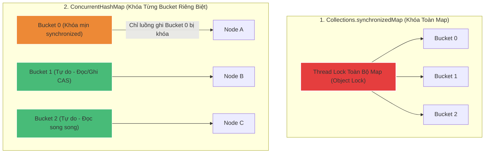

# ConcurrentHashMap khác gì HashMap kết hợp synchronized?

## ⚡ Tóm tắt ngắn (30s)
* **`HashMap + synchronized`** (ví dụ `Hashtable`, `Collections.synchronizedMap`) bảo đảm an toàn đa luồng bằng cơ chế **Object-level Lock (Khóa thô toàn cục)**. Mỗi thời điểm chỉ duy nhất 1 luồng được phép truy cập Map (dù là đọc hay ghi), tạo ra nút thắt cổ chai (bottleneck) hiệu năng nghiêm trọng dưới tải cao.
* **`ConcurrentHashMap`** (từ Java 8) bảo đảm an toàn đa luồng bằng cơ chế **Bucket-level Lock (Khóa mịn phân mảnh)** kết hợp các phép toán **CAS (Compare-And-Swap)** và từ khóa `volatile`:
  1. **Đọc không khóa (Lock-free Read)**: Các luồng đọc hoàn toàn không cần lock nhờ tính hiển thị tức thì của thuộc tính `volatile` trên dữ liệu Node.
  2. **Ghi mịn (Fine-grained Write)**: Chỉ sử dụng `synchronized` để khóa trên chính Node đầu tiên của bucket bị ghi, các bucket khác vẫn hoạt động ghi/đọc song song bình thường. Tăng băng thông đa luồng lên gấp hàng chục lần.

---

## 🔍 Chi tiết bản chất

### 1. Tiến hóa kiến trúc của ConcurrentHashMap
* **Trước Java 8 (Segment Locking)**: Map được chia nhỏ thành 16 phân đoạn (`Segments`). Mỗi phân đoạn là một bảng băm nhỏ sở hữu một lock độc lập. Hỗ trợ tối đa 16 luồng ghi đồng thời tại các segment khác nhau.
* **Từ Java 8 trở đi (Node-level Locking)**: Bỏ hoàn toàn cấu trúc Segment phức tạp. Sử dụng trực tiếp mảng bucket chính.
  * Khi chèn phần tử đầu tiên vào một bucket trống: Dùng kỹ thuật **CAS (Compare-And-Swap)** không khóa của CPU để chèn an toàn.
  * Khi xảy ra va chạm băm (chèn vào bucket đã có phần tử): Chỉ dùng khối `synchronized` để khóa Node đầu tiên của bucket đó.
  * Các luồng ghi ở các bucket khác nhau hoàn toàn không ảnh hưởng lẫn nhau.

### 2. Phép toán CAS (Compare-And-Swap) dưới phần cứng
* CAS là một chỉ thị cấp thấp của CPU (được Java gọi qua lớp nội bộ `Unsafe`).
* Hoạt động theo nguyên tắc: Nhận vào (Địa chỉ ô nhớ, Giá trị cũ mong đợi, Giá trị mới muốn cập nhật). CPU kiểm tra nếu giá trị ở ô nhớ trùng với giá trị cũ mong đợi, nó sẽ cập nhật giá trị mới một cách nguyên tử (atomic) mà không cần dùng đến mutex lock của hệ điều hành.

### 3. Sự bất khả thi của Giá trị Null trong ConcurrentHashMap
* Khác với HashMap, `ConcurrentHashMap` **không cho phép** Key hoặc Value có giá trị `null`.
* **Lý do (Doug Lea giải thích)**: Trong môi trường đa luồng nghiệp vụ, nếu `map.get(key)` trả về `null`, ta không thể xác định chắc chắn: "Key này không tồn tại trong Map" hay "Key này có tồn tại nhưng Value được gán là null". Trong đơn luồng, ta kiểm tra bằng `containsKey(key)`, nhưng trong đa luồng, giữa hai lời gọi `get()` và `containsKey()`, một luồng khác có thể đã can thiệp và chèn dữ liệu vào $
ightarrow$ Gây ra lỗi bất đồng bộ nghiêm trọng.

---

## 🎨 Sơ đồ so sánh Cơ chế Khóa (Locking Mechanism)



---

## 💻 Code Example

### BAD ❌ (Xử lý race condition thủ công trên ConcurrentHashMap gây mất an toàn)
```java
public class BadConcurrentCounter {
    private final Map<String, Integer> countMap = new ConcurrentHashMap<>();

    public void increment(String key) {
        Integer current = countMap.get(key); // Bước 1: Đọc
        if (current == null) {
            countMap.put(key, 1); // Bước 2: Check-then-act không nguyên tử!
        } else {
            countMap.put(key, current + 1); // ❌ Vẫn xảy ra race condition giữa hai luồng!
        }
    }
}
```

### GOOD ✅ (Sử dụng các phương thức nguyên tử tích hợp sẵn)
```java
public class GoodConcurrentCounter {
    private final Map<String, Integer> countMap = new ConcurrentHashMap<>();

    public void increment(String key) {
        // ✅ Hoạt động nguyên tử (atomic) tuyệt đối dưới background
        // Không dùng lock thủ công, hiệu năng tối đa
        countMap.merge(key, 1, Integer::sum);
    }
    
    public void incrementComputeIfAbsent(String key) {
        // Hoặc dùng compute để cập nhật an toàn
        countMap.compute(key, (k, v) -> (v == null) ? 1 : v + 1);
    }
}
```

---

## 📊 Trade-off Analysis

| Tiêu chí so sánh | Collections.synchronizedMap | ConcurrentHashMap (Java 8+) |
| :--- | :--- | :--- |
| **Cơ chế Khóa** | Khóa đối tượng toàn cục độc quyền. | Khóa theo từng đầu Bucket đơn lẻ + CAS. |
| **Hiệu năng Đọc** | Chậm (bị chặn nếu có luồng khác đang đọc/ghi). | **Siêu nhanh** (Lock-free nhờ `volatile`). |
| **Hiệu năng Ghi** | Siêu chậm dưới đa luồng (xếp hàng chờ đợi). | **Cực nhanh** (Ghi song song trên các bucket khác nhau). |
| **Cho phép Null** | Có | **Tuyệt đối không** |
| **Độ nhất quán của Iterator**| Fail-fast (Ném lỗi nếu có sửa đổi khi duyệt). | Weakly-consistent (Cho phép sửa đổi khi duyệt). |

---

## ⚠️ Common Gotchas & Questions follow-up
1. **Weakly-consistent Iterator của ConcurrentHashMap nghĩa là gì?**
   * *Bản chất*: Iterator của ConcurrentHashMap không tạo ra bản sao mảng cũng không khóa Map khi duyệt. Nó phản ánh trạng thái của Map tại thời điểm khởi tạo Iterator và **cho phép** các luồng khác thay đổi dữ liệu trong quá trình duyệt mà không ném ra `ConcurrentModificationException`. Sự thay đổi có thể hoặc không được phản ánh trong Iterator tùy thuộc vào vị trí con trỏ duyệt qua.
2. **Phương thức `size()` của ConcurrentHashMap hoạt động như thế nào?**
   * Trong môi trường concurrency, việc đếm size liên tục qua 1 biến duy nhất sẽ gây nghẽn luồng ghi. ConcurrentHashMap tối ưu bằng cách phân tán biến đếm sang một mảng các ô nhớ (`CounterCell[]`). Khi gọi `size()`, Map cộng dồn các giá trị trong mảng này lại để trả về kết quả ước lượng gần đúng nhất mà không cần khóa toàn cục.
3. 👉 **Câu hỏi đào sâu từ interviewer**: *Tại sao ta không nên sử dụng phương thức `computeIfAbsent()` lồng nhau (nested calls) trong ConcurrentHashMap?*
   * *(Trả lời: Gây ra **Deadlock (Khóa chết)**. Phương thức `computeIfAbsent` thực hiện khóa trên bucket của Key đang xử lý. Nếu bên trong lambda của nó, ta lại gọi tiếp một `computeIfAbsent` trên một Key khác mà vô tình rơi vào cùng một bucket hoặc tạo ra chu kỳ phụ thuộc ngược lại, hai luồng sẽ tự khóa lẫn nhau vĩnh viễn).*