# CopyOnWriteArrayList phù hợp trong trường hợp nào?

## ⚡ Tóm tắt ngắn (30s)
* **`CopyOnWriteArrayList`** là phiên bản an toàn đa luồng (thread-safe) của `ArrayList`.
* **Cơ chế hoạt động**: Mỗi khi có bất kỳ thao tác thay đổi dữ liệu nào (`add`, `set`, `remove`), nó sẽ **sao chép (clone) toàn bộ mảng hiện tại** sang một mảng mới, thực hiện thay đổi trên mảng mới, rồi hoán đổi tham chiếu (reference swap) sang mảng mới.
* **Đặc tính Iterator**: Iterator hoạt động trên một **Snapshot (ảnh chụp tĩnh)** của mảng tại thời điểm khởi tạo, hoàn toàn không bị ảnh hưởng bởi thao tác ghi sau đó và **không bao giờ** ném ra `ConcurrentModificationException`.
* 👉 **Use Case phù hợp**: Phù hợp nhất cho các bài toán **ĐỌC cực kỳ nhiều nhưng GHI cực kỳ ít** (ví dụ: Danh sách Observer/Listener của Event, Static System Configurations Cache).

---

## 🔍 Chi tiết bản chất

### 1. Chi phí của Thao tác Ghi (Mutative Operations)
* Dưới background, mỗi khi gọi phương thức thay đổi dữ liệu, `CopyOnWriteArrayList` sử dụng một ReentrantLock để đồng bộ hóa các luồng ghi, tránh việc nhiều luồng nhân bản mảng cùng lúc:
  ```java
  public boolean add(E e) {
      final ReentrantLock lock = this.lock;
      lock.lock();
      try {
          Object[] elements = getArray();
          int len = elements.length;
          // Nhân bản toàn bộ mảng cũ sang mảng mới tăng thêm 1 phần tử
          Object[] newElements = Arrays.copyOf(elements, len + 1);
          newElements[len] = e;
          setArray(newElements); // Hoán đổi tham chiếu nguyên tử
          return true;
      } finally {
          lock.unlock();
      }
  }
  ```
* **Hậu quả**: Thao tác ghi có độ phức tạp thời gian và không gian là **$O(n)$**. Nếu danh sách chứa 100,000 phần tử và ta chèn dữ liệu liên tục, JVM sẽ phải liên tục cấp phát các mảng khổng lồ trên Heap, gây ra thảm họa quá tải bộ nhớ và ép Garbage Collector hoạt động liên tục (GC Thrashing), làm ứng dụng bị đứng (lag).

### 2. Iterator Snapshot và Sự Đánh đổi về Tính Nhất quán (Consistency)
* Khi bạn lấy ra một Iterator từ `CopyOnWriteArrayList`, nó giữ một tham chiếu trực tiếp tới mảng vật lý hiện tại.
* Dù các luồng khác có thực hiện `add()` hay `remove()`, chúng chỉ làm việc trên mảng nhân bản mới, mảng mà Iterator đang giữ vẫn nguyên vẹn.
* **Đánh đổi**: Luồng duyệt dữ liệu sẽ **không thấy** các phần tử được thêm mới sau khi Iterator đã được tạo (Weakly Consistent). Đây là sự đánh đổi chủ ý để đổi lấy tốc độ đọc tối đa và loại bỏ hoàn toàn việc khóa đồng bộ khi duyệt mảng.

---

## 🎨 Sơ đồ trực quan (Cơ chế Copy-On-Write)

```mermaid
graph TD
    subgraph State1["Trạng thái 1: Hai luồng cùng đọc Mảng hiện tại"]
        TRead1["Thread A (Đọc)"] --> Array1["Array Ref (0x01) <br> [A, B, C]"]
        TRead2["Thread B (Đọc)"] --> Array1
    end

    subgraph State2["Trạng thái 2: Luồng C thực hiện ghi dữ liệu 'D'"]
        TWrite["Thread C (Ghi)"] -->|1. Clone mảng mới| Array2["New Array (0x02) <br> [A, B, C, D]"]
        Array1 -->|2. Hoán đổi con trỏ tham chiếu| Array2
    end
    
    style Array1 fill:#1a365d,stroke:#3182ce,stroke-width:2px
    style Array2 fill:#48bb78,stroke:#fff,stroke-width:1px
```



---

## 💻 Code Example

### BAD ❌ (Lạm dụng CopyOnWriteArrayList cho luồng ghi tần suất cao)
```java
// ❌ Thảm họa hiệu năng! Ghi log realtime liên tục 1000 lần/giây vào danh sách lớn.
// Ép JVM nhân bản mảng liên tục gây OutOfMemoryError hoặc đứng app do GC.
List<String> logList = new CopyOnWriteArrayList<>();

public void onLogReceived(String log) {
    logList.add(log); // Gây clone mảng liên tục O(N) cực kỳ lãng phí!
}
```

### GOOD ✅ (Áp dụng hoàn hảo cho mô hình Observer/Listener Pattern)
```java
public class EventPublisher {
    // ✅ Danh sách các listener rất ít khi thay đổi (chỉ đăng ký lúc khởi động)
    // nhưng sự kiện phát ra liên tục -> Đọc liên tục cực nhanh không cần lock
    private final List<EventListener> listeners = new CopyOnWriteArrayList<>();

    public void registerListener(EventListener listener) {
        listeners.add(listener); // Ghi cực kỳ ít, tốn chi phí nhỏ chấp nhận được
    }

    public void publishEvent(Event event) {
        // ✅ Đọc cực nhanh song song nhiều luồng, tuyệt đối an toàn, không lo nghẽn lock
        for (EventListener listener : listeners) {
            listener.onEvent(event);
        }
    }
}
```

---

## 📊 Trade-off Analysis

| Đặc điểm so sánh | ArrayList + synchronized | CopyOnWriteArrayList |
| :--- | :--- | :--- |
| **Tốc độ Đọc** | Chậm (bị chặn nếu có luồng khác đang ghi). | **Cực nhanh** ($O(1)$ lock-free hoàn toàn). |
| **Tốc độ Ghi** | Trung bình (đồng bộ hóa nhỏ bằng lock). | **Rất chậm** ($O(n)$ do phải copy mảng vật lý). |
| **Bộ nhớ tiêu hao** | Thấp. | **Rất cao** (Cấp phát mảng mới liên tục khi ghi). |
| **Tính an toàn Iterator** | Dễ ném `ConcurrentModificationException`. | **An toàn tuyệt đối** không ném ngoại lệ. |
| **Tính nhất quán dữ liệu**| Nhất quán tuyệt đối (Strongly Consistent). | Nhất quán yếu (Weakly Consistent - xem snapshot). |

---

## ⚠️ Common Gotchas & Questions follow-up
1. **Iterator của `CopyOnWriteArrayList` có hỗ trợ các phương thức thay đổi dữ liệu như `remove()`, `set()` không?**
   * *Bản chất*: **Không**. Nếu bạn cố tình gọi `iterator.remove()`, hệ thống sẽ ném ra ngoại lệ `UnsupportedOperationException` ngay lập tức vì snapshot mảng mà Iterator đang giữ là bất biến để bảo vệ an toàn luồng đọc.
2. **Có thể dùng `CopyOnWriteArrayList` thay thế hoàn toàn cho `Vector` không?**
   * Được, và hiệu năng của `CopyOnWriteArrayList` sẽ vượt trội hơn `Vector` rất nhiều nếu số luồng đọc áp đảo số luồng ghi.
3. 👉 **Câu hỏi đào sâu từ interviewer**: *Nếu số lượng thao tác chèn/xóa ở mức trung bình và danh sách rất lớn, bạn sẽ dùng cấu trúc an toàn đa luồng nào thay cho CopyOnWriteArrayList để cân bằng giữa tốc độ đọc và ghi?*
   * *(Trả lời: Sẽ sử dụng **`ConcurrentLinkedQueue`** hoặc sử dụng cơ chế bao bọc phân mảnh bằng khóa đọc/ghi **`ReentrantReadWriteLock`** trên nền ArrayList thông thường. Điều này giúp cân bằng chi phí chèn dữ liệu không bị thoái hóa thành $O(n)$ nhân bản vùng nhớ rộng).*