# Set đảm bảo uniqueness (tính duy nhất) như thế nào?

## ⚡ Tóm tắt ngắn (30s)
* Lớp **`HashSet`** trong Java đảm bảo tính duy nhất của phần tử bằng cách **sử dụng (ủy quyền) một đối tượng `HashMap` nội bộ** làm bộ lưu trữ vật lý thực sự.
* **Cơ chế hoạt động**:
  1. Khi khởi tạo `HashSet`, một `HashMap` ngầm được tạo ra dưới background.
  2. Khi bạn gọi `hashSet.add(element)`, HashSet thực tế thực hiện lệnh:
     ```java
     map.put(element, PRESENT);
     ```
     Trong đó, **`element`** đóng vai trò là **Key** của HashMap, và **`PRESENT`** là một đối tượng hằng số giả (dummy Object) dùng chung.
  3. Nhờ cơ chế chống trùng lặp Key tuyệt đối của `HashMap` (dựa trên `hashCode()` và `equals()`), `HashSet` tự động kế thừa khả năng bảo đảm tính duy nhất của phần tử mà không cần viết lại giải thuật băm phức tạp.

---

## 🔍 Chi tiết bản chất

### 1. Phân tích mã nguồn gốc của JDK (HashSet Delegation)
* Hãy nhìn vào cách các kỹ sư Java triển khai `HashSet` trong thư viện chuẩn:
  ```java
  public class HashSet<E> implements Set<E> {
      private transient HashMap<E, Object> map;

      // Dummy value để liên kết với một Object trong Map
      private static final Object PRESENT = new Object();

      public HashSet() {
          map = new HashMap<>();
      }

      public boolean add(E e) {
          // put trả về null nếu Key chưa tồn tại, hoặc trả về Value cũ nếu Key đã tồn tại
          return map.put(e, PRESENT) == null;
      }
  }
  ```
* **Bản chất**: Phương thức `map.put()` sẽ trả về `null` nếu đây là lần đầu tiên Key được đưa vào Map $
ightarrow$ `add()` trả về `true`. Nếu Key đã tồn tại, `put()` sẽ ghi đè giá trị `PRESENT` lên chính nó và trả về `PRESENT` (khác null) $
ightarrow$ `add()` trả về `false` báo hiệu thêm thất bại do trùng lặp.

### 2. Sự phụ thuộc tuyệt đối vào Hợp đồng equals() và hashCode()
* Vì phần tử trong Set chính là Key của HashMap, tính duy nhất của Set phụ thuộc 100% vào việc bạn override phương thức `equals()` và `hashCode()` của đối tượng phần tử đó.
* Nếu hai đối tượng khác nhau về địa chỉ vùng nhớ nhưng giống hệt nhau về nội dung thuộc tính, và bạn quên override `hashCode()` $
ightarrow$ Chúng sẽ được băm ra 2 index bucket khác nhau $
ightarrow$ Set sẽ chứa cả hai phần tử trùng lặp nội dung đó $
ightarrow$ Phá vỡ định nghĩa cơ bản của cấu trúc dữ liệu Set.

---

## 🎨 Sơ đồ trực quan (HashSet bọc HashMap bên trong Heap)

```mermaid
graph TD
    subgraph HashSetWrapper["HashSet Object (RAM)"]
        SetAdd["add('Apple')"]
    end
    
    subgraph HashMapInternal["HashMap Nội Bộ (Storage)"]
        MapPut["put('Apple', PRESENT)"]
        SetAdd -->|Delegates| MapPut
        
        Buckets["Mảng Buckets"]
        MapPut --> Buckets
        Buckets -->|Key| KeyNode["'Apple' (Key)"]
        Buckets -->|Value| DummyNode["PRESENT (Dummy Object Ref 0x99)"]
    end
    
    style HashSetWrapper fill:#1a365d,stroke:#3182ce,stroke-width:2px
    style HashMapInternal fill:#2d3748,stroke:#a0aec0,stroke-width:1px
```



---

## 💻 Code Example

### BAD ❌ (Thêm đối tượng Custom Class quên override hashCode/equals vào HashSet)
```java
public class Student {
    private String id;
    public Student(String id) { this.id = id; }
    // ❌ Quên override equals() và hashCode()
}

// 💥 Sử dụng:
Set<Student> set = new HashSet<>();
set.add(new Student("S001"));
set.add(new Student("S001")); // Trùng lặp mã học sinh!

// ❌ Kết quả: Chứa cả 2 đối tượng trùng lặp nội dung!
System.out.println(set.size()); // Output: 2
```

### GOOD ✅ (Override đầy đủ bằng Record để HashSet hoạt động đúng đặc tả)
```java
// Record tự động override hashCode và equals hoàn hảo dựa trên id
public record StudentRecord(String id) {}

// ✅ Sử dụng:
Set<StudentRecord> secureSet = new HashSet<>();
secureSet.add(new StudentRecord("S001"));
boolean added = secureSet.add(new StudentRecord("S001")); // ✅ Trả về false!

// Set chỉ chứa duy nhất 1 phần tử
System.out.println(secureSet.size()); // Output: 1
System.out.println(added); // Output: false
```

---

## 📊 Trade-off Analysis

| Loại Set | Cấu trúc bên dưới | Ưu điểm | Nhược điểm & Đánh đổi |
| :--- | :--- | :--- | :--- |
| **`HashSet`** | HashMap nội bộ. | **Tốc độ tối đa** $O(1)$ cho mọi thao tác. | Không bảo toàn bất kỳ thứ tự nào của phần tử. |
| **`LinkedHashSet`**| LinkedHashMap nội bộ.| Đảm bảo **thứ tự chèn** của phần tử khi duyệt Set. | Tiêu tốn nhiều bộ nhớ RAM hơn HashSet thông thường. |
| **`TreeSet`** | TreeMap nội bộ. | Tự động **sắp xếp** các phần tử theo thứ tự tăng/giảm dần. | Tốc độ chậm hơn ($O(log n)$ do cấu trúc cây Đỏ-Đen). |

---

## ⚠️ Common Gotchas & Questions follow-up
1. **Dummy Object `PRESENT` có làm tốn nhiều dung lượng bộ nhớ RAM không?**
   * *Bản chất*: **Không đáng kể**. Vì `PRESENT` được khai báo là một hằng số tĩnh duy nhất (`private static final Object PRESENT = new Object();`), tất cả các phần tử trong HashSet trên toàn ứng dụng đều chia sẻ chung một tham chiếu vùng nhớ tới duy nhất một Dummy Object này. Phụ phí bộ nhớ thực tế chỉ nằm ở cấu trúc vỏ Node của HashMap bên dưới.
2. **Làm sao để tạo một Set an toàn đa luồng?**
   * Sử dụng phương thức tiện ích: `Collections.synchronizedSet(new HashSet<>(`)) hoặc sử dụng cấu trúc `ConcurrentHashMap.newKeySet()` (khuyên dùng trong môi trường đa luồng cao).
3. 👉 **Câu hỏi đào sâu từ interviewer**: *Nếu ta thêm một phần tử vào HashSet, sau đó thay đổi thuộc tính của phần tử đó (giống như bài toán mutated key), rồi kiểm tra `contains()` hoặc cố gắng chèn lại chính phần tử đó, hệ quả sẽ ra sao?*
   * *(Trả lời: Tương tự như HashMap, khi đối tượng bị đột biến thuộc tính làm thay đổi `hashCode()`, HashSet sẽ không thể tìm lại được đối tượng cũ bằng phương thức `contains()`, và nếu ta add lại một đối tượng trùng nội dung mới, Set vẫn sẽ nhận thêm phần tử đó $
ightarrow$ Dẫn tới trùng lặp dữ liệu và rò rỉ bộ nhớ).*