# TreeSet cần điều kiện gì để hoạt động đúng?

## ⚡ Tóm tắt ngắn (30s)
* **`TreeSet`** lưu trữ các phần tử dưới dạng cây tự cân bằng (được bọc bởi `TreeMap` nội bộ).
* Để hoạt động đúng không bị sập ứng dụng, `TreeSet` yêu cầu các phần tử thêm vào phải **có khả năng so sánh lớn bé với nhau**:
  1. Lớp của phần tử đó bắt buộc phải **triển khai interface `Comparable`** (định nghĩa thứ tự tự nhiên).
  2. **Hoặc** bạn phải truyền vào một **`Comparator`** tùy biến khi khởi tạo `TreeSet`.
* ⚠️ **Cực kỳ quan trọng**: `TreeSet` xác định tính trùng lặp phần tử dựa trên phương thức **`compareTo()` (hoặc `compare()`) trả về 0**, hoàn toàn **không sử dụng phương thức `equals()` và `hashCode()`**!

---

## 🔍 Chi tiết bản chất

### 1. Hiểm họa ClassCastException lúc Runtime
* Khác với HashSet chấp nhận mọi kiểu dữ liệu, nếu bạn chèn một đối tượng của class thông thường (không triển khai `Comparable`) vào một `TreeSet` rỗng (hoặc không cấu hình `Comparator` ngoài), trình biên dịch vẫn cho qua.
* Tuy nhiên, ngay khi chạy ứng dụng và thực hiện lệnh `add()`, JVM sẽ ném ra ngoại lệ **`ClassCastException`** và làm sụp đổ ứng dụng của bạn lập tức do không thể ép kiểu Key sang interface `Comparable` để so sánh nhánh cây.

### 2. Sự không đồng nhất nguy hiểm giữa equals() và compareTo()
* Theo đặc tả thiết kế chuẩn của Java: Phương thức `compareTo()` nên được viết đồng bộ nhất quán với `equals()` (Natural ordering consistent with equals):
  ```java
  (x.compareTo(y) == 0) == x.equals(y)
  ```
* **Hậu quả nếu vi phạm**: Nếu ta thiết kế một class có `equals()` trả về `false` (hai đối tượng khác nhau nội dung), nhưng hàm `compareTo()` lại trả về `0` (coi bằng nhau về thứ tự), thì **TreeSet sẽ từ chối thêm phần tử thứ hai** vào tập hợp!
* Điều này dẫn tới sự mất mát dữ liệu nghiêm trọng và cực kỳ khó tìm ra nguyên nhân nếu lập trình viên không hiểu rõ bản chất hoạt động của TreeSet.

---

## 🎨 Sơ đồ trực quan (TreeSet vs HashSet: Check Trùng Lặp)

```mermaid
graph TD
    subgraph HashSetPath["Quy trình HashSet (Dựa trên Hash)"]
        H_Add["HashSet.add(Obj)"] --> H_Hash["Tính hashCode()"]
        H_Hash --> H_Find["Tìm bucket"]
        H_Find --> H_Eq["So sánh equals()"]
        H_Eq -- Trùng --> H_Reject["Từ chối nhận"]
        H_Eq -- Khác --> H_Accept["Nhận phần tử"]
    end

    subgraph TreeSetPath["Quy trình TreeSet (Dựa trên Cây)"]
        T_Add["TreeSet.add(Obj)"] --> T_Comp["Gọi compareTo() / compare()"]
        T_Comp --> T_Branch["Duyệt trái/phải trên cây"]
        T_Branch --> T_Result{"Kết quả so sánh?"}
        T_Result -- "== 0" --> T_Reject["Từ chối nhận (Trùng)"]
        T_Result -- "!= 0" --> T_Accept["Nhận và cân bằng cây"]
    end
    
    style H_Eq fill:#2d3748,stroke:#ed8936,stroke-width:1px
    style T_Result fill:#1a365d,stroke:#3182ce,stroke-width:2px
```



---

## 💻 Code Example

### BAD ❌ (compareTo viết lệch pha với equals làm biến mất dữ liệu trong TreeSet)
```java
public class WrongEmployee implements Comparable<WrongEmployee> {
    private String id;
    private String department;

    public WrongEmployee(String id, String department) { 
        this.id = id; 
        this.department = department; 
    }

    @Override
    public boolean equals(Object o) {
        if (this == o) return true;
        if (!(o instanceof WrongEmployee)) return false;
        // equals so sánh cả id và phòng ban
        WrongEmployee that = (WrongEmployee) o;
        return Objects.equals(id, that.id) && Objects.equals(department, that.department);
    }

    @Override
    public int compareTo(WrongEmployee o) {
        // ❌ SAI LẦM: Chỉ so sánh id để xếp thứ tự tự nhiên
        return this.id.compareTo(o.id);
    }
}

// 💥 Sử dụng:
Set<WrongEmployee> set = new TreeSet<>();
WrongEmployee emp1 = new WrongEmployee("E001", "HR");
WrongEmployee emp2 = new WrongEmployee("E001", "IT"); // Khác phòng ban!

System.out.println(emp1.equals(emp2)); // Trả về false! (Rõ ràng là 2 nhân viên khác nhau)

set.add(emp1);
boolean added = set.add(emp2); // ❌ Trả về false! TreeSet từ chối nhận vì compareTo trả về 0!

System.out.println(set.size()); // Output: 1 (Nhân viên IT đã bị bốc hơi khỏi Set!)
```

### GOOD ✅ (Triển khai Comparable đồng bộ nhất quán tuyệt đối)
```java
public class GoodEmployee implements Comparable<GoodEmployee> {
    private String id;
    private String department;

    public GoodEmployee(String id, String department) {
        this.id = id;
        this.department = department;
    }

    @Override
    public boolean equals(Object o) {
        if (this == o) return true;
        if (!(o instanceof GoodEmployee)) return false;
        GoodEmployee that = (GoodEmployee) o;
        return Objects.equals(id, that.id) && Objects.equals(department, that.department);
    }

    @Override
    public int hashCode() {
        return Objects.hash(id, department);
    }

    @Override
    public int compareTo(GoodEmployee o) {
        // ✅ So sánh đồng bộ tất cả các trường tham gia vào equals
        int comp = this.id.compareTo(o.id);
        if (comp != 0) return comp;
        return this.department.compareTo(o.department);
    }
}
```

---

## 📊 Trade-off Analysis

| Tiêu chí | HashSet | TreeSet |
| :--- | :--- | :--- |
| **Độ phức tạp (Get/Add)**| **$O(1)$** lý tưởng. | **$O(log n)$** (Chậm hơn do phải duyệt và cân bằng cây). |
| **Thứ tự phần tử** | Lộn xộn ngẫu nhiên. | **Luôn được sắp xếp** theo thứ tự rõ ràng. |
| **Yêu cầu đối với lớp** | Override `hashCode()` và `equals()`. | Phải triển khai `Comparable` hoặc truyền `Comparator`. |
| **Null Safety** | Cho phép chứa 1 phần tử `null`. | **Không cho phép** chứa `null` (Ném lỗi sập app). |

---

## ⚠️ Common Gotchas & Questions follow-up
1. **Làm thế nào để đưa đối tượng của bên thứ ba không implement Comparable vào TreeSet?**
   * *Bản chất*: Hãy tạo và truyền một đối tượng `Comparator` vào constructor của TreeSet khi khởi tạo:
     ```java
     Set<ThirdPartyClass> set = new TreeSet<>(Comparator.comparing(ThirdPartyClass::getSomeField));
     ```
     Cách này giúp bạn vượt qua kiểm duyệt ép kiểu Comparable của JVM một cách hoàn hảo.
2. **Có thể sửa đổi giá trị thuộc tính so sánh của phần tử khi nó đã nằm trong TreeSet không?**
   * **Tuyệt đối không**. Tương tự như mutated key trong HashMap, nếu bạn thay đổi giá trị thuộc tính tham gia so sánh, cấu trúc cây Đỏ-Đen sẽ bị sai lệch hoàn toàn, làm các thao tác tra cứu, chèn, xóa sau đó chạy sai logic hoặc gây mất dữ liệu.
3. 👉 **Câu hỏi đào sâu từ interviewer**: *Nếu bạn cần một cấu trúc Set vừa đảm bảo không chứa trùng lặp phần tử, vừa luôn giữ các phần tử sắp xếp theo thứ tự bảng chữ cái của tên, nhưng yêu cầu tốc độ chèn dữ liệu ban đầu phải cực kỳ nhanh, bạn sẽ thiết kế luồng xử lý như thế nào?*
   * *(Trả lời: Sẽ áp dụng chiến lược chuyển đổi cấu trúc: Ban đầu, ta chèn toàn bộ dữ liệu vào một **`HashSet`** để loại bỏ trùng lặp với hiệu năng chèn siêu tốc $O(1)$. Sau khi đã nạp đầy đủ dữ liệu, ta mới khởi tạo một **`TreeSet`** và truyền toàn bộ HashSet đó vào constructor của TreeSet để thực hiện sắp xếp 1 lần duy nhất lúc xuất dữ liệu. Điều này giúp tối đa hóa hiệu năng ghi của hệ thống).*