# JVM gồm những thành phần chính nào?

## ⚡ Tóm tắt ngắn (30s)
* **JVM (Java Virtual Machine)** được cấu thành từ 3 cấu phần cốt lõi: **Class Loader Subsystem** (nạp và liên kết Class), **Runtime Data Areas** (hệ thống bộ nhớ) và **Execution Engine** (bộ máy thực thi lệnh).
* Bộ nhớ JVM chia tách rõ rệt thành các phân vùng dùng riêng cho từng luồng (**Stack, PC Register, Native Stack**) và phân vùng dùng chung toàn cục (**Heap, Metaspace**).
* Bytecode được nạp vào bộ nhớ và thực thi tối ưu nhờ sự kết hợp giữa bộ thông dịch (**Interpreter**), bộ biên dịch tối ưu hóa động (**JIT Compiler**) và hệ thống thu gom rác tự động (**Garbage Collector**).

---

## 🔍 Chi tiết bản chất

### 1. Class Loader Subsystem
Chịu trách nhiệm nạp động các tệp tin `.class` vào vùng nhớ. Quá trình này diễn ra qua 3 bước nghiêm ngặt:
* **Loading**: Tìm kiếm và nạp luồng byte của class theo mô hình ủy quyền cây (**Delegation Model**).
* **Linking**: 
  * *Verification*: Kiểm tra tính hợp lệ của tệp class chống lại các mã độc hại cố ý sửa đổi bytecode.
  * *Preparation*: Cấp phát bộ nhớ cho các biến static và gán giá trị mặc định của hệ thống (ví dụ: `0`, `false`, `null`).
  * *Resolution*: Chuyển đổi các tham chiếu ký hiệu (Symbolic References) trong hằng số pool sang địa chỉ thực tế (Direct References) trong bộ nhớ.
* **Initialization**: Thực thi các khối khởi tạo tĩnh (`static {}`) và gán giá trị thực tế cho các biến static.

### 2. Runtime Data Areas (Vùng dữ liệu khi chạy)
* **JVM Stacks**: Lưu trữ các Stack Frame chứa biến cục bộ, giá trị trung gian và lời gọi hàm. Giải phóng lập tức khi luồng thoát phương thức.
* **Heap Memory**: Trái tim lưu trữ dữ liệu động của JVM. Nơi chứa mọi Object và Array được khởi tạo bằng từ khóa `new`. Đây là mục tiêu hoạt động chính của Garbage Collector.
* **Metaspace**: Vùng nhớ Native nằm ngoài Heap để lưu thông tin về Class Metadata, Method Metadata và Constant Pool. Tự động mở rộng theo bộ nhớ vật lý của hệ điều hành.
* **PC Registers**: Bộ đếm chương trình lưu giữ địa chỉ của lệnh JVM hiện tại mà thread đang thực thi.
* **Native Method Stacks**: Tương tự JVM Stacks nhưng chuyên biệt phục vụ cho các mã máy native (C/C++) thông qua cổng kết nối JNI.

### 3. Execution Engine (Công cụ thực thi)
* **Interpreter**: Thông dịch từng dòng Bytecode sang mã máy. Khởi chạy tức thì nhưng hiệu năng thấp khi gặp các vòng lặp hoặc khối mã thực thi lặp lại.
* **JIT Compiler (Just-In-Time)**: Giám sát tần suất thực thi mã (Hotspots). Khi một khối mã chạy đủ nhiều, JIT sẽ biên dịch trực tiếp khối đó thành mã máy CPU tối ưu tuyệt đối và lưu vào cache bộ nhớ (Code Cache).
* **Garbage Collector (GC)**: Chạy song song thu gom các đối tượng không còn khả năng tiếp cận (Unreachable objects) để trả lại dung lượng cho Heap.

---

## 🎨 Sơ đồ kiến trúc tổng thể của JVM

```mermaid
graph TD
    subgraph Subsystem["Class Loader Subsystem"]
        L["1. Loading (Nạp Class)"] --> Li["2. Linking (Verify/Prepare/Resolve)"]
        Li --> I["3. Initialization (Khởi tạo tĩnh)"]
    end

    subgraph Memory["Runtime Data Areas (JVM Memory)"]
        subgraph ThreadPrivate["Thread-Private (Vùng nhớ riêng tư của Luồng)"]
            S["JVM Stacks"]
            PC["PC Registers"]
            NS["Native Stacks"]
        end
        subgraph ThreadShared["Thread-Shared (Vùng nhớ dùng chung toàn cục)"]
            H["Heap Memory"]
            M["Metaspace (Native)"]
        end
    end

    subgraph Engine["Execution Engine"]
        Int["Interpreter (Thông dịch)"]
        JIT["JIT Compiler (Biên dịch trực tiếp)"]
        GC["Garbage Collector (Bộ dọn rác)"]
    end

    Subsystem --> Memory
    Memory --> Engine
    
    style ThreadPrivate fill:#2d3748,stroke:#ed8936,stroke-width:2px
    style ThreadShared fill:#1a365d,stroke:#3182ce,stroke-width:2px
    style Engine fill:#2c5282,stroke:#4299e1,stroke-width:2px
```



---

## 💻 Code Example

### BAD ❌ (Tải class động vô tội vạ không qua cache, gây rò rỉ bộ nhớ native)
```java
public class DynamicClassLoader {
    public void executeTask(String classPath) throws Exception {
        // ❌ Tồi tệ: Nạp lại Class liên tục qua URLClassLoader mới mà không tái sử dụng
        // Dễ làm tràn Metaspace do sinh ra hàng nghìn Class metadata trùng lặp
        URLClassLoader loader = new URLClassLoader(new URL[]{new URL(classPath)});
        Class<?> clazz = loader.loadClass("com.example.DynamicTask");
        Object obj = clazz.getDeclaredConstructor().newInstance();
        clazz.getMethod("run").invoke(obj);
        loader.close(); 
    }
}
```

### GOOD ✅ (Nạp class động có kiểm soát và sử dụng Cache Class Loader)
```java
public class ControlledClassLoader {
    // ✅ Sử dụng ConcurrentHashMap để lưu trữ và tái sử dụng ClassLoader/Class
    private static final Map<String, Class<?>> classCache = new ConcurrentHashMap<>();
    private static final URLClassLoader sharedLoader = new URLClassLoader(new URL[]{});

    public void executeTask(String className) throws Exception {
        Class<?> clazz = classCache.computeIfAbsent(className, name -> {
            try {
                // Chỉ nạp class 1 lần duy nhất và lưu vào cache
                return Class.forName(name, true, sharedLoader);
            } catch (ClassNotFoundException e) {
                throw new RuntimeException(e);
            }
        });
        
        Object obj = clazz.getDeclaredConstructor().newInstance();
        clazz.getMethod("run").invoke(obj);
    }
}
```

---

## 📊 Trade-off Analysis

| Thành phần thực thi | Ưu điểm | Nhược điểm | Use Case |
| :--- | :--- | :--- | :--- |
| **Interpreter (Thông dịch)** | Khởi động ứng dụng ngay lập tức mà không mất thời gian chuẩn bị hay biên dịch trước. | Hiệu năng thấp cho các vòng lặp do phải giải dịch Bytecode lặp đi lặp lại. | Các đoạn mã chạy một lần duy nhất lúc khởi động hệ thống. |
| **JIT Compiler (C2/Graal)** | Tối ưu hóa mã máy cực sâu dựa trên dữ liệu runtime, hiệu năng tiệm cận ngôn ngữ biên dịch như C/C++. | Tốn tài nguyên CPU và RAM để phân tích tối ưu lúc chạy, gây hiện tượng trễ ban đầu (Warm-up). | Các ứng dụng chạy dài hạn, xử lý lượng Request lớn liên tục (Spring Boot, Microservices). |

---

## ⚠️ Common Gotchas & Questions follow-up
1. **Phân biệt `ClassNotFoundException` và `NoClassDefFoundError`**:
   * `ClassNotFoundException` (Checked Exception): Xảy ra khi ứng dụng cố gắng nạp một class thông qua chuỗi tên động (`Class.forName()`, `ClassLoader.loadClass()`) nhưng không tìm thấy file `.class` tương ứng trong Classpath.
   * `NoClassDefFoundError` (Linkage Error): Xảy ra khi Class đã tồn tại ở thời điểm compile-time và ứng dụng đã build thành công, nhưng tại runtime, JVM cố gắng truy cập class đó nhưng file `.class` đã biến mất hoặc quá trình liên kết (Linking) bị sập do lỗi tĩnh (`static initialization` ném ngoại lệ).
2. 👉 **Câu hỏi đào sâu**: *Làm thế nào để JIT Compiler phát hiện ra một phương thức "nóng" (Hotspot) để tối ưu?*
   * *(Trả lời: JVM sử dụng hai bộ đếm bên trong: `Invocation Counter` (đếm số lần phương thức được gọi) và `Backedge Counter` (đếm số lần các vòng lặp bên trong phương thức được thực thi). Khi tổng hai bộ đếm này vượt ngưỡng quy định (ví dụ: mặc định là 10,000 lần với Server VM C2 Compiler), JIT sẽ đưa phương thức này vào hàng đợi biên dịch sang mã máy).*