# So sánh G1 GC, ZGC, Shenandoah ở mức phục vụ phỏng vấn Senior

## ⚡ Tóm tắt ngắn (30s)
* **G1 GC (Garbage-First)**: Bộ dọn rác mặc định từ Java 9. Chia nhỏ bộ nhớ Heap thành hàng ngàn phân vùng hình học (**Regions**). Thu gom các vùng chứa nhiều rác nhất trước để đạt được thời gian dừng ứng dụng mục tiêu được thiết lập trước.
* **ZGC (Z Garbage Collector)**: Thiết kế cho thời đại Cloud hiện đại (Java 15+). Có khả năng quản lý bộ nhớ khổng lồ (lên tới 16TB) mà vẫn đảm bảo thời gian dừng **STW luôn dưới 1 mili giây**, hoạt động dọn rác diễn ra song song (Concurrent) với luồng ứng dụng.
* **Shenandoah**: Bộ dọn rác song song độ trễ thấp do Red Hat phát triển (Java 12+), dọn dẹp và nén bộ nhớ cùng lúc luồng đang chạy giúp ép thời gian dừng tối giản tối đa.

---

## 🔍 Chi tiết bản chất

### 1. Cơ chế hoạt động của G1 GC (Garbage-First)
* Không chia Heap thành các phân vùng thế hệ vật lý liền kề cố định. G1 chia Heap làm khoảng 2048 vùng **Regions** ảo kích thước bằng nhau (từ 1MB đến 32MB).
* Mỗi Region có thể linh động đóng vai trò là Eden, Survivor hoặc Old Gen tại bất kỳ thời điểm nào.
* G1 GC thu thập thông tin về lượng rác thực tế trong từng Region và ưu tiên quét dọn vùng nào chứa nhiều rác nhất trước (Garbage-First) để đảm bảo hiệu suất thu hồi bộ nhớ tối đa trong khoảng thời gian STW mong muốn (`-XX:MaxGCPauseMillis=200` mặc định).

### 2. Đột phá công nghệ của ZGC (Độ trễ tiệm cận 0ms)
ZGC thực hiện hầu hết tất cả các pha nặng nề (quét con trỏ, di chuyển đối tượng dồn dịch bộ nhớ) **song song đồng thời (Concurrent)** với các luồng xử lý của ứng dụng mà không cần dừng hệ thống. Đạt được điều này nhờ hai vũ khí tối tân:
* **Colored Pointers (Con trỏ màu)**:
  * ZGC tận dụng 4 bit chưa sử dụng trong địa chỉ con trỏ 64-bit để lưu trữ metadata trực tiếp trên địa chỉ tham chiếu (thông tin về trạng thái GC của đối tượng).
  * Giúp GC phát hiện nhanh trạng thái đối tượng mà không cần truy xuất dữ liệu vật lý của đối tượng đó.
* **Load Barriers (Rào cản tải)**:
  * Khi luồng ứng dụng cố gắng đọc một đối tượng từ Heap, một đoạn mã siêu nhỏ (Load Barrier) do ZGC chèn vào sẽ lập tức kiểm tra các bit màu của con trỏ đó.
  * Nếu phát hiện đối tượng đã bị GC di chuyển sang vùng nhớ mới nhưng con trỏ chưa được cập nhật, Load Barrier sẽ tự động giải mã con trỏ mới, sửa lại tham chiếu cũ ngay tại thời điểm runtime (Self-Healing) rồi mới trả lại dữ liệu cho ứng dụng.

### 3. Bộ dọn rác Shenandoah
* Tương tự ZGC, điểm mạnh nhất của Shenandoah là thực hiện pha **Compact (dồn dịch nén bộ nhớ)** song song đồng thời khi các luồng ứng dụng vẫn ghi dữ liệu bình thường.
* Sử dụng cấu trúc rào cản ghi để đồng bộ hóa dữ liệu sao chép giữa bản sao cũ và bản sao mới của đối tượng đang di chuyển.

---

## 🎨 Sơ đồ so sánh mô hình phân bổ bộ nhớ của G1 GC vs ZGC

```mermaid
graph TD
    subgraph G1Layout["Mô hình bộ nhớ G1 GC (Regions ảo đa dạng)"]
        R1["Eden"]
        R2["Old"]
        R3["Survivor"]
        R4["Eden"]
        R5["Old"]
        R6["Survivor"]
    end

    subgraph ZGCLayout["Mô hình bộ nhớ ZGC (Heap phẳng chia vùng động)"]
        Z1["Small Page <br> (2MB - Đối tượng nhỏ)"]
        Z2["Medium Page <br> (32MB - Đối tượng vừa)"]
        Z3["Large Page <br> (Dành riêng cho 1 Object khổng lồ)"]
    end

    style R1 fill:#2c5282,stroke:#fff
    style R2 fill:#1a365d,stroke:#fff
    style R3 fill:#48bb78,stroke:#fff
    style R4 fill:#2c5282,stroke:#fff
    style R5 fill:#1a365d,stroke:#fff
    style R6 fill:#48bb78,stroke:#fff
    
    style Z1 fill:#2b6cb0,stroke:#fff
    style Z2 fill:#2b6cb0,stroke:#fff
    style Z3 fill:#e53e3e,stroke:#fff
```



---

## 💻 Code Example

### BAD ❌ (Sử dụng cấu hình mặc định cũ cho hệ thống Microservice yêu cầu phản hồi siêu tốc)
```java
// ❌ Cấu hình JVM tồi cho API Gateway yêu cầu Latency < 10ms:
// java -XX:+UseParallelGC -jar gateway.jar
// Bộ dọn rác Parallel GC tối ưu hóa tối đa cho tổng lượng công việc (Throughput)
// nhưng mỗi khi dọn rác nó sẽ dừng hệ thống (STW) có thể lên tới 500ms.
// Hậu quả: Ứng dụng thỉnh thoảng bị nghẽn lag bất chợt, gây sụt giảm chất lượng dịch vụ (SLA).
public class GatewayApplication {
    // Ứng dụng trung chuyển hàng nghìn request/giây bị nghẽn ngẫu nhiên
}
```

### GOOD ✅ (Kích hoạt ZGC tối tân cho hệ thống Cloud Native phản hồi tức thời)
```java
// ✅ Cấu hình JVM hoàn hảo cho độ trễ cực thấp trên Java 17+:
// java -XX:+UseZGC -XX:+UnlockDiagnosticVMOptions -XX:+ZProactive -jar gateway.jar
// Ứng dụng chạy mượt mà tuyệt đối, thời gian dừng GC (STW) luôn được duy trì ổn định
// ở mức dưới 1 mili giây (thường là vài chục microsecond) bất kể Heap lớn bao nhiêu.
public class PerfectGatewayApplication {
    // API Gateway phản hồi ổn định 100% trong mọi đợt dọn rác của JVM
}
```

---

## 📊 Bảng so sánh các thông số kỹ thuật tối cao

| Tiêu chí | G1 GC | ZGC (Java 15+) | Shenandoah |
| :--- | :--- | :--- | :--- |
| **Phù hợp kích thước Heap** | Trung bình lớn (4GB - 64GB). | Siêu lớn (16MB - 16TB). | Trung bình lớn (4GB - 100GB+). |
| **Thời gian dừng STW** | Thiết lập linh hoạt (20 - 200ms). | **Luôn luôn < 1ms** (Trung bình 50 microsecond). | Rất thấp (vài mili giây). |
| **Throughput (Tốc độ thô)** | Rất cao. | Giảm nhẹ khoảng 2-5% so với G1 do overhead Load Barrier. | Trung bình khá. |
| **Thuật toán dọn dẹp** | Mark-Copy / Mark-Compact. | **Concurrent** Mark & Compact. | **Concurrent** Mark & Compact. |
| **Cơ chế cốt lõi** | Quét vùng chứa nhiều rác nhất. | **Colored Pointers** và **Load Barriers**. | Brooks Pointers / Load Reference Barriers. |

---

## ⚠️ Common Gotchas & Questions follow-up
1. **Đánh đổi của ZGC (Throughput vs Latency)**:
   * ZGC mang lại độ trễ siêu thực dưới 1ms, nhưng bạn bắt buộc phải đánh đổi khoảng 2% đến 5% tổng năng lực xử lý (Throughput) của CPU. Do luồng ứng dụng phải thực thi thêm các đoạn mã phụ trợ của **Load Barriers** khi truy cập bộ nhớ.
   * Nếu hệ thống của bạn là tác vụ tính toán Batch Job dài hạn (như Render Video, Export Excel khổng lồ) không quan tâm tới độ trễ phản hồi tức thời, hãy tiếp tục sử dụng **Parallel GC** để đạt Throughput thô tốt nhất.
2. 👉 **Câu hỏi đào sâu từ interviewer**: *ZGC có phân chia thế hệ bộ nhớ (Generational ZGC) không?*
   * *(Trả lời: Có. Ban đầu ZGC là bộ dọn rác không thế hệ (Single-generation). Tuy nhiên, để tối ưu hóa tối đa theo giả thuyết "đối tượng chết trẻ", từ phiên bản **Java 21**, JVM đã chính thức ra mắt **Generational ZGC** (kích hoạt qua `-XX:+UseZGC -XX:+ZGenerational`), giúp giảm thêm 70% lượng CPU tiêu thụ và tăng mạnh Throughput so với bản ZGC cũ).*